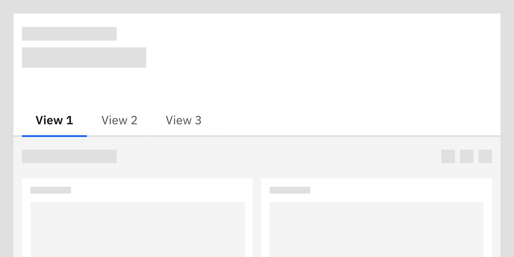

<- [Back to dashboard overview](https://pages.github.ibm.com/cdai-design/pal/patterns/dashboards/usage)

<PageDescription>

**Views** are an optional way to organize data and related cards within a dashboard. 

Views vary from **sections** in that they have a less granular relationship with the dashboard information compared to the more inter-related sections that contain **cards**.

</PageDescription>

<AnchorLinks>
  <AnchorLink>Overview</AnchorLink>
  <AnchorLink>Anatomy of a view</AnchorLink>
  <AnchorLink>When to use</AnchorLink>
  <AnchorLink>When not to use</AnchorLink>
  <AnchorLink>Best practices</AnchorLink>
</AnchorLinks>

## Overview

Views will If permitted, users can create, edit, and delete views. Views are often called “tabs” in product documentation.

Views should follow the precedent set by the [page header](https://pages.github.ibm.com/cdai-design/cloud-pal/components/page-header-on-cloud/usage/) pattern. 

<Row>
  <Column colMd={4} colLg={8}>

</Column>
</Row>

## Anatomy of a view

Views are comprised of some or all of the following elements:

<Row>
  <Column colMd={4} colLg={8}>

</Column>
</Row>

1. **Tabs:** Indicates separate views that users can navigate between. Tabs include the title of the view.
2. **Description (optional):** Provides additional information about the view..
3. **Filters (optional):** Display data that matches the selected criteria.
4. **Actions (optional):** Contains actionable items users can take on the view as a whole.
5. **Cards:** Contains the content that is available within the view.

## When to use

- Use when a dashboard has enough content that organization is needed.
- Use to organize or categorize related cards and data.Examples: Dashboard title: Ohio. View titles: Columbus, Toledo, Cleveland, Cincinnati

## When not to use

- Don’t use views if you only have one or two cards on your dashboard.

## Best practices

- If you have more views than will fit within the width of the page, use scrolling tabs and an overflow menu or drop-down list for navigating to the rest of the views.
- View-level actions should sit below the tabs.
- When creating views, consider the how many you will have. If you foresee having an amount large enough that organization and navigation becomes cumbersome, consider how the views can be grouped or categorized and potentially create additional dashboards instead.
- Use scrolling tabs if the dashboard has more views than visibly fit within the width of the screen.
- If there are scrolling tabs, include an overflow menu or drop-down list so users can quickly jump to a specific tab.
- Place overflow furthest to the right.
- Don’t place an overflow menu between tab/view actions.

