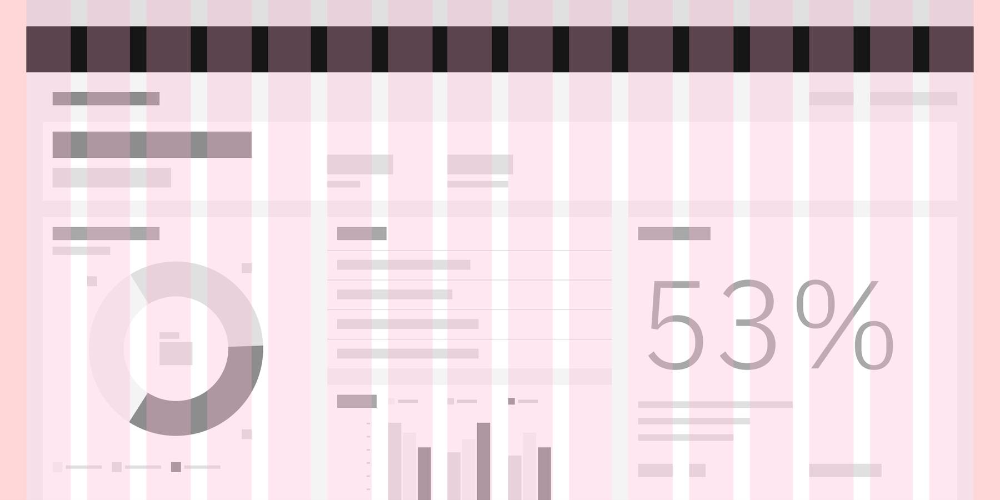

← [Back to dashboard overview](https://pages.github.ibm.com/cdai-design/pal/patterns/dashboards/)

<PageDescription>

Layouts in the dashboard experience should be in constant negotiation between the actual needs of the dashboard UX and the precedents currently found in the patterns that already exist for Carbon for IBM Products.

</PageDescription>

<AnchorLinks>
  <AnchorLink>Overview</AnchorLink>
  <AnchorLink>Grid</AnchorLink>
  <AnchorLink>Page elements</AnchorLink>
</AnchorLinks>

## Overview

Within the dashboard experience, there are many several intersections with other design patterns. For instance, grid layouts, page headers, and cards will be treated the same way as found in other Carbon for IBM Products patterns.

Below are patterns that already exist in the Carbon for IBM Products pattern library.

<Row>
  <Column colMd={4} colLg={8}>

</Column>
</Row>

## Grid

Use the [Carbon narrow grid](https://carbondesignsystem.com/guidelines/2x-grid/implementation/#the-narrow-grid) because its smaller margins are better for accommodating the higher density of information that is typically present on dashboards. If a different grid size is used in the rest of your application, use that grid size to maintain consistency within your application.

- The spacing between two cards should never be greater than the size of the outer margins.

<Row>
  <Column colMd={4} colLg={4}>

#### Grid layout

    

  Whether the design calls for fixed or fluid grids, guidance for all dashboard margins, gutters, and breakpoints can be found [here](https://pages.github.ibm.com/cdai-design/pal/components/grid-behaviors).
 

</Column>

  <Column colMd={4} colLg={4}>

  #### Page layout modules

   

  To maintain a greater sense of unity across all pages, guidance for layout modules has been established and can be found [here](https://pages.github.ibm.com/cdai-design/pal/layouts/library/).

</Column>

</Row>

## Page elements 

<Row>
  <Column colMd={3} colLg={4}>

  #### Page headers

   

  [Page headers](https://pages.github.ibm.com/cdai-design/pal/components/page-header/usage/) will manifest in a number of ways: with tabs, pagination, subtitles in order to best organize your dashboard.

</Column>

  <Column colMd={3} colLg={4}>

  #### Productive cards

   

  [Productive cards](https://pages.github.ibm.com/cdai-design/pal/components/card/productive/usage) are a foundational design element of the dashboard by depicting data visualizations, numerical data, or other necessary content.

 

</Column>

  <Column colMd={3} colLg={4}>

  #### Side panel

   

 [Side panels](https://pages.github.ibm.com/ai-applications/design/components/sidepanel/usage) will often be used to further dive into specific areas of a dashboard card.

</Column>

  <Column colMd={3} colLg={4}>

  #### Dashboard widgets

   

  [Dashboard widgets](https://pages.github.ibm.com/cdai-design/cloud-pal/patterns/dashboard-widgets/usage) are a more formalized card design].

</Column>

</Row>
