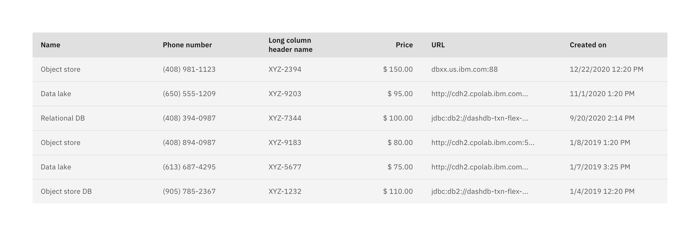
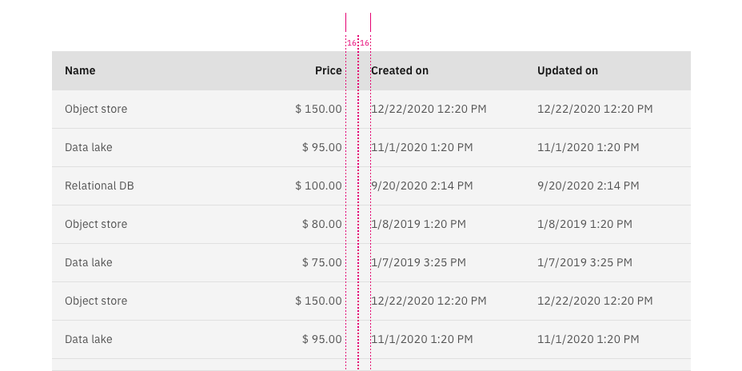
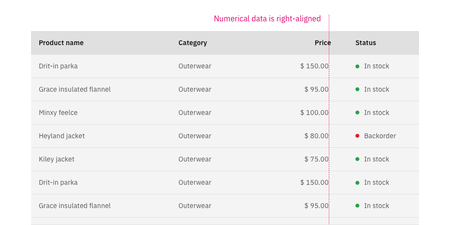
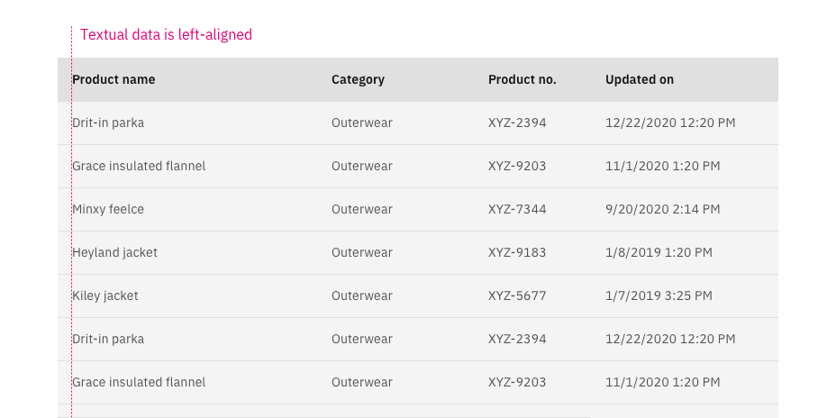
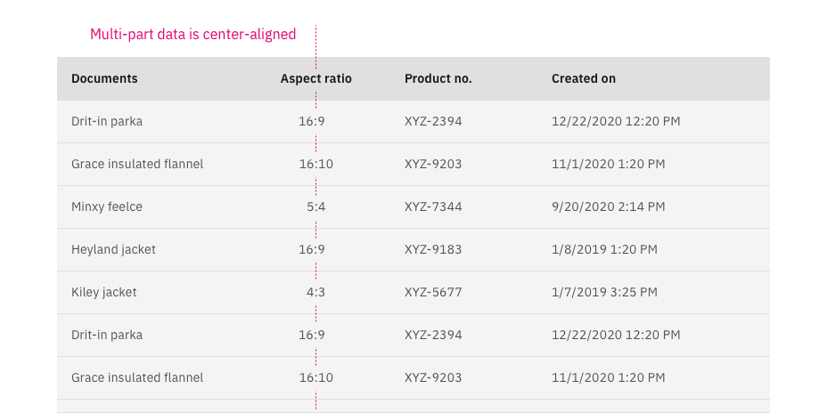
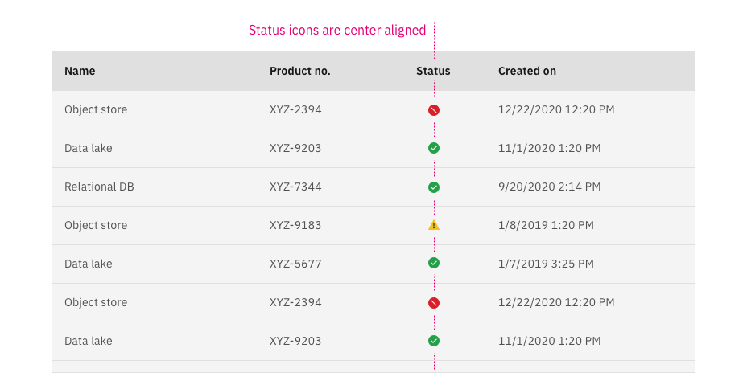
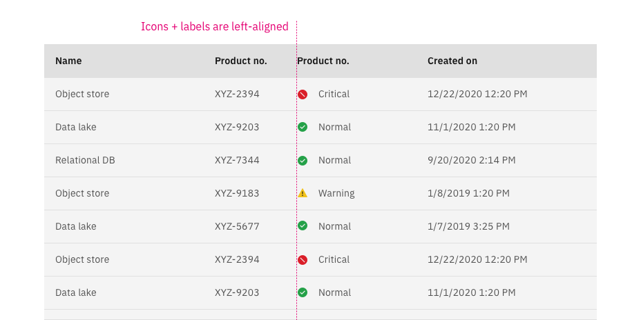
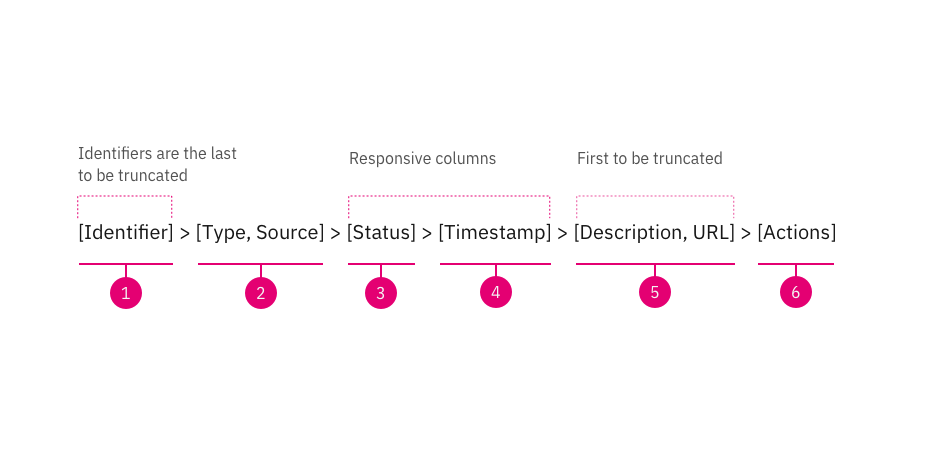

import { Breadcrumb, BreadcrumbItem } from "carbon-components-react";

<Breadcrumb>
  <BreadcrumbItem href="/patterns/data-table/overview">Overview</BreadcrumbItem>
  <BreadcrumbItem isCurrentPage href="/patterns/data-table/column-alignment">
    Column Alignment
  </BreadcrumbItem>
</Breadcrumb>

<PageDescription>

Data tables display sets of data across rows and columns. They organize information in a way that’s easy to scan so that users can look for patterns and develop insights from data. By designing more efficient, clearer, and easier-to-use tables, we improve the experience of analyzing and understanding large sets of data.

</PageDescription>

## Column headers

Headers, generally, should carry whatever alignment their data has. This keeps the vertical lines of the table clean, and provides consistency and context.

- Show only one sorting carat in the table header to indicate the current sort column. By default, table sorting only happens when user clicks on sorting. [Table sorting](https://carbon-components-react.netlify.app/?path=/story/datatable-sorting--usage)
- Use [sentence style capitalization](../../../content/capitalization/) for all column headers
- Column titles should stick to one or two words that describe the data in that column.
- In cases where a column title is too long, we follow [Carbon](https://www.carbondesignsystem.com/components/data-table/usage#content).

### Padding

Minimum gap between columns should be 16/32 px

## Data alignment

**Basic rules**

1. Numerical data is right-aligned
2. Textual data is left-aligned
3. Headers are aligned with their data

### Numerical data

Numerical data is read right-to-left; that is, we compare numbers by first looking at their ones digit, then their tens, then their hundreds, and so on.

- Sample: 1,230, $320, etc.

 

### Textual data

Textual data is read _in English_ from left-to-right. Comparing textual elements is typically done by sorting into alphabetical order: if two entries start with the same letter, the second letter is used, and so on. Trying to quickly scan text can be infuriating if it’s not left-aligned.

- Sample: San Francisco, (408) 555-1234, EXt14-ESE, 1/2/2020 10:00PM, etc.

 

### Multi-part data

If it's a multi part value separated by common separator, align by the separator.

- Sample: 16:9, 1920 x 1080, 12.01

 

### Icons

Status icons are an important method of communicating severity level information to users. When a column has one status icon, it is best to centre align it. When a column has multiple icons then they should be left-aligned

 

### Icons+label

This is considered as text and should be left-aligned

## Column order

Good column order allow users to scan, analyze, compare, filter, sort, and manipulate information to derive insights and commit actions.

Good column order allow users to scan, analyze, compare, filter, sort, and manipulate information to derive insights and commit actions. Identifiers should always be the first elements of a datable and actions last. The other elements can be changed to reflect your product needs.

1. **Identifiers** (first item of table): Identifiers include name or ID and should be placed in the first section of the table. Either one can be the first column if both exist.
2. **Type and source**: This section includes type, source, tags, parent, version, category, etc.
3. **Status**: Status column should be responsive. When using icon+label for the status column, responsive will automatically hide the label as the table gets smaller. Tooltips are required when the label is hidden as a results of responsive behaviors.
4. **Timestamp**: Timestamp includes Created on, Modified on, Uploaded on, etc. The date and time format should follow the Date and time guidelines and should be responsive. Use long format when space permits, change it to short format as the table gets smaller. For example, September 29, 2020 11:59:12 AM > 9/29/2020 11:59 AM
5. **Description and URL**: Description and URL should be the first data to get truncated in a table. Users should be able to see or copy the full string by hovering on it.
6. **Actions** (last item): All actions should be hidden until users hover the row to reduce visual clutter. However, when there are 3 or more actions, use overflow menu and which should be persistent and available to users all the time.

## Related

- [Reorder pattern](hhttps://pages.github.ibm.com/cdai-design/pal/wip/reordering/)
- [Add-select modal pattern](https://ibm.ent.box.com/notes/574380001581?s=vldtegn7sphu7h19et40907f903wnqrt)
