import { Breadcrumb, BreadcrumbItem } from "carbon-components-react";

<Breadcrumb>
  <BreadcrumbItem href="/patterns/data-table/overview">Overview</BreadcrumbItem>
  <BreadcrumbItem isCurrentPage href="/patterns/data-table/expandable-rows">
    Expandable rows
  </BreadcrumbItem>
</Breadcrumb>

<PageDescription>

Expandable rows consist of expansion rows and expanded areas. Expansion rows (parent) assist users in navigating hierarchically organized data by initially showing only the primary data. Expanded areas (child) house secondary data and are nested underneath the respective primary data. Examples of secondary data include subcategories, child-to-parent relationships, and more details of row data.

</PageDescription>

## Expandable rows

This pattern explains how to lay out content within an expanded area and why content within the expanded area cannot be aligned to the grid and should not be aligned to table columns.

### Anatomy

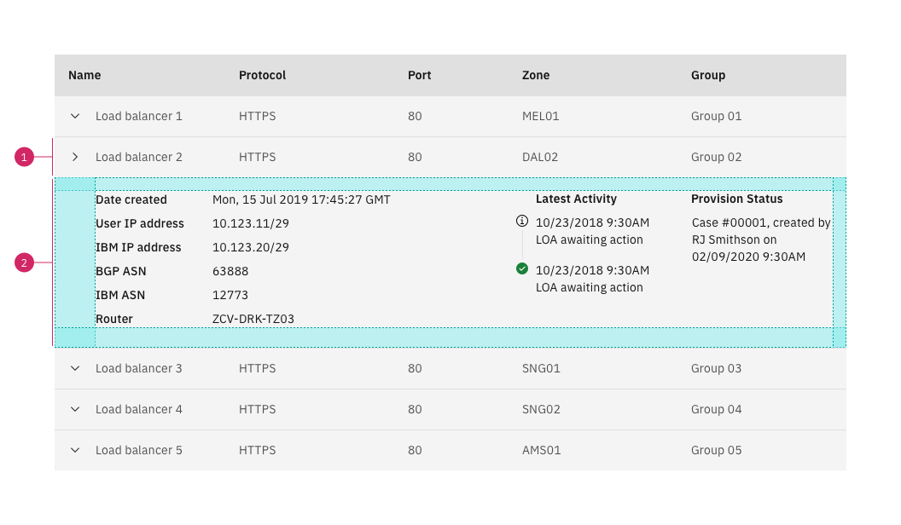

1. Exansion row
2. Expanded area

### Padding

The expanded area should have the following padding. The padding remains the same regardless of the height of the table's rows.

| Property         | Value  | Token        |
| ---------------- | ------ | ------------ |
| `padding-top`    | `16px` | `$layout-01` |
| `padding-right`  | `16px` | `$layout-01` |
| `padding-bottom` | `24px` | `$layout-02` |
| `padding-left`   | `48px` | `$layout-04` |

### When to use

Use the expandable row for the following:

- Supplementary information
- Information that relates to the primary row content that is not initially crucial for user comprehension
- Data that needs additional query time

### When not to use

When the content in the expanded area begins to feel cramped, consider using a dedicated page, [side panel](https://www.carbondesignsystem.com/components/UI-shell-right-panel/usage), [modal](https://www.carbondesignsystem.com/components/modal/usage/), or [tearsheet](https://pages.github.ibm.com/cdai-design/pal/components/tearsheet/usage) to view information and complete tasks.

_If my content is feeling cramped, can I  increase the expanded area's height?_

In order to prevent a vertical scroll bar in the expanded area, the area does not have a `max-height`. However, you should consider the following:

- The purpose of an expanded area is to facilitate exploring additional item details in the context of a larger data set
- If the expandable row area is too tall your user may lose their place within the data table when they expand a row

If your use case requires what feels like a page worth of content, consider displaying the content in a [side panel](https://www.carbondesignsystem.com/components/UI-shell-right-panel/usage), [tearsheet](https://pages.github.ibm.com/cdai-design/pal/components/tearsheet/usage), [modal](https://www.carbondesignsystem.com/components/modal/usage), or a dedicated page.

Here is one example of how a side panel can be used to display additional row information.

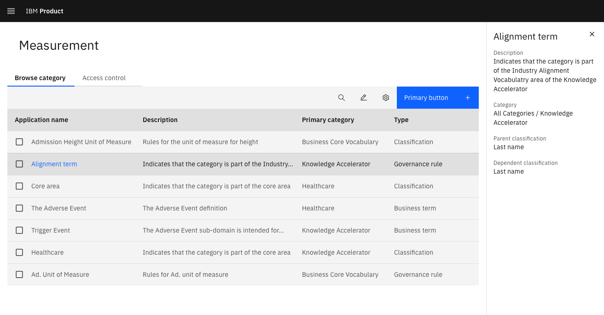

## Alignment

If you are working in Sketch it is easy to create a design where items in the expanded area align to the grid or to the table columns. However, as soon as a developer attempts to implement this design they will quickly encounter problems.

Instead of aligning content to table columns or the grid, you should lay out your content in a manner that establishes clear relationships between content items and utilize Carbon's [layout scale](https://www.carbondesignsystem.com/guidelines/spacing/overview/#layout-scale).

<Accordion>
<AccordionItem title="Why can't I align my content to the grid?">
<Row>
<Column colMd={8} colLg={8} noGutterSm>
The grid is built with a web layout model called flex-box. A flex layout allows elements within a container to resize and automatically arrange depending on the width of the container. In the case of the grid, think of the grid as the container and each column as an element within the grid. Each column's width is defined as a percentage of the grid's width. 

Unfortunately, elements placed within each column of the grid do not have access to the width of the grid. If you examine the HTML, the expanded row is placed in the grid's columns. This means that the content within an expanded row cannot align to the grid. 

While there may be methods to come close to aligning the content within an expanded area to the grid, that should not be your goal. Instead, you should focus on structuring the content in a way that is easy to process and maintains strong links between related information. 

You should utilize Carbon’s layout spacers to separate content within expanded areas and to maintain consistency with the rest of your designs.

</Column>
</Row>
</AccordionItem>

<AccordionItem title="Can I align content to the table columns?">
<Row>
<Column colMd={8} colLg={8} noGutterSm>
Even though in certain cases it is possible to align the content within an expanded area to the table columns, it is not recommended. 

Dynamic content, translation, and responsive tables can all cause misalignment between content in an expanded area and table columns. Additionally, in certain tables, users can resize and hide table columns. 

Focus on structuring and presenting the content in a manner that is easy to understand and follows other Design Language principles. 

</Column>
</Row>
</AccordionItem>
</Accordion>

### How to lay out content

Given that an expanded area is just an empty container, there will likely be numerous layout options for each use case.

`flex-box` is one method that you can use to arrange content within an expanded area. `flex-box` utilizes a property called `justify-content` to control how its items are distributed. `justify-content` has two values, `flex-start` and `space-between`,  that adhere to Carbon's propensity for left alignment and will work well for distributing content within an expanded area.

#### `flex-start`

Use this option to pack the items from left to right. A designer can then dictate the appropriate amount of space between items in the expanded area. The amount of space between items will remain consistent at each breakpoint unless dictated otherwise.

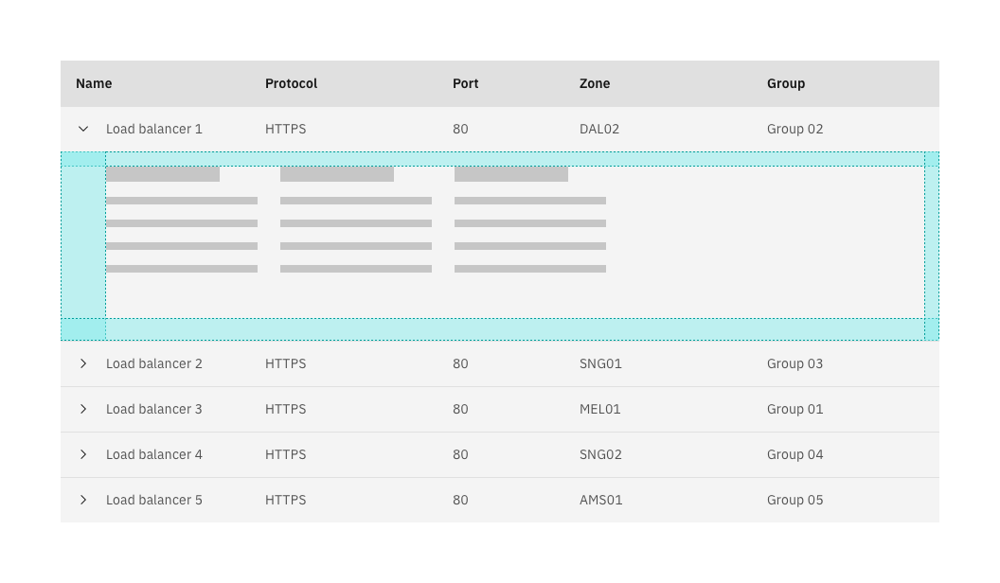

#### `space-between`

Use this option to evenly distribute items within the expanded area. The first item will be left-aligned to the expanded area and the last item will be right-aligned to the expanded area. This option should only be used if it is more important to distribute the items evenly than it is to preserve a specific spatial relationship between the items.

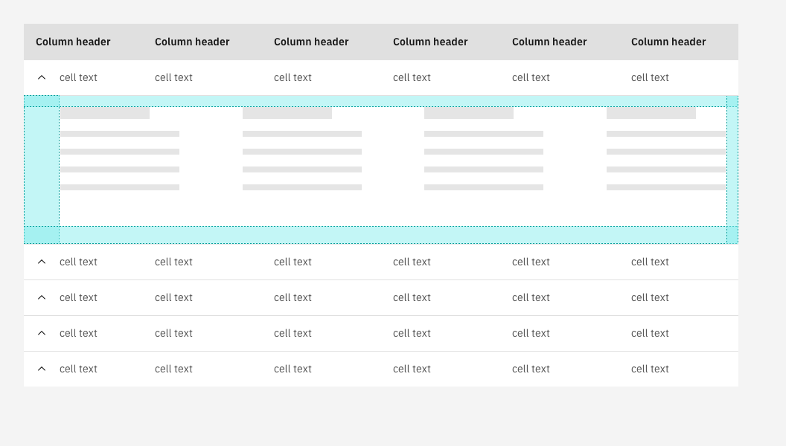

In most cases, you should combine `flex-start` and intentional spacing between content items.

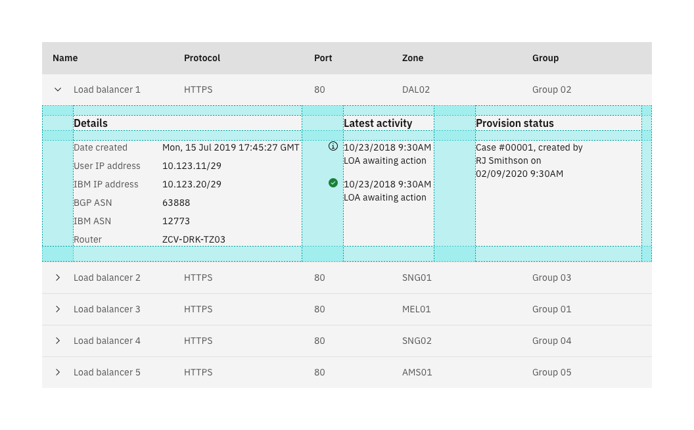

### Aligning one or more items to the right

`flex-box` also makes it possible to align one or more content items to the right side of the expanded area.

You should only right align content if the main content items are already left aligned and if aligning content to the right improves the expanded area's usability.

To align an item to the right you need to set the item's `margin-left` to `auto`.

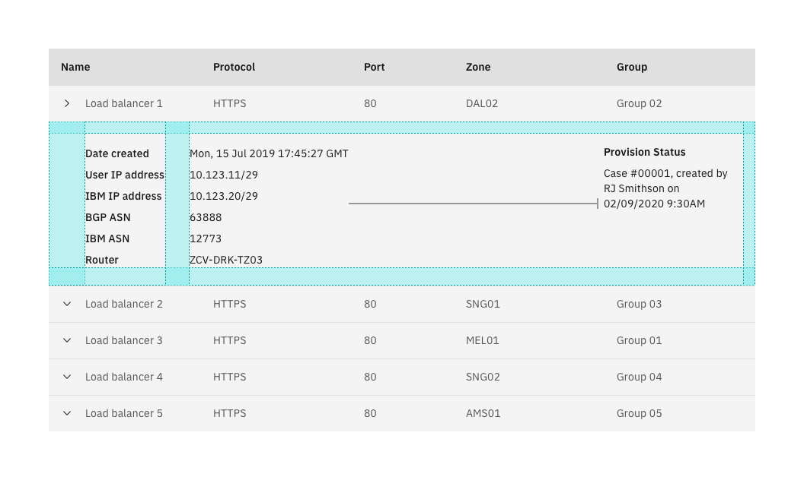

### Wrapping

If you are using a responsive data table, the items in the expanded area may need to wrap.

You should only wrap the items in the expanded area if you are able to preserve important relationships between content items and ensure that the expanded area is still usable. If this is not possible, consider displaying the content in a different manner.

In the _do_ example all of the items in the expanded area wrap to one column. This prevents the _Provision Status_ section's placement from bisecting the *Details* section in a way that makes it difficult to tell that the *Details* section contains key value pairs.

<DoDontRow>

<DoDont type="do">

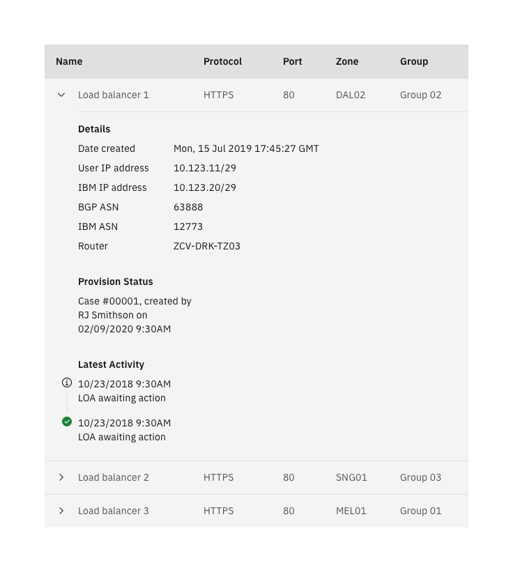

</DoDont>

<DoDont type="dont">

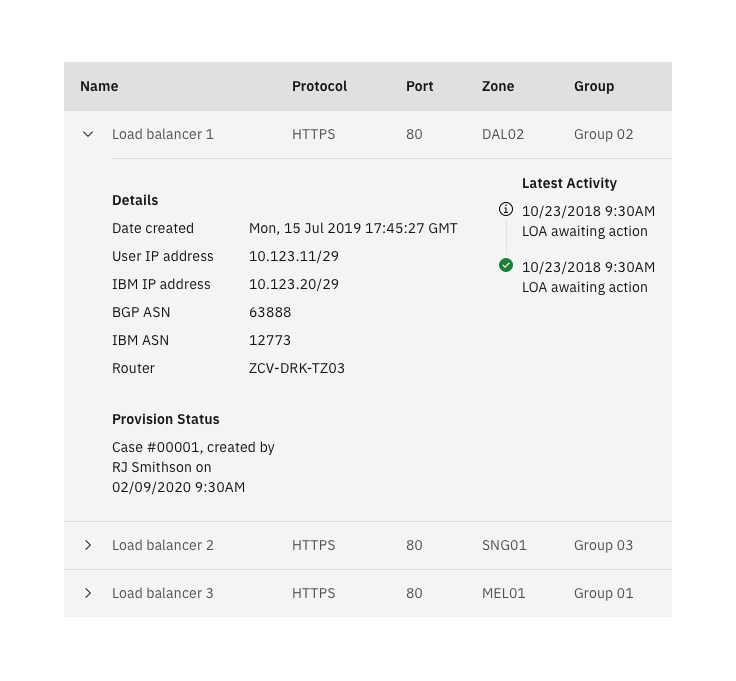

</DoDont>

</DoDontRow>

### Sizing

Use the same principles you use elsewhere to size content within an expanded area. If your table stretches the width of the screen and the expanded area contains a paragraph, set a max-width on the paragraph to preserve legibility. A good rule of thumb is to keep paragraph line length between 50 and 70 characters.

<DoDontRow>

<DoDont>

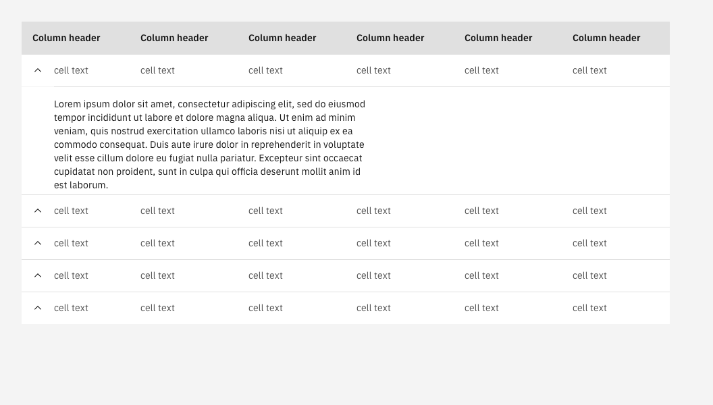

</DoDont>

<DoDont type="dont">

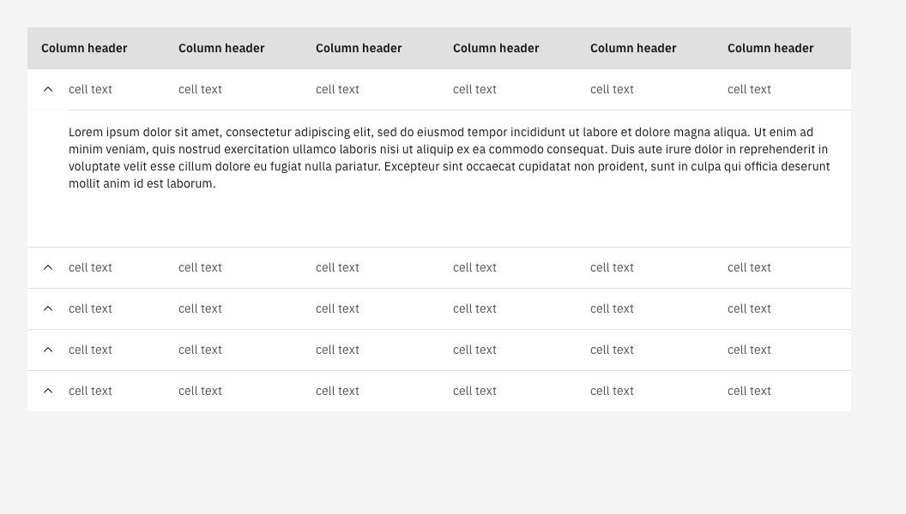

</DoDont>

</DoDontRow>

## Best Practices

<DoDontRow>

<DoDont caption="Do use the expandable row to house more details, descriptions, and minor actions.">

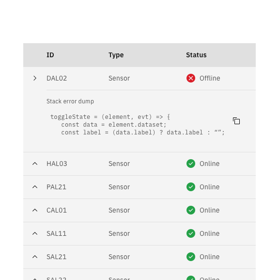

</DoDont>

<DoDont type="dont" caption="Don't use the expandable row to hide important information or actions that are often used. ">

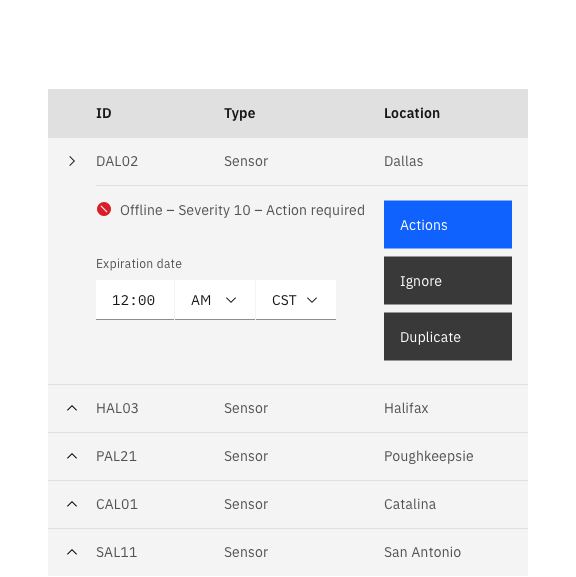

</DoDont>

</DoDontRow>

## Related

- [Data table](https://pages.github.ibm.com/cdai-design/pal/patterns/data-table/overview)
- [Side panel](https://pages.github.ibm.com/cdai-design/pal/components/side-panel/usage)