import { Breadcrumb, BreadcrumbItem } from "carbon-components-react";

<Breadcrumb>
  <BreadcrumbItem href="https://pages.github.ibm.com/cdai-design/pal/patterns/data-table/overview">Overview</BreadcrumbItem>
  <BreadcrumbItem
    isCurrentPage
    href="https://pages.github.ibm.com/cdai-design/pal/patterns/data-table/headers"
  >
    Headers
  </BreadcrumbItem>
</Breadcrumb>

<PageDescription>

The data table header provides a high-level context of the data and gives a brief overview about the data. Each data table must have a header. Headers should be placed right on top of the data table. Each table header should have a title at the minimum; additional information can be optional depending on the user's requirements. 

</PageDescription>

## Overview

We differentiate between two types of data table headers:

1. Default data table headers
- using subline in table header
- using tabs as table header
- using page header as table header
- using accordions in table headers

2. Dense data table headers
 

We use Carbon's white theme headers rather than the Gray 10 theme.

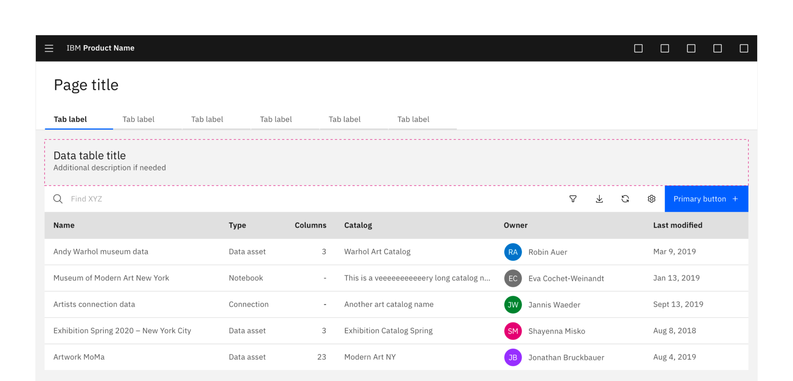 

## Headers

### Default data table header

Default data table header can be used for general data table use cases such as data set preview, data catalog, and any page with a full page data table. A data table must include a title. **If a page only has one table, the page header acts as the table title and no table header is required.**  Any metadata about the data can be added as a sub-line. 

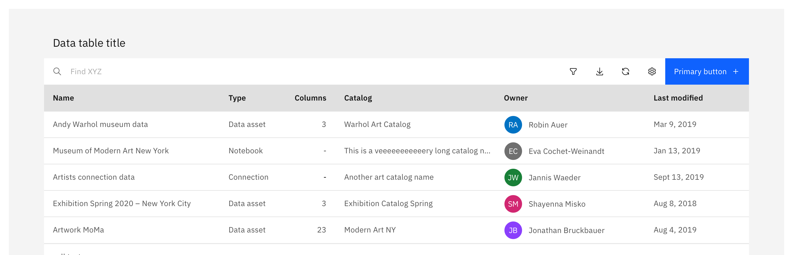 

The maximum title width should not display more than up to 65 characters. We recommend keeping the data table title in one line, and text that is longer than title width is truncated with an ellipsis and a tooltip showing the full string on hover.

| Typography table titles       |      Color     |   Type       | Size               |   Line-height   |   Weight     |   Letter-spacing |
| -------------                 | -----------    | -----        |    -----           | -----           |    -----     | -----           |
| `$productive-heading-03`       | `$text-01`       | IBM Plex Sans |  20px / 1.25rem    | 26px / 1.625rem | 400 / Regular | 0px |

<Row>

<Column colMd={6} colLg={6}>

✅ **Do**

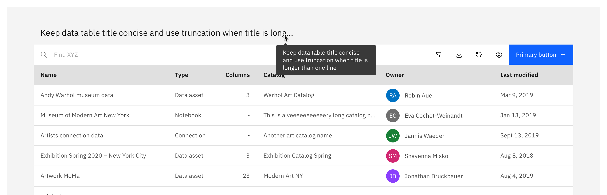 

- Keep the data table title concise and maintain in a single line.
- If the title is longer than 8 column width, text should be truncated with an ellipsis. On hover, a tooltip shows the full name.
- Data table titles should utilize sentence style capitalization.

</Column>

<Column colMd={6} colLg={6}>

🚫 **Don't**

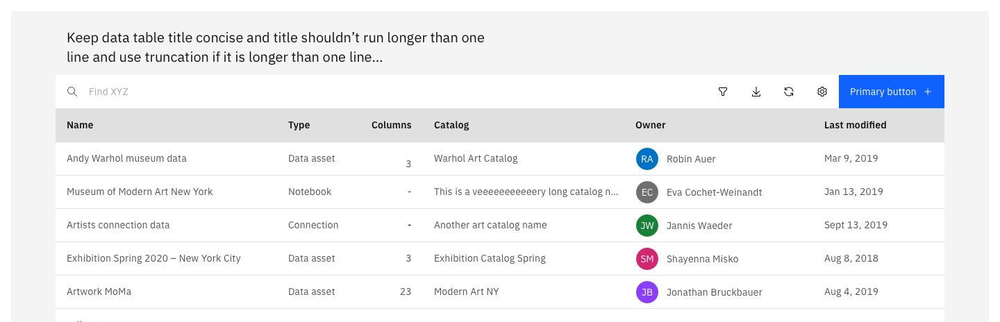 

- Data table title shouldn't be longer than one line.

</Column>

</Row>

### Sub-lines in table header

Sub-line can be used to capture information such as number of total columns, number of sample data, and last updated etc. Any long data summary description or additional content should live in other places in the UI (e.g. side panels).

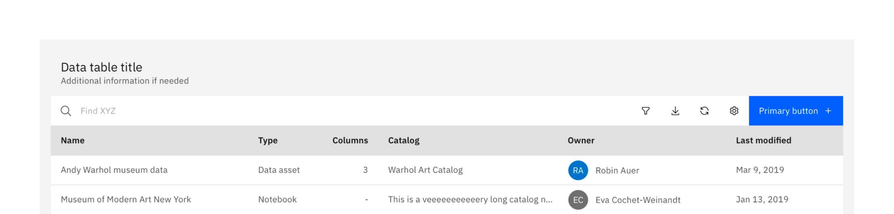 

The recommended maximum for a sub-line width is max 60-80 characters. Longer lines are hard to read.

| Typography table titles       |      Color     |   Type       | Size               |   Line-height   |   Weight     |   Letter-spacing |
| -------------                 | -----------    | -----        |    -----           | -----           |    -----     | -----           |
| `$body-long-01 `       | `$text-02`       | IBM Plex Sans |  14px / .875rem    | 20px / 1.25rem | 400 / Regular | 16px |

<Row>

<Column colMd={6} colLg={6}>

✅ **Do**

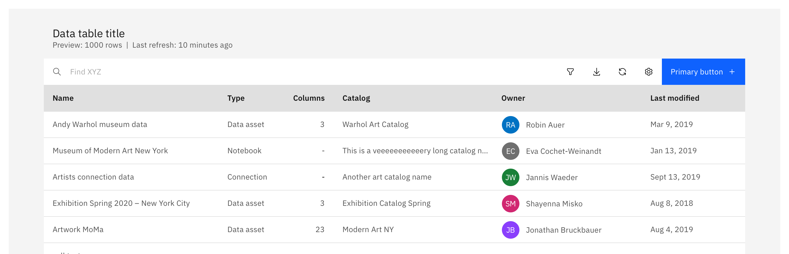 

- Use [space][space]  | (vertical divider)  [space][space] to separate content within sub-line. 

</Column>

<Column colMd={6} colLg={6}>

🚫 **Don't**

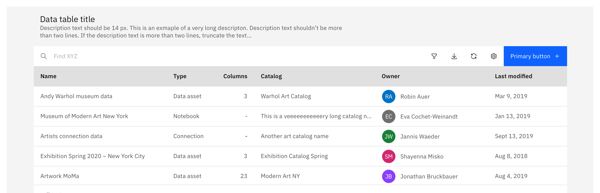 

- Sub-line shouldn't be a long description or more than one line.

</Column>

</Row>

### Tabs in a table header

Some tables require tabs so that the user directly can switch between different content of the table. Those tabs are placed directly on top of the toolbar. We use Carbon’s container tabs. In that case we recommend that tabs replace the default table header. Make sure that labels are clear and concise. 

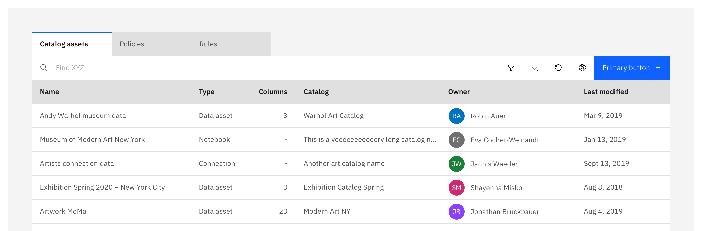 

Use tabs on top of the table only when they are related to the content of the table. For tabs that apply to the full page, make sure to place them in the table header so that they apply to all content of the page below.

### Page header as table header

If a page only has one table, the page header acts as the table title and no header is required.

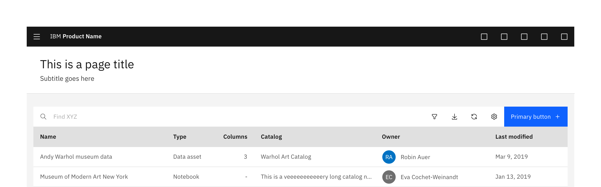 
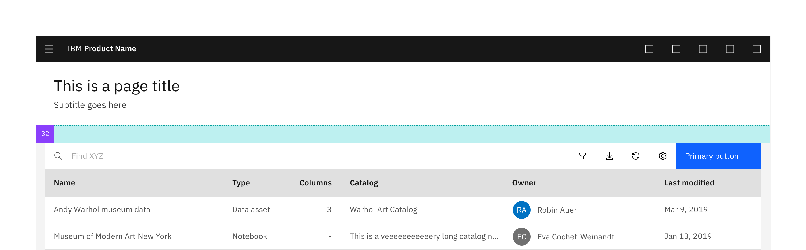

### Multiple tables on a page

When there are multiple tables on a page the spacing between tables is always 48 px (`$layout-01` + `$layout-03`). Always use ghost buttons for table actions on pages that have multiple tables. There shouldn’t be more than one primary action on a page. 

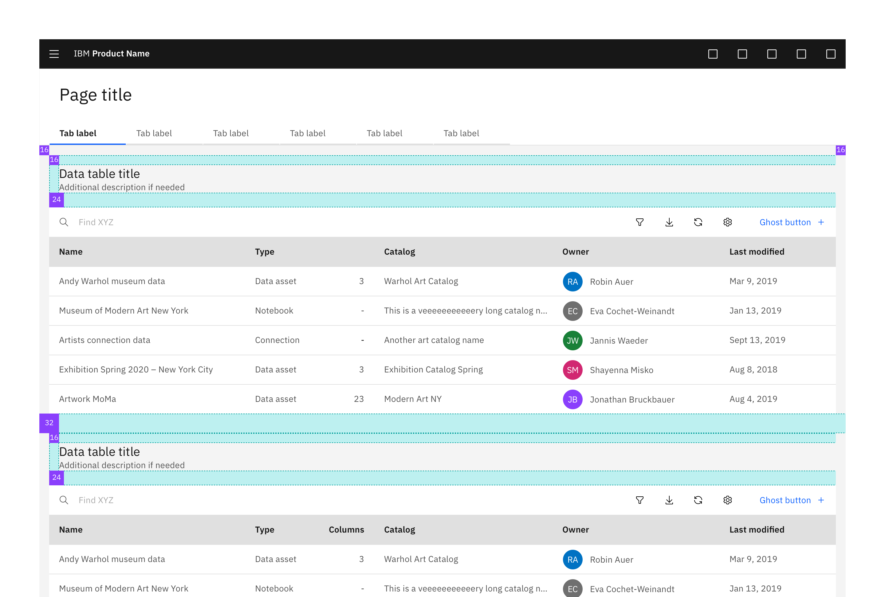

 

<Row>

<Column colMd={6} colLg={6}>

✅ **Do**

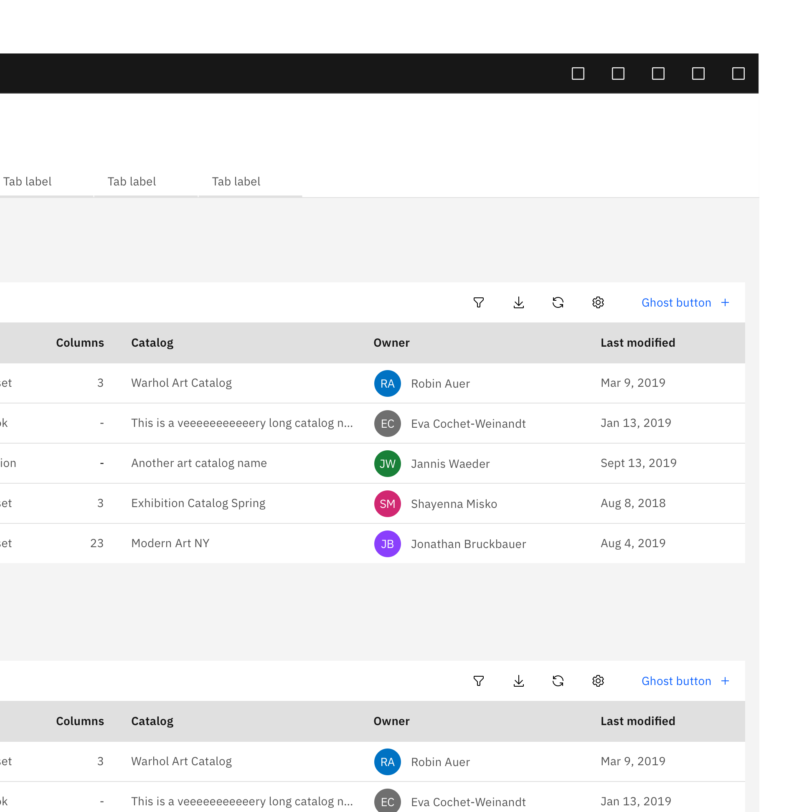

When there are multiple tables on the page, always use ghost buttons for actions. There shouldn’t be more than one primary action on a page.

</Column>

<Column colMd={6} colLg={6}>

🚫 **Don't**

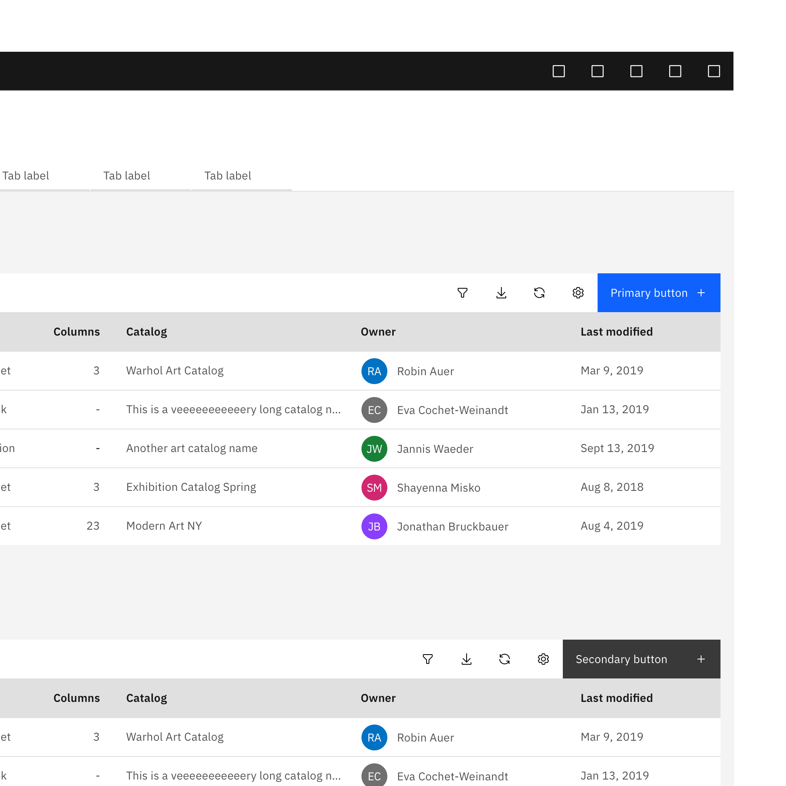

Use multiple primary buttons or mix and match primary or secondary button on a page. 

</Column>

</Row>

### Accordions in table headers 

When a page has multiple tables and content it can get quickly overwhelmed. Therefore accordions can help to expand and collapse a table. In that case we use accordions in front of the table title. By default we recommend to expand all tables. 

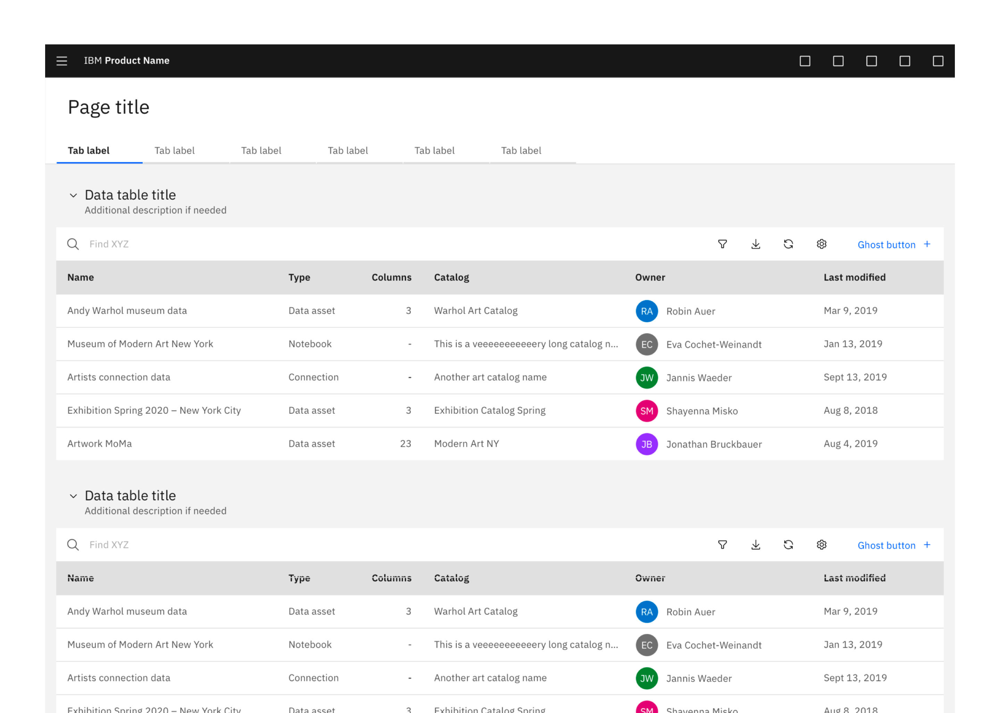

<Title> Collapsed table headers </Title>

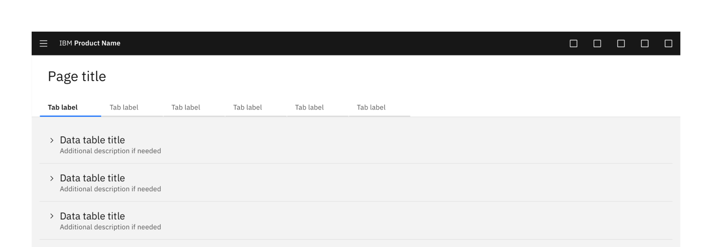

For collapsed tables we use a 1px line (#E0E0E0) at the bottom to separate the different table titles.

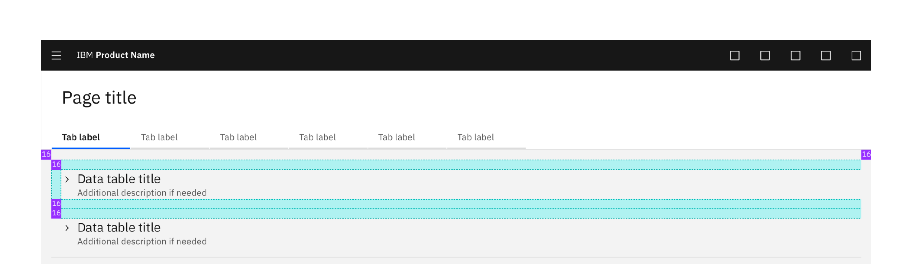

<Title> Expanded and collapsed table headers </Title>

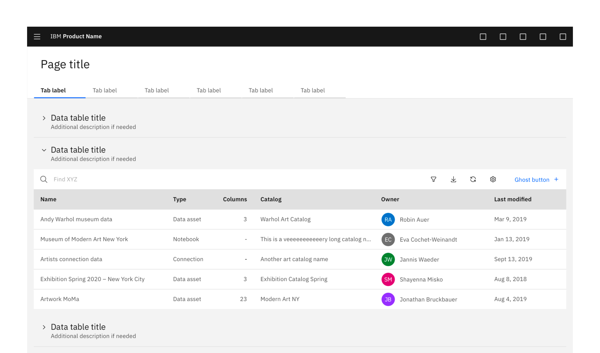

### Dense data table header 

Dense data table header is reserved for lightweight tables. A table contains a header as well as action buttons, but needs to fit into a denser design or page with multiple elements. Dense table header can also be used to display a smaller data set, or show multiple tables on a page. We recommend using no more than 5 icons and one button for dense table header. If there is a special case where a need for more than 5 icons is necessary, then consider using an overflow menu for lesser used items.

Ghost button is the default button for dense table header, as dense header is intent for small tables, which usually isn't the primary action on the page. 

✅ Do
- Use dense data table headers only for lightweight tables, that don’t contain a lot of data and therefore don’t require a search. Also use it if the user wants to view small amount of data without or only a few actions (like one or two filters, only a single action button,...)

🚫 Don’t
- Use dense data table header with multi-select. Dense data table header pattern breaks once the user selects as least one row from the table, the batch action bar appears at the table and covers the table header. 

**When a table requires multi-select, always use the default data table header.** 

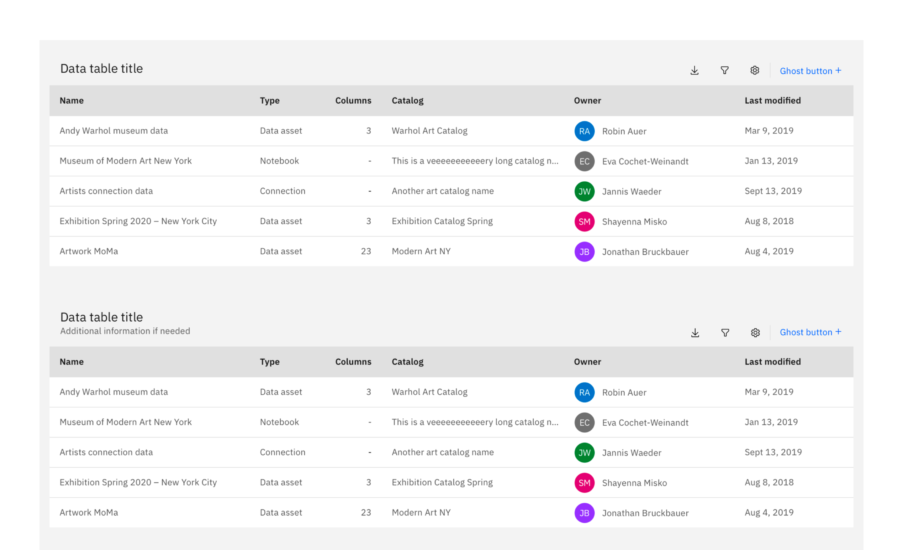

<Title> Variation - Dense header with persistent filter  </Title>

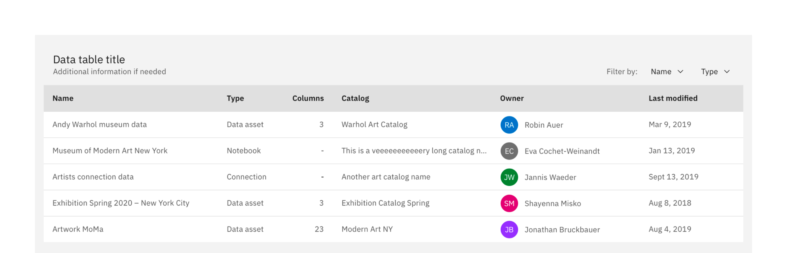

<Title> Variation - Dense header with only search  </Title>

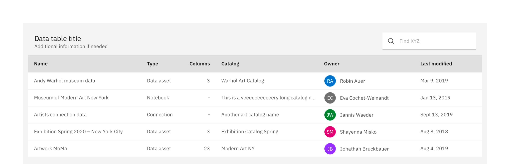

<Title> Tokens </Title>

Divider-line icons/action button: `$ui-03`, 24 px height

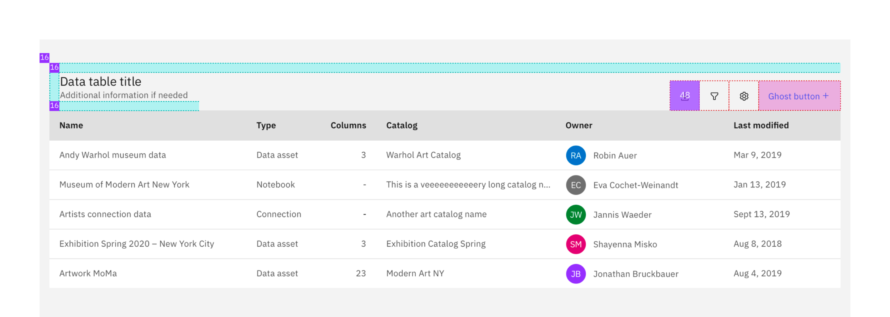

## Related

- [Carbon data tables](https://www.carbondesignsystem.com/components/data-table/usage)
- [Carbon accordions](https://www.carbondesignsystem.com/components/accordion/usage)
- [Cloud PAL table headers](https://pages.github.ibm.com/ibmcloud/pal/components/data-table/usage/#table-header)
