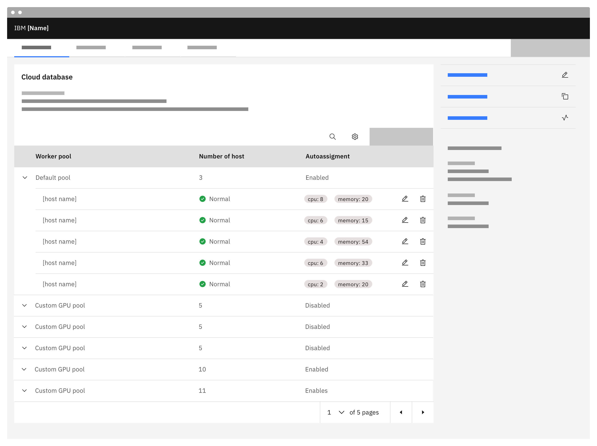
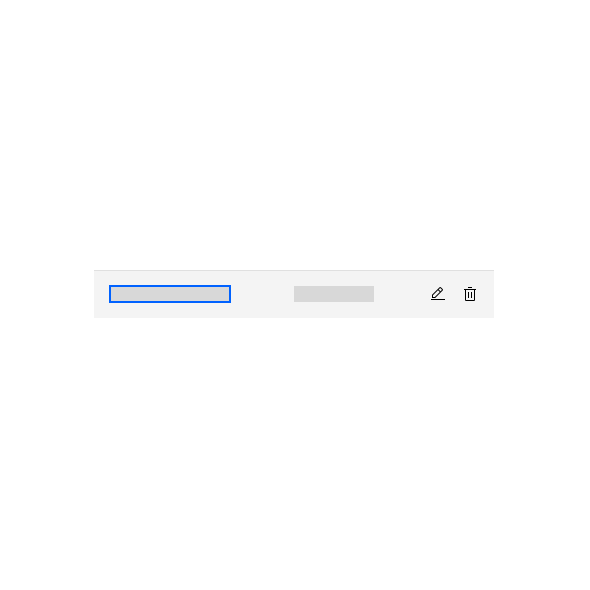
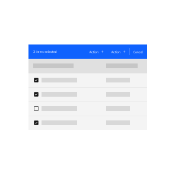
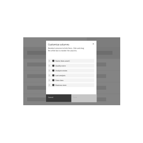
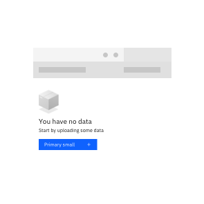

import { Breadcrumb, BreadcrumbItem } from "carbon-components-react";

<Breadcrumb>
  <BreadcrumbItem isCurrentPage href="/patterns/data-table/overview">
    Overview
  </BreadcrumbItem>
</Breadcrumb>

<PageDescription>

The data table provides a compact layout for viewing and managing large quantities of data while extending Carbon capabilities in a large number of areas. Data tables are used to organize and display data efficiently.

</PageDescription>

The data table component allows for customization with additional functionality, as needed by your product’s users. The data table’s features are ideal for organizing and displaying data in a UI and provide a large range of possible capabilities.

**Note**: _These pages are not intended to replace the Carbon documentation. These are meant to provide guidance, structure and consistency for all our products under the Carbon for Cloud & Cognitive portfolio._

## Overview

The standard Carbon data tables have been delivered as a set of common components, as such these are flexible in the way they can be implemented. The carbon guidelines can be found here.

This documentation is a set of guidelines on how to implement these component to ensure a consistent experience across our portfolio and provide users with a similar, uniform experience.

<Row className="image-card-group">

<Column colMd={3} colLg={3} noGutterSm>

<ImageCard 
sub-title="Header"
sub-titleColor="dark"
hoverColor="dark"
href="/patterns/data-table/headers">

</ImageCard>

<ImageCard
sub-title="Expandable rows"
sub-titleColor="dark"
hoverColor="dark"
href="/patterns/data-table/expandable-rows">

</ImageCard>

<ImageCard
sub-title="Column alignment"
sub-titleColor="dark"
hoverColor="dark"
href="/patterns/data-table/column-alignment">

</ImageCard>

</Column>

<Column colMd={3} colLg={3} noGutterSm>

<ImageCard 
sub-title="Table actions"
sub-titleColor="dark"
hoverColor="dark"
disabled
href="https://www.carbondesignsystem.com/">

</ImageCard>

<ImageCard
sub-title="Inline editing"
sub-titleColor="dark"
hoverColor="dark"
disabled
href="https://www.carbondesignsystem.com/">

</ImageCard>

<ImageCard
sub-title="Scrolling"
sub-titleColor="dark"
hoverColor="dark"
disabled
href="https://www.carbondesignsystem.com/">

</ImageCard>

</Column>

<Column colMd={3} colLg={3} noGutterSm>

<ImageCard
sub-title="Row action buttons"
sub-titleColor="dark"
hoverColor="dark"
href="https://pages.github.ibm.com/cdai-design/pal/patterns/data-table/row-action-buttons"> 

</ImageCard>

<ImageCard
sub-title="Pagination"
sub-titleColor="dark"
hoverColor="dark"
disabled
href="https://www.carbondesignsystem.com/">

</ImageCard>

<ImageCard
sub-title="Clickable rows items"
sub-titleColor="dark"
hoverColor="dark"
href="/patterns/data-table/clickable-row-items">

</ImageCard>

</Column>

<Column colMd={3} colLg={3} noGutterSm>

<ImageCard
sub-title="Toolbar actions"
sub-titleColor="dark"
hoverColor="dark"
disabled
href="https://www.carbondesignsystem.com/">

</ImageCard>

<ImageCard
sub-title="Column customization"
sub-titleColor="dark"
hoverColor="dark"
href="/patterns/data-table/column-customization">

</ImageCard>

<ImageCard
sub-title="Empty state"
sub-titleColor="dark"
hoverColor="dark"
disabled
href="https://www.carbondesignsystem.com/">

</ImageCard>

</Column>

</Row>

