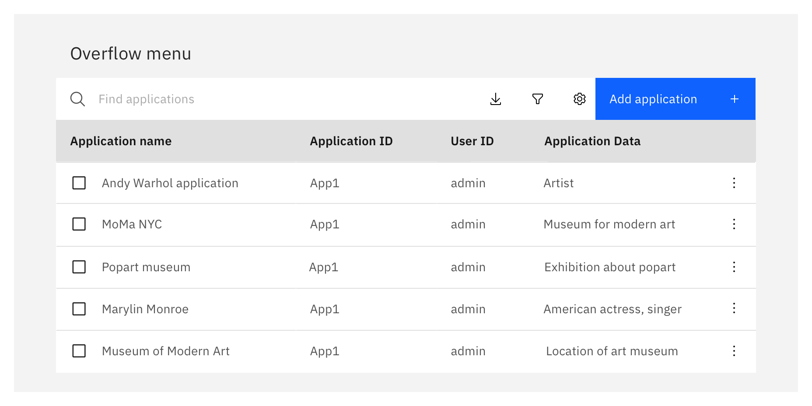
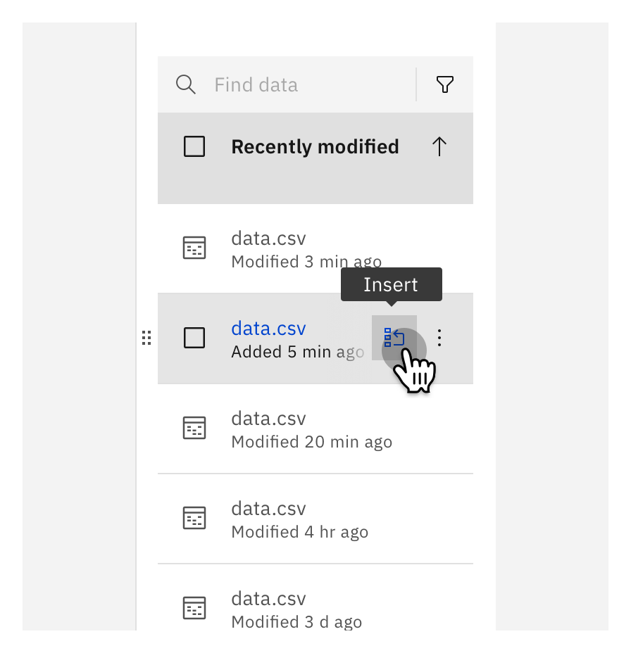
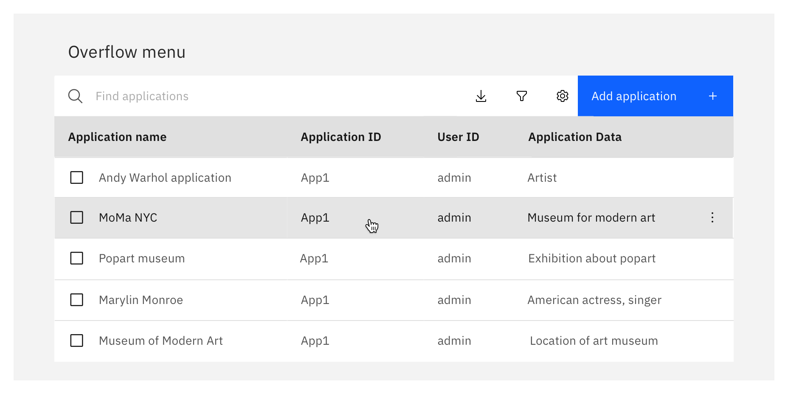
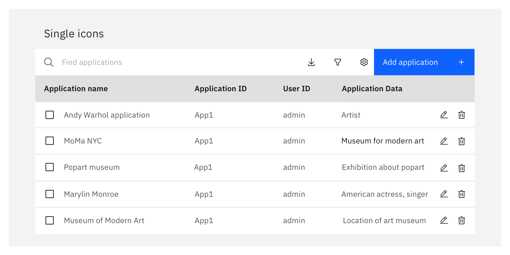
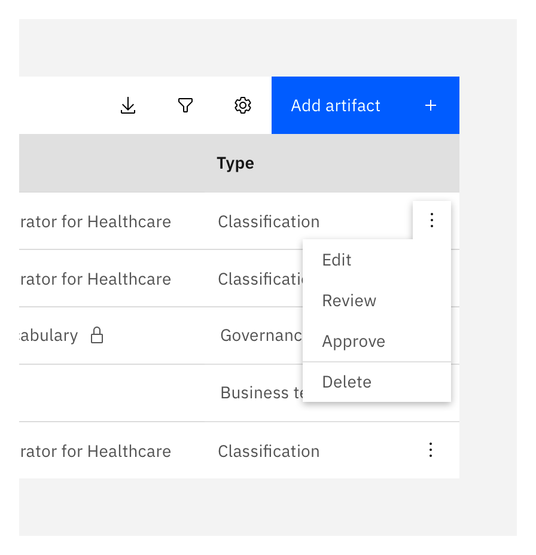
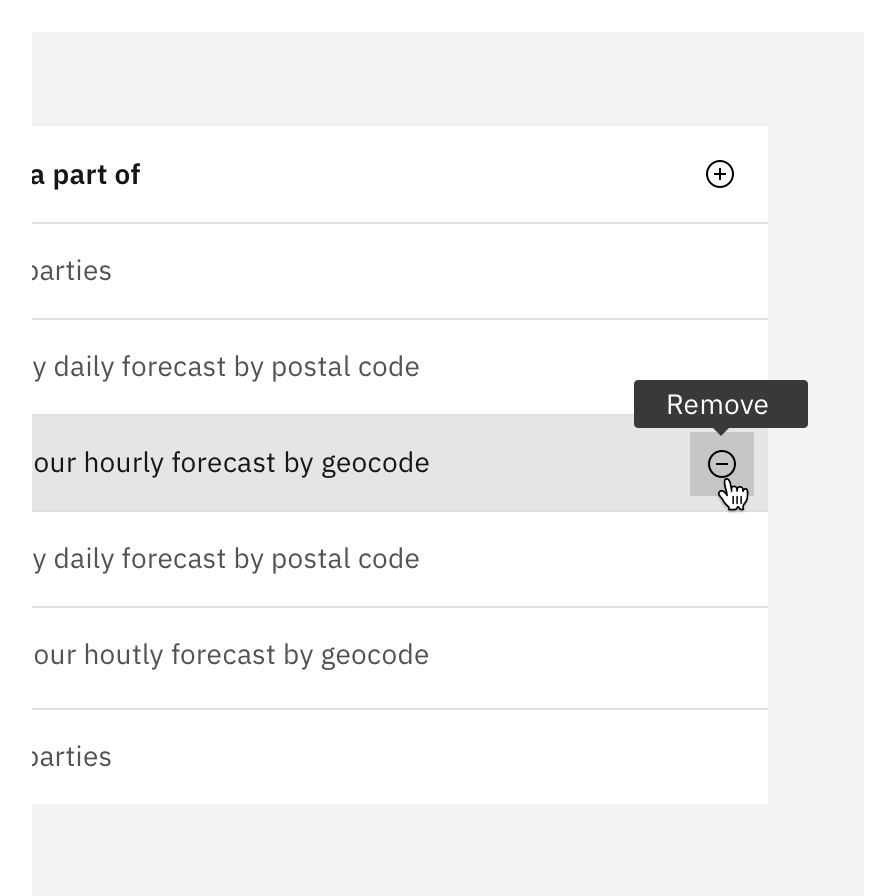
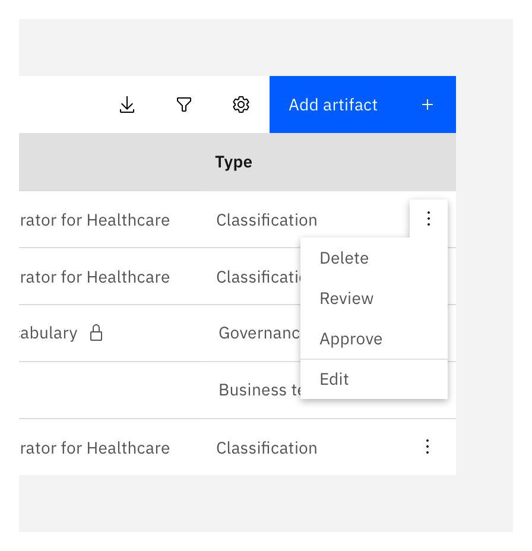
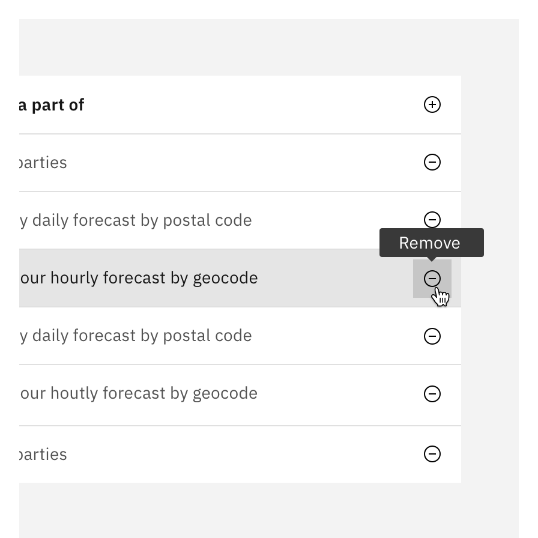
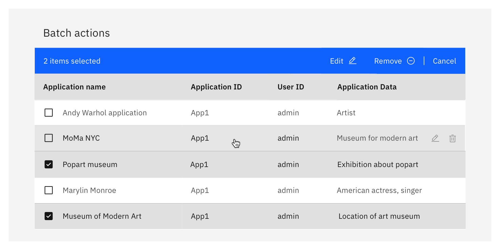
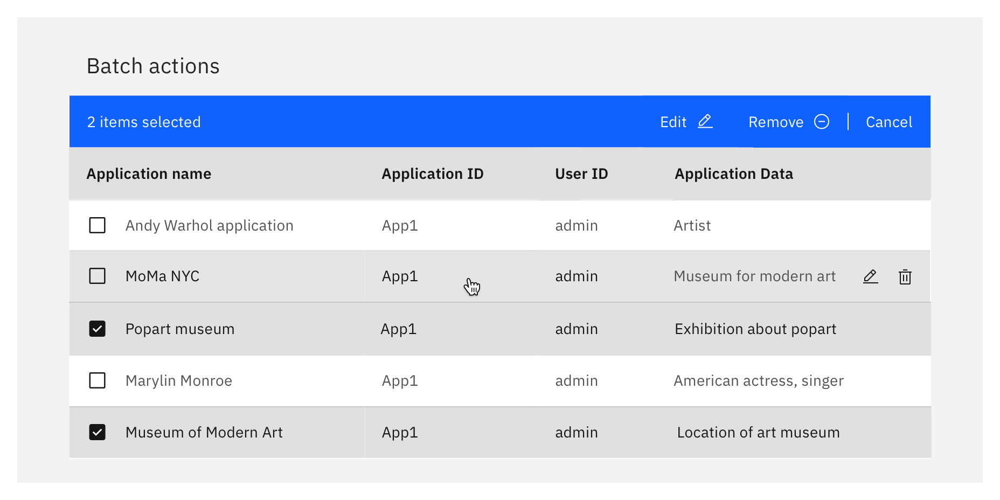

import { Breadcrumb, BreadcrumbItem } from "carbon-components-react";

<Breadcrumb>
  <BreadcrumbItem href="/patterns/data-table/overview">Overview</BreadcrumbItem>
  <BreadcrumbItem isCurrentPage href="/patterns/data-table/column-alignment">
    Row action buttons
  </BreadcrumbItem>
</Breadcrumb>

<PageDescription>

Inline actions are functions that may be performed on a specific table row. Each row is accompanied by specific inline actions – either displayed in an [overflow menu](https://www.carbondesignsystem.com/components/overflow-menu/usage) or as icon action buttons.

</PageDescription>

<AnchorLinks>
  <AnchorLink>Best practices</AnchorLink>
  <AnchorLink>Overflow menus</AnchorLink>
  <AnchorLink>Action buttons</AnchorLink>
  <AnchorLink>Destructive actions</AnchorLink>
  <AnchorLink>Actions in batch edit mode</AnchorLink>
  <AnchorLink>Accessibility</AnchorLink>
  <AnchorLink>Related</AnchorLink>
</AnchorLinks>

<InlineNotification kind="info">

Action buttons and overflow menus are not interchangeable in terminology and are refereed to as 2 different components in this document. <Link to="https://www.carbondesignsystem.com/components/button/usage">Action buttons</Link> (rather icon action buttons) are buttons that use icons to instantiate an action or lead to a flow via a dialog. <Link to="https://www.carbondesignsystem.com/components/overflow-menu/usage">Overflow menus</Link> always use the "..." icon to indicate multiple items are available.

</InlineNotification>

## Best practices

- Overflow menu are the default to use if there are more than 2 action a user take on a row.
- When fitting to mobile screens, convert any number of action buttons in a row to always persistent overflow menus.
- Overflow menus are by default persistent unless in condensed spaces, to which making them visible only on hover is acceptable but not necessary.
- Show action buttons persistently only if the user is being encouraged to click them. Otherwise, action buttons should be visible on hover to discourage use and to de-clutter content that would otherwise become redundant.
- Destructive actions are by default visible only on hover of the row. The exception is if we want to encourage the user to click on the action (i.e to remove items from a deleted files section).

 

## Overflow menus

### When to use

- When a table has rows that include more than 2 action buttons, use an overflow menu instead.
- When a table has rows that include actions which are dependent on other properties which can vary the amount of actions (role access, permissions, available content, asset type, etc) use an overflow menu instead of changing action button icons per row.

<DoDontRow>

<DoDont caption="Do show overflow menus persistently by default.">

</DoDont>

<DoDont caption="Do consider in condensed spaces to ensure the overflow menus can be shown on hover to keep focus on the table information itself.">

</DoDont>

</DoDontRow>

### When not to use

- Do not use if a table has rows with 1 or 2 static actions.

<DoDontRow>

<DoDont type="dont" caption="Don’t show overflow menus on hover by default. Overflow menus on hover are hard to discover due to the low visual contrast. Exception: condensed spaces.">

</DoDont>

</DoDontRow>

 

## Action buttons

### When to use

- When a table has rows that include 1 or 2 action button, use individual action buttons on hover.

<DoDontRow>

<DoDont caption="Do display action buttons on hover by default.">

</DoDont>

</DoDontRow>

### When not to use

- When a table has rows that include more than 2 action buttons, use an overflow menu instead.
When icons aren't able to fully represent the action behind the icon, use text buttons or overflow menu instead.
- When a table has rows that include actions which are dependent on other properties (role access. permissions, available content, asset type, etc) use an overflow menu instead of changing action button icons per row.

<DoDontRow>

<DoDont type="dont" caption="Do not use persistent action buttons if you want to discourage use and de-clutter content.">

</DoDont>

</DoDontRow>

 

## Destructive actions

### When to use

- When a table has rows with actions that remove (destructively), delete, disconnect, or destroy the object being acted upon or if it may cripple the work in another system.

<DoDontRow>

<DoDont caption="Do add danger actions to the bottom of overflows.">

</DoDont>

<DoDont caption="Do display destructive actions on hover of the row.">

</DoDont>

</DoDontRow>

### When not to use

- For removal of objects that are not destroyed (i.e removing a user from a project does not delete the user from the system, as they can always be re-added again).

<DoDontRow>

<DoDont type="dont" caption="Do not include danger buttons at the top or middle of an overflow menu.">

</DoDont>

<DoDont type="dont" caption="Don’t display destructive actions persistent. Exception: if we want to encourage the user to click on the action.">

</DoDont>

</DoDontRow>

 

## Actions in batch edit mode

- Actions will be hidden (not just disabled but completely removed from view) from user if a data table has batch edit activated.
- User can only interact with table row actions if the batch edit is disabled/in normal viewing mode.

<DoDontRow>
  <DoDont caption="Do disable action buttons on rows when batch action mode is enabled.">

  </DoDont>
  <DoDont type="dont" caption="Do allow users to select action buttons on rows when batch action mode is enabled.">

  </DoDont>
</DoDontRow>

 

## Accessibility

### Keyboard & screen reader access

- Ensure that even if an action button is only available on hover, that we include the ability to tab to it for users with screen readers and those actively using keyboards. As soon as a user tabs into a row, display all avalable actions as if the user is hovering the row.

### Responsive design and touch screens

- When scaling down to the medium breakpoint, convert any hover-only action buttons into _persistent overflow menus_ (for any number of actions in a row). This helps reduce wasted space if there are 2 icons and makes it available for touch screens which typically assume this screen size or smaller.

 

## Related

- [Button component](https://www.carbondesignsystem.com/components/button/usage)