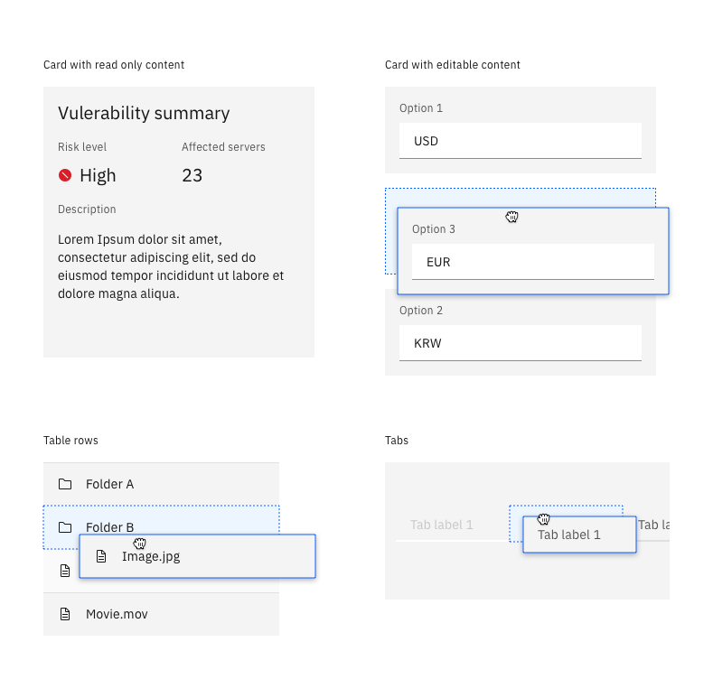
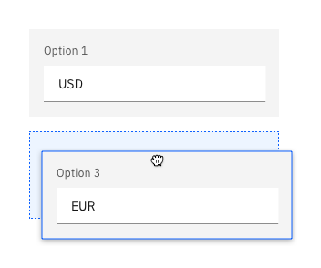
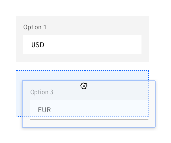
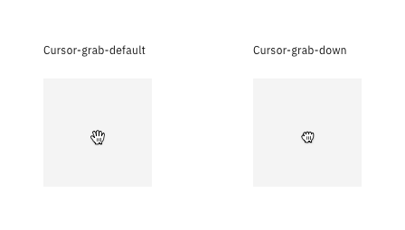
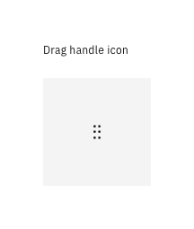
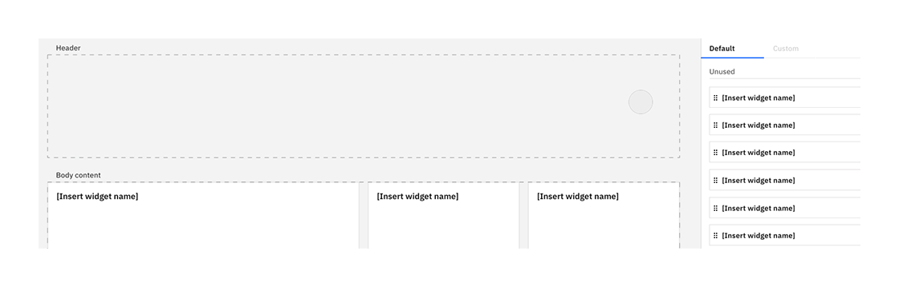
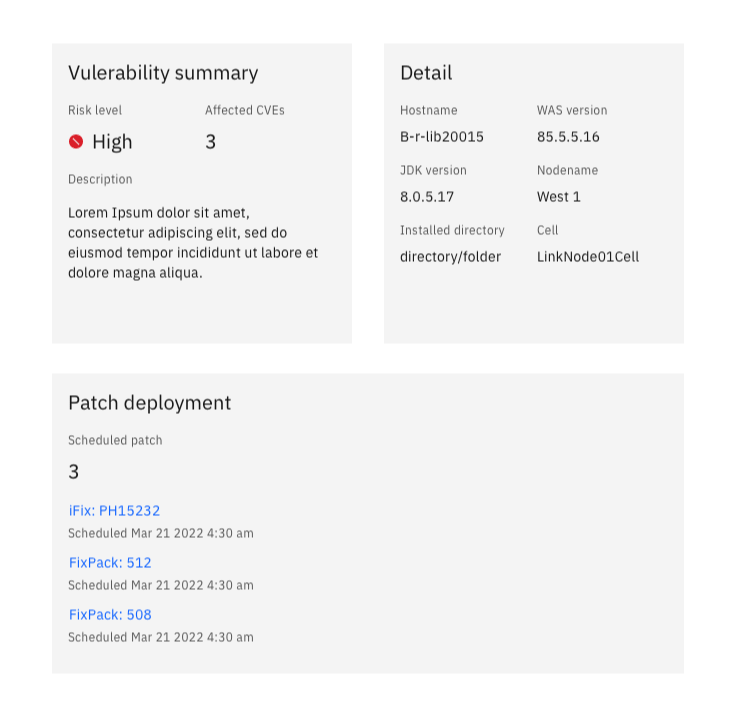
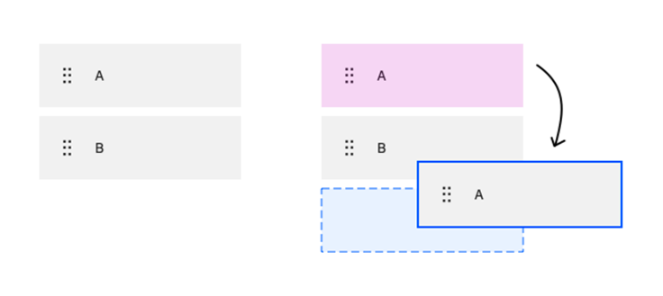
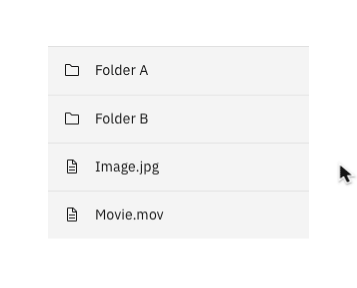

<PageDescription>

Drag and drop is a common interaction that is widely used for various situations. In Carbon ecosystem, we clarify the use cases, interactions and styles. 

</PageDescription>

<AnchorLinks>
    <AnchorLink>Overview</AnchorLink>
    <AnchorLink>When to use</AnchorLink>
    <AnchorLink>Draggable objects</AnchorLink>
    <AnchorLink>Signifier</AnchorLink>
    <AnchorLink>Dropzone</AnchorLink>
</AnchorLinks>

## Overview
Drag and drop is a common interaction that is widely used in various situations. Within the Carbon ecosystem, we clarify the use cases, interactions and styles. Drag and drop interaction consists of three phases - grabbing the object, dragging the object and dropping the object. Different signifiers and styles are used during each phase. 

### When to use

| Use case                             | Goal                                                                                 |
| ------------------------------------ | ------------------------------------------------------------------------------------ | 
| Move cards or tiles in a dashboard   | Use with quick, simple creations like that of an item.                               |
| Reorder the list                     | Use with simple or transitional creations with no more than a couple of form fields. | 
| Upload, move and copy files          | Use with medium complexity creations if the user needs page context.                 | 
| Merging cards                        | Use with medium complexity creations.                                                |  

## Draggable objects
There are many objects that can be draggable, but here are the three most common: 
- Cards
- Table rows
- Tabs

    

### Style
While the object is being dragged, it contains a focus state to differentiate the draggable object from other components on the screen. 

| Border                           |                                                  |
| -------------------------------- | ------------------------------------------------ | 
| border-style                     | solid                                            |
| border-width                     | 1px                                              |
| border-color                     | Blue60                                           |

| Shadow                           |                                                  |
| -------------------------------- | ------------------------------------------------ | 
| box-shadow                       | 0 2px 6px 0 rgba(0,0,0,.3)                       |

<Row>
<Column colMd={4} colLg={4} noGutterSm>

<DoDontExample type="do" caption="No transparency adjusted while dragging the object. ">

</DoDontExample>

</Column>
<Column colMd={4} colLg={4} noGutterSm>

<DoDontExample type="dont" caption="Do not adjust transparency of the object while dragging.">

</DoDontExample>

</Column>
</Row>

## Signifier

### Mouse cursor

To initiate drag and drop interaction, a signifier to inform users that the object is draggable is required. 
Mouse cursor is the most important signifier. On the hover over the draggable object, the cursor changes to Cursor-grab-default state to indicate the object is draggable. On click and while dragging, the cursor changes to Cursor-grab-down state. 

### Drag handle icon

Drag handle icon is an **optional** signifier. When drag and drop interaction is expected in the context, no additional handle icon is needed. However, handle icon will help situation in the context it's not clear the object is draggable.

#### Handle icon displayed on hover

When there are many draggable objects on the screen. If drag and drop is expected as common action. (e.g., dashboard cards.)

#### Persistent handle icon

When it's not clear the objects are draggable, drag handle icon helps to inform the users the object is draggable. (e.g., movable tags on the separate column, reordering section in a form.) 

## Dropzone

While dragging the object, drop zone appears near the dragging object. The drop zone pushes nearby objects horizontally and/or vertically. 

### Initial location of the object 

When the object A moves to below the object B, the initial location A was before (pink highlighted). 

The original location becomes a drop zone. When the dragging object is moved to other point where the new drop zone appears, the original location drop zone disappears, and nearby objects takes up the space. 

When the original location of the object doesn't become a drop zone, it preserves the initial location as a disabled state. 

### Style

| Border                           |                                                  |
| -------------------------------- | ------------------------------------------------ | 
| border-style                     | dashed gap 2px                                   |
| border-width                     | 2px                                              |
| border-color                     | Blue60                                           |
| background-color                 | Blue10                                           |

## Contributors
Minji Kim  
Carrie Lloyd  
Johanna Koval  
Andrew Smith  

**Edited by**  
Minji Kim

**Last updated**  
Mar 18, 2022