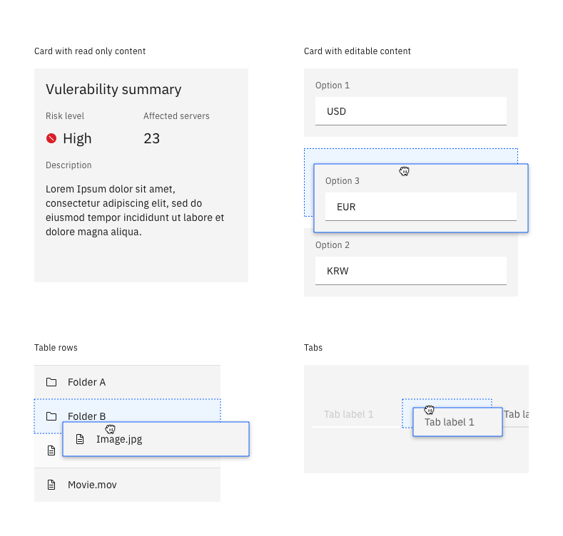
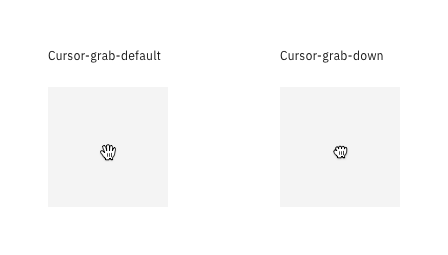
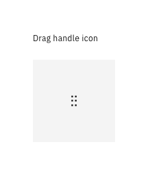
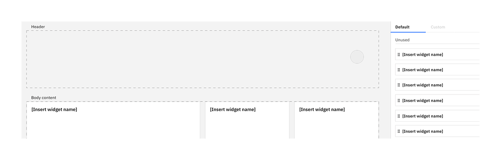
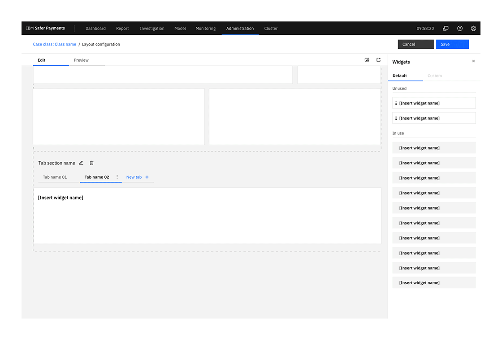

<PageDescription>

Drag and drop is a common interaction that is widely used for various situations. In the Carbon ecosystem, we clarify the use cases, interactions and styles.

</PageDescription>

<AnchorLinks>
  <AnchorLink>Overview</AnchorLink>
  <AnchorLink>When to use</AnchorLink>
  <AnchorLink>Draggable objects</AnchorLink>
  <AnchorLink>Signifier</AnchorLink>
  <AnchorLink>Dropzone</AnchorLink>
</AnchorLinks>

## Overview

Drag and drop is a common interaction that is widely used in various situations. Within the Carbon ecosystem, we clarify the use cases, interactions and styles. Drag and drop interaction consists of three phases - grabbing the object, dragging the object and dropping the object. Different signifiers and styles are used during each phase.

### When to use

| Use case                           | Goal                                                                                 |
| ---------------------------------- | ------------------------------------------------------------------------------------ |
| Move cards or tiles in a dashboard | Use with quick, simple creations like that of an item.                               |
| Reorder the list                   | Use with simple or transitional creations with no more than a couple of form fields. |
| Upload, move and copy files        | Use with medium complexity creations if the user needs page context.                 |
| Merging cards                      | Use with medium complexity creations.                                                |

## Draggable objects

Many objects can be draggable, but here are the three most common:

- Cards
- Table rows
- Tabs

<Row>
<Column colMd={8} colLg={8}>

</Column>
</Row>

### Style

While the object is being dragged, it contains a focus state to differentiate the draggable object from other components on the screen.

| Border       |        |
| ------------ | ------ |
| border-style | solid  |
| border-width | 1px    |
| border-color | Blue60 |

| Shadow     |                            |
| ---------- | -------------------------- |
| box-shadow | 0 2px 6px 0 rgba(0,0,0,.3) |

<DoDontRow>
<DoDont aspectRatio="1:1" caption="No transparency was adjusted while dragging the object. ">

</DoDont>

<DoDont type="dont" aspectRatio="1:1" caption="Do not adjust the transparency of the object while dragging.">

</DoDont>
</DoDontRow>

## Signifier

### Mouse cursor

To initiate drag and drop interaction, a signifier to inform users that the object is draggable is required. 
The mouse cursor is the most important signifier. On the hover over the draggable object, the cursor changes to the Cursor-grab-default state to indicate the object is draggable. On click and while dragging, the cursor changes to a Cursor-grab-down state.

<Row>
<Column colMd={8} colLg={8}>

</Column>
</Row>

### Drag handle icon

The drag handle icon is an **optional** signifier. When drag and drop interaction is expected in the context, no additional handle icon is needed. However, the handle icon will help the situation in the context where it's not clear the object is draggable.

<Row>
<Column colMd={8} colLg={8}>

</Column>
</Row>

#### Handle icon displayed on hover

When there are many draggable objects on the screen. If drag and drop is expected as a common action. (e.g., dashboard cards.)

#### Persistent handle icon

When it's not clear the objects are draggable, the drag handle icon helps to inform the users the object is draggable. (e.g., movable tags on the separate column, reordering section in a form.)

<Row>
<Column colMd={8} colLg={8}>

</Column>
</Row>

## Dropzone

While dragging the object, the drop zone appears near the dragging object. The drop zone pushes nearby objects horizontally and/or vertically.

<Row>
<Column colMd={8} colLg={8}>

</Column>
</Row>

### Initial location of the object 

When object A moves below object B, the initial location A was before (pink highlighted).

<Row>
<Column colMd={8} colLg={8}>

</Column>
</Row>

The original location becomes a drop zone. When the dragging object is moved to another point where the new drop zone appears, the original location drop zone disappears, and nearby objects take up the space.

<Row>
<Column colMd={8} colLg={8}>

</Column>
</Row>

When the original location of the object doesn't become a drop zone, it preserves the initial location as a disabled state.

<Row>
<Column colMd={8} colLg={8}>

</Column>
</Row>

### Style

| Border           |                |
| ---------------- | -------------- |
| border-style     | dashed gap 2px |
| border-width     | 2px            |
| border-color     | Blue60         |
| background-color | Blue10         |

## Contributors

Minji Kim  
Carrie Lloyd  
Johanna Koval  
Andrew Smith  

**Edited by**  
Minji Kim

**Last updated**  
Mar 18, 2022
