#### Maintainers:

The Carbon for IBM Products > Design System Adoption Guild (DSAG).
Slack channel: [#ibmproducts-pal](https://ibm-casdesign.slack.com/archives/CQGR0HC05)

<PageDescription>

To edit is to change values or data. This pattern focuses on how to place
the user in a flow when there's a need for editing an existing asset, and
provides important considerations to keep in mind when creating edit flows.

</PageDescription>

<AnchorLinks>
  <AnchorLink>Overview</AnchorLink>
  <AnchorLink>Inline edit</AnchorLink>
  <AnchorLink>Modal edit</AnchorLink>
  <AnchorLink>Side panel edit</AnchorLink>
  <AnchorLink>Tearsheet edit</AnchorLink>
  <AnchorLink>Full page edit</AnchorLink>
  <AnchorLink>Other edit behaviors</AnchorLink>
  <AnchorLink>Other considerations</AnchorLink>
  <AnchorLink>Designing with edit flows</AnchorLink>
  <AnchorLink>Related use cases</AnchorLink>
  <AnchorLink>Terminology</AnchorLink>
</AnchorLinks>

## Overview

Users often need to edit different types of
assets and information, and they can have simple or complex requirements.
Choosing an edit flow that matches the complexity and context of the data will
help ensure users can easily edit and update assets and information in your product.

<Row className="image-card-group">

<Column colMd={3} colLg={3} noGutterSm>

<ImageCard 
sub-title="Inline edit"
sub-titleColor="dark"
aspectRatio="4:3"
hoverColor="dark"
href="#inline-edit">

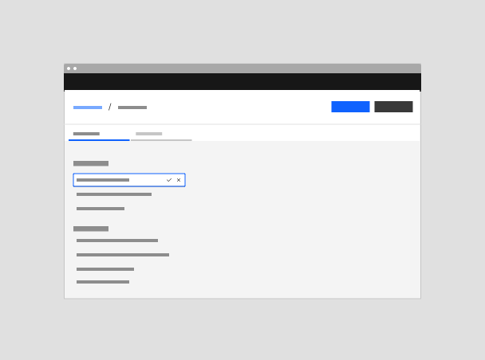

</ImageCard>

<ImageCard
sub-title="Narrow tearsheet edit"
sub-titleColor="dark"
aspectRatio="4:3"
hoverColor="dark"
href="#narrow-tearsheet">

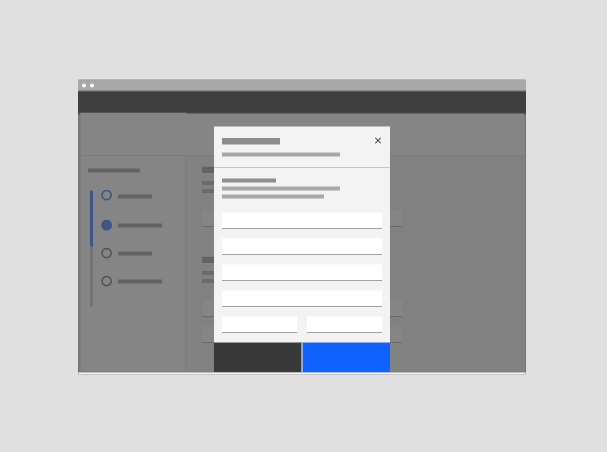

</ImageCard>

</Column>

<Column colMd={3} colLg={3} noGutterSm>

<ImageCard 
sub-title="Modal edit"
sub-titleColor="dark"
aspectRatio="4:3"
hoverColor="dark"
href="#modal-edit">

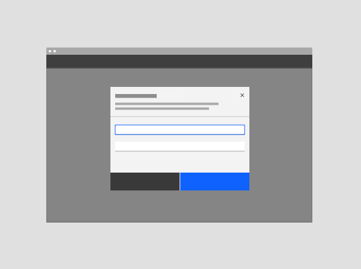

</ImageCard>

<ImageCard
sub-title="Wide tearsheet edit"
sub-titleColor="dark"
aspectRatio="4:3"
hoverColor="dark"
href="#wide-tearsheet-edit">

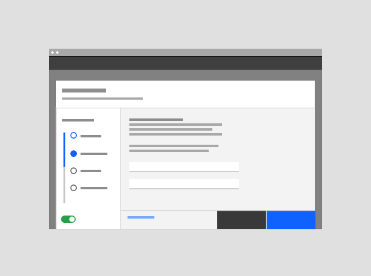

</ImageCard>

</Column>

<Column colMd={3} colLg={3} noGutterSm>

<ImageCard
sub-title="Side panel edit"
sub-titleColor="dark"
aspectRatio="4:3"
hoverColor="dark"
href="#side-panel-edit">

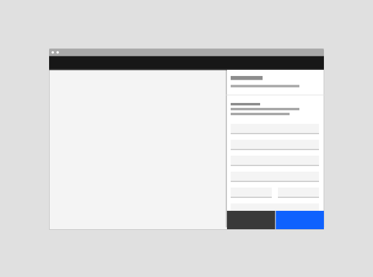

</ImageCard>

<ImageCard
sub-title="Full page edit"
sub-titleColor="dark"
aspectRatio="4:3"
hoverColor="dark"
href="#full-page-edit">

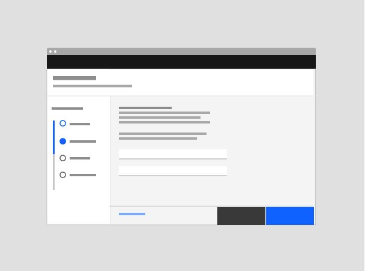

</ImageCard>

</Column>

</Row>

#### Deciding what to use

Choose the flow depending on the number, impact and intent of edits made.  
Refer to [Behaviors](#behaviors) and [Best practices](#best-practices).

| Type                                          | Usage                                                                                                                                | Context                                          |
| --------------------------------------------- | ------------------------------------------------------------------------------------------------------------------------------------ | ------------------------------------------------ |
| [Inline edit](#inline-edit)                   | Use with quick, simple edits of individual fields.                                                                                   | On-page content can be seen and interacted with. |
| [Modal edit](#modal-edit)                     | Use with simple or transitional edits of no more than a couple of form fields.                                                       | On-page content is obscured.                     |
| [Side panel edit](#side-panel-edit)           | Use with medium complexity edits if the user needs page context.                                                                     | On-page content can be seen.                     |
| [Tearsheet edit](#tearsheet-edit)             | Use with medium to complex edits.                                                                                                    | On-page content is obscured.                     |
| [Full-page edit](#full-page-edit)             | Use when settings on a page need to always be shown in edit mode, or when the context of the page is needed to make several changes. | N/A                                              |
| [Other edit behaviors](#other-edit-behaviors) | UI components with their own edit interaction patterns such as cards, dashboards, data tables, text editors and property editors.    | N/A                                              |

## Inline edit

### States

Inline editing requires particular visual and behavioral cues to make the experience clear to the user. Use the following states and behaviors when using this edit variation:

- When a user hovers or tabs to static content, it will show an edit icon and background hover color
  to let the user know they can edit it. Note: Make sure the item being edited is visually distinct
  and separate from other values that cannot be inline edited to avoid confusion. For mobile and tablet screens,
  show the edit icon always (instead of just on hover).
- Once the user clicks the content/editable item, the Close (Cancel) and Check (Save) icon buttons appear.
- Once a change is detected, the Check (Save) icon button becomes enabled.
- To cancel the edits, the user can click the cancel button or press the Escape key to revert the field back to a static view and the latest value.
- If the field has an error, the error icon shows next to the cancel and save buttons.

<Row>
<Column colMd={8} colLg={6}>

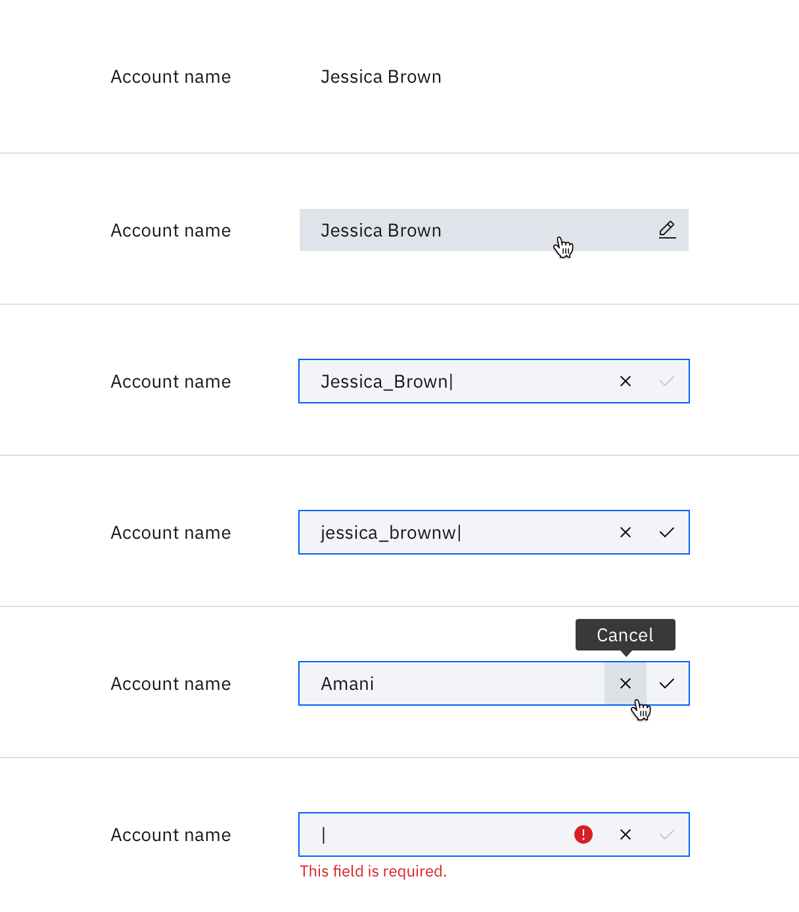

</Column>
</Row>

#### Additional behavior notes

- Saving the value. Clicking the Save button or pressing the Enter/Return key will save the new input.
- If the user clicks away from the field instead of clicking the Save button,
  as long as no errors were detected, and the user did not click to navigate away from the current page/view,
  the new value will be saved automatically. If an error was detected, show the field in an error state with
  the Save button disabled.
- A user should be able to undo changes they have made to a value by pressing cmd/ctrl + Z on the keyboard.
- If the user tries to navigate away from the page before changes are saved, show a confirmation modal letting
  them know they have unsaved changes, and explaining that if they proceed, their changes will not be saved. If
  they Cancel out of this modal, they will remain on the current page and see the value still in the editable state
  with the Save and Cancel buttons enabled.

<Row>
<Column colMd={8} colLg={8}>

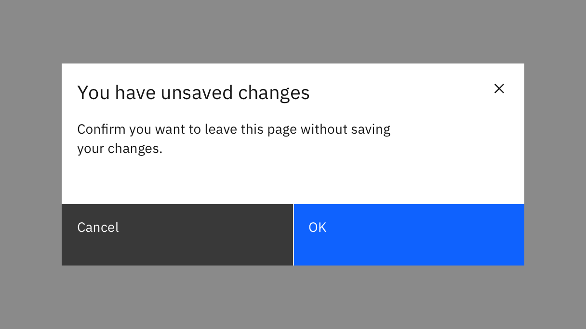

</Column>
</Row>

- If the user tries to navigate away from the page and an error exists on an edited value, a low-contrast inline error notification
  letting the user know they have an unsaved value(s) with errors should appear at the top of the section where the
  error exists and should automatically scroll to that section so that the inline error notification can be read.

### When to use

Use this pattern when the user needs to make and apply quick, simple edits to a
text input or text area field one at a time.

### When not to use

- The user will likely make many changes at a time - instead, use a pattern that enables them to make several edits before committing the changes as a group.
- The change will affect another setting.
- The field will be any form element other than text input or text area.
- Consider using a bulk edit pattern if there are several values in a section that can be edited.
- If the field(s) being edited are next to other values that look the same but have a different edit pattern, or won't show an icon on hover.

## Modal edit

### Anatomy

<Row>
<Column colMd={8} colLg={8}>

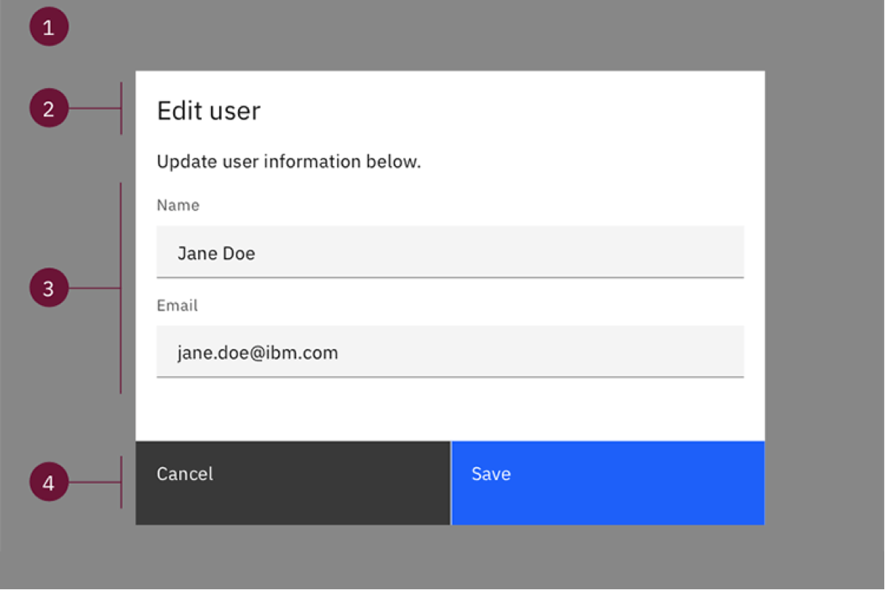

</Column>
</Row>

1. **Modal size & overlay:** Small modal. Screen overlay that obscures the on-page content.
2. **Edit title:** Title line for edit flow with optional subtitle.
3. **Body:** Contains the information and/or controls needed to populate the task. It can include message text and components (1 or 2 form fields).
4. **Buttons:** The primary and secondary buttons are "Save" and "Cancel".

### When to use

- Use a modal for simple edits with one or two form fields to be filled out.
- For example, for a read-only summary in a panel, clicking edit
  opens edit modal (only for edits with 1-2 form fields).

### When not to use

- When inline editing can be done instead.
- The content is being "edited" frequently - use inline edit instead.
- There are more than three form fields, or if there is
  scrolling inside the modal. Modals should not have more than two form fields within them.

## Side panel edit

### Anatomy

<Row>
<Column colMd={8} colLg={8}>

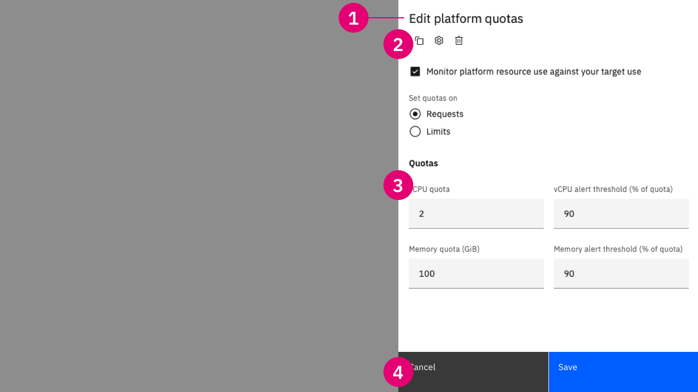

</Column>
</Row>

1. **Title block**: The title block contains navigational elements such as closing, go back, and pop out, along with header text (always begins with "Edit [object name]") and description that describes the side panel’s purpose.
2. **Action toolbar (optional)**: The action toolbar is a set of global secondary action buttons the user can perform with the side panel’s content.
3. **Body content**: The body content area displays various informational and editable elements based on the use-case. The body content is the only scrollable area within the side panel.
4. **Primary actions**: For an edit side pannel, the primary and secondary buttons are "Save" and "Cancel".

#### Panel size

One reason for editing in side panels is that they allow the user to stay in context.
Choose a side panel size that allows enough of the background to stay in context, while
is also being mindful of a size that comfortably and appropriately fits the content that
needs to be edited. Refer to [Side Panel guidelines](https://pages.github.ibm.com/cdai-design/pal/components/side-panel/usage) for available sizes and grids.

#### Slide-in

Use a slide-in panel when the user needs to reference page-level information to complete the edits.
The user needs the ability to interact with the panel alongside of the page content. In this case, if the
user tries to navigate away from the page without saving their changes, show the confirmation modal outlined
in the [Inline edit section](#inline-edit)) to let the user know they have unsaved changes and confirm
they want to proceed without saving.

#### Slide-over

Use a slide-over panel when the user does not need to interact or reference the main page below the panel. 
The user should have their focus on the panel and editing the workflow within it.

#### Example usage situations:

- Editing properties of nodes in canvas-based products (for example, Elyra/Common Canvas
  products such as DataStage, Orchestration, and Modeler).
- Editing objects in a data table.

### When to use

- When editing the content in a data table row (and inline edit for the table is not appropriate).
- Consider a side panel to show additional information on the object being edited.
- The user needs to stay in context with the surrounding content as they make their edits.
- The original create flow was in a narrow tear sheet and you don't want to obstruct the context by re-opening the narrrow tear sheet for edits.

### When not to use

- Do not use a side panel for simple one-task edits - consider inline editing instead.
- The information being referenced is complex or if launching an extensive create flow - use a tearsheet instead.
- The information being reference is simple or if launching a simple create or edit flow.
- If needing a complex edit or create flow.

## Tearsheet edit

### Narrow tearsheet

#### Anatomy

<Row>
<Column colMd={8} colLg={8}>

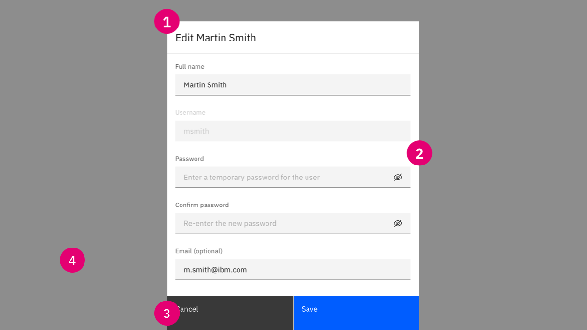

</Column>
</Row>

1. **Header**: The header can include title, description, labels, and tabs. Always use "Edit" in the title.
2. **Main content area**: This area includes the editable content.
3. **Save/cancel buttons**: The primary and secondary buttons are "Save" and "Cancel".
4. **Background overlay**: (same as modals)

#### When to use

- The original create flow was in a narrow tear sheet.
- There are enough edits to require scrolling.
- The content is more complex than what is allowed in a modal.

#### When not to use

- The task is too small to warrant the tear sheet (i.e., only one field needs
  to be edited) - use inline edit or a modal instead.
- The user needs to interact with, compare, or have full view of the rest of the
  screen's content.
- Input is required before a user can proceed - use a modal instead.
- If there is a large amount of editable content or complex/multi -step
  interactions needed - use a large tear sheet or side panel instead.

### Wide tearsheet edit

#### Anatomy

<Row>
<Column colMd={8} colLg={8}>

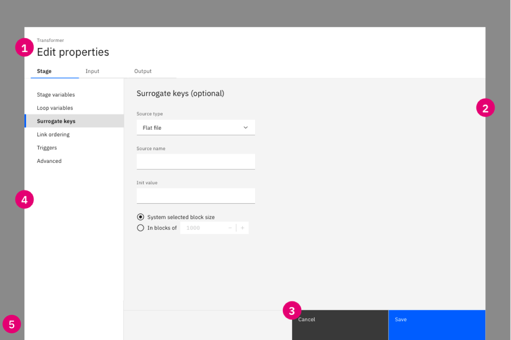

</Column>
</Row>

1. **Header**: The header can include title, description, labels, and tabs. Must include "Edit" in the title.
2. **Main content area**: This area includes the editable content.
3. **Navigation buttons**: In most cases, the navigation buttons are limited to primary and secondary
   buttons ("Save" and "Cancel"). If the edit flow requires steps (not common), the Next/previous buttons serve as
   the primary and secondary buttons until the last step, where the primary button is "Save" (Cancel is the ghost button in this case).
4. **Influencer (optional)**: A left side panel that can be used, for example, as a menu, progress indicator, or filter. Alternatively, a right side panel can be used for a Summary (of changes).
5. **Background overlay (same as modals)**

#### When to use

- The create flow happened in a tear sheet.
- A subset of the related item will be edited.
- You want to keep the user in context instead of taking the user to a new page.
- The amount of content is too much for a modal or narrow tear sheet.
- The content is too complex for a modal or narrow tear sheet.
- If the space to edit in the original location is too restricted (i.e. in a narrow side panel), a tear sheet can provide more area to work.

#### When not to use

Do not use when the edit actions are few/simple - consider using a modal instead.

## Full page edit

### Anatomy and behaviors

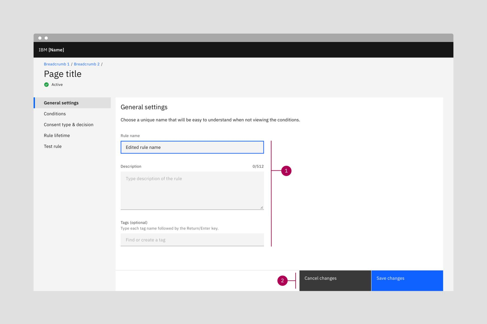

1. **Editable content.** Everything in the page is editable and shown in the editable state.
2. **Save/cancel buttons.** Cancel changes and save changes buttons are always shown as disabled until
   a change is detected on the page. Note that "changes" is added to the button names in this case because
   the title of the page does not have "Edit" in it. In a toggle use case where the content on the page was
   static until the user turned on an edit mode, the title of the page would change to "Edit [object]" and
   the buttons would be labeled "Cancel" and "Save".

| Use case                         | Behavior                                                                                                                |
| -------------------------------- | ----------------------------------------------------------------------------------------------------------------------- |
| Toggle a page to "edit mode"     | Save and cancel buttons show at the bottom when in "edit mode".                                                         |
| Settings page is always editable | "Save changes" and "Cancel changes" buttons sit at bottom of browser window, and are disabled until change is detected. |

### When to use

- The user will want to submit multiple changes at once.
- A full page needs the ability to toggle into an edit mode.
- The main value of the object is its settings and it needs a "home" (i.e. its own page), but having an extra view of all the settings in a static/uneditable view is overkill. In this case, the page always shows the settings in editable mode, and the save changes/cancel changes buttons are shown in a disabled state until a change is detected.
- Editing is done using a draft flow.

## Other edit behaviors

Some components have their own distinct edit behaviors.

<Row className="image-card-group">

<Column colMd={3} colLg={3} noGutterSm>

<ImageCard 
sub-title="Component: Card edit"
sub-titleColor="dark"
aspectRatio="4:3"
hoverColor="dark"
href="#cards">

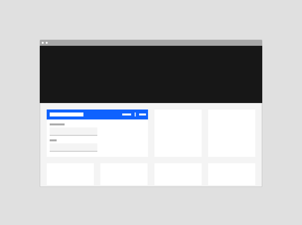

</ImageCard>

</Column>

<Column colMd={3} colLg={3} noGutterSm>

<ImageCard
sub-title="Component: Data table edit"
sub-titleColor="dark"
aspectRatio="4:3"
hoverColor="dark"
href="#data-tables">

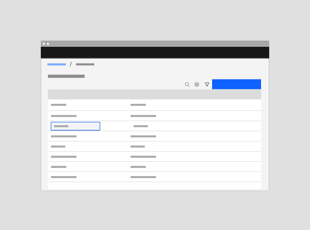

</ImageCard>

</Column>

<Column colMd={3} colLg={3} noGutterSm>

<ImageCard
sub-title="Component: Text editor"
sub-titleColor="dark"
aspectRatio="4:3"
hoverColor="dark"
href="#text-editors">

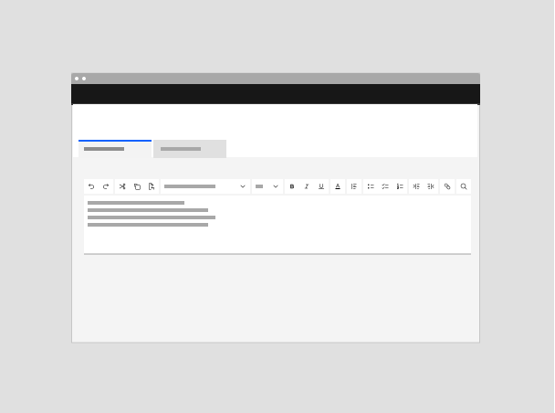

</ImageCard>

</Column>

</Row>

### Cards

Editable cards allow a user to view, modify, and save the content contained
within the card. These cards are generally used in instances where a user needs
to make changes to a resource instances (ex. configuration details), account
plan, etc. Editable cards allow a user to edit something within context.

#### Cards - simple edits

<Row>
<Column colMd={12} colLg={12}>

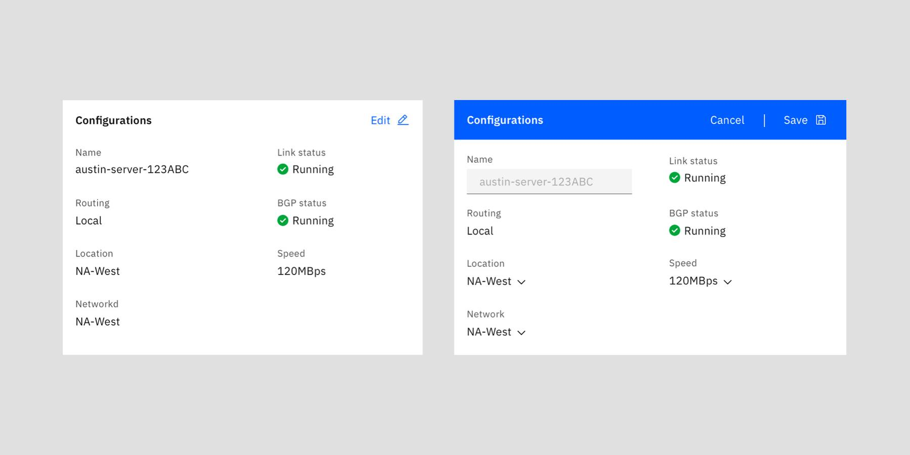

</Column>
</Row>

For simple edits such as changing the name of an object, editable cards can be used. Edit mode is triggered by clicking on the edit button (left card, top-right). When in edit mode (right card) highlight what is editable with active inline inputs and disable what is not.

Note: Your card height might vary if you don’t use inline inputs when the user toggles the edit mode on/off.

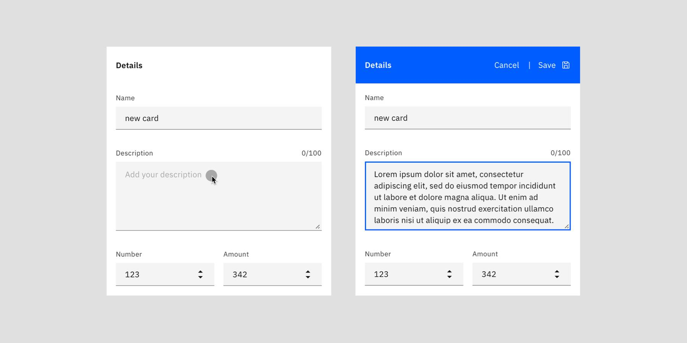

#### Cards - complex edits

In instances where a user needs to make multiple edits and the changes made to a
card can’t be contained in place and/or have high-impact (ex: dependencies or
plan/cost change) use the side panel to display all fields that can be edited
and needed information.

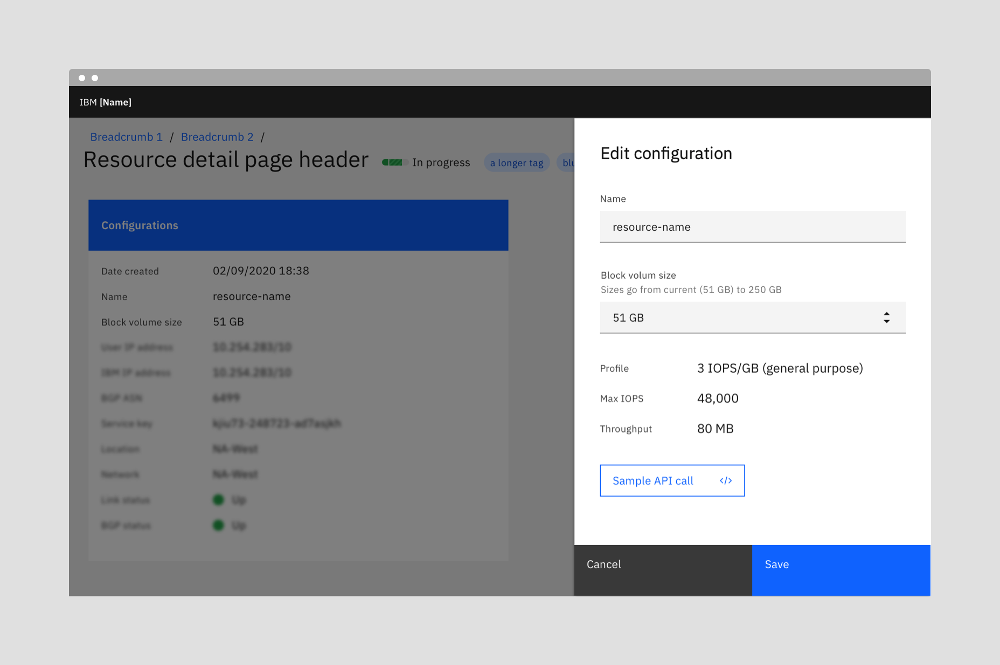

### Data tables

Refer to [data table pattern documentation](https://pages.github.ibm.com/cdai-design/pal/components/data-table/overview) for editing content in a data table.

### Text editors

Refer to the [Text editor toolbar documentation](https://www.carbondesignsystem.com/patterns/text-toolbar-pattern/) for guidance on using text editors.

## Other considerations

### Summary of changes

Consider adding a summary of the changes for users to review before saving if
there is a chance a user could lose track of the edits they made, for example in
long forms.

- The summary of changes should only be used for fullscreen and tearsheet edits if the user has to scroll or navigate different components to make the edits.
- It should be used to provide an overview of what the user has changed and potentially explain what the consequences of those changes mights be.
- It should also allow for the user to make quick edits like removing a specific change if they decide they don't want to make that change anymore. A good example of this is the add and select tearsheet pattern. In this pattern users are making selections from a list, the summary shows the selected items in one spot and the option to remove individual selections.

Use a right side panel to show the changes that the user is making.  The summary of changes should show the information in the way that suits the content. For example, show a list of fields changed or a list of the selections made. If possible, users should be able to remove the changes listed in the summary from the side panel before saving.

<Row>
<Column colMd={12} colLg={12}>

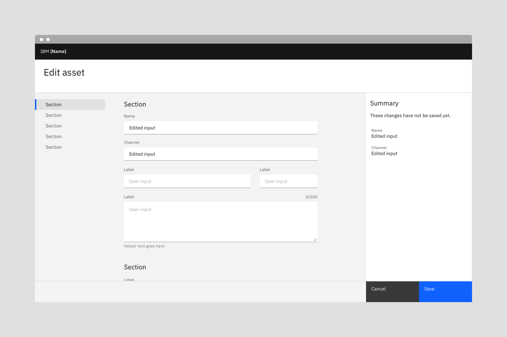

</Column>
</Row>

### Warnings

Notify and warn users if saving the edits made will have an impact in other
areas or will make changes elsewhere. Inform the user if their changes or edits
cannot be undone.

Consider the level of severity of the edits to make sure the users are warned and
aware of the consequence of the changes they made:

#### Low severity edits 

Changes that are only to a non-functional values and that
don't have impacts on other areas are considered low severity edits. For low
severity edits, the "always editable" or "batch edit"  patterns can be used. Don't
show a warning model for low severity edits.

#### High severity edits

Changes are considered high severity edits if they will cause any of the following:

- Behaviours, assets, components, workflows will need to change.
- The customer experience will change.
- The experience for other people in the organization will changes.
- They will trigger needing to edit somewhere else.

High severity edits require a confirmation dialog. The button to confirm the changes should use the [danger button](https://www.carbondesignsystem.com/components/button/usage/).

<Row>
<Column colMd={8} colLg={8}>

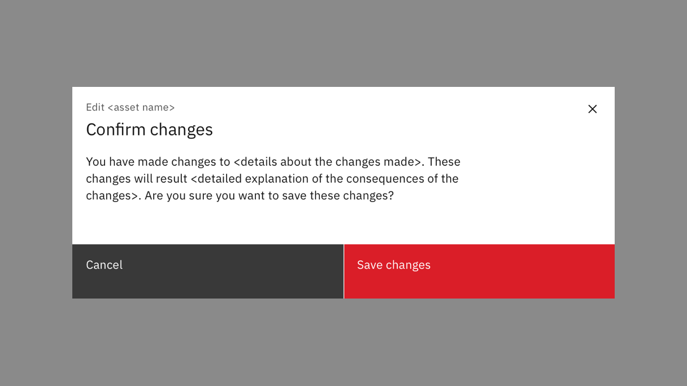

</Column>
</Row>

### Undo

Consider how the edits fits in the undo stack:

- If fields are always editable, users should be able to undo each step or element.
- If there is an "edit mode", consider allowing the user to undo specific element
  changes in addition to the an overall undo after the user saves changes that would revert all of the changes made.

Undo is dependent on the use case, however, consider adding "undo" as an action
in the confirmation notification or options to clear edits if it fits in editing mode.

### User feedback

#### Success confirmation

An optional success notification can be used to confirm that the user’s changes
have been saved. Consider confirmation notifications especially if users will be
leaving the edit mode, or exiting an edit modal, tearsheet or view  would be losing
the view of the changes they made. For inline edits or automatic saving a
notification is not recommended to avoid excessive notifications noise, as long as
there is obvious visual feedback that the changes have been applied.

If saving the changes is an operation that will take time to process consider including
the confirmation notification in the notification center.

For confirmation notifications, follow
[Carbon's notifications guidelines](https://www.carbondesignsystem.com/components/notification/usage/)
as well as the [notifications pattern](https://www.carbondesignsystem.com/patterns/notification-pattern/).

#### Errors

As the users are making edits, show immediate feedback about their changes as
much as possible. Show inline errors when applicable, following [validation and
error pattern guidance](https://www.carbondesignsystem.com/components/form/usage/#validation-and-errors). 
Try to highlight errors that have dependents as early as possible.

In the case that the "save changes" operation fails:

- Keep users in the edit view, or bring users back to the "edit" page (This could potentially be through an
  "error saving" [notification](https://www.carbondesignsystem.com/patterns/notification-pattern/))
- Try to retain users' work and changes as much as possible. Consider auto
  saving as draft especially if there are a lot of changes made.

## Designing with edit flows

### Behaviors

#### Edit mode

If the user intent includes viewing without editing, provide a read-only state
and reveal editable fields when users click an "edit" button.

| Type               | Interaction                                                                 | When to use                                                                                                                    |
| ------------------ | --------------------------------------------------------------------------- | ------------------------------------------------------------------------------------------------------------------------------ |
| Active "edit mode" | Editable fields become available only after a user clicks an "edit" button. | Use when users' intent may be to review rather than change data or values. Use when editing will disrupt user or system tasks. |
| Always editable    | Fields that can be changed always appear editable.                          | Use when users main goal is to change data rather than review data.                                                            |

<Row>
  <Column colMd={4} colLg={4}>

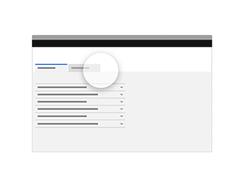

<Caption> With an "edit mode", editable fields become available after the user clicks an "edit" button.</Caption>

  </Column>
    <Column colMd={4} colLg={4}>

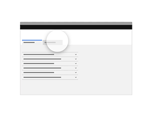

<Caption> Without an edit mode, fields that can be changed always appear in the editable state. </Caption>

  </Column>
</Row>

#### Save mode

Review the guidance in the
[saving pattern](https://pages.github.ibm.com/cdai-design/pal/patterns/saving/usage).

| Type                          | Interaction                                                                                                | When to use                                                                                                                                                                             |
| ----------------------------- | ---------------------------------------------------------------------------------------------------------- | --------------------------------------------------------------------------------------------------------------------------------------------------------------------------------------- |
| Active save                   | User clicks a "save" button to confirm the edits they have made to data or values.                         | Use when edits will disrupt user or system tasks. Use when batch edits to multiple values are made.                                                                                     |
| Auto save by interval         | System saves changes periodically without user action. Visual cues inform the user that changes are saved. | Use to prevent loss in case of error. Use when users are likely to remain in an "edit" flow for prolonged periods of time. Use when application of changes does not disrupt the system. |
| Auto save on leaving a field  | System saves the changes to each field after the user makes an edit.                                       | Use when the intent is to edit one or very few fields.                                                                                                                                  |

#### Severity

Edits that have a wider impact on the system or user experience should use
[warnings](#warnings) to inform the user of the consequence of their edits.

### Best practices

**Do: Title pages with "Edit (object)" so that users know what their actions
are.**  
Explicit IA lets us use succinct button terms such as "Save" or "Cancel".

**Do: Consider using the same edit variation as is used to create the resource.**  
Exceptions: Where the number of editable values is significantly smaller or larger than
during creation, or the context of current settings is required, use a different
behavior to when the resource is created.

**Do: Use a variation that is best for the number of editable (or likely to be
edited) values.**  
Some variations (modal, inline editing) are best used when few values are
editable. Consider how many values a user is likely to edit in each interaction.

**Do: Provide the data in a read-only format if the user's intent is often to
view rather than edit.**  
Consider using an "edit" button to reveal the edit form. See
[edit mode](#behaviors).

**Do: Provide users feedback**  
Alert users when saving changes fails. If possible, retain their work and allow
the user to try saving again.

**Do: Provide any context needed for a user to make edits to a value.** 
Consider side panel or inline editing so that the user can continue to see the
page context.

**Do: Inform users of the consequence of their edits, whether to other editable
values or to the system as a whole.**  
Use steps, validation and progressive disclosure to help users avoid error. When
editing a resource affects system availability, use warnings, messages and
notifications if necessary to inform the user.

**Do: Show a confirmation modal if the user tries to navigate away from a page when there are unsaved edits.**
Show the confirmation modal outlined in the [Inline edit section](#inline-edit)) to let the user know they
have unsaved changes and confirm they want to proceed without saving.

**Do: Default users to the non-stepped view of a multiple-step flow when they
edit unless edits can only be made sequentially.**

## Related use cases

See [Create flows](https://pages.github.ibm.com/cdai-design/pal/patterns/creation-flows/usage).

## Terminology

Refer to the
[Carbon for IBM Products glossary of terms](https://pages.github.ibm.com/cdai-design/pal/content/terminology/approved-terms).

**Edit:** Allows data or values to be changed.  
_Avoid "Configure", "Change" etc._

**Create new version:** Allows a new object to be created from the configuration
of an existing object. The user can edit the configuration before the object is
created.  
_If changes are applied to the creation of a new object (not the current object)
avoid using "edit" terminology. Instead, use "Create new version" or "Duplicate"
followed by "Edit".  Avoid "Save as"._

**Save:** Saves pending changes to a file, document or UI component.  
_Avoid "Apply changes" and "Finish".  Do not use "Done", "Commit", "OK", or
"Update"._

**Cancel:** Stops the current action and closes the dialog.  
_Avoid "Discard", "Clear", "Remove", "Reset", "Revert". Title pages/dialogs
"Edit (object) (object name)" so that the word "changes" does not need to be
combined with the action "Cancel changes"._

**Undo:** Reverts to the state before the most recent changes made by the
user.  
_Avoid "Restore", "Revert"._
