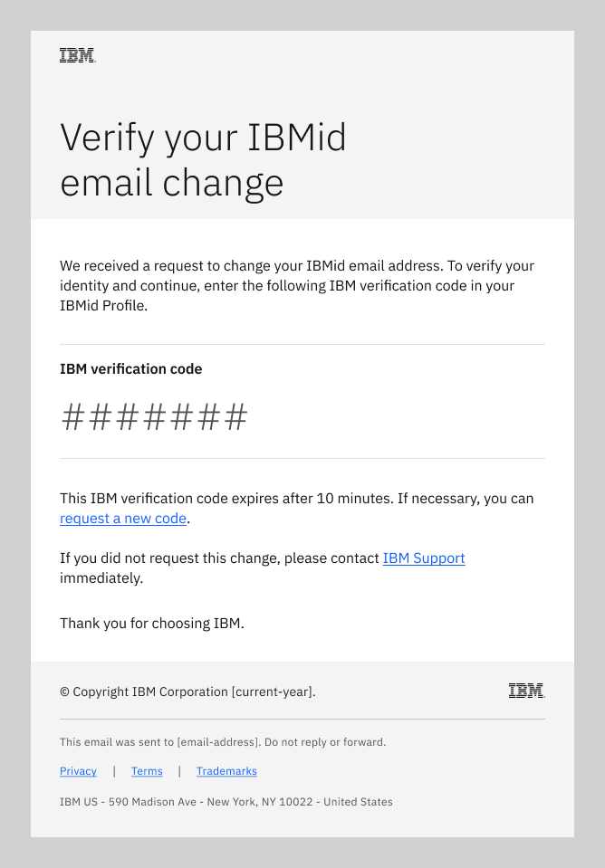
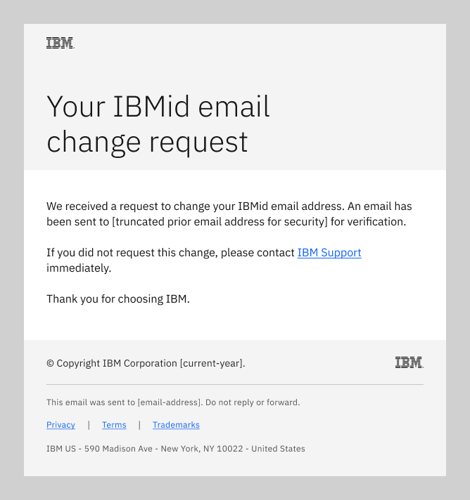
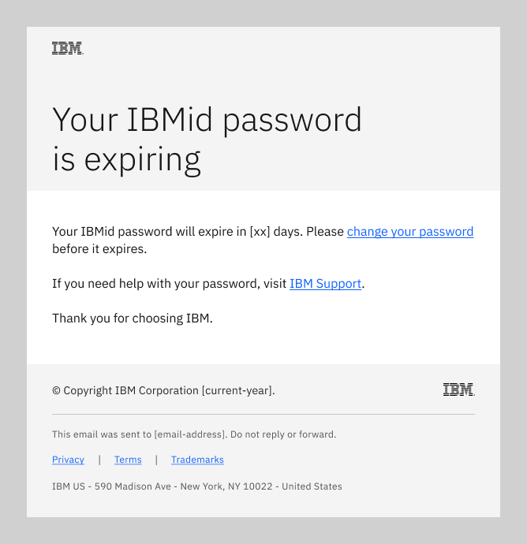
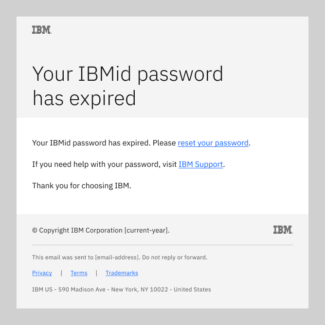

import { Breadcrumb, BreadcrumbItem } from "carbon-components-react";
import { Link } from "gatsby";

← [Back to Email patterns overview](/patterns/emails/overview)

<PageDescription>

IBMid transactional emails are sent when a user registers for an IBMid or updates their existing IBMid profile.

</PageDescription>

<AnchorLinks>
    <AnchorLink> Overview </AnchorLink>
    <AnchorLink> IBMid change email </AnchorLink>
    <AnchorLink> IBMid change password </AnchorLink>
</AnchorLinks>

## Overview
Product teams cannot change or alter IBMid email patterns. However, it is important for product teams to understand the end-to-end IBM email user experience, including IBMid emails, to promote brand consistency and reduce duplication. 

<InlineNotification kind="info">

**Note:** Additional IBMid transactional email patterns continue in development.

</InlineNotification>

## IBMid change email
This email flow enables a user to securely change their IBMid email address or their IBM profile contact email address, 
which can be the same email. The emails in this flow are sent to the user’s contact email address.

<Row>
<Column colMd={8} colLg={8}>

</Column>
</Row>

When the user submits an email address change request, the flow sends two automated emails to verify the identity of
the requester.

### Change verification email
One email, with a verification code, is sent to the new email address. This email directs the recipient to
enter the verification code into their IBMid profile change request at ibm.com. Their email address (IBMid or
contact) is not changed until the verification code is entered correctly.

<Row>
<Column colMd={8} colLg={8}>

Subject: Your IBM email change request

</Column>
</Row>

### Change notice email
A second email is sent to the user’s existing IBM email address to notify them of the profile change request. This
email directs the user to contact IBM immediately if they did not request a change to their IBM email address.

<Row>
<Column colMd={8} colLg={8}>

Subject: Your IBM email change request

</Column>
</Row>

### Profile updated email
When triggered by a completed update to their IBM user profile, this email is sent to the user's IBM contact email address. The email
alerts them to their updated profile.

<Row>
<Column colMd={8} colLg={8}>

Subject: Your updated IBM profile

</Column>
</Row>

## IBMid change password
This email flow enables a user whose IBMid password has expired, or is expiring soon, to securely change or reset their password.
The emails in this flow are sent to the user’s contact email address, which can be the same as their IBMid email.

<Row>
<Column colMd={8} colLg={8}>

</Column>
</Row>

When activated by a password expiration event, the flow sends the applicable email to prompt the user to either change or reset their
IBMid password.

### Password expiring email
When triggered by an expiration notice event, this email is sent to the user's IBM profile contact email address. The email
alerts them to their approaching password expiration and prompts them to change their password before it expires.

<Row>
<Column colMd={8} colLg={8}>

</Column>
</Row>

### Password expired email
When triggered by an expired password event, this email is sent to the user's IBM contact email address. The email
alerts them to their expired password and prompts them to reset their password.

<Row>
<Column colMd={8} colLg={8}>

</Column>
</Row>

### Profile updated email
When triggered by a completed update to their IBM profile, this email is sent to the user's IBM contact email address. The email
alerts them to their updated profile.

<Row>
<Column colMd={8} colLg={8}>

</Column>
</Row>
