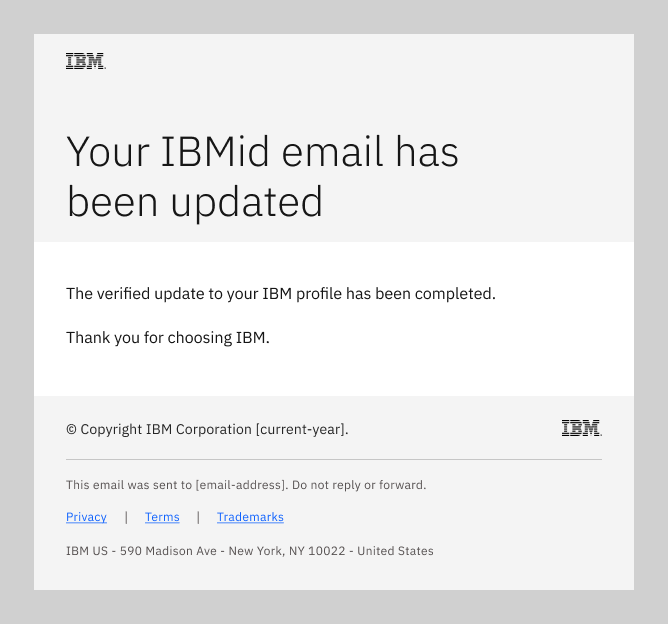
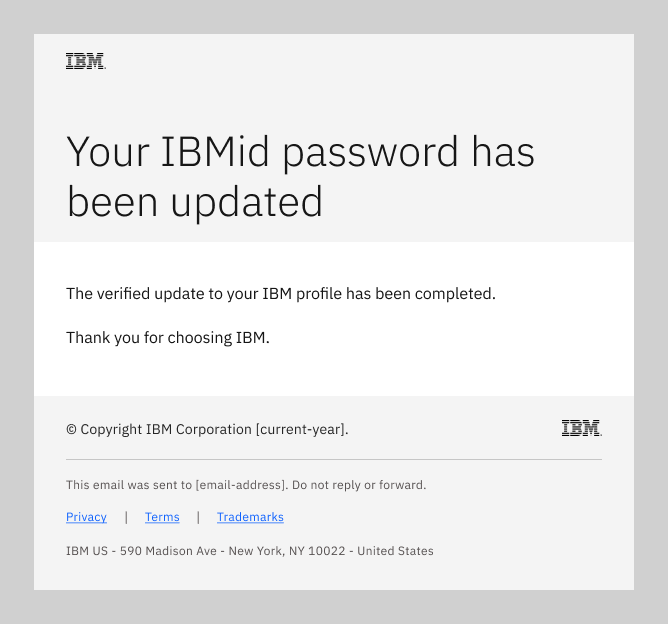

import { Breadcrumb, BreadcrumbItem, Tabs as CTabs, Tab as CTab } from "carbon-components-react";
import { Link } from "gatsby";

← [Back to Email patterns overview](/patterns/emails/overview)

<PageDescription>

IBMid transactional emails are sent when a user registers for an IBMid or updates their existing IBMid profile.

</PageDescription>

<AnchorLinks>
    <AnchorLink> Overview </AnchorLink>
    <AnchorLink> IBMid change email </AnchorLink>
    <AnchorLink> IBMid change password </AnchorLink>
    <AnchorLink> Self-report pattern adoption </AnchorLink>
</AnchorLinks>

## Overview
Product teams cannot change or alter the IBMid emails that are sent to customers. However, product teams should be aware of the end-to-end IBMid email user experience. 

<InlineNotification kind="info">

**Note:** Additional IBMid transactional email patterns continue in development.

</InlineNotification>

## IBMid change email
This email flow enables a user to change their IBMid email address. The emails in this flow are sent to the user’s current and new IBMid email addresses, as described.

<Row>
<Column colMd={8} colLg={8}>

</Column>
</Row>

When the user submits an IBMid email address change request, the flow sends two automated emails to verify the identity of
the requester.

### Change verification email
One email, with a verification code, is sent to the new IBMid email address. This email directs the recipient to
enter the verification code into their IBMid profile change request at their ibm.com user Profile page. Their IBMid email address 
is not changed until the verification code is entered correctly.

<Row>
<Column colMd={8} colLg={8}>

Subject: Your IBMid email change request

</Column>
</Row>

### Change notice email
A second email is sent to the user’s existing IBMid email address to notify them of the change request. This
email directs the user to contact IBM immediately if they did not request a change to their IBMid email address.

<Row>
<Column colMd={8} colLg={8}>

Subject: Your IBMid email change request

</Column>
</Row>

### IBMid updated email
When triggered by a completed update to their IBMid email address, this email is sent to the user's Contact information email address. The email
alerts them to their updated IBMid.

<Row>
<Column colMd={8} colLg={8}>

Subject: Your updated IBMid

</Column>
</Row>

## IBMid change or reset password
This email flow enables a user whose IBMid password is expiring soon, or has expired, to securely change or reset their password.
The emails in this flow are sent to the user’s Contact information email address. 

<Row>
<Column colMd={8} colLg={8}>

</Column>
</Row>

When triggered by a password expiration event, the flow sends the applicable email (expiring soon or has expired) to prompt the user to either change or reset their
IBMid password.

### Password expiring email
When triggered by an expiration notice event, this email is sent to the user's Contact information email address. The email
alerts them to their approaching password expiration and prompts them to change their password before it expires.

<Row>
<Column colMd={8} colLg={8}>

</Column>
</Row>

### Password expired email
When triggered by an expired password event, this email is sent to the user's Contact information email address. The email
alerts them to their expired password and prompts them to reset their password.

<Row>
<Column colMd={8} colLg={8}>

</Column>
</Row>

### Password updated email
When triggered by a completed change to their IBMid password, this email is sent to the user's Contact information email address. The email
alerts them to their updated password.

<Row>
<Column colMd={8} colLg={8}>

</Column>
</Row>

<InfoCard
cardName="Pattern version history"
cardDescription='Versions, changelog and contributors'>

<CTabs>

<CTab label="Version">

1.0  

</CTab>

<CTab label="Changelog">

2023-09-22: Version 1.0 release

</CTab>

<CTab label="Contributors">

<SME>

  <a href="https://w3.ibm.com/#/people/2J8178897">Rachel Jacobs</a>  
  <a href="https://w3.ibm.com/#/people/0D9543649">Judith Benjamin</a>  

</SME>

</CTab>

</CTabs>

</InfoCard>

## Self-report pattern adoption
<iframe class="airtable-embed" src="https://airtable.com/embed/appvxykrpLizynCkz/pagb8h96UpytE2Nzf/form" frameborder="0" onmousewheel="" width="100%" height="600" style="background: transparent; border: 1px solid #ccc;"></iframe>
