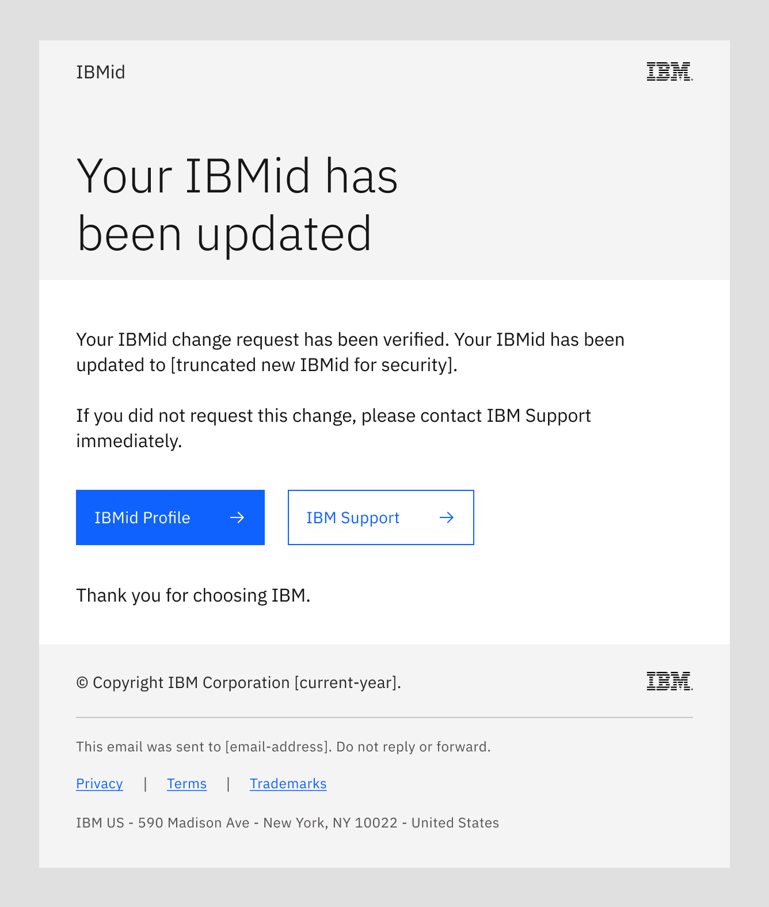

import { Breadcrumb, BreadcrumbItem, Tabs as CTabs, Tab as CTab } from "carbon-components-react";
import { Link } from "gatsby";

← [Back to Email patterns overview](/patterns/emails/overview)

<PageDescription>

IBMid transactional emails are sent when a user registers for an IBMid or updates their existing IBMid Profile.

</PageDescription>

<AnchorLinks>
    <AnchorLink> Overview </AnchorLink>
    <AnchorLink> Change IBMid</AnchorLink>
    <AnchorLink> Change or reset IBMid password</AnchorLink>
    <AnchorLink> Change IBMid Profile contact email address</AnchorLink>
    <AnchorLink> Change IBMid Profile business contact information</AnchorLink>
    <AnchorLink> IBMid multifactor authentication</AnchorLink>
    <AnchorLink> Self-report pattern adoption </AnchorLink>
</AnchorLinks>

## Overview
Product teams cannot change or alter the IBMid emails that are sent to customers. However, product teams should be aware of the end-to-end IBMid email user experience which provides access to their products. 

**Attention:** The email address which receives a given IBMid email may vary by circumstance, as noted below. For example, a user's IBMid Profile **Contact** email address may differ from the email address defined as the user's IBMid. 

## Change IBMid
This email flow enables a user to change the email address used for their IBMid. The emails in this flow are sent to the user’s IBMid Profile **Contact** email address, which may be different than the user's IBMid (email address).

<Row>
<Column colMd={8} colLg={8}>

</Column>
</Row>

When the user submits an IBMid change request in their IBMid Profile, the flow sends the following automated emails to their contact email address to 
verify the user's identity.

### IBMid change verification
This email with a 5-digit prefix and a 6-digit verification code is sent to the user's IBMid Contact email address. This email directs the recipient to
enter the 6-digit verification code into their IBMid Profile change request form. The email address used as their IBMid is not changed 
until the verification code is entered correctly.

<Row>
<Column colMd={8} colLg={8}>

Subject: Your IBMid change request

</Column>
</Row>

### IBMid changed notice
When the verification code is entered successfully, this email is sent to the user's IBMid Contact email address to 
provide notice of their changed IBMid.

<Row>
<Column colMd={8} colLg={8}>

Subject: Your verified IBMid change

</Column>
</Row>

## Change or reset IBMid password
This email flow enables a user to change or reset their IBMid password. The emails in this flow are sent to the user’s IBMid Profile **Contact** email address, which may be different than the user's IBMid (email address).

<Row>
<Column colMd={8} colLg={8}>

</Column>
</Row>

When triggered by a password expiration event, the flow sends the applicable email (expiring soon or has expired) to prompt the user to either change or reset their
IBMid password. 

### IBMid password expiring
When triggered by an expiration warning event, this email is sent to the user's IBMid Profile Contact email address. The email
alerts them to their approaching password expiration and prompts them to change their password before it expires.

<Row>
<Column colMd={8} colLg={8}>

</Column>
</Row>

### IBMid password expired
When triggered by an expired password event, this email is sent to the user's IBMid Profile Contact email address. The email
alerts them to their expired password and prompts them to reset their password.

<Row>
<Column colMd={8} colLg={8}>

Subject: Reset your IBMid password

</Column>
</Row>

### IBMid password changed
When triggered by a completed change to their IBMid password, this email is sent to the user's IBMid Profile contact email address. The email
alerts them to their updated password.

<Row>
<Column colMd={8} colLg={8}>

Subject: Your IBMid password change

</Column>
</Row>

## Change IBMid Profile contact email address
This email flow enables a user to change their IBMid Profile Contact email address. The emails in this flow are sent to the user’s IBMid Profile **Contact** email address which may be different than the user's IBMid (email address).

<Row>
<Column colMd={8} colLg={8}>

</Column>
</Row>

When the user submits a Contact email address change request in their IBMid Profile, the flow sends two automated emails, one each to their Contact email addresses (old and new), to verify the user's identity. 

### IBMid Profile contact email change verification
This email with a 5-digit prefix and a 6-digit verification code is sent to the user's existing IBMid Contact email address. This email directs the recipient to
enter the 6-digit verification code into the IBMid Profile change request form. Their Contact email address is not changed until the verification code is entered correctly.

<Row>
<Column colMd={8} colLg={8}>

Subject: Your IBMid Profile Contact email change request

</Column>
</Row>

### IBMid Profile Contact email changed notice
When the verification code is entered successfully, this email is sent to the user's new IBMid Profile Contact email address to 
provide notice of their changed Contact email address.

<Row>
<Column colMd={8} colLg={8}>

Subject: Your IBMid Profile Contact email has changed

</Column>
</Row>

## Change IBMid Profile business contact information
This email flow notifies the user of a change to their business contact information in their IBMid Profile, such as their name, address, or phone number. The email is sent to the user’s IBMid Profile **Contact** email address, which may be different than the user's IBMid (email address).

<Row>
<Column colMd={8} colLg={8}>

Subject: Your IBMid Profile business contact change

</Column>
</Row>

## IBMid multifactor authentication
This email flow confirms the user's enrollment or change to their IBMid multifactor authentication (MFA) methods. The emails in this flow are sent to the user’s IBMid Profile **Contact** email address, which may be different than the user's IBMid (email address).

<Row>
<Column colMd={8} colLg={8}>

</Column>
</Row>

When the user enrolls in or changes their IBMid multifactor authentication methods, the flow sends two automated emails to provide notice of their MFA enrollment or change. 

### IBMid multifactor email enrollment verification
One email with a 5-digit prefix and a 6-digit verification code is sent to the user's requested email address for their IBMid multifactor authentication (MFA) email method. This email directs the recipient to enter the 6-digit verification code into their IBMid MFA settings. The IBMid MFA email method and email address are not enrolled until the verification code is entered correctly.

<Row>
<Column colMd={8} colLg={8}>

Subject: Your IBMid multifactor email enrollment

</Column>
</Row>

### IBMid multifactor email enrollment verified
When the user enters the IBMid multifactor authentication (MFA) email method verification code successfully, this email is sent to the user's MFA email address to confirm their enrollment. 

<Row>
<Column colMd={8} colLg={8}>

Subject: Your verified IBMid multifactor email address

</Column>
</Row>

### IBMid multifactor login attempt email
When the user attempts to log in to ibm.com, or to any IBM product interface requiring their IBMid, this email with a 5-digit prefix and a 6-digit verification code is sent to the user's MFA email address. This email directs the recipient to enter the 6-digit verification code into their IBM login interface. The user is not logged in to IBM until the verification code is entered correctly.

<Row>
<Column colMd={8} colLg={8}>

Subject: Your ibm.com MFA verification code

</Column>
</Row>

<InfoCard
cardName="Pattern version history"
cardDescription='Versions, changelog and contributors'>

<CTabs>

<CTab label="Version">

1.1  

</CTab>

<CTab label="Changelog">

2024-03-27: Version 1.1 release

</CTab>

<CTab label="Contributors">

PLG Design - <a href="https://w3.ibm.com/#/people/1J7360897">Kiran Ravindra</a>  

PLG Content - <a href="https://w3.ibm.com/#/people/929078897">Josh Horton</a>  

</CTab>

</CTabs>

</InfoCard>

## Self-report pattern adoption
<iframe class="airtable-embed" src="https://airtable.com/embed/appvxykrpLizynCkz/pagb8h96UpytE2Nzf/form" frameborder="0" onmousewheel="" width="100%" height="600" style="background: transparent; border: 1px solid #ccc;"></iframe>
