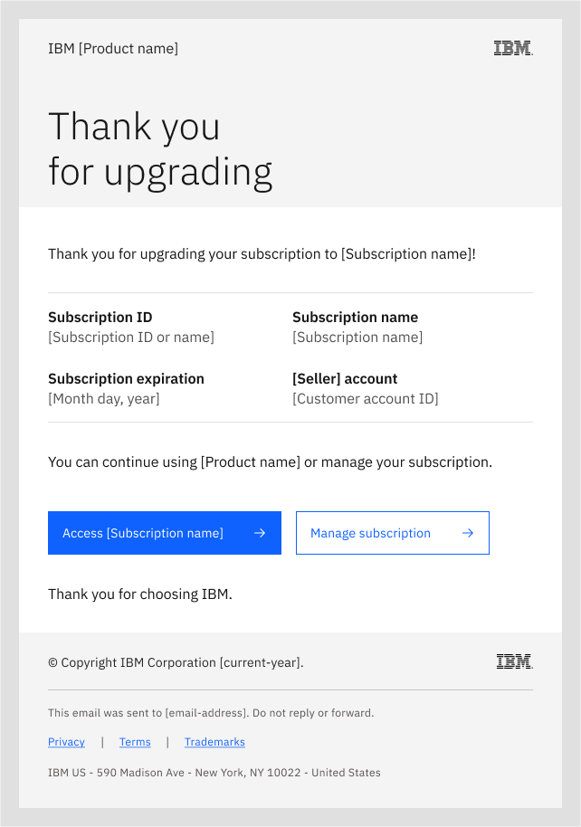
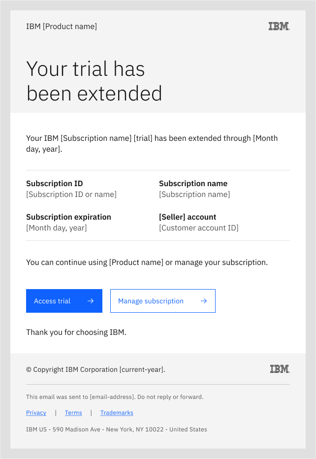

---

title: SSM Try emails

---

import { Tabs as CTabs, Tab as CTab } from "carbon-components-react";

← [Back to Email patterns overview](/patterns/emails/overview)

<PageDescription>

The IBM SSM email service sends transactional emails to subscribers of IBM Try offers.

</PageDescription>

<AnchorLinks>

<AnchorLink> Overview</AnchorLink>
  
<AnchorLink> Try email components</AnchorLink>
  
<AnchorLink> SSM trial emails</AnchorLink>
  
<AnchorLink> Thank you for subscribing</AnchorLink>

<AnchorLink> Welcome to your trial</AnchorLink>

<AnchorLink> Your trial is expiring</AnchorLink>

<AnchorLink> Your trial has expired</AnchorLink>

<AnchorLink> Your trial has been deleted</AnchorLink>

<AnchorLink> Thank you for upgrading</AnchorLink>

<AnchorLink> Your trial has been extended</AnchorLink>
  
<AnchorLink> Transactional email footer</AnchorLink>
  
<AnchorLink> Implementation notes</AnchorLink>

</AnchorLinks>

## Overview

The IBM [Subscription & Subscriber Management](https://w3.ibm.com/w3publisher/subscriber-subscription-management/ssm-emails) (SSM) email service sends the following automated emails to subscribers of IBM Try offers. These transactional emails enable your users to access and upgrade their limited-time Try experiences. Each transactional email provides a specific notice to subscribers, and are intended to complement, not replace, in-product UI messaging.  

### Try email components 

SSM transactional Try email components are shown in the following email example: 

<Row>

<Column colMd={8} colLg={8}>

Subject: Your IBM [product_name] trial subscription

 

SSM transactional Try email components

</Column>

</Row>

The following components are highlighted in the transactional Try email example (image above): 

1. **Subscription name**. This component contains the product offering name for the trial subscription, as distinct from the IBM product name only.
2. **30-day free trial**. This component contains the trial duration, and can be edited or omitted depending on the subscription name, trial period, or limitation other than time period.
3. **Subscription ID**. This component contains the Try user's subscription ID for the product trial. Multiple instances of a single product trial may exist under one subscription ID. One user may have multiple IBM Try subscriptions (IDs).
4. **Subscription name**. This component contains the product offering name for the trial subscription, and should match the subscription name used in the introductory sentence.
5. **Subscription expiration**. This component contains the product trial expiration date. The alphanumerical "Month day, year" format (September 28, 2024, for example) is recommended due to geographical variations in numerical-only (##/##/####) date formats.
6. **"Seller" account**. This component contains the customer's account identifier with the seller, such as their **"IBM" account** name or number. 
7. **Custom text**. This component contains optional custom text which a product team may choose to include in the email. For example, "Refer to the product documentation for usage details." - where "product documentation" is a clickable link. 
8. **Transactional email footer**. This component provides access to the required legal information and notice for the transactional class of business emails, including the IBM Privacy statement.

## SSM trial emails

The following emails are sent to subscribers as part of the SSM product trial flow. As described, some emails are conditional and may not be sent to every subscriber.

###  Thank you for subscribing

This first SSM email in the Try experience email flow is sent when the user subscribes to your Try offer. The email thanks them for subscribing and asks them to look for a Welcome email to use for accessing their provisioned trial (Trial, Sandbox Trial, or Freemium). No action is required by the user at this point, so there are no call-to-action (CTA) buttons. A text link to My IBM enables the user to check on the status of their trial provisioning.

<Row>

<Column colMd={8} colLg={8}>

Subject: Your [IBM Subscription_name] free trial 

 

Thank you for subscribing trial email

</Column>

</Row>

###  Welcome to your trial

The next SSM email in the Try experience email flow is sent when the user's trial is provisioned and ready to use. The email welcomes them to their trial (Trial, Sandbox Trial, or Freemium), and lists their subscription ID, subscription expiration date, and customer account ID. The call-to-action (CTA) buttons enable the user to start using their trial (primary action) or to manage their subscription or trial at My IBM (secondary action).

<Row>

<Column colMd={8} colLg={8}>

Subject: Start your IBM [product_name] free trial

 

Welcome to your trial email

</Column>

</Row>

### Your trial is expiring 

The next email in the SSM flow notifies the user that their trial will expire soon. If the user has already upgraded their Try offer (such as by purchasing a subscription), they do not receive this email. The email provides the expiration date and prompts the user to upgrade to continue using the product. The CTA button enables the user to upgrade (primary action) their Try subscription.

<Row>

<Column colMd={8} colLg={8}>

Subject: Your IBM [product_name] trial is expiring soon

 

Your trial is expiring email

</Column>

</Row>

### Your trial has expired

The next email in the SSM flow provides notice to the user that their trial has expired. If the user has already upgraded their Try subscription (such as by purchasing), they do not receive this email. The email informs them that continued use of their trial depends on upgrading their subscription. The CTA button enables the user to upgrade (primary action) by purchasing a subscription or contacting IBM sales (secondary action).

Note: The recommended target for the "IBM sales" CTA link is [https://www.ibm.com/products?contactmodule](https://www.ibm.com/products?contactmodule). 

<Row>

<Column colMd={8} colLg={8}>

Subject: Your [IBM Subscription_name] trial has expired

 

Your trial has expired email

</Column>

</Row>

### Your trial has been deleted

The next email in the SSM flow provides notice to the user that IBM has deleted their trial. If the user has already upgraded their subscription (by purchasing a subscription within the grace period), then this original trial may or may not be deleted (the user may have opted for a new environment after purchasing, for example). A common grace period following trial expiration is 30 days, enabling both your product team and the user to continue using the product with minimal intervention. The CTA buttons enable the user to purchase (primary action) a new subscription or to contact IBM sales (secondary action) for additional purchase options.

<Row>

<Column colMd={8} colLg={8}>

Subject: Your expired [IBM Subscription_name] trial has been deleted

 

Trial deleted email

</Column>

</Row>

### Thank you for upgrading

The next email in the SSM flow thanks the user who has upgraded their Try offer, typically by purchasing a subscription. The CTA buttons enable the user to get started (primary action) with the upgraded product or to manage their subscription at My IBM. 

<Row>

<Column colMd={8} colLg={8}>

Subject: Your [IBM Subscription_name] subscription upgrade

 

Upgrade thank you email

</Column>

</Row>

### Your trial has been extended

The final email in the SSM flow notifies the user when their request for a Try period extension has been granted. The email includes the subscription information and the updated expiration date. The CTA buttons enable the user to access their trial (primary action) or to manage their subscription at My IBM (secondary action).

<Row>

<Column colMd={8} colLg={8}>

Subject: Your IBM [product_name} trial extension

 

Trial extended email

</Column>

</Row>

### Transactional email footer

The required transactional email footer, included in all Try transactional emails, covers IBM legal requirements and provides links to related legal information:  

© Copyright IBM Corporation [current_year].

------------------------------------------

This email was sent to [email-address]. Do not reply or forward.

Privacy (links to https://www.ibm.com/privacy) |

Terms  (links to - for purchases - https://www.ibm.com/support/customer/csol/terms/  or for trials - https://www.ibm.com/support/customer/csol/terms/?id=Z126-6567) |

Trademarks  (links to - https://www.ibm.com/legal/copyright-trademark)

IBM US - 590 Madison Avenue - New York, NY 10022 - United States

## Implementation notes

Your product team should consider the following guidelines when implementing SSM trial transactional emails: 

1. The email "Subject:" line is important text which appears in the recipient's email in-box and should be implemented as described.
2. Once a trial user purchases your IBM product, the trial emails should be discontinued. In their place, transactional emails for their purchase should be started. If the user upgrades to another Try offer for your product, the SSM trial email flow should restart with updated subscription information.
3. Some IBM product trials may expire based on variables other than the number of days, such as limits on data size, number of API calls, and monetary credits. In these cases, product teams should adapt the time-limited Try design, and as needed, submit a design request to the PLG team.
4. If your IBM user cancels their Try offer (either before expiration or within the post-expiration grace period), only the "Your trial has been deleted" email should be sent. The product UI should provide messaging to confirm cancellation, collect information about the reason for cancellation, and present alternative Try offers or other options.
5. For transactional emails, and in accordance with the [US FTC CAN-SPAM Act](https://www.ftc.gov/business-guidance/resources/can-spam-act-compliance-guide-business), IBM does not provide an Unsubscribe or Opt out method. IBM users have opted in to receiving transactional emails, through their voluntary relationship with IBM, and cannot opt out of receiving emails specific to a transaction. Marketing emails, by contrast, require an Unsubscribe or Opt out method, under US CAN-SPAM law, and are subject to significant penalties for violations.

<InfoCard
cardName="Pattern version history"
cardDescription='Versions, changelog and contributors'>

<CTabs>

<CTab label="Version">

1.1  

</CTab>

<CTab label="Changelog">

2024-02-19: Version 1.1 release

</CTab>

<CTab label="Contributors">

PLG Design - <a href="https://w3.ibm.com/#/people/1J7360897">Kiran Ravindra</a>  

PLG Content - <a href="https://w3.ibm.com/#/people/929078897">Josh Horton</a>  

</CTab>

</CTabs>

</InfoCard>
