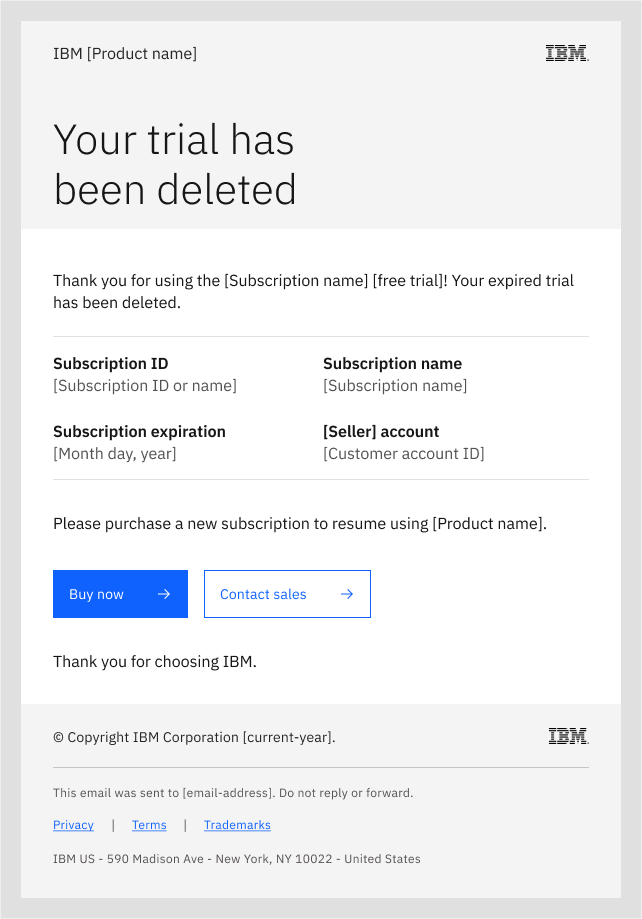

---

title: SSM Try emails

---

import { Tabs as CTabs, Tab as CTab } from "carbon-components-react";

← [Back to Email patterns overview](/patterns/emails/overview)

<PageDescription>

The IBM SSM email service sends transactional emails to subscribers of IBM Try offers.

</PageDescription>

<AnchorLinks>

<AnchorLink>Overview</AnchorLink>

<AnchorLink> Welcome to your Try experience</AnchorLink>

<AnchorLink> Your Try experience is expiring</AnchorLink>

<AnchorLink> Your Try experience has expired</AnchorLink>

<AnchorLink> Your Try environment has been deleted</AnchorLink>

<AnchorLink> Thank you for upgrading</AnchorLink>

<AnchorLink> Your Try offer has been extended</AnchorLink>

<AnchorLink> Implementation notes</AnchorLink>

</AnchorLinks>

## Overview

The IBM [SSM](https://w3.ibm.com/w3publisher/subscriber-subscription-management/ssm-emails) email service sends the following automated emails to subscribers of IBM Try offers. These transactional emails enable your users to access and upgrade their limited-time Try experiences. Each transactional email provides a specific notice to subscribers, and are not intended to replace in-product UI messaging.  

###  Welcome to your Try experience

This first SSM email in the Try experience email flow is sent when the user subscribes to your Try offer. The email welcomes them to their trial (Trial, Sandbox Trial, or Freemium), and lists their subscription ID, subscription name, customer account, and expiration date. The call-to-action (CTA) buttons enable the user to access their Try experience (primary action) or manage their subscription (secondary action), including checking on provisioning status.

<Row>

<Column colMd={8} colLg={8}>

Subject: Welcome to your IBM [product_name] free trial! 

 

Welcome to your trial email

</Column>

</Row>

### Your Try experience is expiring 

The next email in the SSM flow notifies the user that their Try experience will expire soon. If the user has already upgraded their Try offer (such as by purchasing a subscription), they do not receive this email. The email provides the expiration date and prompts the user to upgrade to continue using their Try environment. The CTA buttons enable the user to upgrade (primary action) their Try offer subscription or to access their Try experience (secondary action). 

<Row>

<Column colMd={8} colLg={8}>

Subject: Your IBM [product_name} trial is expiring!

 

Your trial is expiring email

</Column>

</Row>

### Your Try experience has expired

The next email in the SSM flow provides notice to the user that their Try experience has expired. If the user has already upgraded their Try subscription (such as by purchasing), they do not receive this email. The email informs them that continued use of their Try environment depends on upgrading their subscription. The CTA button enables the user to upgrade (primary action) by purchasing a subscription. 

<Row>

<Column colMd={8} colLg={8}>

Subject: Your IBM [product_name] trial has expired

 

Your trial has expired email

</Column>

</Row>

### Your Try environment has been deleted

The next email in the SSM flow provides notice to the user that IBM has deleted their expired Try environment. If the user has already upgraded their Try experience (such as by purchasing a subscription within the grace period), then their Try environment has not been deleted and they do not receive this email. The CTA buttons enable the user to purchase (primary action) a new subscription or to contact IBM sales (secondary action) for additional purchase options. 

<Row>

<Column colMd={8} colLg={8}>

Subject: Your IBM [product_name] trial has been deleted

 

Trial deleted email

</Column>

</Row>

### Thank you for upgrading

The next email in the SSM flow thanks the user who has upgraded their Try offer (such as by purchasing a subscription). The CTA buttons enable the user to get started (primary action) with the upgraded product, which may contain features not included in the previous Try offer, or to manage their subscription (secondary action). Because a purchase has occurred, the upgrade email includes a link to support.

<Row>

<Column colMd={8} colLg={8}>

Subject: Your IBM [product_name] subscription upgrade! 

 

Trial upgraded email

</Column>

</Row>

Attention: Include the Get support target URL: https://www.ibm.com/mysupport/ when the upgraded customer has paid for your IBM product (as opposed to upgrading to another type of free trial).

### Your Try offer has been extended

The final email in the SSM flow notifies the user if their request for an extension has been granted. The email includes the subscription information and the updated expiration date. The CTA buttons enable the user to access their Try experience (primary action) or to manage their subscription (secondary action). 

<Row>

<Column colMd={8} colLg={8}>

Subject: Your IBM [product_name} trial extension! 

 

Trial extended email

</Column>

</Row>

### Transactional email footer

The required transactional email footer, included in all Try transactional emails, covers IBM legal requirements and provides links to related legal information:   

© Copyright IBM Corporation [current_year].

---------------------------

This email was sent to [email-address]. Do not reply or forward.

Privacy (links to https://www.ibm.com/privacy) |

Terms  (links to - for purchases - https://www.ibm.com/support/customer/csol/terms/  or for trials - https://www.ibm.com/support/customer/csol/terms/?id=Z126-6567) |

Trademarks  (links to - https://www.ibm.com/legal/copyright-trademark)

IBM US - 590 Madison Avenue - New York, NY 10022 - United States

### Implementation notes

Your product team should consider the following additional guidelines when implementing the SSM transactional email flow: 

For transactional emails, IBM does not provide an Unsubscribe or Opt out action, which are required for marketing emails only under US “Can Spam” law. IBM users cannot opt out of transactional emails.

If the IBM user cancels their Try offer (either before expiration or within the post-expiration grace period), SSM Try emails should no longer be sent. Instead, the product UI should provide messaging to confirm cancellation, collect information about the reason for cancellation, and present alternative Try offers or other options. 

If the IBM user purchases the product, SSM Try emails should no longer be sent. Transactional emails for their purchase should then be sent in place of Try emails. If the user upgrades to another Try offer for the product, the SSM Try offer email flow should restart with the new subscription ID.

Some IBM product Try experiences may expire based on variables other than the number of days, such as a limit on data size, number of API calls, or monetary credits. In these cases, product teams should adapt the time-limited Try design, and as needed submit a design request to the PLG team. 

<InfoCard
cardName="Pattern version history"
cardDescription='Versions, changelog and contributors'>

<CTabs>

<CTab label="Version">

1.0  

</CTab>

<CTab label="Changelog">

2023-11-03: Version 1.0 release

</CTab>

<CTab label="Contributors">

PLG Design - <a href="https://w3.ibm.com/#/people/1J7360897">Kiran Ravindra</a>  

PLG Content - <a href="https://w3.ibm.com/#/people/929078897">Josh Horton</a>  

</CTab>

</CTabs>

</InfoCard>
