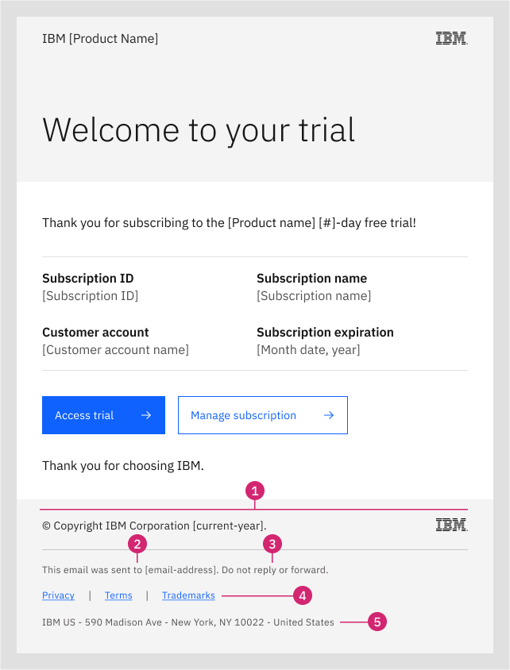

---

title: Transactional email footer

---

import { Breadcrumb, BreadcrumbItem, Tabs as CTabs, Tab as CTab } from "carbon-components-react";

import { Link } from "gatsby";

<PageDescription>

IBM email services can align with this PLG standard by implementing the transactional email footer. This page provides details on this email footer and the HTML code snippet to use for implementation in your transactional emails.

</PageDescription>

<AnchorLinks>

<AnchorLink>Overview</AnchorLink>
<AnchorLink>Transactional email footer</AnchorLink>
<AnchorLink>Footer elements</AnchorLink>
<AnchorLink>Code snippet</AnchorLink>
<AnchorLink>Implementation notes</AnchorLink>

</AnchorLinks>


## Overview

The PLG transactional email footer is a research-based UX design which meets legal requirements and provides an optimal user 
experience for transactional email recipients. IBM transactional emails are emails sent to customers with their implied consent through 
purchasing an IBM product or service, registering for an IBM Try offer, or creating an IBMid account or IBM Cloud account.

##  Transactional email footer

The PLG transactional email footer, designed for any IBM Try offer transactional email, covers IBM legal requirements and provides links 
to recommended legal information. The text an links used in the footer are as follows: 

-------

© Copyright IBM Corporation [current_year]. [IBM logo image file right-aligned]

-------

This email was sent to [to:email-address]. Do not reply or forward.

[Privacy](https://www.ibm.com/privacy) - https://www.ibm.com/privacy | 

[Terms](https://www.ibm.com/support/customer/csol/terms/) - https://www.ibm.com/support/customer/csol/terms/ (for purchases) or [Terms](https://www.ibm.com/support/customer/csol/terms/?id=Z126-6567) - https://www.ibm.com/support/customer/csol/terms/?id=Z126-6567 (for Try offers) 

[Trademarks](https://www.ibm.com/legal/copyright-trademark) - https://www.ibm.com/legal/copyright-trademark 


IBM US - 590 Madison Avenue - New York, NY 10022 - United States

-------

An implemented version of the footer is shown in the following Try offer Welcome email:

<Row>

<Column colMd={8} colLg={8}>

Subject: Welcome to your IBM [product_name] free trial! 

 

Welcome to your trial email with transactional email footer

</Column>

</Row>

## Footer elements

Content details for the five elements in the transactional email footer (previous image) are as follows: 

1. **Copyright** statement. This element contains the standard IBM copyright statement, including the (c) Copyright symbol and the year 
the email was sent. The copyright line also includes the IBM logo image, aligned to the right.

2. **Email sent to [email-address]**. This element provides the original email address that first received the email, which may differ from the email account used to view the email. It provides original source information if the original email has been forwarded by the recipient to an email alias or alternate email acccount, forwarded by another user, or sent to a group email list. For example, a user who auto-forwards email from multiple email addresses to a single email account can match the sender to the original email address. 

3. **Do not reply or forward.** This element notifies they user that they will not get a response if they reply to this automated sender. It also notifies the user to not forward this email, as transactional emails can contain account and personal information intended for the original recipient only. 

4. Links to **IBM Privacy Statement**, **IBM Cloud Terms and conditions**, and **IBM Trademarks (and copyright)** are included as follows: 

    **Privacy** - This element links to the IBM Privacy Statement, at https://www.ibm.com/privacy. The IBM Privacy Statement provides notice to users of their rights with respect to information they share with IBM. Note that for transactional emails there is no Unsubscribe or Opt-out choice, as users have implicitly consented to receive transactional emails about their specific product engagement only.

    **Terms** - This element provides two options for your product team to implement in transactional email footers. For transactional emails about product purchases, link to IBM Terms and conditions at https://www.ibm.com/support/customer/csol/terms/. For transactional emails about free Try offers, link to the IBM Cloud Trial agreement, at https://www.ibm.com/support/customer/csol/terms/?id=Z126-6567). In either case, the user has been notified of their implicit usage agreement for your IBM product.

    **Trademarks** - This element links to https://www.ibm.com/legal/copyright-trademark for IBM copyright and trademark information. It provides notice to the user of trademarks and copyrighted material owned by IBM or by IBM business partners.
    
5. **Physical mail address**. This element is required in marketing emails as part of the U.S CAN-SPAM law and is also recommended for transactional emails for consistency and UX. The user is notified of a physical mail address to use for written inquiries relating to their privacy. 


## Code snippet

Copy the following HTML snippet to add the PLG transactional email footer to your transactional emails: 

Note: To customize your Terms target URL for an IBM Cloud Trial, replace the general IBM Terms link with https://www.ibm.com/support/customer/csol/terms/internal/?id=Z126-6567.


```markdown 
<div style="background-color: #f4f4f4; padding-left: 32px; padding-right:32px; padding-bottom: 32px; padding-top:24px;">
<table style="width=100%; border-collapse: collapse;" width="100%" alt="" valign="top" align="center" data-proportionally-constrained="true" data-responsive="true">
<tr>
    <td>
        <p style="color: #262626; font-size: 14px; margin-bottom: 42px; ">© Copyright IBM Corporation 2023.</p>
    </td>
    <td style="text-align:right;">
        
    </td>
</tr>
<tr> 
    <td style="border-bottom: 1px solid black; padding:0px; border-color:#c6c6c6"></td>
    <td style="border-bottom: 1px solid black; padding:0px; border-color:#c6c6c6"></td>
</tr>

<tr>
    <td>
    
        <p style="color: #565151; font-size: 14px;  margin-top: 24px; font-weight:400;">This email was sent to {{to.email}}. Do not reply or forward.</p>
        <p style="color: #565151; font-size: 14px; margin-top: 24px; word-spacing: 16px;"> <a style="color:#0f62fe; text-decoration: underline;" href="https://www.ibm.com/privacy">Privacy</a>      |      <a style="color:#0f62fe; text-decoration: underline;" href="https://www.ibm.com/support/customer/csol/terms/">Terms</a>      |      <a style="color:#0f62fe; text-decoration: underline;" href="https://www.ibm.com/legal/copyright-trademark">Trademarks</a> </p>
        <p style="color: #565151; font-size: 14px;  margin-top: 24px; font-weight:400;">IBM US - 590 Madison Ave - New York, NY 10022 - United States</p>
    </td>
</tr>
</table>
</div>
```


## Implementation notes

Your product team should consider the following additional guidelines when implementing the transactional email footer:

1. As noted previously, you can customize the Terms link target URL as applicable for purchase transactional emails (IBM Terms) or Try offer transactional emails (IBM Cloud Trial Terms). 
2. For transactional emails, IBM does NOT provide an Unsubscribe or Opt-out option, which is required for marketing emails only, including "nurture" emails, under US “CAN-SPAM” law. IBM users cannot unsubscribe or opt out from transactional emails, which they have implicitly agreed to receive through their voluntary engagement with an IBM product or service.

<InfoCard
cardName="Pattern version history"
cardDescription='Versions, changelog and contributors'>

<CTabs>

<CTab label="Version">

<Details>
1.0  
</Details>

</CTab>

<CTab label="Changelog">

<Details>

2023-12-07: Version 1.0 release

</Details>

</CTab>

<CTab label="Contributors">

<a href="https://w3.ibm.com/#/people/1J7360897">Kiran Ravindra</a> <br/>

<a href="https://w3.ibm.com/#/people/2J8178897">Rachel Jacobs</a> <br/>

<a href="https://w3.ibm.com/#/people/929078897">Josh Horton</a> <br/>

</CTab>

</CTabs>

</InfoCard>
