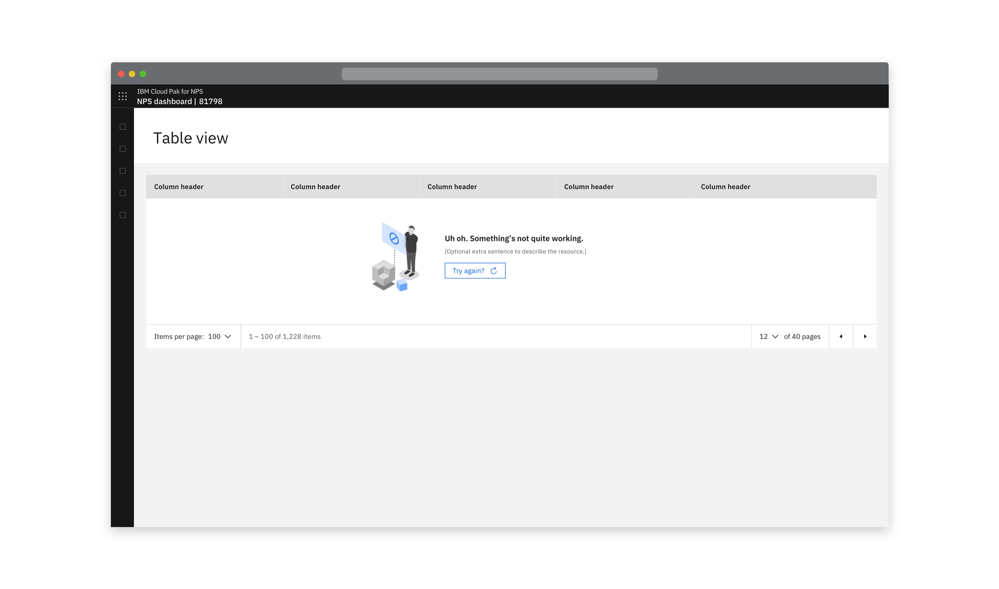
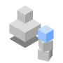
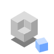
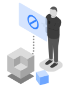
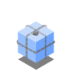
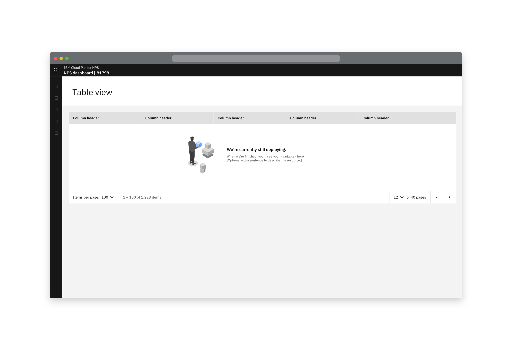
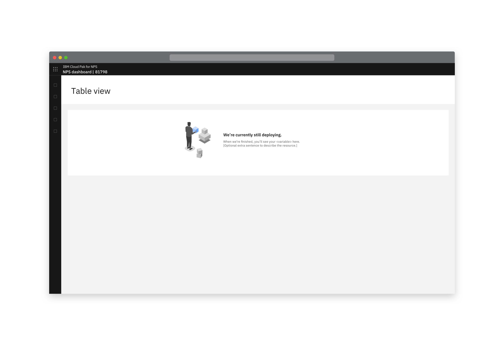
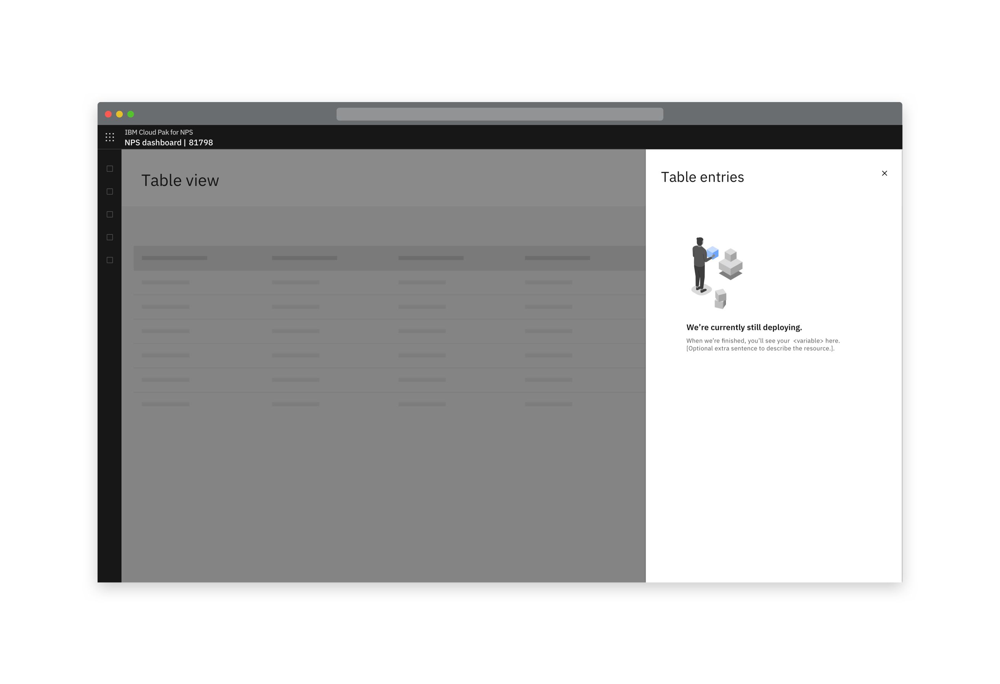
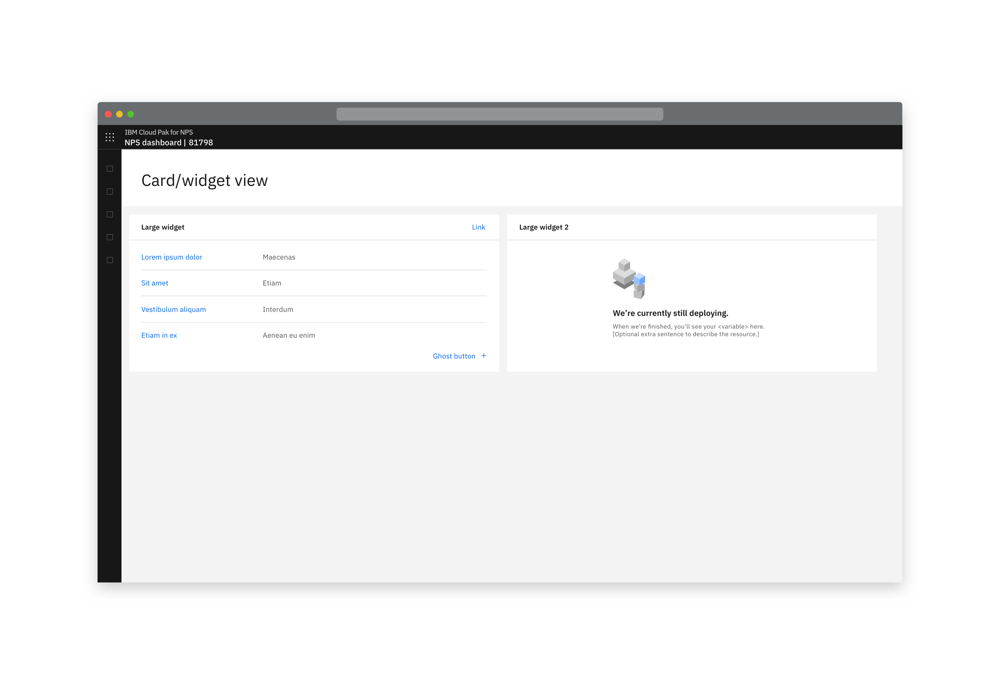
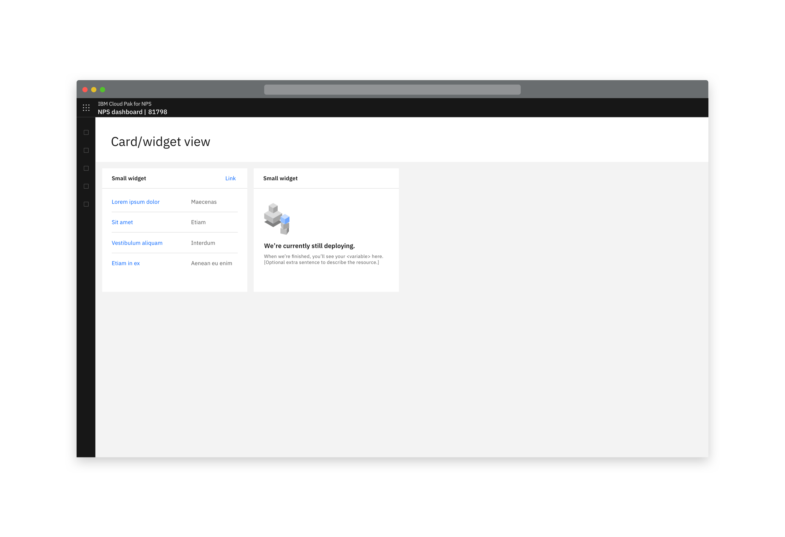

<SubmittedToCarbon to="https://www.carbondesignsystem.com/experimental/empty-state-pattern">

  This pattern has been submitted to Carbon.

</SubmittedToCarbon>

## Guidelines for CD&AI Designers

Additional guidelines here provide default header text and images for 4 key empty state scenarios. 
Images are provided in the reusable components, but can be found along with the default text in the table. 

For errors that require a full screen takeover, or where none of the page content can be shown, please refer to the HTTP errors pattern. 

<AnchorLinks>
  <AnchorLink>The different empty state scenarios</AnchorLink>
  <AnchorLink>Variants</AnchorLink>
  <AnchorLink>Further guidelines</AnchorLink>
</AnchorLinks>

## Approach
Empty states can occur for a number of reasons (see next section).
While each of the scenarios is different, for each one the written content should follow this basic structure:

**A mandatory heading.**

**Sub-text** that is mandatory in some cases, optional in others, not needed in others.

**A call-to-action button** in some cases.

<Row>
 <Column colLg={8}>

 

 </Column>
</Row>

## Different empty state scenarios

### Deploying

_(Note: the generic loading state covers most situations. We've just included this particular scenario to cover the initial deployment of a new service.)_

**Heading:** We’re currently still deploying.

**Sub-text:** When we’re finished, you’ll see your _[variable]_ here. _(Plus optional extra sentence to describe the resource here, if required.)_

**CTA button:** _(No CTA button required)_

<Row>
 <Column colLg={2}>

 <Caption> <a href="resources/EmptyState-Deploysmall90px.svg" download>Download small</a> </Caption>

 </Column>

 <Column colLg={2}>
 <Caption> <a href="resources/EmptyState-Deploylarge.svg" download>Download large</a> </Caption>

 

 </Column>
</Row>

### API error

**Heading:** Uh oh. Something’s not quite working.

**Sub-text:** _(Optional - for example an error code, what the problem is, and how to fix it)_

**CTA button:** Try again? _(Clicking this button would resend the request / refresh the view)_

<Row>
 <Column colLg={2}>

 <Caption> <a href="resources/EmptyState-APIErrorsmall90px.svg" download>Download small</a> </Caption>

 </Column>

 <Column colLg={2}>
 <Caption> <a href="resources/EmptyState-APIErrorlarge.svg" download>Download large</a> </Caption>

 

 </Column>
</Row>

### No search results

**Heading:** Hmm, your search didn’t return any results.

_No need for any further text as this is a common user experience. Users know to return to the search box, etc._

<Row>
 <Column colLg={2}>

 <Caption> <a href="resources/EmptyState-Nosearchresultssmall90px.svg" download>Download small</a> </Caption>

 </Column>

 <Column colLg={2}>
 <Caption> <a href="resources/EmptyState-Nosearchresultslarge.svg" download>Download large</a> </Caption>

 

 </Column>
</Row>

### There aren’t any objects yet

**Heading:** You don’t currently have any _[variable]_.

**Sub-text:** _(Optional extra sentence to describe the resource.)_

**CTA button:** _(No CTA button required)_

<Row>
 <Column colLg={2}>

 <Caption> <a href="resources/EmptyState-Nothingsmall90px.svg" download>Download small</a> </Caption>

 </Column>

 <Column colLg={2}>
 <Caption> <a href="resources/EmptyState-Nothinglarge.svg" download>Download large</a> </Caption>

 

 </Column>
</Row>

### Not authorised

**Heading:** _TBC_

**Sub-text:** _TBC_

**CTA button:** _TBC_

<Row>
 <Column colLg={2}>

 <Caption> <a href="resources/EmptyState-Notauthorisedsmall90px.svg" download>Download small</a> </Caption>

 </Column>

 <Column colLg={2}>
 <Caption> <a href="resources/EmptyState-Notauthorisedlarge.svg" download>Download large</a> </Caption>

 

 </Column>
</Row>

## Variants

### Large variant
The large variant of empty state includes a more detailed version of the supporting image. This layout is intended to be used in large spaces of the UI, such as empty tables and side-panels. In this variant, the image is placed to the left of the text, with the text being vertically centred.

#### Tables
When possible, it is important to show the column headers alongside the empty state component, to provide further context into what would appear once the table was filled. However, if this is not possible, the component can be used without. 

<Row>
 <Column colLg={6}>

 

 </Column>
</Row>
<Row>
 <Column colLg={6}>

 

 </Column>
</Row>

#### Side panels
Side panels also use the large variant, but depending on the width of the panel, the content may need to stack. Side panels are deemed appropriate for the larger variant due to the large amount of vertical space that they provide. 

<Row>
 <Column colLg={6}>

 

 </Column>
</Row>

#### Full page layout

TBC.

### Small variant
For tiles and widgets, a small variant should be used. In this case, the image is positioned top left of the supporting text. If the tile is so small that the component doesn’t fit, then the image can be removed to allow for this. 

<Row>
 <Column colLg={6}>

 

 </Column>
</Row>

<Row>
 <Column colLg={6}>

 

 </Column>
</Row>

## Further guidelines
What to do when more than one empty state appears on the page? TBC
