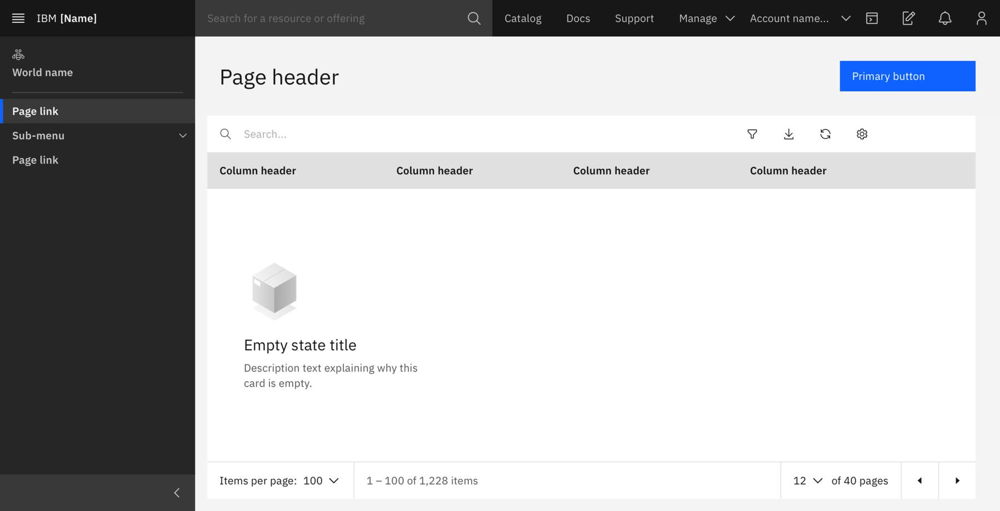
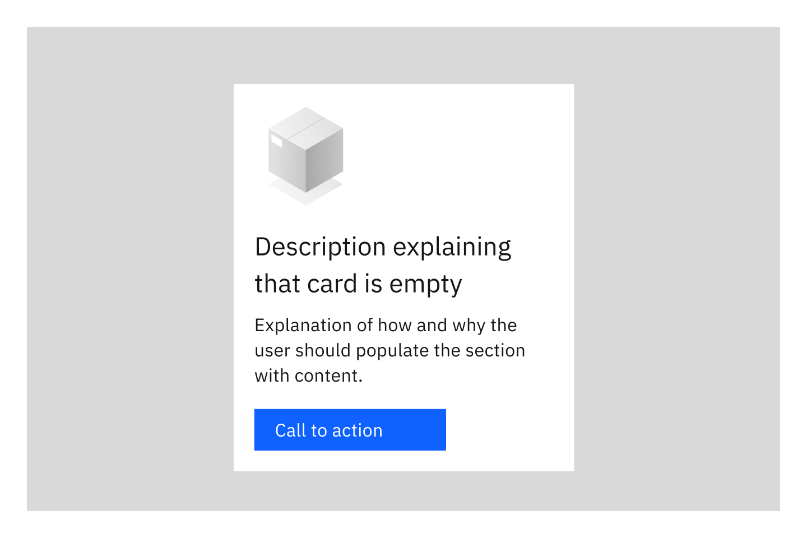
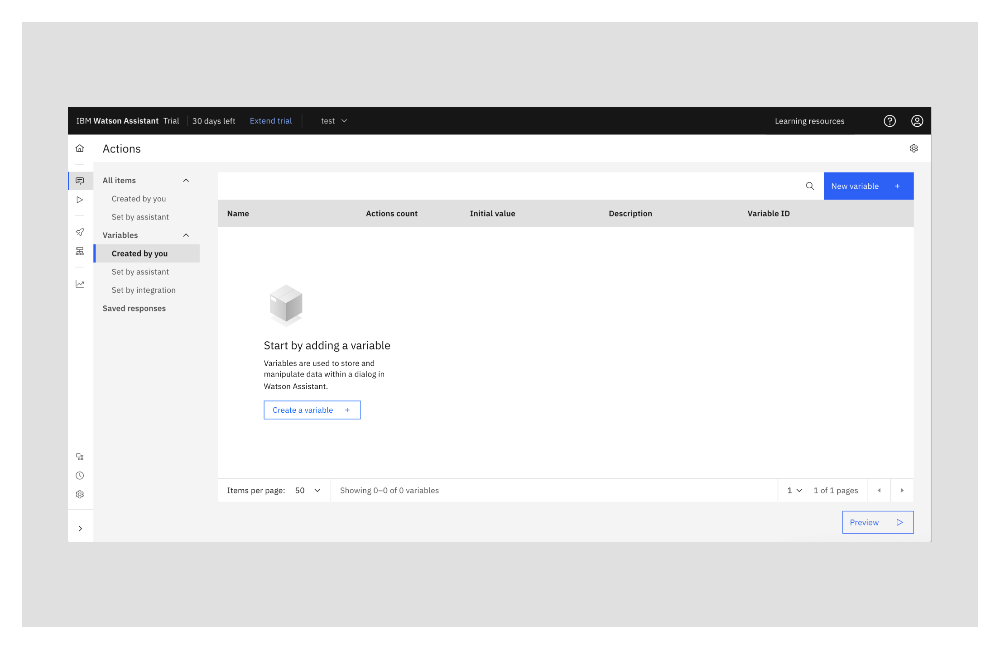
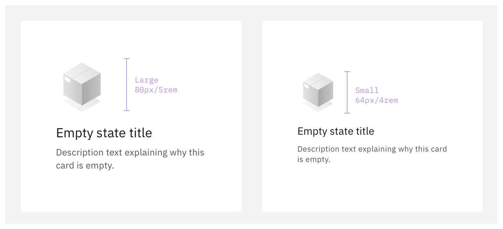
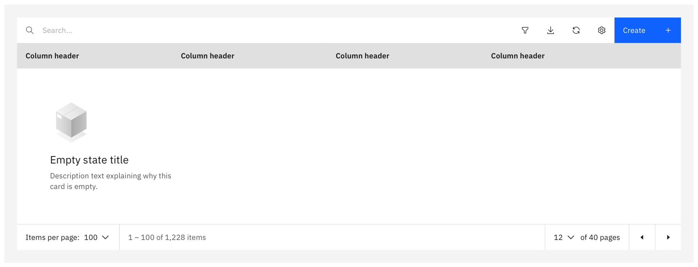
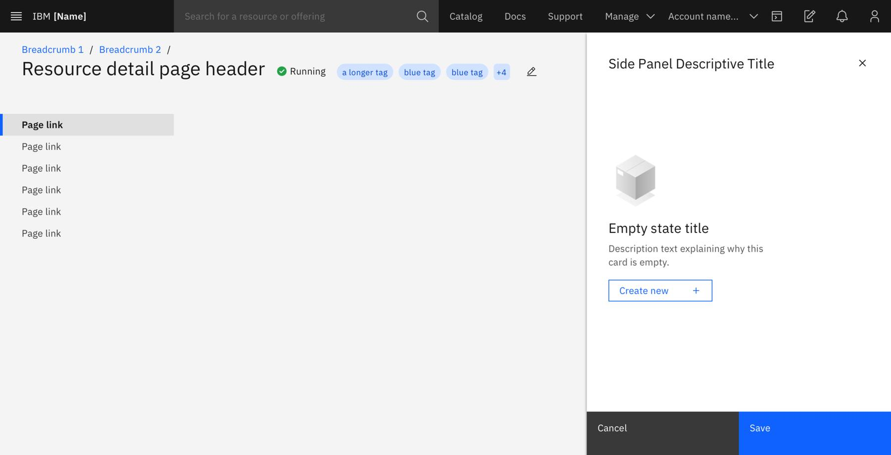
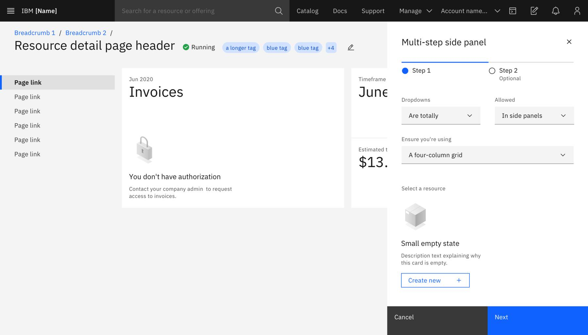

import { Tabs as CTabs, Tab as CTab } from "carbon-components-react";

<PageDescription>

This pattern extension of the Empty State pattern on the [Carbon website](https://www.carbondesignsystem.com/patterns/empty-states-pattern/) and is focused on content and illustration guidance.

</PageDescription>

<AnchorLinks>
  <AnchorLink>Overview</AnchorLink>
  <AnchorLink>Content</AnchorLink>
  <AnchorLink>Sizes</AnchorLink>
  <AnchorLink>Illustrations</AnchorLink>
  <AnchorLink>Variations</AnchorLink>
  <AnchorLink>Additional Guidelines</AnchorLink>
  <AnchorLink> Self-report pattern adoption </AnchorLink>
</AnchorLinks>

<Row>
 <Column colLg={12}>

 </Column>
</Row>

## Overview

Carbon for Cloud &amp; Cognitive follows the Carbon [empty state](https://www.carbondesignsystem.com/patterns/empty-states-pattern/) pattern and adds few more specific guidelines.  
These additional guidelines provide default header text and images for six common empty state scenarios. The images are part of the empty state coded component and can be viewed live in our Storybook, along with the default text in the table. For errors that require a full screen takeover, or where none of the page content can be shown, please refer to the [HTTP errors](https://pages.github.ibm.com/cdai-design/pal/patterns/http-errors/usage/) pattern.

## Content

<Row>
<Column colLg={8}>

 </Column>
</Row>

According to [Carbon](https://carbondesignsystem.com/patterns/empty-states-pattern/), "empty states are moments in an product or service where there is no data to display to the user". Although they are most commonly found when a user first interacts with a product or page, they also can be shown when data is deleted or otherwise unavailable. 

In the event an empty state is shown, it is recommended that product teams provide actionable next steps to help the user populate the section. Empty states should also give reasons for why user’s would want to populate the section. 

Empty states and their descriptions should be written in the passive voice to avoid blaming the user. 

<Row>
<Column colLg={8}>

 </Column>
</Row>

## Sizes

<Row>
 <Column colLg={8}>

 </Column>
</Row>

Empty states come in two sizes:

- Large: 80px/5rem
- Small: 64px/4rem

Below, you can find examples on when to use each size:

### Large

Use-cases:

- Main content area
- Empty side panel
- Tables

Examples:

<Row>
 <Column colLg={12}>

 </Column>
</Row>
<Row>
 <Column colLg={12}>

 </Column>
</Row>

### Small

Use-cases:

- Cards
- Widgets
- Sections on a side panel

<Row>
 <Column colLg={12}>

 </Column>
</Row>

## Illustrations

### Basic empty states

A subset of illustrations from the [Carbon for Cloud &amp; Cognitive Illustration Library](https://pages.github.ibm.com/cdai-design/pal/illustrations/library/) has been used to provide consistency across six common empty state scenarios. If you have a specific empty state which you feel is not covered by one of these illustrations, you may choose to create a new object which more accurately represents your empty state scenario.

Characteristics of empty state illustrations:

- isometric
- monochromatic
- depicts an objects' relevance to the specific scenario

### Creating new empty state illustrations

When it comes to creating custom empty state illustrations, you have two options:

- Follow the guidelines to create new a empty state illustration in the illustration guideline.
- Reach out to the illustration team via the [#cdai-pal](https://ibm.enterprise.slack.com/?redir=%2Fr-t29805298899%3Fredir%3D%252Farchives%252FCQGR0HC05) Slack channel.

## Empty state types

<Row>
  <Column colLg={8}>
    <EmptyStateType />
  </Column>
</Row>

## Variations

### Expressive empty states

#### Full pages

Empty states that take over a full page, like in the case of 404 No page found, should use colorful and more sophisticated illustrations and follow the [HTTP error](https://pages.github.ibm.com/cdai-design/pal/patterns/http-errors/usage/) pattern.

#### Teaching moments

When seeking to teach the user about some more complex actions (such as in a wizard or in an action such as upload) you can use illustrations that contain color. See the [Carbon for Cloud &amp; Cognitive Illustration Library](https://pages.github.ibm.com/cdai-design/pal/illustrations/library/) for guidance and assets to help you create your own expressive illustrations.

<Row>
 <Column colLg={4} colMd={4} colSm={4}>

<EmptyStateAllAssetsCard
  title="Empty State SVGs"
  image="/static/81acbae3f289f8a00761848d6244b405/zip.svg"
  alt="Zip Icon"
  source="/static/1b310444078f057e4a8fb948ec2e5a22/EmptyStateSVGs.zip"
  name="Empty State SVGs"
/>

 </Column>
</Row>

## Additional Guidelines

The large variant of an empty state includes a more detailed version of the supporting image. This layout is intended to be used in large spaces of the UI, such as empty tables and side-panels. In this variant, the image is placed to the left of the text, with the text being vertically centered.

### Tables

When possible, it is important to show the column headers alongside the empty state component, to provide further context into what would appear once the table was filled. However, if this is not possible, the component can be used without.

  
<InfoCard
  cardName="Pattern version history"
  cardDescription='Versions, changelog and contributors'> 
<CTabs>
<CTab label="Version">

  1.0

</CTab>
<CTab label="Changelog">

  2023-08-11: Version 1.0 release

</CTab>
<CTab label="Contributors">
  <a href="https://w3.ibm.com/#/people/2J8178897">Rachel Jacobs</a>  
  <a href="https://w3.ibm.com/#/people/0D9543649">Judith Benjamin</a>  
</CTab>
</CTabs>
</InfoCard>

## Self-report pattern adoption
<iframe class="airtable-embed" src="https://airtable.com/embed/appvxykrpLizynCkz/pag6vMUcv2eCAUp5A/form" frameborder="0" onmousewheel="" width="100%" height="600" style="background: transparent; border: 1px solid #ccc;"></iframe>
