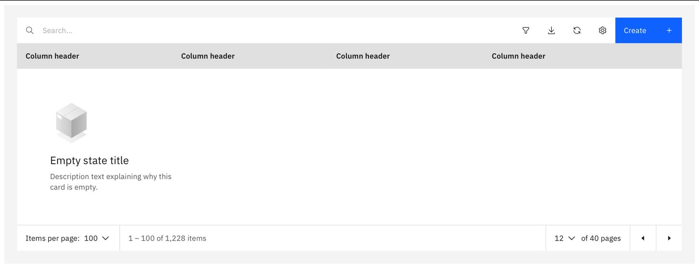
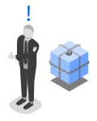

<SubmittedToCarbon to="https://www.carbondesignsystem.com/patterns/empty-states-pattern/">

This pattern has been submitted to Carbon.

</SubmittedToCarbon>

## This is a pattern extension mainly focused on illustration consistency.

Click here to view the Empty State pattern on the Carbon website.

<AnchorLinks>
  <AnchorLink>Overview</AnchorLink>
  <AnchorLink>Sizes</AnchorLink>
  <AnchorLink>Illustrations</AnchorLink>
  <AnchorLink>Variations</AnchorLink>
  <AnchorLink>Additional Guidelines</AnchorLink>
</AnchorLinks>

## Overview

CD&AI follows the Carbon empty state pattern and adds few more specific guidelines.
These additional guidelines provide default header text and images for six common empty state scenarios. The images are part of the empty state coded component and can be viewed live in our Storybook, along with the default text in the table. For errors that require a full screen takeover, or where none of the page content can be shown, please refer to the HTTP errors pattern.

## Sizes

Empty states come in two sizes:

- Large: 80px/5rem
- Small: 64px/4rem

Below, you can find examples on when to use each size:

### Large

Use-cases:

- Main content area
- Empty side panel
- Tables

Examples:

### Small

Use-cases:

- Cards
- Widgets
- Sections on a side panel

## Illustrations

### Basic empty states

A subset of illustrations from the CD&AI Illustration Library has been used to provide consistency across six common empty state scenarios. If you have a specific empty state which you feel is not covered by one of these illustrations, you may choose to create a new object which more accurately represents your empty state scenario.

Characteristics of empty state illustrations:

- isometric
- monochromatic
- depicts an objects' relevance to the specific scenario

## Empty state types

### No data

Common in first use experiences. Make sure to explain what will be in the empty space when it is populated and provide guidance for the user regarding next steps.

<EmptyStateTable
  headingText="You don’t currently have any variable."
  subText="Optional extra sentence to describe the resource and how to create one."
  buttonsText="If relevant, add a relevant CTA button"
/>

### No results found

Used when the user's search parameters return no results.

// table goes here

### System error (API error, generic error, etc)

Used when the system can't display the information due to an error. Explain steps the user can take to find out more detail and/or to resolve the problem. For example, view an activity log.

// table goes here

### Deploying

Note: Use the generic loading state whenever possible. We’ve included this particular scenario to cover first time usage when the deployment of a new service is happening in the background.

// table goes here

### Not authorized

For when the user does not have permission to view the data. Suggest steps or process to request access.

// table goes here

### No notifications

For when the user has no notifications.

// table goes here

### No label/tags

For when the user has not created tags yet and is managing them.

// table goes here

## Variations

### Expressive empty states

#### Full pages

Empty states that take over a full page, like in the case of 404 No page found, should use colorful and more sophisticated illustrations and follow the HTTP error pattern.

#### Teaching moments

When seeking to teach the user about some more complex actions (such as in a wizard or in an action such as upload) you can use illustrations that contain color. See the CD&AI Illustration Library for guidance and assets to help you create your own expressive illustrations.

### Creating new empty state illustrations

When it comes to creating custom empty state illustrations, you have two options:

- Follow the guidelines to create new a empty state illustration in the illustration guideline.
- Reach out to the illustration team via the #cdai-pal Slack channel.

## Guidelines for CD&AI Designers

Additional guidelines here provide default header text and images for 5 key empty state scenarios.
Images are provided in the reusable components, but can be found along with the default text in the table.

For errors that require a full screen takeover, or where none of the page content can be shown, please refer to the HTTP errors pattern.

<AnchorLinks>
  <AnchorLink>Different empty state scenarios</AnchorLink>
  <AnchorLink>Variants</AnchorLink>
  <AnchorLink>Further guidelines</AnchorLink>
</AnchorLinks>

## Approach

Empty states can occur for a number of reasons (see next section).
While each of the scenarios is different, for each one the written content should follow this basic structure:

**A mandatory heading.**

**Sub-text** that is mandatory in some cases, optional in others, not needed in others.

**A call-to-action button** in some cases.

<Row>
 <Column colLg={8}>

 </Column>
</Row>

## Different empty state scenarios

### No search results

**Heading:** Hmm, your search didn’t return any results.

_No need for any further text as this is a common user experience. Users know to return to the search box, etc._

<Row>
 <Column colLg={2}>

{" "}

<Caption>
  {" "}
  <a href="resources/EmptyState-Nosearchresultssmall90px.svg" download>
    Download small
  </a>{" "}
</Caption>

 </Column>

 <Column colLg={2}>
 <Caption> <a href="resources/EmptyState-Nosearchresultslarge.svg" download>Download large</a> </Caption>

 </Column>
</Row>

### There aren’t any objects yet

**Heading:** You don’t currently have any _[variable]_.

**Sub-text:** _(Optional extra sentence to describe the resource.)_

**CTA button:** _(No CTA button required)_

<Row>
 <Column colLg={2}>

{" "}

<Caption>
  {" "}
  <a href="resources/EmptyState-Nothingsmall90px.svg" download>
    Download small
  </a>{" "}
</Caption>

 </Column>

 <Column colLg={2}>
 <Caption> <a href="resources/EmptyState-Nothinglarge.svg" download>Download large</a> </Caption>

 </Column>
</Row>

### API error

**Heading:** Uh oh. Something’s not quite working.

**Sub-text:** _(Optional — for example an error code, what the problem is, and how to fix it)_

**CTA button:** Try again? _(Clicking this button would resend the request / refresh the view)_

<Row>
 <Column colLg={2}>

{" "}

<Caption>
  {" "}
  <a href="resources/EmptyState-APIErrorsmall90px.svg" download>
    Download small
  </a>{" "}
</Caption>

 </Column>

 <Column colLg={2}>
 <Caption> <a href="resources/EmptyState-APIErrorlarge.svg" download>Download large</a> </Caption>

 </Column>
</Row>

### Deploying

_(Note: the generic loading state covers most situations. We've just included this particular scenario to cover the initial deployment of a new service.)_

**Heading:** We’re currently still deploying.

**Sub-text:** When we’re finished, you’ll see your _[variable]_ here. _(Plus optional extra sentence to describe the resource here, if required.)_

**CTA button:** _(No CTA button required)_

<Row>
 <Column colLg={2}>

{" "}

<Caption>
  {" "}
  <a href="resources/EmptyState-Deploysmall90px.svg" download>
    Download small
  </a>{" "}
</Caption>

 </Column>

 <Column colLg={2}>
 <Caption> <a href="resources/EmptyState-Deploylarge.svg" download>Download large</a> </Caption>

 </Column>
</Row>

### Not authorised

**Heading:** _TBC_

**Sub-text:** _TBC_

**CTA button:** _TBC_

<Row>
 <Column colLg={2}>

{" "}

<Caption>
  {" "}
  <a href="resources/EmptyState-Notauthorisedsmall90px.svg" download>
    Download small
  </a>{" "}
</Caption>

 </Column>

 <Column colLg={2}>
 <Caption> <a href="resources/EmptyState-Notauthorisedlarge.svg" download>Download large</a> </Caption>

 </Column>
</Row>

## Variants

### Large variant

The large variant of empty state includes a more detailed version of the supporting image. This layout is intended to be used in large spaces of the UI, such as empty tables and side-panels. In this variant, the image is placed to the left of the text, with the text being vertically centred.

#### Tables

When possible, it is important to show the column headers alongside the empty state component, to provide further context into what would appear once the table was filled. However, if this is not possible, the component can be used without.

<Row>
 <Column colLg={6}>

 </Column>
</Row>
<Row>
 <Column colLg={6}>

 </Column>
</Row>

#### Side panels

Side panels also use the large variant, but depending on the width of the panel, the content may need to stack. Side panels are deemed appropriate for the larger variant due to the large amount of vertical space that they provide.

<Row>
 <Column colLg={6}>

 </Column>
</Row>

#### Full page layout

TBC.

### Small variant

For tiles and widgets, a small variant should be used. In this case, the image is positioned top left of the supporting text. If the tile is so small that the component doesn’t fit, then the image can be removed to allow for this.

<Row>
 <Column colLg={6}>

 </Column>
</Row>

<Row>
 <Column colLg={6}>

 </Column>
</Row>

## Further guidelines

What to do when more than one empty state appears on the page? TBC
