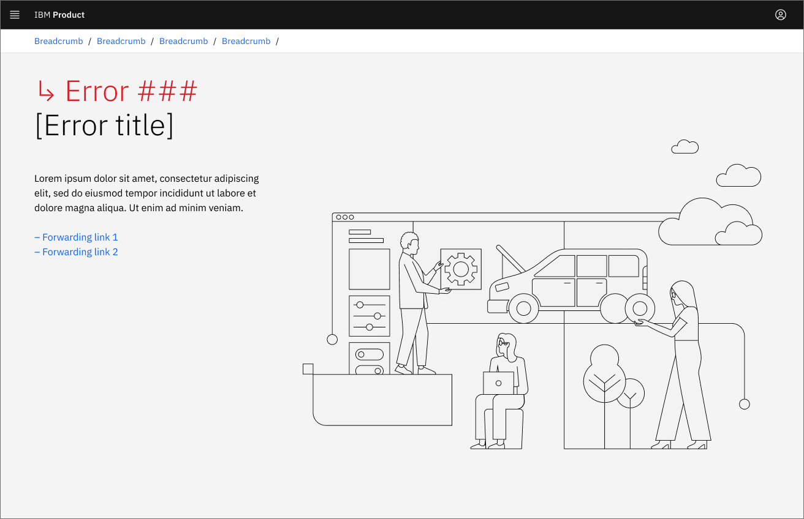

<PageDescription>

  Display a full-page error when the requested page is unavailable to the user. This is typically caused by issues with the requested URL or access permissions. Errors caused by server connectivity issues are not covered in this guideline.

</PageDescription>

<AnchorLinks>
  <AnchorLink>Overview</AnchorLink>
  <AnchorLink>Redirecting the user</AnchorLink>
  <AnchorLink>403 - Access denied</AnchorLink>
  <AnchorLink>404 - Page not found</AnchorLink>
  <AnchorLink>Other errors</AnchorLink>
  <AnchorLink>Server-side errors</AnchorLink>
</AnchorLinks>

## Overview  

A best practice is to use an error message as specific as possible to the user’s content request. Use the more general full-page error messages only when an error message specific to the user’s content and overall goal is not available. 

## Redirecting the user

Whenever possible, automatically redirect the user to their requested content instead of returning a full-page error. For example, redirect the user when:

1. The requested page has been moved, and you know the new URL.
2. The requested page has been merged with a closely-related page with similar or identical content.

However, if redirecting could lead to confusion or insufficient content for the user to achieve their goal, return a full-page error instead.

When redirecting users to a new page due to the unavailability of the requested page, it's essential to provide clear and informative messaging to guide them. Use the following options to inform users about the redirection:

- **Auto-redirect without a message:** Redirect users without interruption.
- **Auto-redirect with a message:** After redirecting to a new page, display a message in a modal or banner to inform users that they've been redirected.
- **User-confirmed redirect:** Instead of automatically redirecting users, present a modal with options for the user to confirm or cancel.

## 403 - Access denied

Return an **Access denied (403)** error message when the user isn't authorized to access the requested page. This error is typically caused by one of the following problems:

- The user doesn't have the access permissions to view the requested page.
- The user doesn't have the access permissions to use the data or application.
- The user isn't logged in to a page that requires login credentials.

Sample 403 error text: 
- Headline - "Access denied"
- Description - “You are not authorized to access the requested page. Please verify that you are logged in to the hosting environment and your access permissions are correct.”  
- Suggested links - Provide suggested links to help users navigate past the error.   

<Row>
 <Column colLg={8}>

 </Column>
</Row>
<Row>
 <Column colLg={8}>

 </Column>
</Row>

## 404 - Page not found

Return a **Page not found (404)** error message when the server can't find the page requested by the user, and redirection isn't possible. This error is typically caused by one of the following problems: 

- The user selects a bookmarked URL that no longer exists.
- The user mistypes the URL.
- The user clicks on a malformed link.
- The page has been moved, and redirection was not implemented.

Sample 404 error text: 
- Headline - "Page not found"
- Description - “The page you requested has moved or is unavailable, or the specified URL is not valid. Please check the URL or search the site for the requested content.”  
- Suggested links - Provide suggested links to help users navigate past the error.   

<Row>
 <Column colLg={8}>

 </Column>
</Row>
<Row>
 <Column colLg={8}>

 </Column>
</Row>

## Other errors

Use this design for full-page errors that are not 403 or 404 errors, and not caused by server connectivity issues.

<Row>
 <Column colLg={8}>

 </Column>
</Row>
<Row>
 <Column colLg={8}>

 </Column>
</Row>

## Server-side errors

HTTP errors caused by the server are called server-side errors. These errors occur when a web server is unable to fulfill a request made by a web browser. Users are unable to reach the server and therefore can’t access the error page.

Common HTTP server-side errors are handled by web browsers, including the following use cases:
- 408 Request time-out: The server fails to complete a request within the given time due to increased network activity causing delays.
- 500 Internal server error: A general error message for undefined server-side issues.
- 502 Bad gateway: A gateway or proxy server receives an invalid response from an upstream server.
- 503 Service unavailable: The server can't respond, often due to high requests or maintenance.
- 504 Gateway timeout: The server doesn't receive a response from another server within the specified time period.

While it’s possible to use a third-party application or JavaScript event listener to display a customized error page when the connection is lost, using web browsers to handle server-side errors and display their default error pages is recommended.
