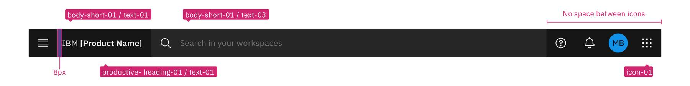

<PageDescription>

Users rely on the global header to navigate and orient themselves in the UI. This documentation outlines some of the qualities that make the global header consistent, familiar, and usable.

</PageDescription>

<AnchorLinks>
  <AnchorLink>Overview</AnchorLink>
  <AnchorLink>Anatomy</AnchorLink>
  <AnchorLink>Header patterns</AnchorLink>
  <AnchorLink>Use cases</AnchorLink>
  <AnchorLink>Behaviors</AnchorLink>
  <AnchorLink>Accessibility</AnchorLink>
</AnchorLinks>

## Overview

The global header is essential to the product's UI. It contains functionality for the current product as well as the entire system. The global header provides consistent locations to invoke the product's local navigation as well as pervasive access to system-wide functions and tools.

## Anatomy

### Header base with actions

1. **Hamburger menu (optional):** The primary navigation within the product. 
2. **Product name:** To ensure users quickly identify the product they are using.
3. **Search bar (optional):** Allows users to search for everything they have access to across the platform.
4. **Utilities:** System-wide functions and tools.
5. **User profile:** Quick access to the user's account.

### Order of items

The example below shows a header with a hamburger menu, search, trial countdown, typical platform utilities, and a switcher.

| Element             | Placement      | 
| --------------------| -------------- | 
| 1. Hamburger menu	  | The hamburger menu should always be positioned as the furthest left icon. |
| 2. Product name     | The product name is to the right of the hamburger menu. But if the product doesn't contain a hamburger menu, it will positioned as the furthest left item. | 
| 3. Search           | Search is positioned in the center of the header, except when the screen size becomes small that it can't contain the length of the header. In that case it will turn into a search icon and become the left most icon on the right side of the header. This is to allow for an expanding search field that does not disrupt other icon positions. Reference the [search bar guidelines](https://pages.github.ibm.com/cdai-design/pal/cloud-paks/global-search/search-bar). | 
| 4. Trial countdown  | The trial countdown positioned as the furthest left item of the icons on the right side of the header. | 
| 5. Other            | The number of header icons a product uses may vary. This placement will help avoid disrupting the position of the core icons and inconsistencies as your user navigates between other product shell headers. Note: a product may include up to 4 other items. | 
| 6. Assistance       | Assistance is positioned to the left of notifications. | 
| 7. Notifications    | Notifications is positioned to the right of assistance. | 
| 8. Sub-menu         | The sub-menu placement is up to what fits the product best. Some products place it between the utility icons and the user profile, while some have it placed to the left of the utilities. Reference the [sub-menu guidelines](link).| 
| 9. User profile     | The user profile should be the left of the switcher. When there is no switcher, the user profile will be the rightmost icon.         | 
| 10. Switcher        | The switcher should always be positioned as the furthest right icon. This ensures the icon does not shift when navigating across systems.         | 

## Header patterns
Click into a card to view its pattern and learn how to use.

<Row className="image-card-group">

<Column colMd={3} colLg={3} noGutterSm>

<ImageCard 
sub-title="Hamburger menu"
sub-titleColor="light"
hoverColor="light"
href="https://pages.github.ibm.com/cdai-design/pal/cloud-paks/navigation/usage">

</ImageCard>

<ImageCard 
sub-title="Assistance"
sub-titleColor="light"
hoverColor="light"
href="https://github.ibm.com/PrivateCloud-analytics/ibm-assist-me/wiki">

</ImageCard>

</Column>

<Column colMd={3} colLg={3} noGutterSm>

<ImageCard
sub-title="Search"
sub-titleColor="light"
hoverColor="light"
href="https://pages.github.ibm.com/cdai-design/pal/cloud-paks/global-search/search-bar">

</ImageCard>

<ImageCard
sub-title="Sub-menu"
sub-titleColor="light"
hoverColor="light"
disabled
href="https://www.carbondesignsystem.com/">

</ImageCard>

</Column>

<Column colMd={3} colLg={3} noGutterSm>

<ImageCard
sub-title="Trial countdown"
sub-titleColor="light"
hoverColor="light"
href="https://pages.github.ibm.com/cdai-design/pal/cloud-paks/trial-countdown/usage">

</ImageCard>

<ImageCard
sub-title="Profile menu"
sub-titleColor="light"
hoverColor="light"
href="https://pages.github.ibm.com/cdai-design/pal/cloud-paks/profile/usage">

</ImageCard>

</Column>

<Column colMd={3} colLg={3} noGutterSm>

<ImageCard
sub-title="Notifications"
sub-titleColor="light"
hoverColor="light"
href="https://pages.github.ibm.com/cdai-design/pal/patterns/notifications/usage">

</ImageCard>

<ImageCard
sub-title="Switcher"
sub-titleColor="light"
hoverColor="light"
href="https://pages.github.ibm.com/cdai-design/pal/cloud-paks/cross-pak-switcher/usage">

</ImageCard>

</Column>

</Row>

## Use cases

Below are variations of how the global header is configured based on the product and its needs.

#### Cloud Pak aaS

#### Cloud Pak on-prem 

#### Point product aaS

## Behaviors

### Responsiveness
The search bar renders differently in response to the browser screen size to maximize the space. 

### Styling

#### Gray 100 theme
As part of the UI shell, the global header and its corresponding panels will always be the dark theme, `gray-100`.

#### Spacing
There is an `8px` space between the hamburger menu and product name.  
Icons aligned to the right of the header have no space between.

#### Text styles
IBM: `body-short-01 / text-01`  
Product name: `productive- heading-01 / text-01`  
Default search bar: `body-short-01 / text-03` 

#### Icons
Icon fill: `icon-01`  
Icons follow the carbon button styling - including `default`, `hover-row`, and `focus`.

## Accessibility

#### Keyboard Navigation    
Tapping the `tab` key will navigate the focus to a container on the screen. The sequential order of tab stops is shown below. When the section of interest is within the user's focus, they can use arrow keys to navigate within the container.

