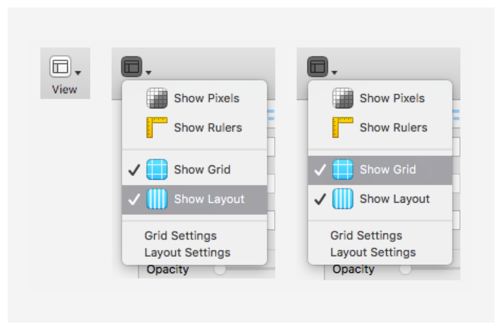
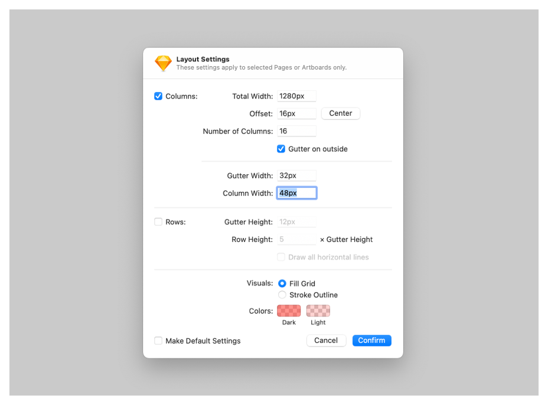

<InlineNotification kind="warning">

**Sketch guidance**  
IBM is moving to Figma. This guidance exists for designers who do not have access to Figma yet, and are still using Sketch. This guidance will be removed in Q2 2023 to reflect the organizational shift. 
</InlineNotification> 

## Setting up your Sketch file

To get started with your design, copy and paste the artboards to the right into your new document. You can toggle seeing the columns on Sketch at “**View → Show layout***” and the units at “**View → Show grid**”.

<Row>
<Column colLg={8}>

</Column>
</Row>

Slide-in panels influence the page layout grid; below are some of the specifications for panel combinations and how they impact the grid at all sizes.

- Breakpoint Width* = **Artboard Width**
- Breakpoint Gutter* = **Left and Right Outside Margins**
- Total Panel Width (“sidebar nav”) + Left outside margin + Right outside margin = **Total Margins**
- Artboard Width - Total Margins = **Total Width**
- Total Panel Width + Left margin = **Offset**

_*Since we are following the Carbon Design responsive guidelines, we referenced this [table](https://www.carbondesignsystem.com/guidelines/2x-grid/implementation#responsive-options) to determine our common breakpoint widths and respective gutter specs._

**Example**

<Row>
  <Column colLg={8}>

  </Column>
</Row>

Let’s say we want to create a custom grid for a new design that uses the extra small panel (256px wide) on our x-large 1312px breakpoint. Applying the formula above, your calculations would look like this

- Breakpoint Width (1312px) = 1312px wide artboard
- Breakpoint gutter (32px) = 32px Left outside margin and 32px Right outside margin
- Total Panel Width (256px) + 16px Left + 16px Right = 288px Total Margins
- Artboard Width (1312px) - Total Margins (272px) = **1,056px Total Width**
- Total Panel Width (256px) + 16px Left = **272px Offset**

_*If the grid influencer would cause the content view size to be smaller than 1056, then it would follow the next grid breakpoint setting the columns to 8. Which also avoids columns that are smaller than 32._

## Resources

<Row className="resource-card-group">
  <Column colMd={4} colLg={4} noGutterSm>
    <ResourceCard
      subTitle="IBM grid template"
      href="https://sketch.cloud/s/ngV7z">

  </ResourceCard>
  </Column>
  <Column colMd={4} colLg={4} noGutterSm>
    <ResourceCard
      subTitle="Sketch file"
      href="https://ibm.box.com/s/du4xu2wd2mdbcq17v5rf55yk89p1bvzj">

  

  </ResourceCard>
  </Column>
</Row>

## Related

- [Side panel](https://pages.github.ibm.com/cdai-design/pal/components/side-panel/usage)
- [Tearsheet](https://pages.github.ibm.com/cdai-design/pal/components/tearsheet/usage)
- [2x Grid](https://www.carbondesignsystem.com/guidelines/2x-grid/overview/)
