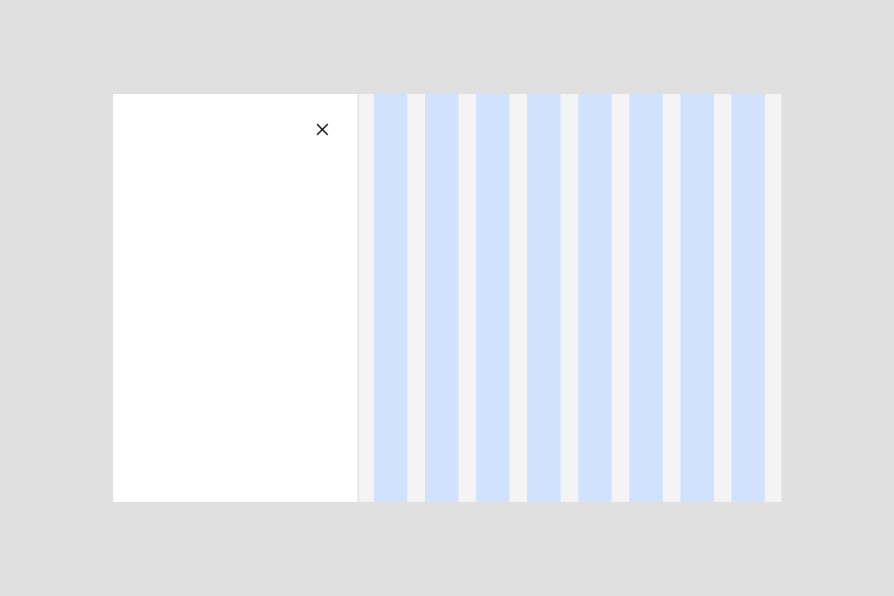

<PageDescription>

A grid influencer is a component that affects the content on the page, and therefore its underlying grid.

</PageDescription>

<AnchorLinks>
<AnchorLink>Overview</AnchorLink>
<AnchorLink>Use cases</AnchorLink>
<AnchorLink>Grids in Figma</AnchorLink>
</AnchorLinks>

## Overview
A grid influencer is a component that affects the content on the page, and therefore its underlying grid. It can either appear on a page as the result of a user action, or be part of your product’s page. These influencers affect the grid and its columns, which scale and resize the page content. 

The basic page grid is not affected by any influencers and would simply react to the product’s breakpoints. To learn more about how the 2x grid works, read the [2x Grid](https://carbondesignsystem.com/guidelines/2x-grid/overview/) by Carbon. This guidance focuses solely on when the grid responds to grid influencers.

## Use cases
There are two main use cases where the grid may be influenced by content: left navigation and slide-in side panels. 

### Left hand navigation
A left hand navigation (using the [UI shell left panel](https://carbondesignsystem.com/components/UI-shell-left-panel/usage/)) is the most common example of a grid influencer. In this example, when opening and closing the left hand navigation, the number of columns remains the same but responds fluidly to the allotted space.

<Row>
<Column colLg={8}>

</Column>
</Row>

<Row>
<Column colLg={8}>

</Column>
</Row>

### Slide-in side panels
Slide-in [side panels](https://pages.github.ibm.com/cdai-design/pal/components/side-panel/usage) are another example of a grid influencer. Slide-in panels are used when the user needs to reference the page along with panel information to complete a task. 

<Row>
<Column colLg={8}>

</Column>
</Row>

<Caption>Introducing a slide-in panel resizes the page content, and reduces the number of columns in the grid.</Caption>

### Best practices

#### Don't use large slide-in panels on small screens.

Using large slide-in panels on small screens results in the page content to be too small to be usable. If you need a side panel size bigger than listed below, consider using a slide-over side panel or a tearsheet instead. 

Suitable slide-in panel sizes for each breakpoint:

| 1584px+               | 1312px   |   1056px |  672px  | 320px   |
| ------------------                     | -----------                | -----                       | -------------               | -----------                 |
| X-Small (256px)   |   X-Small (256px)              |   X-Small (256px)              |    X-Small (256px)              | Not suitable               |
| Small (320px)   |   Small (320px)              |   Small (320px)              |                                 |              |
| Medium (480px)   |   Medium (480px)           |   Medium (480px)              |                                 |                |
| Large (640px)   |   Large (640px)            |                |                 |               |

#### Limit the amount of slide-in panels in a single experience.

You may need multiple slide-in panels open in the same experience (Expanded left hand navigation + an open slide-over panel). However, unless you are using a large screen size (1312px and above) with small side panels, the recommended behavior is that opening a slide-in panel would close any already open slide-in panels in the UI.

<Column colLg='8' noGutterMdLeft>

<GifPlayer color='dark'>

</GifPlayer>
</Column>

## Grids in Figma
When designing in Figma, you will be familiar with using the Screen component from Carbon as the base for all designs. We have created the Screen + influencer component to use in scenarios outlined above. 

You can find this component under Grid influencer, or simply search for "Screen + Influencer" in your assets panel. Make sure you have the [Gray 10/100 - IBM Products library](https://pages.github.ibm.com/cdai-design/pal/design-kits/figma/) enabled.

<Row>
<Column colLg={8}>

</Column>
</Row>

Then you can detach and use it as a base for your designs in the same way as the Carbon screen component. 

## Related
- [Side panel](https://pages.github.ibm.com/cdai-design/pal/components/side-panel/usage)
- [Tearsheet](https://pages.github.ibm.com/cdai-design/pal/components/tearsheet/usage)
- [Design kits](https://pages.github.ibm.com/cdai-design/pal/design-kits/figma/)
