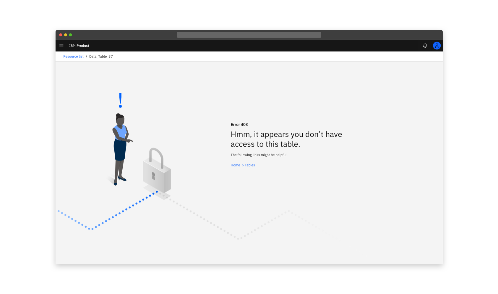
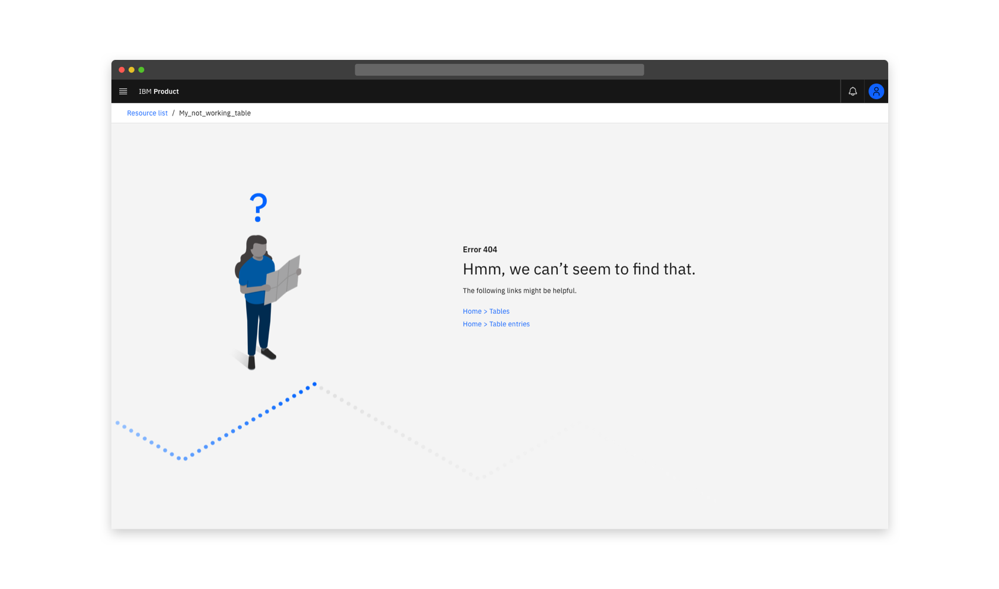
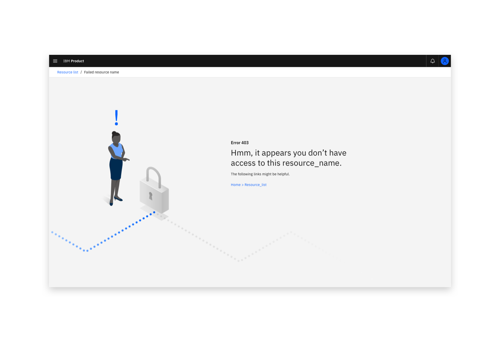
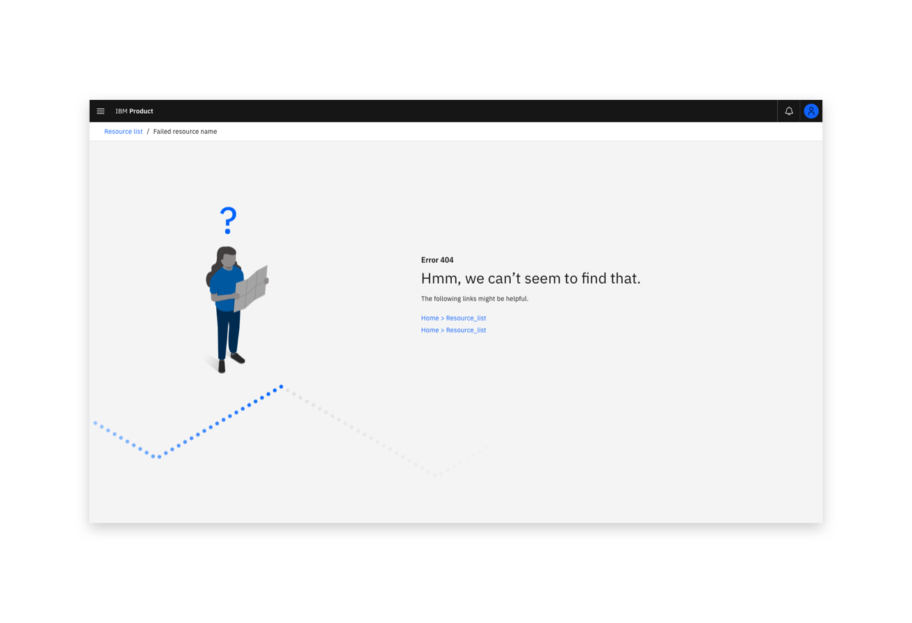
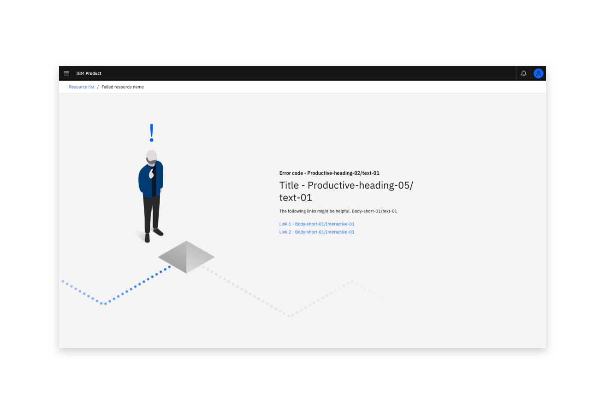

import { Tag } from "carbon-components-react";

  <Tag type="blue">Carbon 10 (v1)</Tag>

<PageDescription>

  HTTP errors are used in an attempt to access something that isn’t available or that the user doesn’t have permission for.

</PageDescription>

<InlineNotification kind="warning">

**Deprecated in v2:** This pattern will be replaced with a newer version in Carbon for IBM Products v2.
Please migrate to the updated [Full-page errors](https://pages.github.ibm.com/cdai-design/pal/patterns/full-page-errors/usage/)
pattern for Carbon 11.
 
This will be removed from the next major version of IBM Products.
</InlineNotification>

<AnchorLinks>
  <AnchorLink>Overview</AnchorLink>
  <AnchorLink>HTTP Error types</AnchorLink>
  <AnchorLink>Format</AnchorLink>
</AnchorLinks>

## Overview  

HTTP errors are used in an attempt to access something that isn’t available or the user doesn’t have permission for.  

<Row>
 <Column colLg={8}>

 <Caption>Example of a 403 error in context</Caption>
 </Column>
</Row>

<Row>
 <Column colLg={8}>

 <Caption>Example of a 404 error in context</Caption>
 </Column>
</Row>

These guidelines provide default header text and images for three common HTTP error scenarios. The images are part of the HTTP errors coded component and can be viewed live in our [Storybook](https://pages.github.ibm.com/cloud-integration-design/ide-components/?path=/story/production-ready-ide-http-errors--default), along with the default text.   

## HTTP error types

### 403 Error

Headline Text - “Hmm, it appears you don’t have access to this resource_name” where resource_name is replaced as needed.  

The description text should introduce the suggested page link(s).   

<Row>
 <Column colLg={8}>

 </Column>
</Row>

<a href="https://github.ibm.com/CDAI-design/pal/tree/main/src/pages/patterns/http-errors/images/Error_Page_Illustrations_403.svg" download>Download the SVG illustration</a>  or find it in the Sketch Kit.

### 404 Error

Headline Text - “Hmm, we can’t seem to find that.”  

The description text should introduce the suggested page link(s).   

<Row>
 <Column colLg={8}>

 </Column>
</Row>

<a href="https://github.ibm.com/CDAI-design/pal/tree/main/src/pages/patterns/http-errors/images/Error_Page_Illustrations_404.svg" download>Download the SVG illustration</a>  or find it in the Sketch Kit.

## Other errors

Provide an error code for all other errors and aim to add a descriptive message.

<Row>
 <Column colLg={8}>

 </Column>
</Row>

<a href="https://github.ibm.com/CDAI-design/pal/tree/main/src/pages/patterns/http-errors/images/Error_Page_Illustrations_OTHER.svg" download>Download the SVG illustration</a>  or find it in the Sketch Kit.

## Format

### Basic HTTP errors

Components from the [Carbon for Cloud &amp; Cognitive Illustration Library](https://pages.github.ibm.com/cdai-design/pal/illustrations/library) have been used to provide consistency across three core HTTP error scenarios. If you have a specific HTTP error which you feel is not covered by one of these illustrations, you may choose to create a new object which more accurately represents your scenario.  

Characteristics of HTTP errors:  
- Displays the error number  
- Features headline text explaining the cause of the error maintaining an informal tone  
- Utilises isometric style illustration (optionally including animation) featuring a human character and an object relevant to the specific scenario    

### Creating new HTTP error illustrations  

When it comes to creating custom empty state illustrations, you have two options:   
- Follow the guidelines to create new a HTTP error illustration in the illustration guideline.  
- Reach out to the illustration team via the [#cdai-pal](https://ibm-casdesign.slack.com/archives/CQGR0HC05) Slack channel.    

<a href="https://github.ibm.com/CDAI-design/pal/tree/main/src/pages/patterns/http-errors/images/Error_Page_Illustrations.ai" download>Download the illustrator file</a>.
