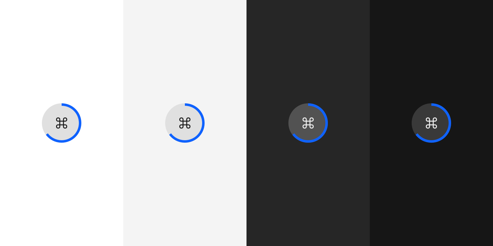
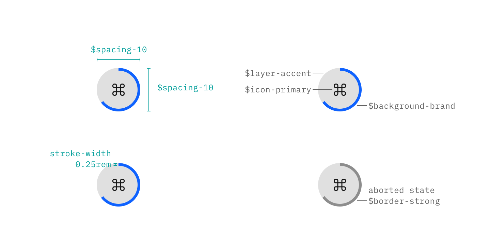
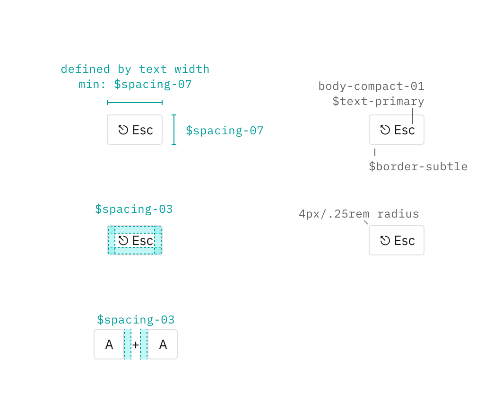

<Row>
  <Column colLg={8}>

  </Column>
</Row>

## Color

| Element | Property | Color token |
| :- | :- | :- |
| Indicator | `background-color` | `$layer-accent` |
| | `fill` | `$icon-primary` |
| | `stroke` | `$background-brand` (when running) `$border-strong` (when aborted) |
| Key | `background-color` | `transparent` |
| | `color` | `$text-primary` |
| | `border-color` | `$border-subtle` |

## Typography

| Element | Type style |
| :- | :- |
| Key | `body-compact-01` |

## Structure

| Element | Property | px / rem | Spacing token |
| :- | :- | :- | :- |
| Indicator | `width`, `height` | - | `$spacing-10` |
| | `stroke-width` | - | `$spacing-02` |
| Key | `min-width` | - | `$spacing-07` |
| | `height` | - | `$spacing-07` |
| | `border-radius` | 4 / .25 | - |
| | `padding` | - | `$spacing-03` |
| Operator | `margin-left`, `margin-right` | - | `$spacing-03` |

<Row>
  <Column colLg={8}>

</Column>
</Row>

Note that the keys have a minimum width of `$spacing-07`, making them square when only one character is displayed (see the example with "A" and "A" above). The text will remain centered, resulting in a higher horizontal spacing on low-width characters such as "I".
