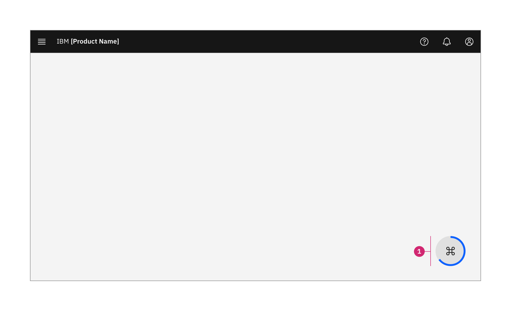
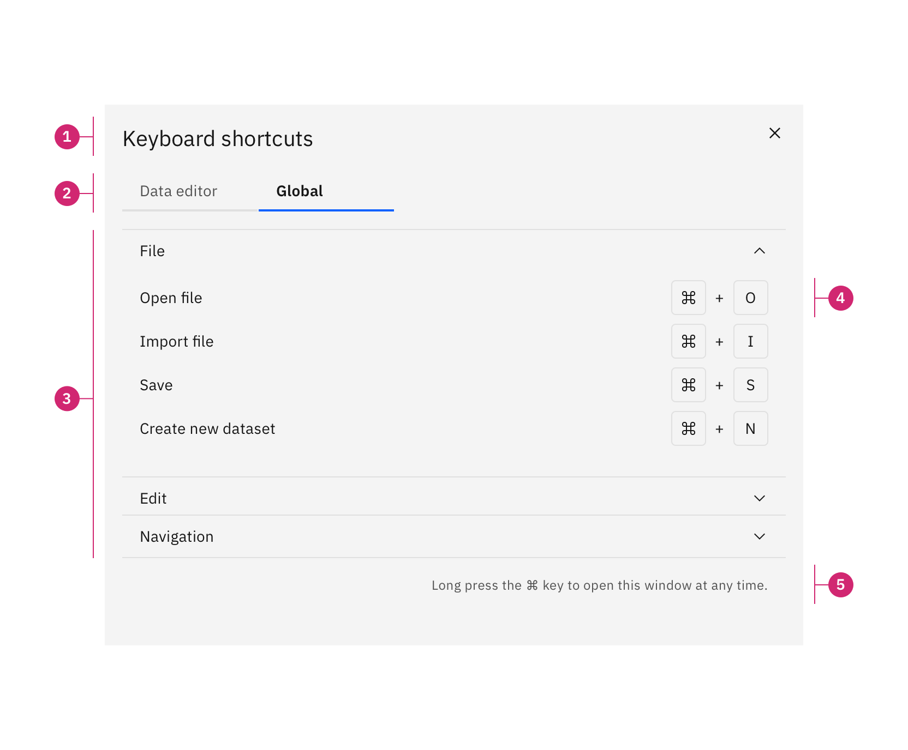
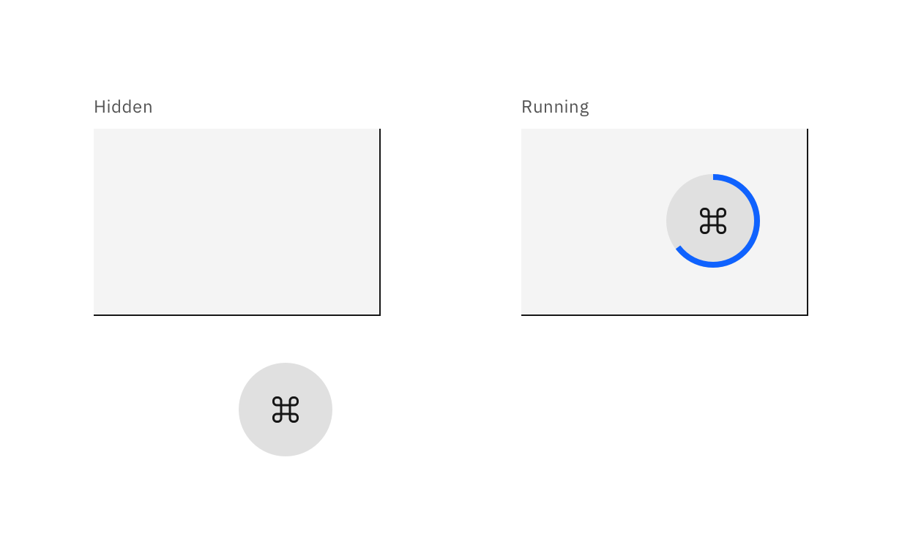
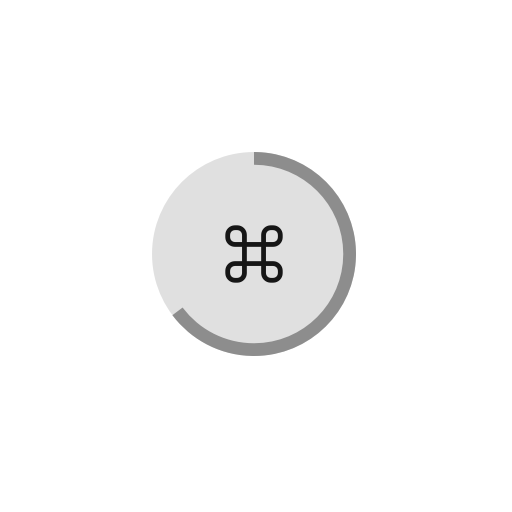

<AnchorLinks>
  <AnchorLink>Overview</AnchorLink>
  <AnchorLink>Behaviour</AnchorLink>
  <AnchorLink>Accessibility</AnchorLink>
  <AnchorLink>Related</AnchorLink>
</AnchorLinks>

## Overview

The objective of this pattern is to give users context-based, quick access to available keyboard shortcuts that help them navigate and interact with the application. Besides encouraging power-users to accelerate their workflow this provides crucial information for users with diverse abilities that rely on keyboard navigation to interact with software. Though the information must also provided in the IBM knowledge center pages of a product, the users would need to switch back and forth between the actual product and the guidance, resulting in higher cognitive load.

### Anatomy

The pattern consists of two components: the keyboard shortcut indicator and the keyboard shortcut modal. The modal contains the content and can be triggered either by the indicator or through a help menu.

#### Keyboard shortcut indicator

<Row>
  <Column colLg={8}>

  </Column>
</Row>

1. **Indicator:** Indicating that the keyboard shortcut modal will be triggered

Note that the icon inside the indicator changes depending on the user's operating system. The `MacCommand24` icon will be used when the user is accessing the application from macOS. On any other oprating system (Windows, Linux, unknown), the `Keyboard24` icon is used instead.

#### Keyboard shortcut modal

<Row>
  <Column colLg={8}>

  </Column>
</Row>

1. **Modal title:** "Keyboard shortcuts"
2. **Categories:** Tabs that allow the user to switch between the individual categories / contexts of the application
3. **Groups:** An accordion that structures all available shortcuts within a category into groups
4. **Command:** An individual keyboard shortcut — consists of a label and a the key combination
5. **Note:** Informs the user how to access this modal (in case they "accidentally" triggered it or opened from help menu)

## Behaviour

### Modal structure

The keyboard shortcut modal should have two categoris (represented by tabs): the current context and global application shortcuts.
The current context is defined by which page the user is currently viewing.

**Example:**
The user is in a data editor and then moves on to a chart building flow. In the first part, the categories shown will be "Data editor" and "Global". In the second part the categories will be "Chart builder" and "Global".

Note that the "Global" category is always placed as the second and the current context will always be the first tab (selected by default).

Within a category, the individual shortcuts are structured into groups to make it easier for the user to find the one they're looking for. These groups are displayed in an accordion. The first group is always open by default while the other groups are initially collapsed when the modal opens.

The height of the modal should be fixed to avoid visual artifcats / jumping when an accordion item is opened or closed.

The individual shortcuts have a descriptive label and a key combination. The individual keys are combined with operators.

### Keys and operators

Keys should use icons to reduce text whenever the icon is clearly identifiable for the user. If an icon might not be understood by everyone, it's best to put the name of the key next to it. This is a list of recommended pairings:

|Key|macOS|Windows/Linux|
|:--|:--|:--|
|Shift|<kbd>⇧</kbd> (icon: `MacShift16`)|<kbd>⇧</kbd> (icon: `MacShift16`)|
|Control|<kbd>⌃ Ctrl</kbd>|<kbd>Ctrl</kbd>|
|Option|<kbd>⌥</kbd> (icon: `MacOption16`)|<kbd>Alt</kbd>|
|Command|<kbd>⌘</kbd>|<kbd>Win</kbd>|
|Backspace|<kbd>⌫</kbd> (unicode: `\u232b`)|<kbd>⌫</kbd> (unicode: `\u232b`)|
|Tab|<kbd>⇥ Tab</kbd> (unicode: `\u21e5`)|<kbd>⇥ Tab</kbd> (unicode: `\u21e5`)|
|Return/Enter|<kbd>↵</kbd> (unicode: `\u21b5`)|<kbd>↵</kbd> (unicode: `\u21b5`)|
|Capslock|<kbd>⇪</kbd> (unicode: `\u21ea`)|<kbd>⇪</kbd> (unicode: `\u21ea`)|
|Escape|<kbd>⎋ Esc</kbd> (unicode: `\u238b`)|<kbd>Esc</kbd> (unicode: `\u238b`)|
|Arrow up|<kbd>↑</kbd> (icon: `ArrowUp16`)|<kbd>↑</kbd> (icon: `ArrowUp16`)|
|Arrow right|<kbd>→</kbd> (icon: `ArrowRight16`)|<kbd>→</kbd> (icon: `ArrowRight16`)|
|Arrow bottom|<kbd>↓</kbd> (icon: `ArrowDown16`)|<kbd>↓</kbd> (icon: `ArrowDown16`)|
|Arrow left|<kbd>←</kbd> (icon: `ArrowLeft16`)|<kbd>←</kbd> (icon: `ArrowLeft16`)|

The following operators are available:

1. **And (`+`):** The keys must be pressed together
2. **Or (`/`):** Multiple keys work for this command. This can also be used to simplify repetetive commands (such as "<kbd>⌘</kbd> + <kbd>↑</kbd> / <kbd>→</kbd> / <kbd>↓</kbd> / <kbd>←</kbd>" to indicate the cmd key can be used in conjunction with the arrow keys instead of displaying four individual commands)
3. **To (`…`):** Indicate that a certain range of numeric keys are used (for example "<kbd>⌘</kbd> + <kbd>1</kbd> … <kbd>8</kbd>" to switch between tabs 1-8)

### Indicator states

The keyboard shortcut indicator has four states:

1. **Hidden:** The indicator is not visible to the user. It "sits" below the window's bottom edge.
2. **Running:** The indicator is shown to the user and the outline is filling up
3. **Aborted:** The user performed an [interruption](#interruptions). The indicator shrinks and moves back to the hidden state.
4. **Done:** The user has not performed an [interruption](#interruptions). The outline is filled and the indicator grows while fading out. The modal is shown.

<Row>
  <Column colLg={8}>

  </Column>
</Row>

### Animation

#### Hidden → Running → Done
<GifPlayer color="dark">

</GifPlayer>

1. The indicator moves up to it's shown position within `200ms` and uses `carbon--motion(entrance, productive)` easing
2. The blue outline starts filling up immediately. It takes `1100ms` and uses `linear` / no easing since it represents time
3. The indicator scales to `150%` of it's original size and fades out to 0% opacity. Both transitions take `200ms` and use `carbon--motion(exit, productive)` easing.

#### Hidden → Running → Aborted
<GifPlayer color="dark">

</GifPlayer>

1. Indicator moves and fills up outline as in previously described animation
2. The outline stops filling and its color changes to `ui-04` immediately
3. The indicator scales to `80%` of it's original size within `300ms` and uses `carbon--motion(standard, productive)` easing
4. After a `300ms` delay, the indicator moves back out to its hidden state with `200ms` duration and `carbon--motion(entrance, productive)` easing

### Trigger

The indicator is triggered whenever the user presses the <kbd>⌘ cmd</kbd> key (macOS) or <kbd>ctrl</kbd> (Windows). However, there is a `500ms` delay between the keypress and the indicator starting to show and fill up so that we may catch an [interruption](#interruptions) before the indicator is shown and the user is not bothered by a constantly appearing and disappearing circle.

**Since some users with motor impairements might have problems with calling an interruption in this time frame, a user must have the option to disable this form of triggering in the application settings.**

As an alternative to the keyboard shortcut, the application's help menu should provide an entry point to the modal.

### Interruptions

Before and while the indicator is shwoing and filling up the user can abort it with any of the following interruptions:

1. Another key (other than the trigger key) is pressed. Example: <kbd>⌘</kbd> + <kbd>S</kbd>
2. Any key (including the trigger key) is released
3. The user moves their mouse pointer futher than 50px from the position it was when they pressed the trigger key
4. The user pressed any mouse button (clicked)
5. The window loses user's focus because they switched to another application / browser tab

If any of these interruptions happen before the indicator is shown, there will be no visual feedback to the user. The indicator simply won't show. If an interruption happened while the indicator was already visible, the "aborted" state is shown and the indicator disappears.

In both cases, the indicator receives a `750ms` cooldown before it can be triggered again.

## Accessibility

The primary focus selctor on the keyboard shortcut modal is `li[role='tab'] a` to automatically focus the first tab when the modal opens.

Each key and operator has an `aria-hidden="true"` attribute to remove them from a screen reader's list of elements. Instead, the entire combination has an `aria-label` that ensures the icons and operators are read correctly.

**Example:** "<kbd>⇧</kbd> + <kbd>↑</kbd> / <kbd>↓</kbd>" would be transformed into the following `aria-label`: "'Shift' and 'arrow up' or 'arrow down'"

As noted in the [trigger](#trigger) section, the user must be able to disable the long-press cmd/ctrl key functionality in the application settings.

## Related

The keyboard shortcut modal leverages the following carbon components:

- [Passive modal](https://www.carbondesignsystem.com/components/modal/usage#passive-modal)
- [Tabs](https://www.carbondesignsystem.com/components/tabs/usage)
- [Accordion](https://www.carbondesignsystem.com/components/accordion/usage)

The keyboard shortcut indicator leverages easing curves from [Carbon's motion guidelines](https://www.carbondesignsystem.com/guidelines/motion/overview).
