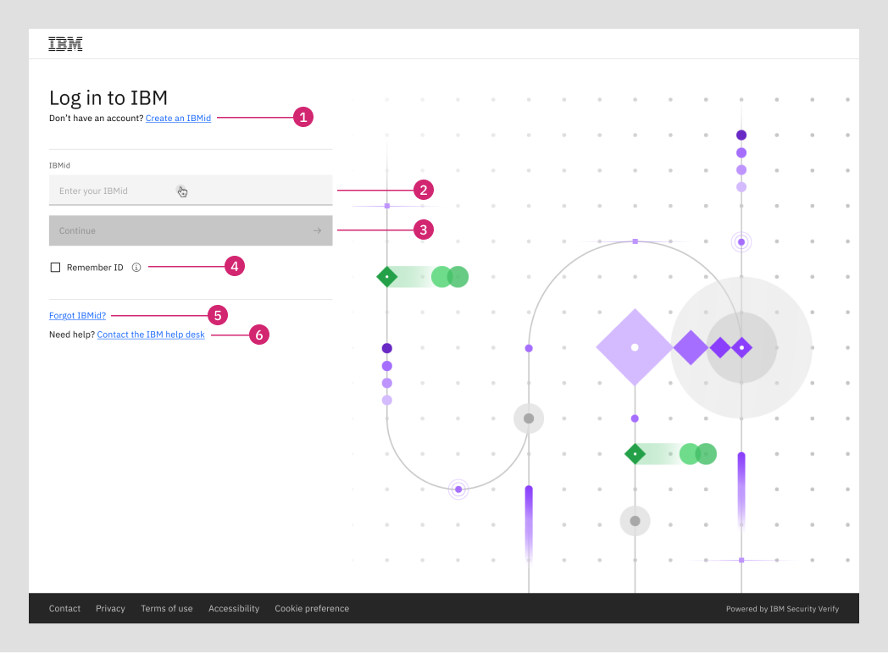
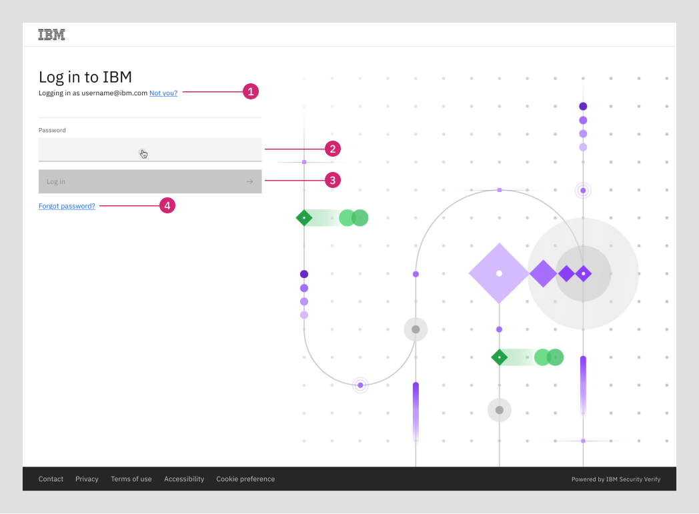
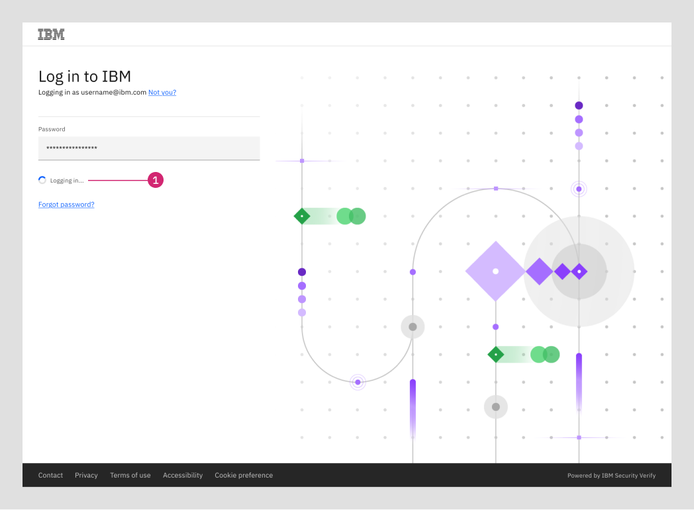

import { Tabs as CTabs, Tab as CTab } from "carbon-components-react";

← [Back to Login and logout patterns overview](/patterns/login-logout/overview)

<PageDescription>

The URX login pattern is a global element of the IBM product experience. It allows users to access their product or Try offer.

</PageDescription>

<AnchorLinks>
    <AnchorLink> Overview </AnchorLink>
    <AnchorLink> User encounters log in screen</AnchorLink>
    <AnchorLink> Email validation and password field </AnchorLink>
    <AnchorLink> User enters their password and logs in </AnchorLink>
    <AnchorLink> Example </AnchorLink>
</AnchorLinks>

## Overview

URX login applies to all products provisioned through IBM that are not IBM Cloud. Product teams do not have to do anything to implement this pattern and it cannot be changed for an individual team’s use.  

### User encounters log in screen

The user is prompted to enter their IBMid/ email address. The user can either manually enter this information or utilize browser autofill functionalities. 

<Row>
  <Column colMd={8} colLg={10}>

  </Column>
</Row>

1. **Create an IBMid link:** Directs user to the IBMid account creation form (URX)
2. **Existing IBMid field** 
3. **Continue button:** Remains disabled until IBMid has been entered and validated
4. **Remember IBMid:** User can optionally select for their browser to remember their IBMid faster login in the future
5. **Forgot IBMid link**  
6. **Support link**

### Email validation and password field

The system verifies that the email address is registered to an IBMid. Once validated, the user is presented with a field to enter their password. 

<Row>
  <Column colMd={8} colLg={10}>

  </Column>
</Row>

1. **Load indicator:** Replaces the Continue button once clicked before loading the password screen

  

<Row>
  <Column colMd={8} colLg={10}>

  </Column>
</Row>

1. **Account label:** Indicates the account the user is logging into, as entered on previous screen
2. **Password field** 
3. **Log in button:** Remains disabled until password has been entered 
4. ** Forgot password link:** Allows user to reset their password

### User enters their password and logs in

The user may manually enter their account password or utilize their browser’s saved password autofill functionality. Once submitted, their password is validated and the user is logged in to their account.

<Row>
  <Column colMd={8} colLg={10}>

  </Column>
</Row>

1. **Load indicator:** Replaces the Log in button once clicked before redirecting the user into the product or Try experience 

### Example

Reference this product agnostic [IBMid login example](https://login.ibm.com/idaas/mtfim/sps/idaas/login?client_id=ZTY0MDc5OGUtOTE3OC00&Ta[…]d458-4b83-9372-4fd592b92bd8%26client_id%3DZTY0MDc5OGUtOTE3OC00) to see how this flow can be used in practice.

<InfoCard
cardName="Pattern version history"
cardDescription='Versions, changelog and contributors'>

<CTabs>

<CTab label="Version">

1.0

</CTab>

<CTab label="Changelog">

2023-08-11: Version 1.0 release

</CTab>

<CTab label="Contributors">

<a href="https://w3.ibm.com/#/people/1J7360897">Kiran Ravindra</a>  

<a href="https://w3.ibm.com/#/people/0D9543649">Judith Benjamin</a>  

</CTab>

</CTabs>

</InfoCard>