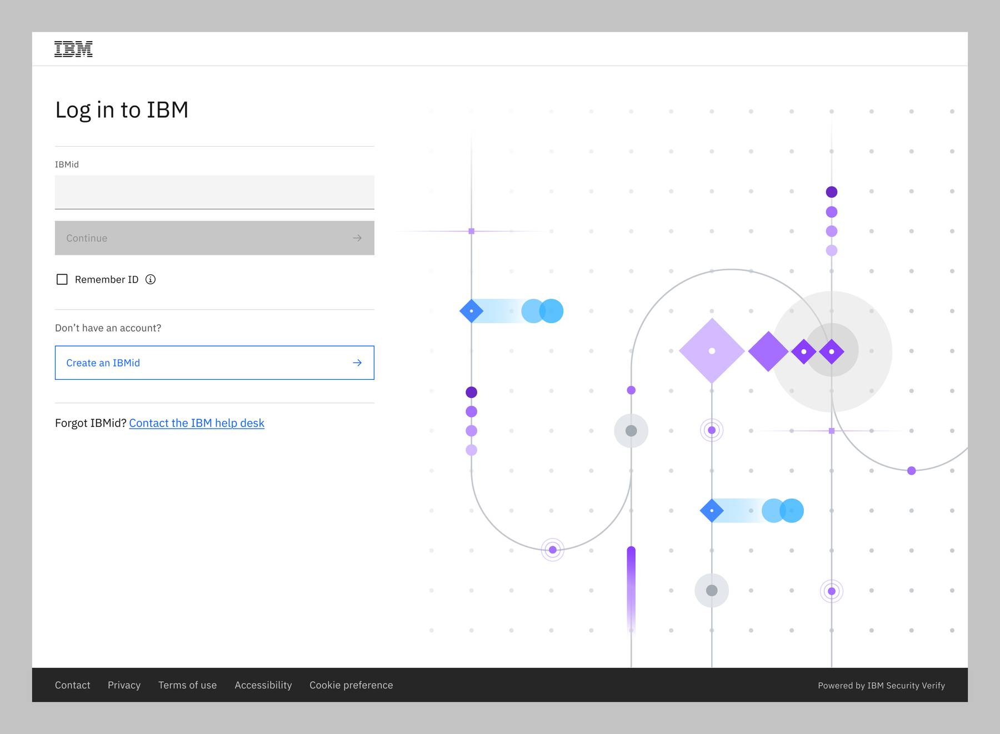

import { Tabs as CTabs, Tab as CTab } from "carbon-components-react";

← [Back to Login and logout patterns overview](/patterns/login-logout/overview)

<PageDescription>

The URX logout pattern allows a user to log out of their IBMid account.

</PageDescription>

<AnchorLinks>
    <AnchorLink> Overview </AnchorLink>
    <AnchorLink> Logging out </AnchorLink>
    <AnchorLink> Successful logout </AnchorLink>
    <AnchorLink> Login screen </AnchorLink>
</AnchorLinks>

## Overview

The logout pattern is visible to all users within a product provisioned through a URX form. The starting point of the flow is when the user clicks **Logout** in the user profile. 

<Row>
  <Column colMd={8} colLg={10}>

  </Column>
</Row>

### Logging out 
After clicking **Log out**, the following message is displayed: “You are now logging out of [Product name]”, indicating that the user is logging out. A loading status icon also appears to show that the logging out is in progress. 

<Row>
  <Column colMd={8} colLg={10}>

  </Column>
</Row>

### Successful logout
After the user has logged out, the following message is displayed: “You have successfully logged out of [Product name]”, indicating that the user has logged out successfully. 

<Row>
  <Column colMd={8} colLg={10}>

  </Column>
</Row>

### Login screen
The user can click the **Log in** button to be redirected to the main login page if desired. Guidance for this pattern can be found on the [URX login](https://pages.github.ibm.com/cdai-design/pal/patterns/login-logout/urx-logout) page. 

<Row>
  <Column colMd={8} colLg={10}>

  </Column>
</Row>

<InfoCard
cardName="Pattern version history"
cardDescription='Versions, changelog and contributors'>

<CTabs>

<CTab label="Version">

 1.0 

</CTab>

<CTab label="Changelog">

 2023-09-13: Version 1.0 release 

</CTab>

<CTab label="Contributors">

<SME>

<a href="https://w3.ibm.com/#/people/1J7360897">Sunny (Ranesh) Babbar</a>  

<a href="https://w3.ibm.com/#/people/0D9543649">Judith Benjamin</a>  

</SME>

</CTab>

</CTabs>

</InfoCard>