<PageDescription>

Notifications provide a way to communicate product information to users. They range from granular, inline responses to user actions to system-wide messages

</PageDescription>
<AnchorLinks>
<AnchorLink>Overview</AnchorLink>
<AnchorLink>When to use</AnchorLink>
<AnchorLink>Accessibility</AnchorLink>
<AnchorLink>Contact</AnchorLink>
<AnchorLink>Feedback</AnchorLink>
</AnchorLinks>

## Overview

The notification pattern provides a consistent experience to users and designers crafting experiences no matter what offering they use or work on. It sets expectations on the behavior for notifications, allowing the user to view and interact with them all in one place.

## Anatomy

### Notifications indicator in the header

In order to inform a user that they have new or unread notifications, an indicator ensures that there is a clear distinction.

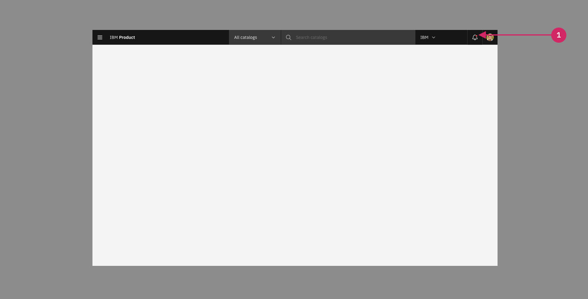

1. **Bell indicator**: The indicator serves as an indication that there are unread or new messages in the queue.

| **Item**                          | **Description (spec)**                                                                                                                                                                                       |
| --------------------------------- | ------------------------------------------------------------------------------------------------------------------------------------------------------------------------------------------------------------ |
| No messages in the header (bell icon) | Will not show an indicator or red dot. Users can still activate the panel when there are no messages.                                                                                                               |
| Messages in header the (bell icon)    | Will show an indicator or red dot, and not the count of messages. This was determined to be sufficient and more legible than a number indicating the amount of notifications (which could be multiple types).  |

### Notification Panel

Notification panels ensure that users can access and read all notifications without cluttering the screen with many persistent notifications. They also provide a consistent experience to users who need more time to read notifications, use a screen reader, or prefer to limit the notifications they receive.

This is particularly useful as by default, toast notifications disappear after a few seconds. They also provide a consistent experience to users who need more time to read notifications, use a screen reader, or prefer to limit the notifications they receive.

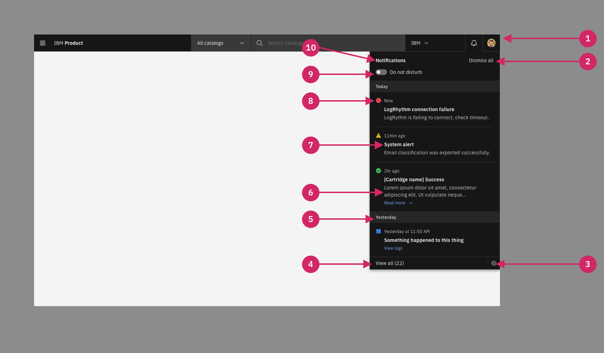

1. **Bell indicator**: The indicator serves as an indication that there are unread or new messages in the queue.
2. **Dismiss all**: Dismisses all visible notifications in the panel. They are still available to view on the history page
3. **Settings icon**: Allows users to access the settings page directly from the panel
4. **View all CTA**: Allows users to access the notifications history page, and also shows a count of how many total notifications exist for a user's account.
5. **Separator**: A segmented summary role up of notifications received by days
6. **Notification body**: Description of notification message. Limited to 2 lines with the ability to expand and collapse to display more info if needed.
7. **Notification title**: Title of the notification/alert/announcement.
8. **Severity indicator/Notification title**: Indicator of level of severity, usually sorted in order of priority
9. **Do not disturb**: Pauses incoming notifications from the screen, but still chronicles them within the Notification center for a user to interact with at their own pace.
10. **Panel Title**: Name of the notifications panel overlay

### Notifications panel (hover state)

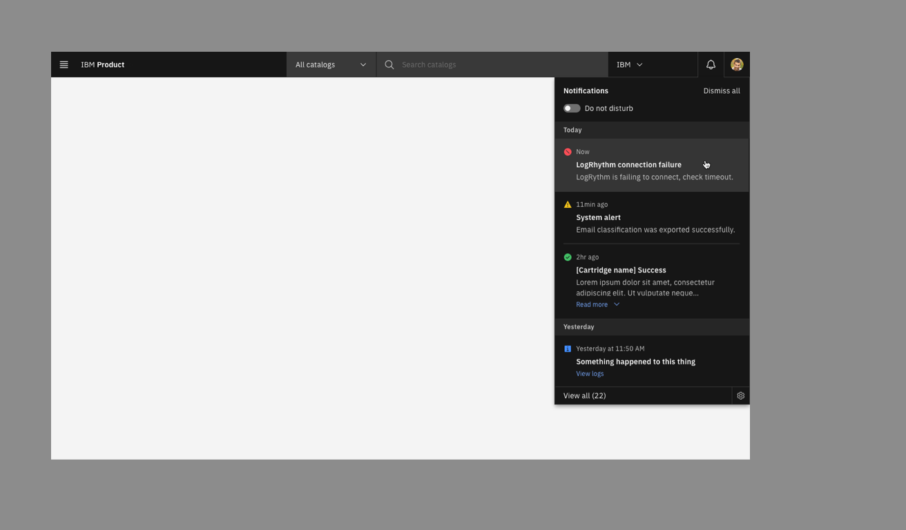

[Animation example](https://ibm.invisionapp.com/prototype/Notifications-panel-sketch-ckfftvja60004w30121uwq1ag/play/f800499a)

### Notifications panel (scroll)

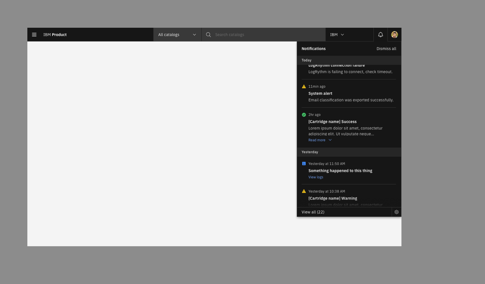

### Notifications panel (sticky scroll)

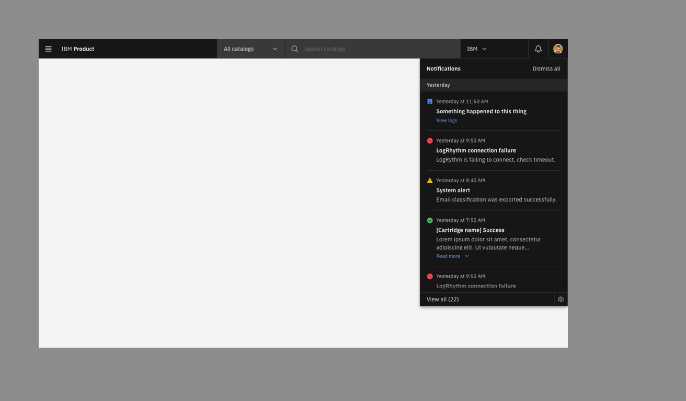

### Notifications panel (read more)

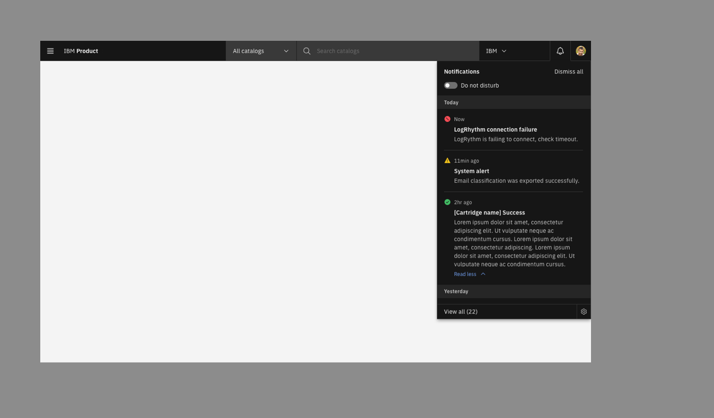

### Notifications view all page

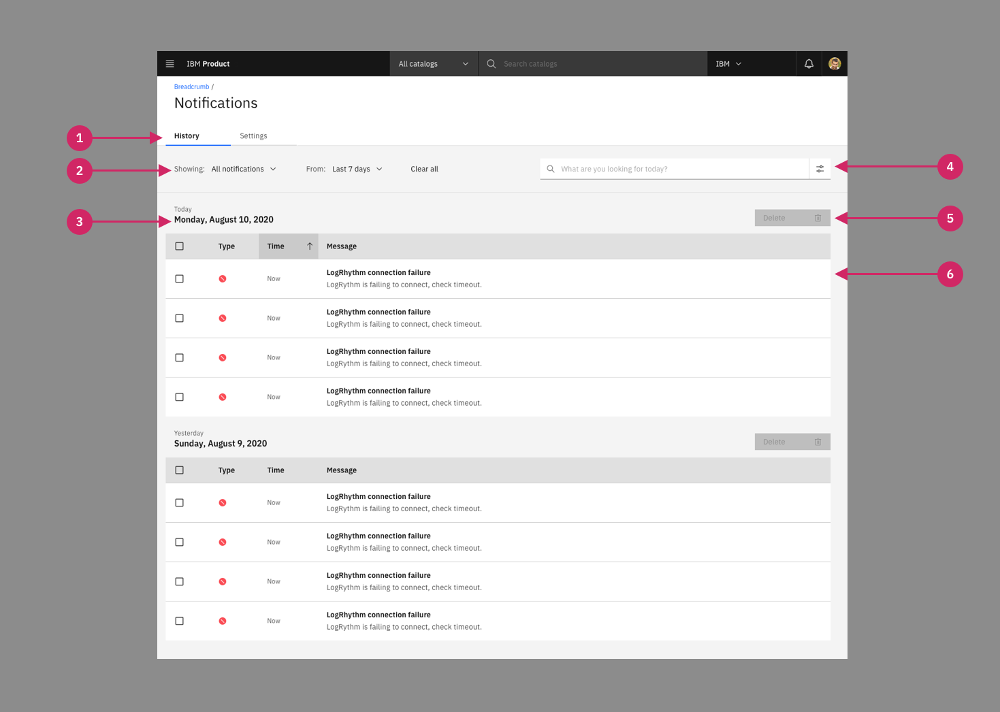

1. **Page tabs**: Allows a user to switch between historical and settings context within the Notifications world
2. **filters**: A user can access and build a set of their own filters for targeting more specific findings.
3. **Date designation**: All notifications grouped by day/date
4. **Find**: Ability to find any notifications you have.
5. **Delete group**: Deletes the entire group or single notification within a group. When selecting a notification or batch selection, the number designation appears along with the button becoming active.
6. **Notifications**: Selectable rows, sortable columns, and could be varying heights depending on the amount of information

**_Infinite scroll_**: Or as close to what we can get as possible to abide by accessibility standards.

### Notifications view all page (selected states)

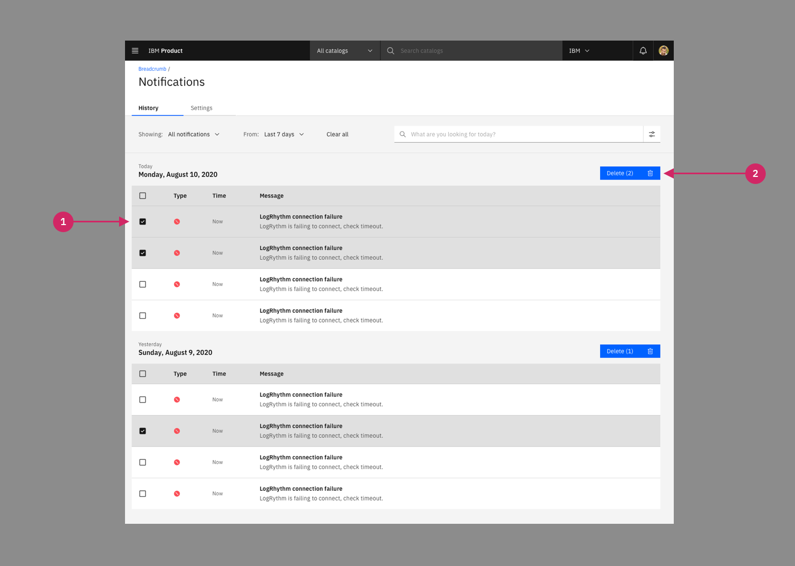

1. **Selected rows**: Batch or individual selections to perform actions on like delete
2. **Delete**: Call to action becomes active and the number designation appears (animates in) after a notification(s) is selected.

### Notifications view all page (filter bar)

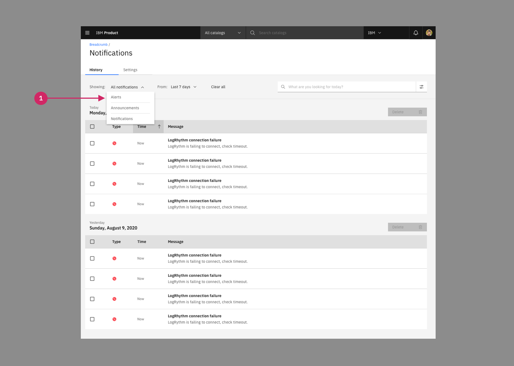

1. **Filter**: Based on the type of notification

### Notifications view all page (filter bar)

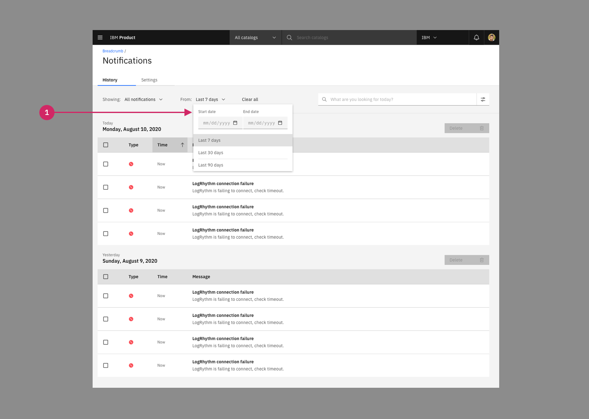

1 **Filter**: Based on time duration

### Notifications view all page (filter bar)

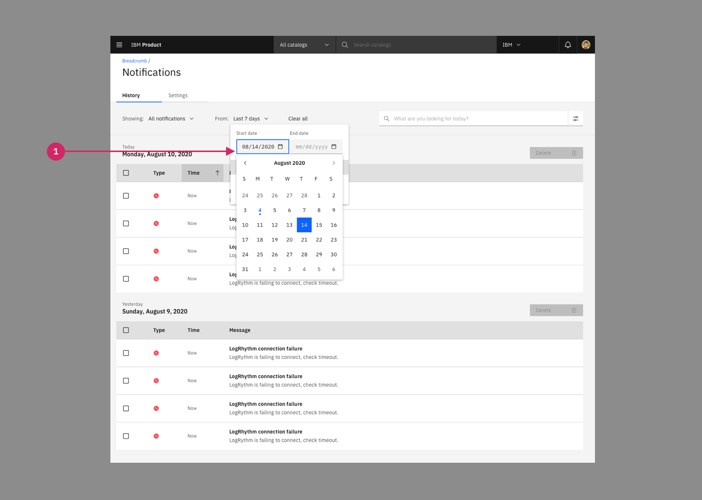

1. **Filter**: Based on time duration, extended to date

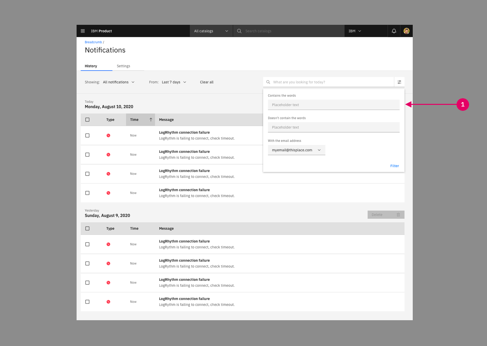

1. **Filter**: Based on keywords (containing, not containing), and email addresses

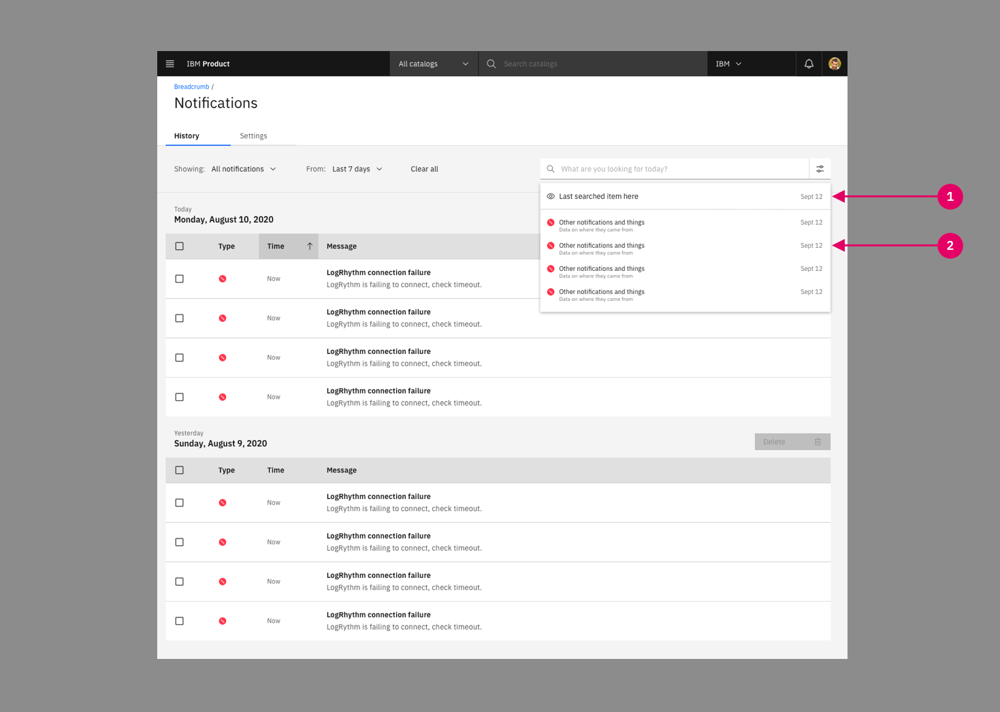

1. **Search**: Surfaces results based on the most recent first, and then the most relevant

### Notification open

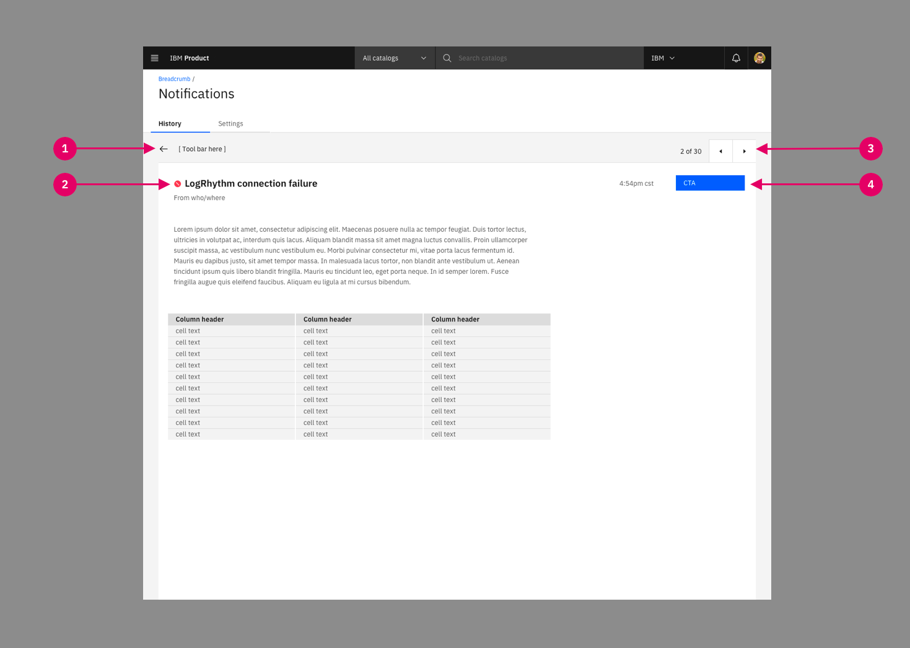

1. **Back button and toolbar**: Allows users to go back to the history list and is the space for a potential toolbar if needed.
2. **Type/Title/Origin:** Shows what type of notification, what the title is, and where it's from in the lockup
3. **Pagination**: Allows users to paginate between notifications in this view
4. **Main CTA**: Placement of a main CTA for the notification

### Notifications settings page (my account, collapsed)

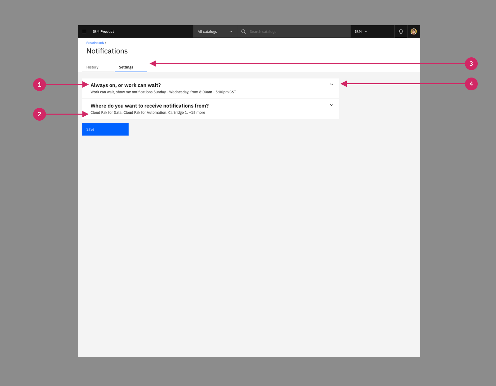

1. **Settings overview title**: An overview of what the setting is.
2. **Setting choices**: A description of the current settings a user has opted into
3. **Page tabs**: Allows a user to switch between historical and settings context within the Notifications world
4. **Accordion containers**: Allows a user to expand on additional functionality

### Notifications settings page (my account, expanded)

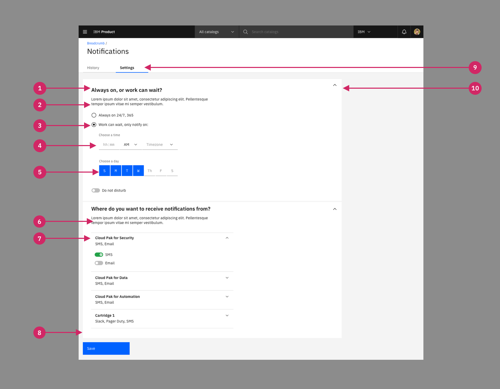

1. **Settings overview title**: An overview of what the setting is.
2. **Description of setting**: A description of what the setting is
3. **Selection**: Radio button used to select frequency of notifications
4. **Time settings**: Once a user opts into setting a specific frequency, the user can set a specific time and timezone in which to receive notifications
5. **Day settings**: Once a user opts into setting a specific frequency, the user can set a specific day range to receive notifications
6. **Accordion containers**: Allows a user to expand on additional functionality for the notification
7. **Toggle switch**: Allows the user to choose how they want to receive notifications based on the offerings they have permission to
8. **Save button**: Once changes are made, the button becomes active, acknowledging a change in state and a user can save their progress.
9. **Page tabs**: Allows a user to switch between historical and settings context within the Notifications world
10. **Accordion containers**: Allows a user to expand on additional functionality for the notification

### Notifications settings page (admin account)

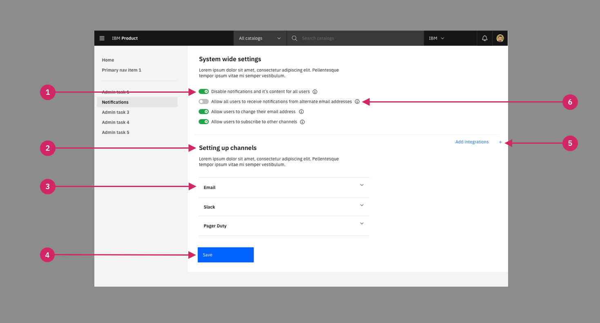

1. **Toggle switch**: Allows the admin to choose how they want to set up notification settings for their system(s)
2. **Settings overview title**: An overview of what the setting is. Setting content may vary depending on admin use case.
3. **Accordion containers**: Allows a user to expand on additional functionality for the notification
4. **Save button**: Once changes are made, the button becomes active, acknowledging a change in state and a user can save their progress.
5. **Add integrations**: Allows the admin to add more integrations to their system(s) for their users to access through an integration (catalog).
6. **Information icons**: On rollover, a user can get more information about anything that the info icon is attached to.

### When to use

Include a short list describing situations where this pattern could be applied. For example, use this pattern when:

- Always use the bell indicator when there are new or unused notifications or messages
- Always use the panel for accessing notifications or messages from the header bell icon indicator
- Use the view all page to show a user's historical list of all of the user notifications or messages
- Use the user account settings page pattern when a user can set their own personal notification settings. They can access these from their user preferences
- User the admin settings page pattern when a user can set their system notification settings. This page will be configurable based on the needs of the admin use case.
- Only use modals for a disruptive moment where a critical decision needs to be made, and a user cannot move further without taking action.

### When not to use (optional)

- Do not use the user account settings page pattern for admin settings page use cases
- Do not use the admin account settings page pattern for user account settings page use cases

## The solution

Notifications are an important method of communicating with users and providing feedback. They range from granular, inline responses to user actions to system-wide messages. Notification panels are helpful for users who receive a large number of system-generated notifications or may need to reference their notifications later. They are used in conjunction with toasts to alert users of notifications as they come in.

- Process handler usage from [Carbon](https://www.carbondesignsystem.com/components/notification/usage/) (inline, toast, system-based, task-based)
- Process handler usage from [Cloud Pak for Data](https://ibm.box.com/s/yuw4bin4ca2xcpzdd3j2ys2l16l2s079) (inline, toast, system-based, task-based)

#### Best practices

- Give users the ability to manage notification preferences.
- Don’t send the same notification multiple times if users don’t interact with it.
- List notifications in chronological order.- Notifications can be grouped by source or urgency.

### Other use cases

#### Announcement (disruption moment)

In the case of a critical immediate action, a system generated modal may be presented that gives the user a time sensitive choice. They may have to take action at that moment to move forward, or they may have the option of deferring the action for a defined amount of time (as defined by the experience team).

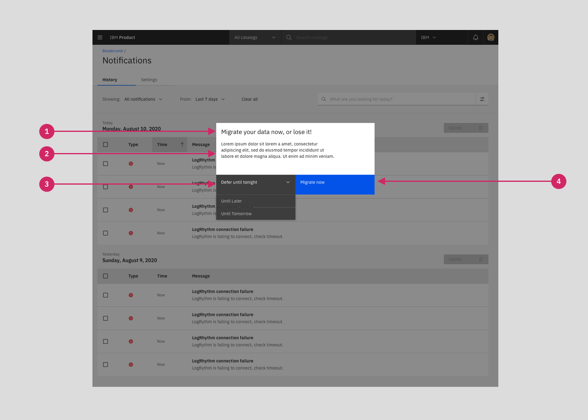

1. **Title block**: Sets the context of the announcement
2. **Body block**: Description of announcement
3. **Decision point CTA**: A call to action in order to defer an immediate need for a certain amount of time with the understanding that the critical action needs to be taken eventually and the user will not be able to move further after a certain amount of deferments.
4. **Immediate decision CTA**: A call to action in order to satisfy the immediate need that is critical to the use case.

## Indicators

Source anchored, an indicator is a way of making a page element (be it content or part of the user interface) stand out to inform the user that there is something special about it that warrants the user’s attention. Often, the indicator will denote that there has been some change to the item represented by that element.

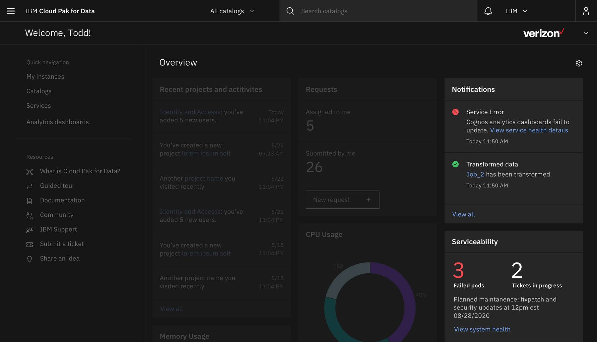

- Indicators are contextual. They are associated with a UI element or with a piece of content, and should be shown in close proximity to that element.
- Indicators are conditional — they are not always present, but appear or change depending on certain conditions.
- Indicators are passive. They do not require that a user take action, but are used as a communication tool to cue the user to something of note.

| **Type**           | **Description**                                                                                |
| ------------------ | ---------------------------------------------------------------------------------------------- | ------------- | --------------------------------------- |
| Icon               | [Status iconography](https://pages.github.ibm.com/cdai-design/pal/patterns/status-icons/usage) | Typographical | Boldfacing unread email messages, etc.  |
| Size and animation | Other sensory elements like vibration, relativity to other elements on the page, etc.          |

### Browser Based (web push) notifications

Browser based (web push) notifications are notifications that can be sent to a user via desktop web and mobile web. These are alert style messages that slide in at the top or bottom right hand corner of a desktop screen, depending on the operating system, or appear on a mobile device in a manner nearly identical to push notifications delivered from apps. Browser based (web push) notifications are delivered on a user’s desktop or mobile screen anytime they have their browser open — regardless of whether or not the user is on the website.

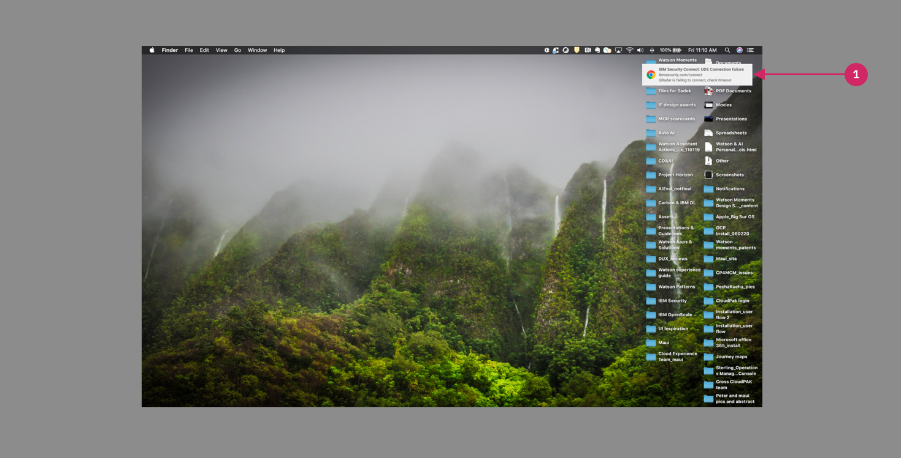

1. **Notification container**: Browser indicator and text blocks identifying the source of the notification and the content (title, description, and link to context of notification). Clicking on the notification should take a user directly to the context of the notification

### OS Based notifications

Browser based notifications are supported by the platform that is being used at the time of engagement. They surfaced through the OS and are opt-in by the user.

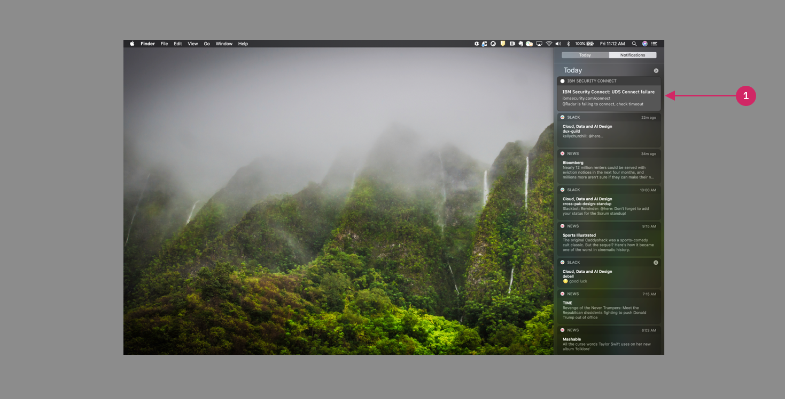

1. **Notification container**: OS based container (within the notifications menu) and text blocks identifying the source of the notification and the content (title, description, and link to context of notification) Clicking on the notification should take a user directly to the context of the notification

## Accessibility

Evaluate your pattern to ensure it meets [accessibility standards](https://carbondesignsystem.com/guidelines/accessibility/overview/) and guidelines, and provide details of compliance.

## Related

**Patterns**

- [Process handlers](https://www.carbondesignsystem.com/components/notification/usage/) from Carbon
- [Notification pattern](https://www.carbondesignsystem.com/patterns/notification-pattern) from Carbon
- Watson Moments [patterns](https://pages.github.ibm.com/data-and-ai/watson-moments/patterns/overview)

**Components**

- [Modal](https://www.carbondesignsystem.com/components/modal/usage/)
- [Notification](https://www.carbondesignsystem.com/components/notification/usage/)
- [UI shell](https://www.carbondesignsystem.com/components/UI-shell-right-panel/usage/)
- [Dialogs](https://www.carbondesignsystem.com/patterns/dialog-pattern/)
- Error states (_future_)
- [Forms](https://www.carbondesignsystem.com/patterns/forms-pattern/)

## References

- [Alert Fatigue](https://psnet.ahrq.gov/primer/alert-fatigue) (Patient Safety Network, 2019)
- [Aria Live Regions](https://www.w3.org/TR/wai-aria-1.1/#aria-live) (W3C, 2017)
- Duncan P. Brumby, Christian P. Janssen, and Gloria Mark, [How Do Interruptions Affect Productivity?](https://link.springer.com/chapter/10.1007/978-1-4842-4221-6_9) (Rethinking Productivity in Software Engineering, 2019)
- Kim Flaherty, [Indicators, Validations, and Notifications](https://www.nngroup.com/articles/indicators-validations-notifications/) (Nielsen Norman Group, 2015)
- Aurora Harley, [Visibility of System Status](https://www.nngroup.com/articles/visibility-system-status/) (Nielsen Norman Group, 2018)
- Jakob Nielsen, [10 Usability Heuristics for User Interface Design](https://www.nngroup.com/articles/ten-usability-heuristics/) (Nielsen Norman Group, 1994)
- [Web Content Accessibility Guidelines](https://www.w3.org/WAI/standards-guidelines/wcag/) (W3C, 2018)

## Feedback

Help us improve this pattern by providing feedback, asking questions, and leaving any other comments on [GitHub](https://github.com/carbon-design-system/carbon-website/issues/new?assignees=&labels=feedback&template=feedback.md).
