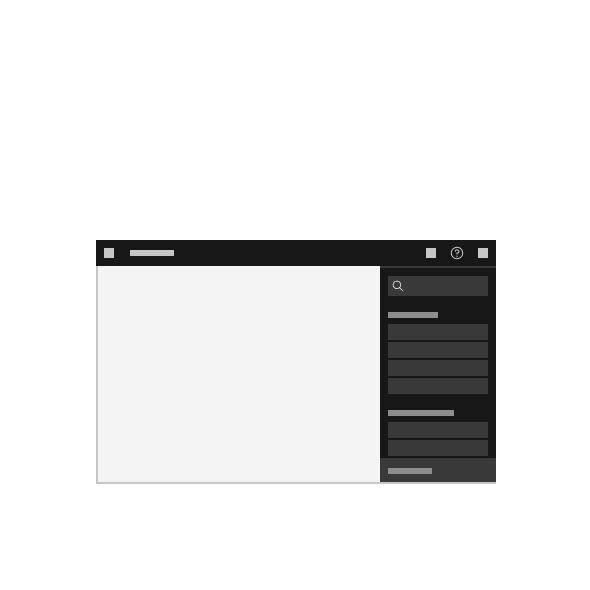

<PageDescription>

Onboarding patterns increase the probability that users will realize critical AHA moments quickly and adopt with ease. Onboarding is meant to level the learning curve, supporting users continuously on their product-use journey as they grow their proficiency.

</PageDescription>

## Overview

Users expect experiences to be immediately intuitive and guiding to value, with quality experiences that deliver answers, so they can focus on doing their job, better. The equation to achieve this is multi-faceted and requires a holistic approach to deliver “delightful experiences”. Users make up all proficiency levels and come from varying degrees of organizational maturity, so it’s paramount to consider how they are introduced and guided through experiences. Even if the product provides immense benefits, if a user fails to quickly onboard to value, the risk of abandonment increases. More so, it can negatively impact trust, brand reputation, and become more costly long-term.

## Patterns

Using the [onboarding components](/components/onboarding/overview), the following patterns are meant to choreograph with each other to increase user satisfaction and retention via a complementary experience of thoughtful nudging, continuous training, and contextual support. They are designed to provide users of all proficiencies a path toward value, and to do so continuously as they level up and as the product matures. 

<InlineNotification>
Onboarding patterns are actively being designed. The work-stream strives to release new patterns incrementally and frequently. For any feedback or questions, please reach out to @cameroncalder
</InlineNotification>

<Row className="image-card-group">

<Column colMd={3} colLg={3} noGutterSm>

<ImageCard disabled aspectRatio="1:1" subTitle="Dec 2023" title="In-product orientation">

</ImageCard>

<ImageCard disabled aspectRatio="1:1" subTitle="1Q 2024" title="Just-in-case access">

</ImageCard>

</Column>

<Column colMd={3} colLg={3} noGutterSm>

<ImageCard disabled aspectRatio="1:1" subTitle="Jan 2024" title="Guided paths">

</ImageCard>

<ImageCard disabled aspectRatio="1:1" subTitle="1H 2024" title="Courses and modules">

</ImageCard>

</Column>

<Column colMd={3} colLg={3} noGutterSm>

<ImageCard disabled aspectRatio="1:1" subTitle="1Q 2024" title="Just-in-time activation">

</ImageCard>

</Column>

</Row>

