<PageDescription>

Users rely on the profile menu to find information related to their account, the product they are using and their active session. This pattern describes the types of content, the layout and the interactions to be used with the profile menu in the global toolbar.

</PageDescription>

<AnchorLinks>
  <AnchorLink>Overview</AnchorLink>
  <AnchorLink>Anatomy</AnchorLink>
  <AnchorLink>The solution</AnchorLink>
  <AnchorLink>Related</AnchorLink>
  <AnchorLink>References</AnchorLink>
  <AnchorLink>Feedback</AnchorLink>
</AnchorLinks>

## Overview

The profile menu is essential to a product’s UI. It is a consistently available user interface element that contains account, product and active session information. It is where they go to log in or out and, when logged in, it is where they access their account information and personal settings among other global content. 

While individual product and product family teams are expected to define the content and design of the profile menus for their products, this pattern lays out how the profile menu should be organized and structured and how common elements should be implemented.  

## Anatomy

The profile menu provides valuable information for our users. It may be used with any product that has a global toolbar and users log in to their accounts to access capabilities.    

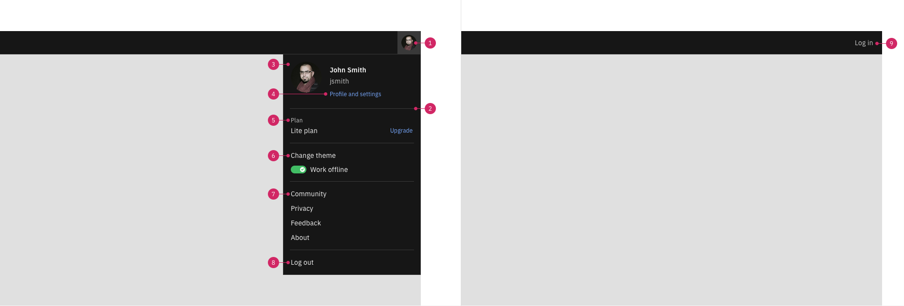

1. **User profile image in the toolbar**: The profile menu uses an icon-size image of the user in the toolbar. If an image of the user is not found, a placeholder thumbnail with the user's initials is used instead.  It is placed in the right most position in the toolbar or, if a 9 dot switcher is used, next to the switcher. When clicked, the profile menu opens. 
2. **Divider**: The profile menu is organized in multiple sections each unified by common content type or theme. The divider delineates the sections. 
3. **User information**: User information includes full name, username and thumbnail picture or placeholder thumbnail with user's initials. 
4. **Profile and settings link**: points to the location (page, dialog or otherwise) where users can view their profile and personal settings. 
5. **Contextual information**: Global contextual information and call to action related to the account or session. (optional) 
6. **Highlighted settings**: Few key or frequently changed global settings can be exposed in the menu. (optional) 
7. **Navigational menu items**. 
8. **Log out**.   
9. **When the user is not logged in**: A log in link is displayed instead of the profile menu.  

### When to use

This pattern can be used with any product that has a global toolbar and users log in to their accounts to access capabilities.    

## The solution

The profile menu pattern supports a variety of menus of increasing complexity. Starting from from short simple menus to longer and more structured ones, the profile menu can accommodate a wide range of content both in terms of type and amount. The pattern aims to maintain a consistent information architecture and hierarchy centered around the end user's profile, account or product in use, and the active session. 

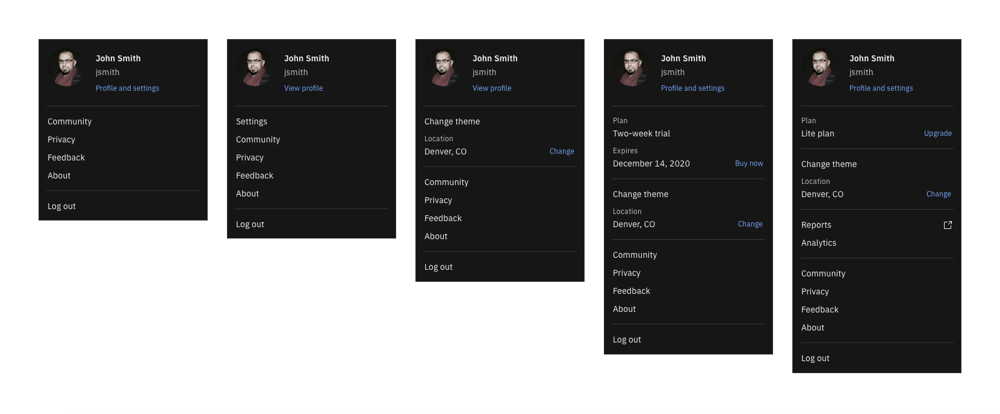

 

#### Layout

The profile menu is made up of multiple sections that should be kept in a particular order. The required order of sections is as follows: 

1. User information section, always appears on top. (_mandatory_) 
2. Contextual information section. (_optional_) 
3. Highlighted end user settings section. (_optional_)  
4. One or more sections for navigational menu items. (_recommended_) 
5. The log out menu item sits in a section of its own at the bottom. (_mandatory_) 

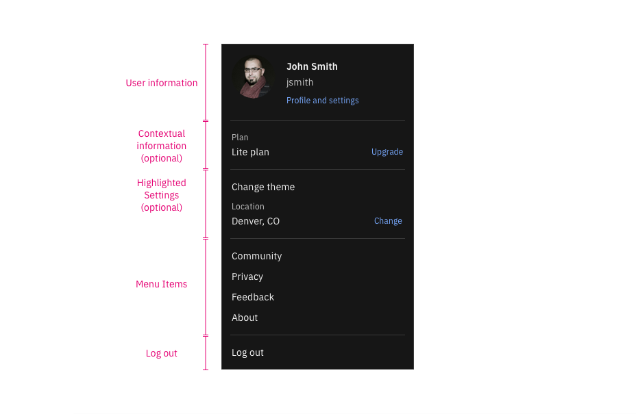

 

**Layout tokens**

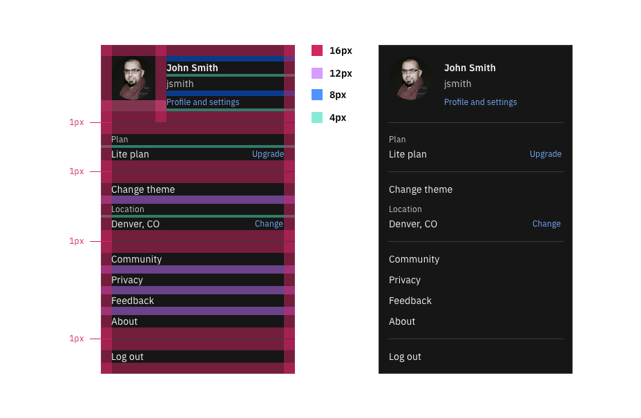

### Behaviors, structure, and functionality

**Menu section details**

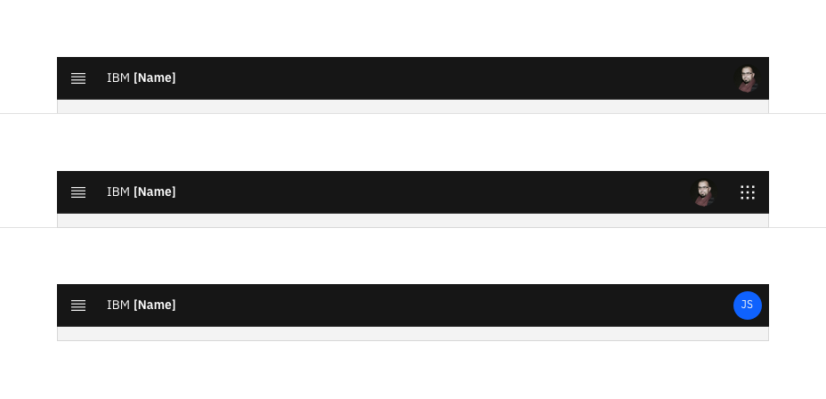

Required
- The icon menu in the toolbar displays the user's profile image.
- It is placed in the right most position among the icon buttons. If a 9 dot switcher is in use, then the profile menu goes next to it. 
- Please refer to the Profile Image pattern on Carbon for more details. 

Variations
- If the user is logged in, but no profile image is available, the toolbar displays a placeholder with the user's initials on it. 
- Please refer to the [Profile image](https://pages.github.ibm.com/cdai-design/pal/patterns/user-profile-images/) pattern on Carbon for more details. 

 

**User information section** (_Required_)

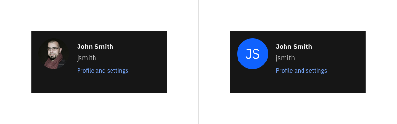

Required
- User's profile image. Please refer to the [Profile image](https://pages.github.ibm.com/cdai-design/pal/patterns/user-profile-images/) pattern for more details. 
- User's full name. 
- User's login ID (username or email). 
- Profile and settings link pointing to the location where the user's profile and settings information are available. 

Variations
- If no user photo is available, the thumbnail displays the user's initials. Please refer to the [Profile image](https://pages.github.ibm.com/cdai-design/pal/patterns/user-profile-images/) pattern for more details. 
- If user profile information and user settings information are not co-located or there are no end user settings, then the Profile and settings link is replaced by a View profile link. 

 

**Contextual information Section** (_Optional_)

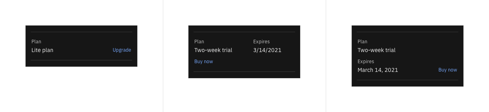

Content

- Only when needed, a contextual information section can be included . 
- The contextual information has to be global in nature and relevant to the user's profile, account or product in use or active session. 
- Call to action links can be used to allow the user to change or modify the context. 

Variations

- Layout of the contextual content can be flexible to accommodate the best way to relay the contextual information to the user. 
- In order not to overwhelm the profile menu, it is best to keep contextual information to a minimum, 1 or 2 items if at all. 

 

**Highlighted settings** (_Optional_)

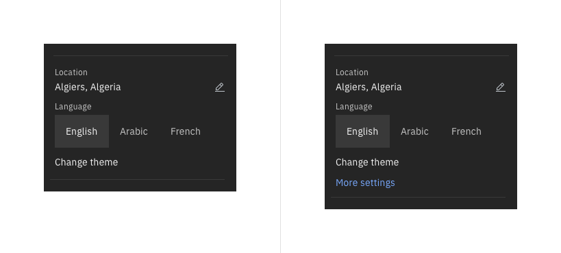
	
Content 

- Only when needed, a handful of key or frequently used global settings can be surfaced in a single section for highlighted settings. 
- These are end user settings, not system settings managed by an administrator. 
- Ideally no more than 3 settings. Other settings should be placed in the dedicated profile and settings area. 

Variations
- If the profile content and the settings content are no co-located, the highlighted settings section (if used) can serve as a way to direct users to the full set of end user settings. 

Required elements
- While which settings are displayed are not required, the following is: 
- If theme switching is displayed, alignment on the approach is required. 
- If settings and user profile are not co-located, the highlighted settings section is used and there are additional end user settings, then the More settings link is required.  

**Menu links** (_Recommended_)

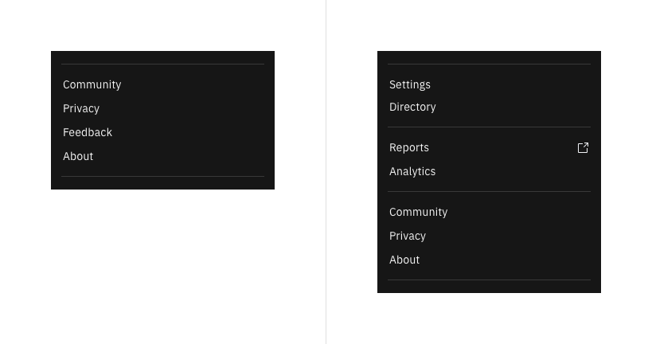

Content
- Individual product teams can determine what content applies to their product. 
- This is a sample of common profile menu items. It is recommended, where possible, to use this order for this content to help consistency across products.  
- Certain content is required. (Please see required elements below). 
	
Variations
- Links can be grouped and organized in multiple sections as need be based on common themes or functionality. 
- Other links may be needed for certain products and can be added. 
- Some of the proposed links may not be needed or available for all products and can be removed. 
- It is recommended to keep the About link towards the bottom of the list just above Log out. 
- If the settings content and the user profile content are not colocated and there is no highlighted settings section to be used to point users to the settings area, then settings should be included as a menu link as shown and placed at the top of the menu links as shown.  
- If some of the menu items lead to content outside of the system, that should be indicated with a punch out icon.

Required elements
- About is required. As far its placement, it is recommended to keep it in the lowest position (just above the Log out section).
- If settings and user profile are not co-located and there is no highlighted settings section to place a link that directs users to the settings, then Settings would be a required element in the menu items. It is required to be at the top of the menu items (closest to where the highlighted settings section would have been). 
- All menu items directing the user outside of the product should be marked with a punch out / launch icon. 
- Do not include any content pertaining to notifications. See notifications pattern. 
- For any content pertaining to user assistance, support or documentation, please follow any respective guidance in these regards (e.g. uptake Assist me and/or Walk me). Also, consider using a dedicated help menu if possible since help content can benefit from direct visibility in the global toolbar instead of being hidden inside the profile menu. 

**Log out**

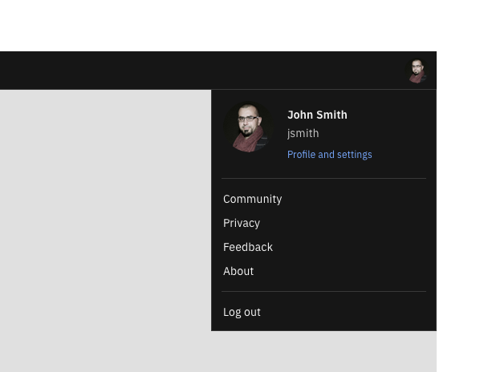
	
Content
- Log out sits in a section of its own. 

Variations
- None 
	
Required elements
- Log out has to be in a section of its own. 
- It has to be the last section at the bottom. 
- The CTA text must read Log out. 

**Log in**

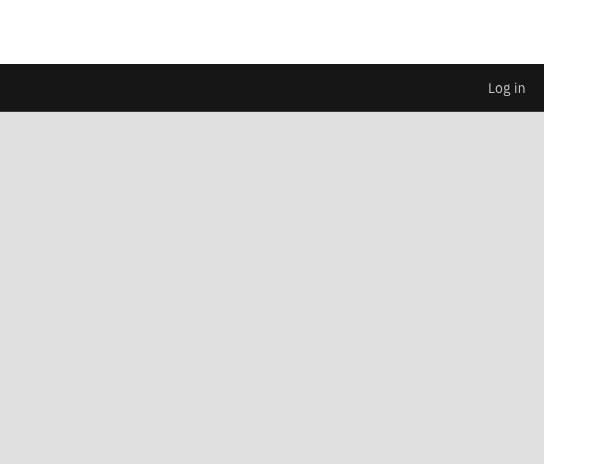

Content 
- When the user is not logged in, the profile menu is replaced by a single Log in link in the global toolbar. 
	
Variations 
- None

Required elements
- If the toolbar is displayed pre-login, a log in link is required in the same location where the profile menu would be post log-in. If there is no toolbar displayed, then login would be available to the user elsewhere as best suits the pre-login design. 

### Best practices

- Ensure all content in the profile menu is global and pertinent regardless of where users are in the product. Do not include content that depends on the context of specific pages or areas of the product. 
- Keep the length of the profile menu balanced and manageable. Try to limit the number of items in the menu to less than 15. 
- Do not use fly-out menus. 
- To display and change highlighted settings, use UI components that allow the user to change a setting with a single click or launch the change flow with a single click. Do not use UI components that require the user to make multiple clicks. 
- If you have many menu items to include, try to organize them in multiple sections based on common themes or functions. Use a divider for delineation. 
- Always indicate menu items that direct users outside of the confines of the product with punch out icons. 

## Related

Components
- [UI shell header](https://www.carbondesignsystem.com/components/UI-shell-header/usage/)

Patterns
- [Global header](https://www.carbondesignsystem.com/patterns/global-header/)

## Feedback

Help us improve this pattern by providing feedback, asking questions, and leaving any other comments on [GitHub](https://github.com/carbon-design-system/carbon-website/issues/new?assignees=&labels=feedback&template=feedback.md)