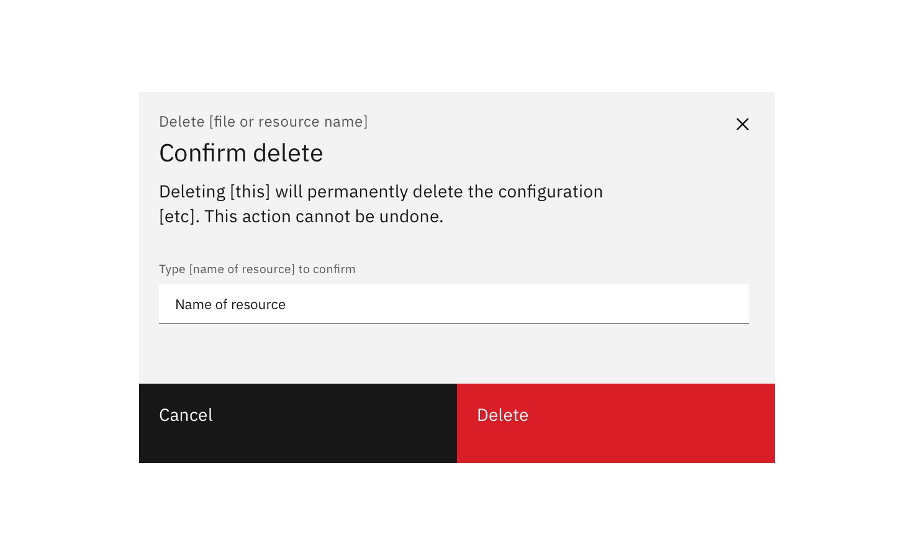
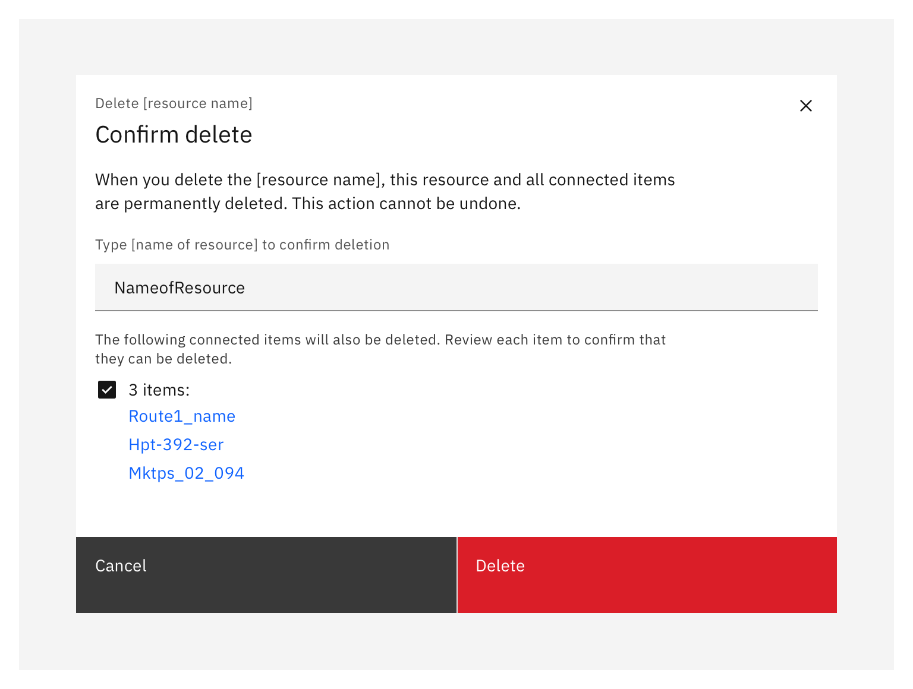
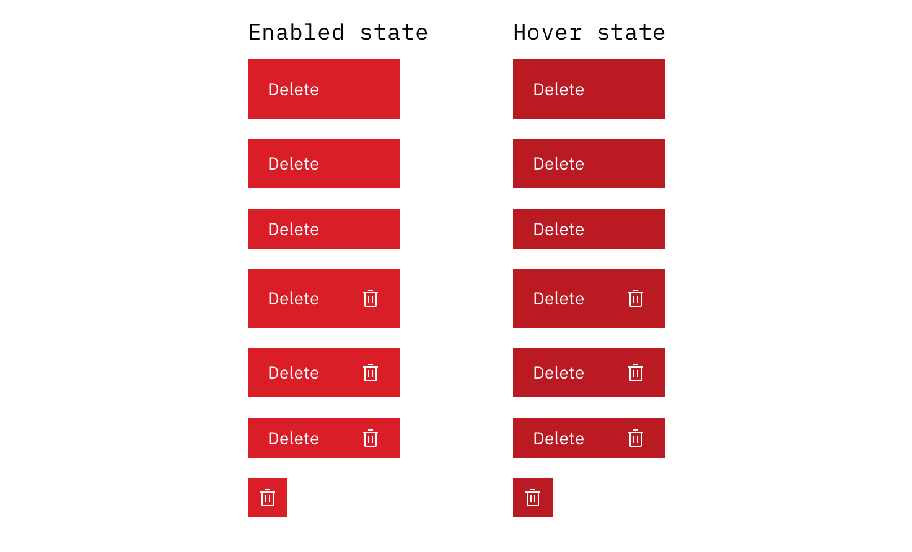
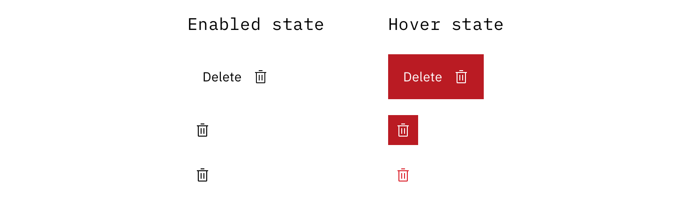
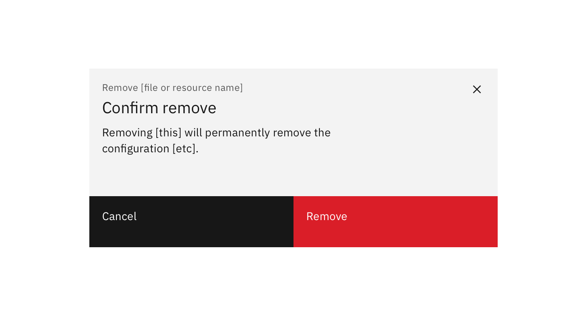
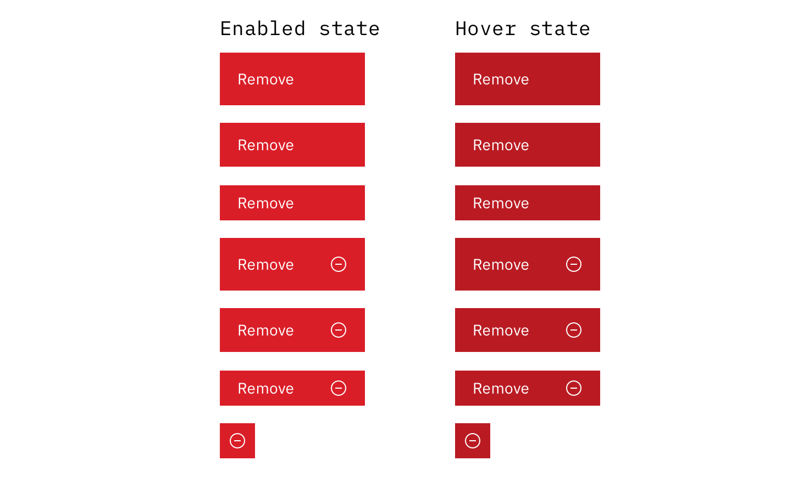
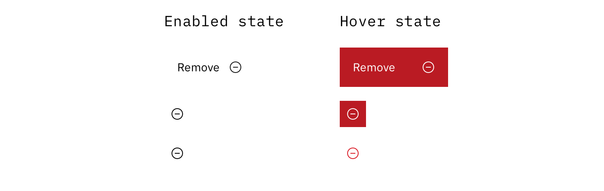
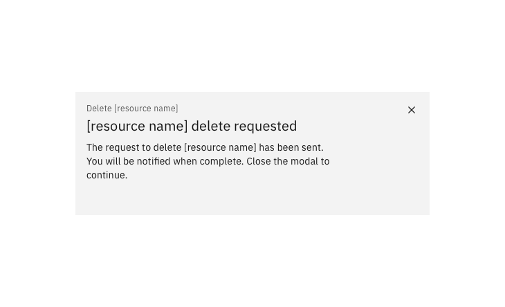
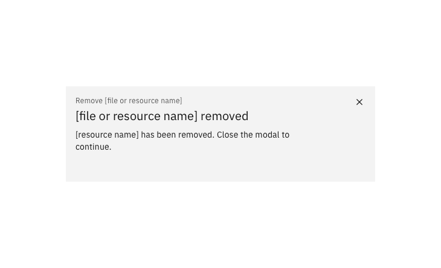
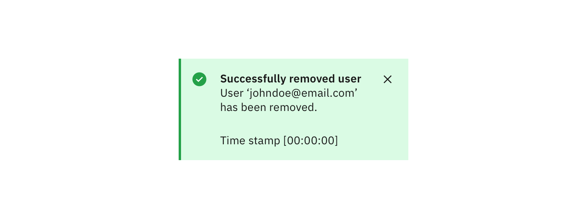

#### Maintainer:

[Vikki Paterson](https://github.com/vikkipaterson)

<PageDescription>

“Removing” is an action that moves information from one location to another.
Removal can be both destructive and non-destructive. “Deletion” is the most
common type of removal and is destructive.

</PageDescription>

<AnchorLinks>

<AnchorLink>High-impact deletion</AnchorLink>
<AnchorLink>Medium-impact deletion</AnchorLink>
<AnchorLink>Low-impact deletion</AnchorLink>
<AnchorLink>Medium-impact removal</AnchorLink>
<AnchorLink>Low-impact removal</AnchorLink>
<AnchorLink>Anatomy</AnchorLink>

</AnchorLinks>

### Delete / Remove variations

| Action | Variation       | Description                                                                                                                |
| ------ | --------------- | -------------------------------------------------------------------------------------------------------------------------- |
| Delete | _High impact_   | Action can't be reversed and causes significant loss. The user types the resource name into the modal to confirm deletion. |
|        | _Medium impact_ | Action can't be reversed and causes some loss. The user sees a modal and confirms the consequence of deletion.             |
|        | _Low impact_    | Action is reversible or very low impact. A confirmation modal may not be required.                                         |
| Remove | _Medium impact_ | Action can't be reversed and causes some loss. The user sees a modal and confirms the consequence of removal.              |
|        | _Low impact_    | Action is reversible or very low impact. A confirmation modal may not be required.                                         |

## High-impact deletion

A high-impact deletion cannot be reversed. The action would result in a
significant loss for a user if done accidentally.

When deleting is high-impact, a confirmation dialog should be presented to the
user which displays:

- The name of the resource
- Consequences of the deletion
- This action cannot be undone.
- An editable text field for the name of the resource to be entered

For high-impact scenarios, a user should confirm the action by manually entering
the name of the resource. The 'Delete' button is enabled when the text entered
perfectly matches the resource name.

Optionally a [Done modal](#done-modal), [Requested modal](#requested-modal) or
[Notification](#notification) can be used to confirm the action (or a
combination of one modal and a notification).

<Row>
<Column colLg={8}>

<Caption>
  {' '}
  The user needs to enter the resource name in order to confirm deletion.
</Caption>

<Caption>
  {' '}
  When the resource name is entered the Delete button is enabled.
</Caption>

</Column>
</Row>

### Deletion with connected items
When deleting a resource that has connected items, users will enter the name of the resource in the text field and use the checkbox to confirm the deletion the all it's connected items. 

What should be in the modal:
- The name of the resource and items
- The consequences of the deletion
- The phrase, "this action cannot be undone"
- An editable text field for the name of the resource to be entered
- A checkbox to confirm the deletion of connected resources

<Row>
<Column colLg={8}>

</Column>
</Row>

### Manual deletion of connected items
When there is a resource that has connected items that need to be deleted first, a passive modal should appear stating that the user needs to first manage the connected items before being able to delete this main resource. Once the items are deleted, the user can then delete this main resource via a standard [high impact modal](http://localhost:8000/components/catalog-tile/usage/#high-impact-deletion). 

What should be in the modal:
- State that the main resource cannot be deleted
- The name of the items that are connected to the main resource that are hindering it's deletion

<Row>
<Column colLg={8}>

</Column>
</Row>

### Batch deletion 
Friction can also be added to batch deletion. A list of the items selected will be provided to the user. Once they have reviewed that list - they will select the check box and the delete button will be activated.

If the user selects more than 10 items, the modal no longer needs to display the item names. It should just provide the number of items that cannot be deleted from the selection.

Note - if the user selects an item that cannot be deleted, there should be a short description notifying them inside the modal.

What should be in the modal:
- The name of the items selected
- The consequences of the deletion
- The phrase, "this action cannot be undone"
- A checkbox to confirm the deletion of the selected resources
- A note of items that cannot be deleted in batch selection (optional)

<Row>
<Column colLg={8}>

.png)

</Column>
</Row>

<Row>
<Column colLg={8}>

.png)

</Column>
</Row>

## Do's & Don'ts

** Do's **
- Always include the name of the resource, consequences of the deletion, the phrase, "this action cannot be undone", and an editable text field for the name of the resource to be entered.
- Do use a checkbox when referencing the deletion of multiple related items.
- Do list the items that cannot be deleted in batch selection.

** Don'ts **
- Do not replace mandatory modal content with a warning notification.
- Do not use a checkbox to replace the editable text field for the name of the resource to be entered.
- Do not alter the way the checkbox is shown in the modal.

## Medium-impact deletion

A medium-impact deletion is one that cannot be reversed, but would not be
catastrophic if done accidentally. When deleting is medium-impact, a
confirmation dialog should be presented to the user which displays:

- The name of the resource
- Consequences of the deletion
- The action cannot be undone.

Optionally an [Optional passive modal](#optional-passive-modal) or
[Notification](#notification) can be used to confirm the action (or a
combination of one modal and a notification).

<Row>
<Column colLg={8}>

<Caption>An example of a standard delete modal</Caption>

</Column>
</Row>

## Low-impact deletion

Requiring the user to confirm deletion is generally recommended. However, in low
impact situations, or when an ‘undo’ option is available, user confirmation may
not be required.

<Row>
<Column colLg={8}>

<Caption> Low impact delete options</Caption>
</Column>
</Row>

<Row>
<Column colLg={8}>

<Caption>Low impact delete options requiring overrides to Carbon</Caption>
</Column>
</Row>

## Medium-impact removal

Removing has a medium impact when the action can't be reversed, and could have
some impact if done accidentally.

Text should tell the user the consequences of the removal and that the action
cannot be undone.

<Row>
<Column colLg={8}>

<Caption>
  {' '}
  Removal modals should include consequences of removal, and "This action cannot
  be undone" statement.
</Caption>

</Column>
</Row>

## Low-impact removal

As removing does not destroy an asset, typically user confirmation is not
required.

<Row>
<Column colLg={8}>

<Caption> Example low impact remove options</Caption>

</Column>
</Row>

<Row>
<Column colLg={8}>

<Caption>Low impact remove options requiring overrides to Carbon.</Caption>

</Column>
</Row>

## Anatomy

### Optional passive modal

In high or medium impact flows, an optional passive modal can be used to signify
the state at the end of a remove or delete action. Some deletion or removal
actions don't happen immediately, in these situations it's recommended to inform
the user through the optional passive modal.

<Row>
<Column colLg={8}>

<Caption>
  {' '}
  Use a success modal to show that a delete request has been made / is in
  progress.
</Caption>

<Caption> Use a success modal to show that removing is complete.</Caption>

</Column>
</Row>

### Notification

An optional notification can be used to confirm a delete or remove action has
completed. This is useful when the action takes more than a few moments.

<Row>
<Column colLg={8}>

<Caption>
  {' '}
  An optional notification can be used to confirm the delete or remove action
  with medium or high impact actions.
</Caption>

</Column>
</Row>

