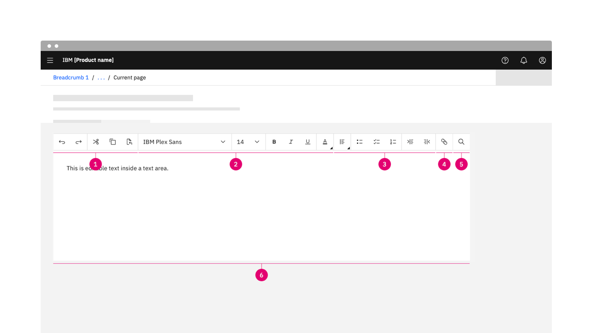

<PageDescription>

A toolbar is a collection of action items that organizes a program's interaction patterns into a series of closely related commands.

</PageDescription>

<AnchorLinks>
  <AnchorLink>Overview</AnchorLink>
  <AnchorLink>Anatomy</AnchorLink>
  <AnchorLink>Interactions</AnchorLink>
  <AnchorLink>Behaviors</AnchorLink>
  <AnchorLink>Accessibility</AnchorLink>
  <AnchorLink>Related</AnchorLink>
  <AnchorLink>References</AnchorLink>
  <AnchorLink>Feedback</AnchorLink>
</AnchorLinks>

## Overview

A toolbar serves as an always-available, easy-to-use interface for performing common functions. It contains a set of icons or buttons that are part of a product interface or an open window. 

A toolbar is a command bar that organizes a program's functions into a series of tabs at the top of a window. It increases the discoverability of features and functions, enables quicker learning of the program as a whole, and makes users feel more in control of their experience with the product. 

A toolbar can be customized by adding or removing icon buttons based on specific user needs. This pattern illustrates the following options.

## Anatomy

Each _**Toolbar**_ is built out with content blocks of elements related to their individual product or offering. All elements are optional and the layout can vary depending on the information that the product toolbar requires. _**Choose a suitable toolbar style based on the number of commands and their usage**_. Avoid using a toolbar configuration that takes too much space from the program work area.

### Docked toolbar

A **toolbar** that is attached to one edge of the program window. This option allows you to have access to the content on the canvas without having to minimize or move elements around and out of the way. You can have your canvas completely clean. 

1. **Application actions** (optional): Commands that involve doing something to or with a file. Typical examples would include, but are not limited to, create, open, save, save as, print, share and send.
2. **Canvas and navigation tools** (optional): Commands that affect the page layout, page backgrounds, spacing, and positioning.
3. **Object type formatting** (optional): Commands related to formatting, and applying styles to the selected object type.
4. **Transformation tools** (optional): Commands related to the transformation of the selected object type.
5. **Text formatting** (optional): Commands that provide users with the ability to edit text.
6. **Panels** (optional): Commands that trigger a side panel. These items can be designed with either the [Ghost buttons or Icon buttons](https://www.carbondesignsystem.com/components/button/usage) and should always be aligned to the right of your canvas. 

### Floating toolbar

A toolbar that is floating on your canvas. Users can move the toolbar around to any location. 

1. **Toolbar placement**: Allows users to drag the toolbar around as they please.
2. **Object type formatting** (optional): Commands that affect the page layout, page backgrounds, spacing, and positioning.
3. **Display details** (optional): Commands that show/hide panels and display additional content 
4. **Transformation tools** (optional): Commands related to the transformation of the selected object type.
5. **Canvas and navigation tools** (optional): Commands that provide users with the ability to edit text.

### Text toolbar

A toolbar that is connected to a container. It is built with a set of buttons and menus that allow users to edit text, search keywords, attach files, and embed links.

1. **Actions**: Use “Undo” and “Redo” to undo or revert the last change made. Use “Cut”, “Copy”, and “Paste” to move pieces of text to another place within the text area, to copy text to the clipboard, or to paste copied text from the clipboard to a different place within the text area.
2. **Formatting**: Change the typeface, size, style, and color of text.
3. **Paragraph**: Select different alignments and indents for paragraph text and indicate bulleted, checked, or numbered lists.
4. **Attachment**: Attach files or embed links in strings of text.
5. **Search**: Search keywords within existing paragraphs of text.
6. **Text area**: Designated area to type editable text.

### Container toolbar

A toolbar that is connected to a container. It is built with a set of buttons and menus that allow users to edit the content inside that container.

1. **Canvas and navigation tools** (optional): Commands that affect the page layout, page backgrounds, spacing, and positioning.
2. **Object type formatting** (optional): Commands related to formatting, and applying styles to the selected object type.
3. **Transformation tools** (optional): Commands related to the transformation of the selected object type.

 

### Organization and order

- Organize the commands within a toolbar into related groups. Having common commands & actions as groups in proximity to each other greatly improves discoverability and efficiency for users
- Place the most frequently used groups first. Within a group, put the commands in their logical order. Overall, the commands should have a logical flow to make them easy to find, while still having the most frequently used action appear first. Doing so is most efficient, especially if there is overflow.
- Use group dividers to help guide users. Doing so makes the groupings obvious and the commands easier to find.
- Avoid placing destructive actions next to frequently used actions. Use either order or grouping to get separation. 
- Use the overflow menu to indicate that not all commands can be displayed. The overflow menu should only be used when there isn't sufficient room to display all the actions.
- Make sure that the most frequently used actions are directly accessible from the toolbar and not hidden in the overflow menu when you have room.  If necessary, reorder the actions, move less frequently used actions, or even remove them completely from the toolbar. 

 

**When to use**

✅ Do 
- Place common actions in proximity to each other
- Place the most commonly used groups in the most prominent locations, and make sure there is a logical order for the groups
- Use separators to indicate strongly related commands, such as a set of mutually exclusive options.
- Optimize the group design so that users find commands quickly and confidently. All other considerations are secondary.
- When appropriate, move frequently used commands from dialog boxes to the ribbon, especially those that are known to be hard to find. Ideally, users should be able to perform common tasks without using any dialog boxes.
- Avoid multiple paths to the same command especially if the command requires many clicks to invoke

**When not to use**

🚫 Don't
- Don't over-organize by adding groups where they aren't needed.
- Don't scale groups containing a single button to a pop-up group icon. When scaling down, leave them as a single button.
- Don't use the scalability of toolbars to justify adding unnecessary complexity. Continue to exercise restraint don't add commands to a toolbar just because you can. Keep the overall command experience simple. 
- Don't stack action items inside the toolbar when space is limited. When space is limited, use the overflow menu.

 

## Toolbar usage

Using a toolbar should make a product feel simpler, more efficient, and easier to use never the opposite. They have the most value when used to present immediate, results-oriented commands. Results-oriented commands make things easier to understand and users much more efficient and productive. 

Don't take for granted that using a toolbar automatically makes your product better. Make the commands discoverable. Choose a design that has a clear, obvious, unique mapping between your commands. Users should be able to determine quickly and confidently which grouping has the command they are looking for and rarely choose the wrong group. 

Make the commands self-explanatory. Users should understand the effect of a command from its label, icon, tooltip, and preview. They shouldn't have to experiment or read a Help topic to see how a command works. 

## Behaviors

Prefer immediate commands. A command is immediate if it takes effect immediately (that is, without dialog boxes to gather additional input). If a command might require input, consider using a split button, with the immediate command in the button portion, and the commands that require input in the submenu.

**Recommended sizing and spacing**

- The recommended toolbar height is 40 pixels and utilizes the field size icon button. 
- A 1 pixel divider is used to separate different groupings inside your toolbar. 
- Light theme: `#E0E0E0` 
- Dark theme: `#393939`

### States

The text toolbar includes a series of basic actions that adopt the [icon button](https://www.carbondesignsystem.com/components/button/usage) style. The action buttons typically have five different states—enabled, hover, focus, active, and disabled.

 

A _**chevron menu**_ is used for typeface and type size menus and adopts the [dropdown](https://www.carbondesignsystem.com/components/dropdown/usage/#dropdown) style. The user can easily choose any typeface and type size to customize their text.

 

The _**caret**_ is used  to indicate that a menu will display different options to choose from.  Prefer immediate commands. A command is immediate if it takes effect immediately (that is, without dialog boxes to gather additional input). If a command might require input, consider using a caret, with the immediate command in the button portion, and the commands that require input in the submenu.

 

### Responsiveness

Make sure the toolbar scales well from the largest window sizes to the smallest. The toolbar flexes in size to adapt to different breakpoints—max, xlg, lg, md, and sm. As the window width decreases, commands will move from the top level into the overflow well.

 

| Breadkpoints        |      Use case      |
| ------------- | ----------- |
| max, xlg      | Displays all controls and functionality in one row with the option to make the search field longer or shorter | \$1600 |
| lg      |   The search field is truncated into a button or use an overflow menu to display collapsed controls    |
| md |   Compresses the full text toolbar into two rows    |
| sm |   A more compact version of “md” with collapsed controls in an overflow menu    |

### Overflow

Choose a suitable toolbar style based on the number of commands and their usage. The toolbar is not capped with a set number of action items however, you should avoid configurations that take too much space away from users. The overflow menu is used to display a list of multiple controls when horizontal space for the toolbar becomes restricted or when it is adapting to breakpoints. 

In some cases, you may not be able to fit all of your commands into a single row and will need to be able to render some of the less frequently used commands in an “overflow menu”. As the window width decreases, commands will move from the top level into the overflow well.

## Accessibility

The left and right Arrow keys are used to navigate through each toolbar item, when the desired item is in focus, hitting the Enter or Space key will activate the action (ex. opening a dropdown, opening more options if the icon has a corner caret, opening a panel, opening a flyout, triggering an action). The Tab key will move the focus out of the toolbar and to the next sequential item in the DOM. The ESC key will close any flyouts/panels/modals/dropdowns that were activated from the toolbar. 

#### Tooltip

Buttons that complete an action upon click receive tooltips on hover and focus. 

### Keyboard

Tab and Shift + Tab move focus in and out of the toolbar.

**When focus moves into a toolbar**:
If focus is moving into the toolbar for the first time, the focus is set on the first control that is not disabled.
If the toolbar has previously contained focus, focus is optionally set on the control that last had focus. Otherwise, it is set on the first control that is not disabled.

**Horizontal toolbars**:
The Left Arrow moves focus to the previous control.
The Right Arrow moves focus to the next control.

**Menus**:
The Up Arrow and Down Arrow navigate to different options within a menu.
Open and close a menu by pressing Enter.

### Screen readers

When a set of controls is visually presented as a group, the toolbar role can be used to communicate the presence and purpose of the grouping to screen reader users. Grouping controls into toolbars can also be an effective way of reducing the number of tab stops in the keyboard interface.

For further accessibility guidance of text toolbars, see [WAI-ARIAs guidelines](https://www.w3.org/TR/wai-aria-practices/examples/toolbar/toolbar.html)

## Related

**Text toolbar versus Dashboard toolbar**

A text toolbar is a set of buttons and menus that primarily allow text editing functionalities while a Dashboard toolbar is composed of buttons and actions users can take while using your product or service.

- [Button](https://www.carbondesignsystem.com/components/button/usage)
- [Dropdown](https://www.carbondesignsystem.com/components/dropdown/usage#dropdown)
- [File uploader](https://www.carbondesignsystem.com/components/file-uploader/usage)
- [Overflow menu](https://www.carbondesignsystem.com/components/overflow-menu/usage)
- [Search](https://www.carbondesignsystem.com/components/search/usage)
- [Text area](https://www.carbondesignsystem.com/components/text-input/usage#character-count)

## References

- 3.23 Toolbar, [W3C WAI-ARIA Authoring Practices](https://www.w3.org/TR/wai-aria-practices/#toolbar) (W3C Working Group Note, 2019)
- Toolbar Example, [W3C WAI-ARIA design pattern](https://www.w3.org/TR/wai-aria-practices/examples/toolbar/toolbar.html) (W3C Working Group Note, 2019)

## Feedback

Help us improve this pattern by providing feedback, asking questions, and leaving any other comments on [GitHub](https://github.com/carbon-design-system/carbon-website/issues/new?assignees=&labels=feedback&template=feedback.md)
