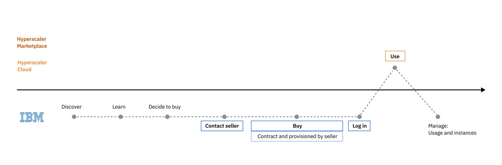
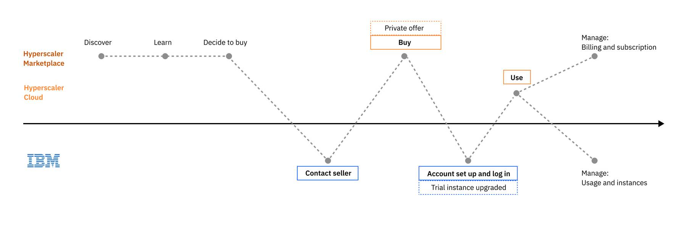

import { Breadcrumb, BreadcrumbItem } from "carbon-components-react";
import { Link } from "gatsby";

<PageDescription>

Users can find IBM products in multiple marketplaces. It's important to be familiar with the user journeys for each route to market and the listing page best practices for the marketplace which your product is listed.
</PageDescription>

<AnchorLinks>
  <AnchorLink> Overview </AnchorLink>
  <AnchorLink> Try and buy through IBM </AnchorLink>
  <AnchorLink> Try and buy through AWS Marketplace </AnchorLink>
  <AnchorLink> Custom offers through IBM Sales </AnchorLink>
  <AnchorLink> Marketplace best practices </AnchorLink>
</AnchorLinks>

## Overview

There are different paths a user may take depending on how and where they want to try and buy IBM SaaS products that run on a hyperscaler cloud. The following are the typical scenarios when transacting through the different cloud providers.

<Row>
  <Column colMd={8} colLg={10}>

  </Column>
</Row>

## Try and buy through IBM 

This scenario starts in IBM.com, where a user can discover, learn, try an IBM's SaaS product that is hosted on a hyperscaler of the user's choice. The user then completes the transaction by subscribing to the product through IBM.

### Try through IBM.com and buy from hyperscaler

<Row>
  <Column colMd={8} colLg={10}>

  </Column>
</Row>

Although there are a few different channels at IBM where a user can find and explore our product offerings, the **typical journey starts from the product marketing page on IBM.com**. The user learns about the product features and the SaaS offering availability on the hyperscaler cloud providers, and registers for the **trial that is provisioned on a selected hyperscaler, like AWS or Azure**.

When they are ready to buy, the user can purchase a paid subscription through the hyperscaler Marketplace. Once the transaction is complete, a button is provided to the user to setup the account (IBM account). The system will recognize the presence of the trial instance and upgrade the instance automatically if the user signs in with the same IBMid as the one used for setting up the trial.

When the user is ready to buy, they can also work with an IBM seller to get a custom offer that better meets their needs. See [Custom offer via IBM Sales](https://pages.github.ibm.com/cdai-design/pal/saas-for-hyperscalers/user-scenarios/private-offer) for details.

<CardGroup>
  <MiniCard
    title="Click through prototype"
    href="https://www.figma.com/proto/SlZ7TK2mTzNLIHZB2dGXRF/MCSP-Onboarding-Design-Guide?page-id=163%3A351403&node-id=2204-478778&viewport=666%2C536%2C0.5&scaling=scale-down&starting-point-node-id=2204%3A478778&show-proto-sidebar=1"
    actionIcon="launch"
  ></MiniCard>
  <MiniCard
    title="Figma design template"
    href="https://www.figma.com/file/SlZ7TK2mTzNLIHZB2dGXRF/MCSP-Onboarding-Design-Guide?node-id=2204%3A478778&t=HclJNZcaoXiK9HbK-1"
    actionIcon="launch"
  ></MiniCard>
</CardGroup>{" "}

### Try and buy through IBM Cloud

<Row>
  <Column colMd={8} colLg={10}>

  </Column>
</Row>

A user can discover and learn about our SaaS product offering through **IBM Cloud catalog**. When the user is ready to try the product, the user will be required to **create an IBM Cloud account** with a payment method. The user can choose to provision the product on IBM Cloud or another hyperscaler supported. When The user will be able to upgrade the trial to a paid plan through IBM Cloud.

<CardGroup>
  <MiniCard
    title="Click through prototype"
    href="https://www.figma.com/proto/SlZ7TK2mTzNLIHZB2dGXRF/MCSP-Onboarding-Design-Guide?page-id=91%3A346985&node-id=828-578536&viewport=-629%2C189%2C1&scaling=scale-down&starting-point-node-id=828%3A578536"
    actionIcon="launch"
  ></MiniCard>
  <MiniCard
    title="Figma design template"
    href="https://www.figma.com/file/SlZ7TK2mTzNLIHZB2dGXRF/MCSP-Onboarding-Design-Guide?node-id=828%3A578536&t=HclJNZcaoXiK9HbK-1"
    actionIcon="launch"
  ></MiniCard>
</CardGroup>

## Try and buy through AWS Marketplace

This scenario starts in the AWS marketplace, where a user can discover, learn, and try an IBM's SaaS offering, and ends in the AWS marketplace to complete the transaction of subscribing to an IBM’s SaaS product.

### Try and buy with public offer on AWS

<Row>
  <Column colMd={8} colLg={10}>

  </Column>
</Row>

The product details page on the AWS Marketplace includes a ** Try for free ** button. When the user clicks the button, they need to log in to their AWS account and complete the trial subscription process on AWS. At the end of the process, a button is provided to the user to register for an IBMid. Once an IBMid is created, a trial instance can be set up and provisioned. The user can upgrade their trial to a paid plan of the IBM service through the AWS Marketplace when they are ready to buy.

Once the transaction is complete, a button is provided to the user to setup the account (IBM account). The user will be directed to the same IBM landing page to create or sign in with an IBMid. The system will ** recognize the presence of the trial instance belonging to the AWS upgraded subscription ** and upgrade the instance automatically. Users can then continue to use the service with the same instance. Customers will manage their subscription and billing in the AWS portal and their product usage and instances in the IBM SaaS Console.

Alternately, the user may have signed up for a SaaS trial through IBM.com instead of from the AWS Marketplace. When the user purchases the SaaS subscription on AWS Marketplace, the system will recognize the presence of the trial instance and upgrade the instance automatically if the user signs in with the same IBMid as the one used for setting up the trial.
See [E2E User journey - IBM](https://pages.github.ibm.com/cdai-design/pal/saas-for-hyperscalers/user-scenarios/transact-upgrade-ibm) for details

<CardGroup>
  <MiniCard
    title="Click through prototype"
    href="https://www.figma.com/proto/SlZ7TK2mTzNLIHZB2dGXRF/MCSP-Onboarding-Design-Guide?page-id=163%3A351403&node-id=232-360185&viewport=666%2C536%2C0.5&scaling=scale-down&starting-point-node-id=232%3A360185&show-proto-sidebar=1"
    actionIcon="launch"
  ></MiniCard>
  <MiniCard
    title="Figma design template"
    href="https://www.figma.com/file/SlZ7TK2mTzNLIHZB2dGXRF/MCSP-Discover%2C-Learn%2C-Try%2C-Buy-flows?node-id=1898%3A423455&t=0b6q9436Ua6pJgGw-1"
    actionIcon="launch"
  ></MiniCard>
</CardGroup>

#### References

- <a
    target="_blank"
    href="https://docs.aws.amazon.com/marketplace/latest/buyerguide/buyer-saas-products.html"
  >
    AWS Marketplace: SaaS Products
  </a>
- <a
    target="_blank"
    href="https://docs.aws.amazon.com/marketplace/latest/buyerguide/buyer-private-offers-subscribing-saas-private-offer.html"
  >
    AWS Marketplace: Subscribing to a SaaS private offer
  </a>

## Custom offers through IBM Sales

When the user has gain enough understanding of the product and is ready to buy, they can ** work with an IBM seller to get a custom offer ** that better meets their needs.

When the user is ready to buy, instead of subscribing to the public plans offered on the marketplace, they can initiate a direct sales conversation with the IBM seller using the "Contact sales" link provided on the product listing page or under the trial countdown menu in the product. The user fills out a form. They will then be contacted by our seller to discuss their needs and negotiate the custom plan that works best for them.

### Direct sales from IBM

After the seller creates the contract and completed the needed registration/subscription steps for the user directly in SSM, the user will receive an email with the link and instruction to access the product or to create their instance. Note: users either already have a sales representative working with them or should be able to find a link on the product page to contact a sales representative.

<Row>
  <Column colMd={8} colLg={10}>

  </Column>
</Row>

### Private offer from a hyperscaler marketplace

Alternatively, the seller can create a private offer in AWS or Azure marketplace and make it visible to the user's account. The user will received an email with link to access the private offer on the specific marketplace where they can review and accept the offer.

Once they have completed the subscription transaction, the user will be directed to the IBM landing page where they are asked to create or sign in with an IBMid. The user will be asked to enter the private offer code, which they have received from the seller in an email. When the account setup process is complete, a new instance of the product will be provisioned and the user can start using the product.

<Row>
  <Column colMd={8} colLg={10}>

  </Column>
</Row>

#### References

- [Contact sales form example](https://www.ibm.com/account/reg/us-en/signup?formid=MAIL-cloud&source=ace-aws)

## Marketplace best practices

It’s critical to make sure our offerings are discoverable, recognizable and stand out amongst others in the marketplace search results.

People need to evaluate if our IBM products are right for them. To meet their needs and increase our engagement and competitive perception, we seek to clearly articulate the value of our products and services. We can inspire confidence that only IBM is uniquely positioned to fulfill their needs over the competition.

To increase our competitiveness and help potential customers accurately evaluate our solutions against their needs and use cases, provide the following in your product listing:

- Clearly explained functions & features
- Highlight our differentiators
- Subscription options and clear pricing information
- Free trial availability
- Clear business use case(s)
- Demo (click through)
- Enable to connect with technical sales or support
- Testimonials and positive user reviews (Encourage customer to provide reviews/feedback on AWS)

Review relevant listing page patterns for the marketplace(s) which your product lives. 

<Row className="image-card-group">

<Column colMd={3} colLg={3} noGutterSm>

<ImageCard 
sub-title="AWS Marketplace listing page" 
sub-titleColor="dark" 
hoverColor="dark"
href="/patterns/try-and-buy-routes-to-market/aws-marketplace-listing-page">

</ImageCard>

</Column>

<Column colMd={3} colLg={3} noGutterSm>

<ImageCard disabled aspectRatio="1:1" subTitle="IBM Marketplace listing page- coming soon">

</ImageCard>

</Column>

<Column colMd={3} colLg={3} noGutterSm>

<ImageCard disabled aspectRatio="1:1" subTitle="IBM Cloud Catalog listing page- coming soon">

</ImageCard>

</Column>

</Row>

