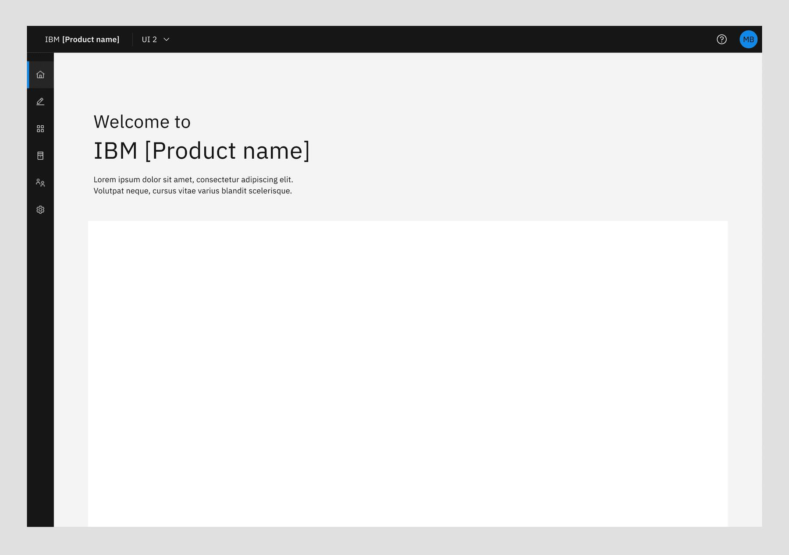
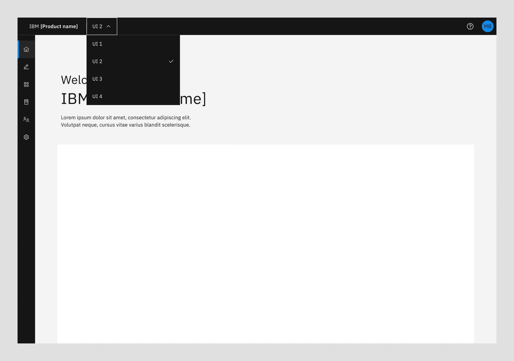
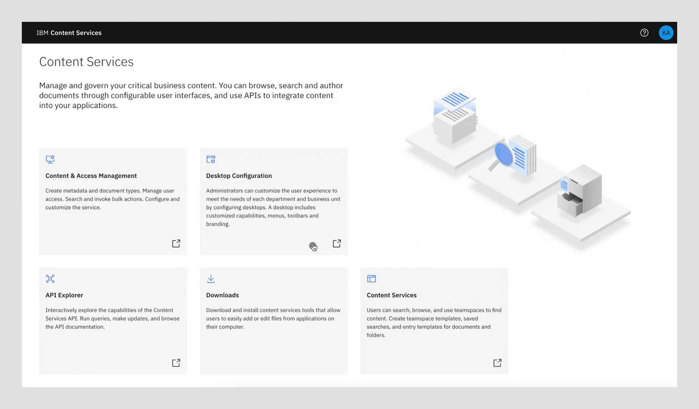

import { Breadcrumb, BreadcrumbItem } from "carbon-components-react";
import { Link } from "gatsby";

<PageDescription>

UI navigation allows a user to easily navigate multiple UIs within a product if it has more than one distinct UI in their offering. 
</PageDescription>

<AnchorLinks>
    <AnchorLink> Overview </AnchorLink>
    <AnchorLink> Products that have a single UI </AnchorLink>
    <AnchorLink> Products that require multiple UIs </AnchorLink>
    <AnchorLink> Default entry UI </AnchorLink>
    <AnchorLink> Product home and landing page </AnchorLink>
</AnchorLinks>

## Overview 

Products should provide **one URL** which takes users to the main landing page of your offering, i.e. the main UI for your offering.

While we encourage offerings to converge access to their offering capabilities into a single UI experience, it is understandable that existing products onboarding to MCSP may have more than one distinct UI driving their experiences, for several reasons.

In the case when a product has multiple UIs, the product should provide the link to the default UI or a product landing page, from which the user can navigate to the UI of their choice. The design of the contents of the landing page itself is **not mandated by MCSP** but should help the user in navigating amongst the offered capabilities.

That said, based on the number of UIs an offering has, MCSP has provided the following guidance to promote a minimum level of navigational consistency for the users.

## Products that have a single UI

- The URL goes to the product’s landing page
- The UI needs to adopt the standard Global header where the product title provides the main context

## Products that require multiple UIs

### Default entry UI

- The URL goes to the product’s chosen main UI, thus that UI’s landing page content
- Product adopts the global header with the UI switcher. The product title is the main context while the UI switcher widget in the global header sets and provides context of the current UI
- This UI switcher widget allows users to switch amongst the available UIs
- Switching UIs maintains Product and UI context in the Global header and only the view is updated

### Product home and landing page

- The URL goes to a product landing page that represents the main entry point to the product experience and provides ways to navigate to any of the available product UIs
- This landing page adopts the standard Global header, with the product title in the header
- The user navigates to the desired UI through the navigational means provided on this landing page, e.g. tiles
- Breadcrumbs shown in the format of "Homepage / [UI Name]" provides context to the user. It also allows user easily navigate back to the product landing page
- The standard global header with the product title provides the overall context of the product, and it should be displayed all the time in all UIs

 

<CardGroup>
  <MiniCard
    title="Figma template"
    href="https://www.figma.com/file/SlZ7TK2mTzNLIHZB2dGXRF/MCSP-Onboarding-Design-Guide?node-id=2462%3A704594&t=jUV3FLbX6twMmqBh-1"
    actionIcon="launch"
  ></MiniCard>
  <MiniCard
    title="Storybook"
    href="https://pages.github.ibm.com/automation-saas/automation-common-header/?path=/story/automation-header--with-account-switcher"
    actionIcon="launch"
  ></MiniCard>
</CardGroup>{" "}
