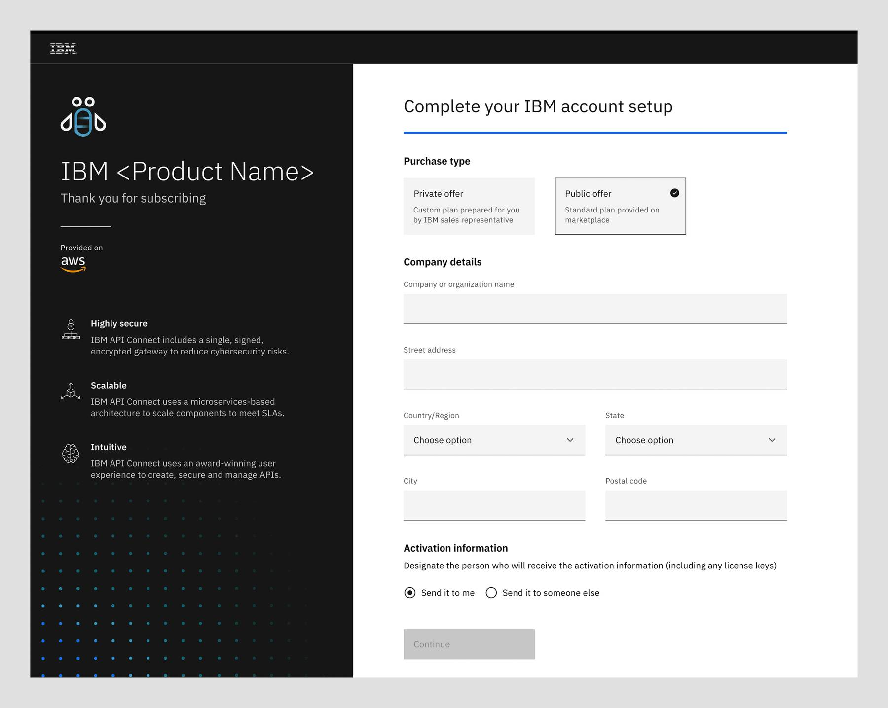

← [Back to Upgrade and purchase patterns overview](/patterns/upgrade-purchase/overview)

<PageDescription>

When a user is ready to buy or upgrade, an easy transition from a Try offer to paid with efficiency and transparency can help cultivate trust between our customers and IBM.

</PageDescription>

<AnchorLinks>
  <AnchorLink>Public vs private offer</AnchorLink>
  <AnchorLink>Subscription and provision</AnchorLink>
  <AnchorLink>Related</AnchorLink>
  <AnchorLink>Design resources</AnchorLink>
  <AnchorLink>References</AnchorLink>
</AnchorLinks>

## Public vs private offer

The user can initiate the subscription process from our product listing in the marketplaces or from within the Try offer.

<Row>
  <Column colMd={8} colLg={10}>

<Caption>
  Trial countdown offers a quick way to initiate the purchasing actions
</Caption>

  </Column>
</Row>

### Public offer

The ** Buy ** button in the trial countdown takes the user to the hyperscaler marketplace according to where the Try offer is originated. For example, if the Try offer is originated from AWS Marketplace, the user will be taken to the product listing page on AWS Marketplace. One or more subscription options are available in the marketplace listing. These options are generally available to anyone who is interested in subscribing to the product. The terms and conditions that come with these options are also standard to everyone who chooses to subscribe.

See prototype: <a target="_blank" href="https://www.figma.com/proto/AdslrSd7PwrntFZehRcTjb/SaaS-for-Hyperscalers-Design-Templates?node-id=232%3A360856&scaling=min-zoom&page-id=163%3A351403&starting-point-node-id=232%3A360856&show-proto-sidebar=1">Buy on AWS</a>

### Private offer

Some customers may prefer to work directly with our Sales team to customize a plan that work best for their needs. They can choose the ** Contact sales ** link to initiate the interaction. They will need to provide the contact information in the form and will later be contacted by the seller. An offer customized to the customer’s specific needs with an agreed pricing is created. See [private offer](https://pages.github.ibm.com/cdai-design/pal/saas-for-hyperscalers/user-scenarios/private-offer#private-offer).

<Row>
  <Column colMd={8} colLg={10}>

<Caption>An example of contact sales form</Caption>

  </Column>
</Row>

## Subscription and provision

Once the transaction on the marketplace is complete, the user will be directed to IBM to set up their account with the following steps:

#### Step 1: Login or create IBMid sign up

The user is required to create an IBMid using the URX form or log in with an existing one. See [IBMid sign up](https://pages.github.ibm.com/cdai-design/pal/saas-for-hyperscalers/common-patterns/urx) for details

The customizable panel of the URX form should have the sub-headline ** "Thank you for subscribing" ** to differentiate from a Try offer sign up.

<Row>
  <Column colMd={8} colLg={10}>

  </Column>
</Row>

#### Step 2: Account setup (Commerce)

To enable the proper accounting of the subscription, the user needs to provide additional information to complete the company account set up.

**Private offer**  
In the case of private offer, the user needs to provide the quote number they received from IBM Sales in order to fetch their company details.

<Row>
  <Column colMd={8} colLg={10}>

  </Column>
</Row>

<Row>
  <Column colMd={8} colLg={10}>

  </Column>
</Row>

If the user has negotiated an offer with IBM sales and the system successfully detects that there is an offer tied in with the user’s account, then their quote number and company information will automatically be fetched.

<Row>
  <Column colMd={8} colLg={10}>

  </Column>
</Row>

**Public offer**  
If the user did not negotiate an offer with IBM sales, they will have to select the Public offer tile and manually enter their company information.

<Row>
  <Column colMd={8} colLg={10}>

  </Column>
</Row>

#### Step 3: Instance provisioning information

<InlineNotification>

**Note:** This step is skipped if a Try offer instance is detected as the Try offer instance will be automatically upgraded with the same setting.

</InlineNotification>

<Row>
  <Column colMd={8} colLg={10}>

  </Column>
</Row>

#### Step 4: Getting instance ready

**New instance**

<Row>
  <Column colMd={8} colLg={10}>

  </Column>
</Row>

**Try offer upgrade instance**

<Row>
  <Column colMd={8} colLg={10}>

  </Column>
</Row>

#### Step 5: Instance is ready

**New instance**

<Row>
  <Column colMd={8} colLg={10}>

  </Column>
</Row>

**Try offer upgrade instance**

<Row>
  <Column colMd={8} colLg={10}>

  </Column>
</Row>

 

<CardGroup>
  <MiniCard
    title="Figma template"
    href="https://www.figma.com/file/SlZ7TK2mTzNLIHZB2dGXRF/MCSP-Onboarding-Guide?node-id=1903%3A423457&t=luuwcPD9pEO2cr6L-1"
    actionIcon="launch"
  ></MiniCard>
  <MiniCard
    title="App icons library"
    href="https://www.ibm.com/design/language/iconography/app-icons/library"
    actionIcon="launch"
  ></MiniCard>
</CardGroup>

## Related

- [Account Sign up](https://pages.github.ibm.com/cdai-design/pal/saas-for-hyperscalers/common-patterns/urx)
- [Email template](https://pages.github.ibm.com/cdai-design/pal/saas-for-hyperscalers/email-templates)

## References

- <a target="_blank" href="https://w3.ibm.com/w3publisher/urx">
    URX
  </a>
