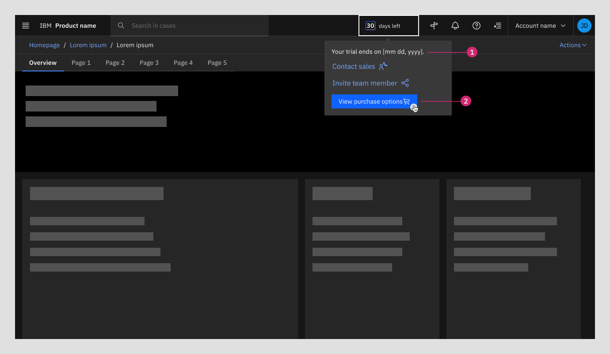
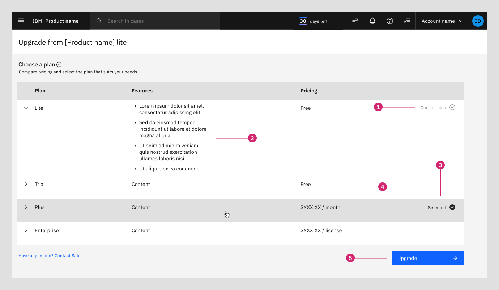
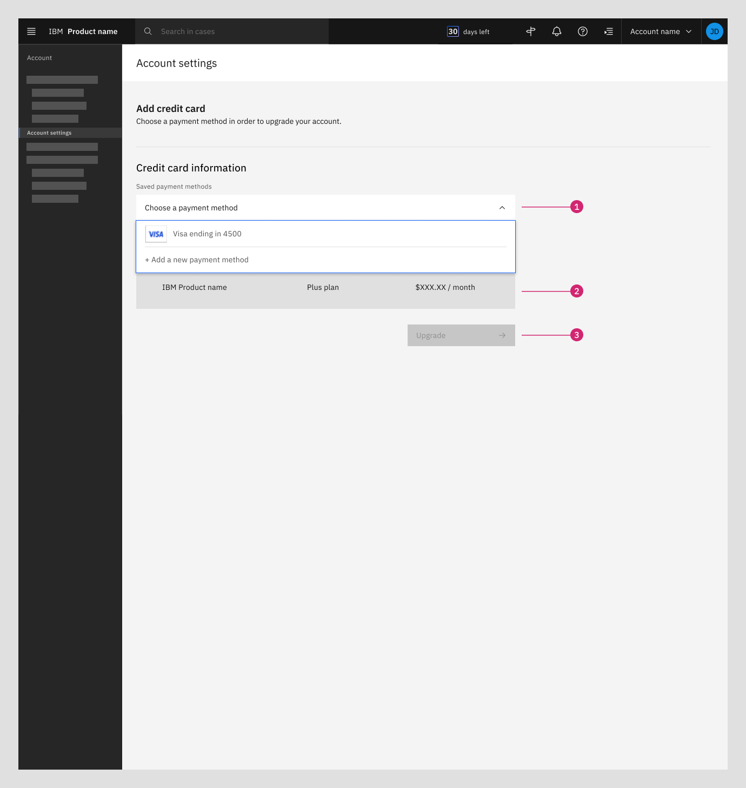
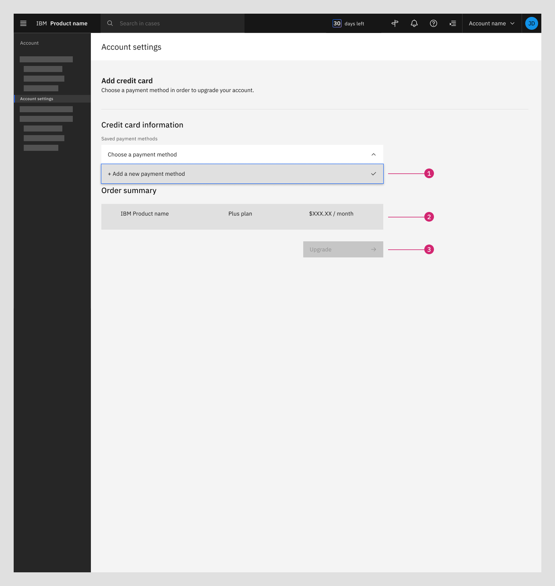
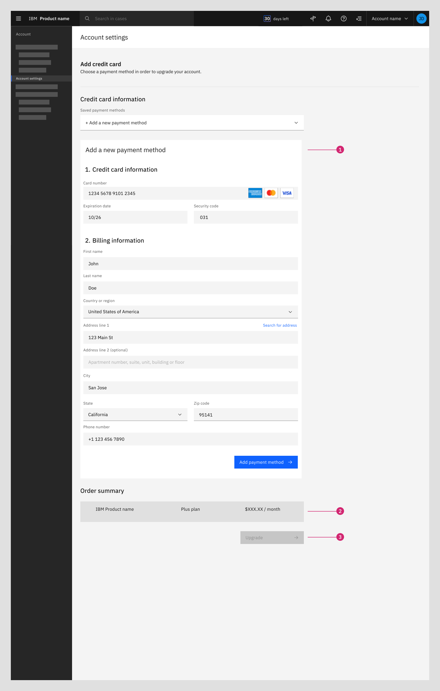
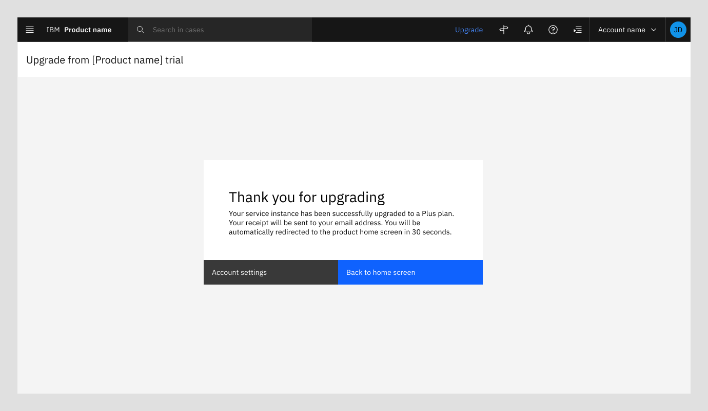

import { Breadcrumb, BreadcrumbItem } from "carbon-components-react";
import { Link } from "gatsby";

<PageDescription>

A Try offer upgrade provides a self-service path for users to upgrade from a Sandbox Trial or Trial from an IBM Cloud product.

</PageDescription>

<AnchorLinks>
<AnchorLink>Overview</AnchorLink>
<AnchorLink>Navigating to the upgrade options </AnchorLink>
<AnchorLink>Selecting a plan</AnchorLink>
<AnchorLink>Choosing a payment method</AnchorLink>
<AnchorLink>Successful upgrade</AnchorLink>
</AnchorLinks>

## Overview

An easy transition from a Try offer to a paid plan is crucial. This pattern should be used by IBM Cloud products to support users to complete an upgrade of a Sandbox Trial or Trial with efficiency and transparency.

## Navigating to the upgrade options

The upgrade pattern must be visible for Sandbox Trial and Trial users. The starting point of the flow is when the user is using a Try experience and hovers over the Days remaining indicator and clicks View purchase options.  

  

<Row>
  <Column colMd={8} colLg={10}>

  </Column>
</Row>

1. **Days remaining in Try experience:** Persistent indicator shows user the number of days remaining in their Try experience and clicking on the indicator opens a modal below

  

<Row>
  <Column colMd={8} colLg={10}>

  </Column>
</Row>

1. **Trial end text:** Trial end date is displayed to user
2. **View purchase options button:** User can access in-product upgrade and pricing screen at any time from this screen

  

## Selecting a plan

The user can view their current plan, compare costs, and select the plan that suits their needs within the pricing table. 

<Row>
  <Column colMd={8} colLg={10}>

  </Column>
</Row>

1. **Current plan indicator**
2. **Features:** This column lists the plan's available features which should be value-focused and specific to individual plans for easy comparison 
3. **Selected plan indicator:** Indicates the plan the user has selected to upgrade to
4. **Pricing:** May be listed per feature, per month, or per user
5. **Upgrade button:** Remains disabled until a new plan in selected

## Choosing a payment method

The user is prompted to enter or select their credit card and the billing information. The process the user follows will vary depending on whether they have a saved payment method on file or need to add a new payment method. 
<Tabs>
<Tab label="Payment method saved">

If the user has already added their credit card information (e.g. the card they entered during registration), the payment screen will display the saved credit card and the associated billing details. The user has the option to use the saved credit card or add a new one.

  

<Row>
  <Column colMd={8} colLg={10}>

  </Column>
</Row>

1. **Saved payment method:** User already has a payment method saved to their account
2. **Order summary:** A summary of billing line items is shown to the user to estimate costs associated with upgrade 
3. **Upgrade button:** Remains disabled until a valid payment method is selected

</Tab>

<Tab label="Add new payment method">

The user can add a new credit card by clicking Add a new payment method.  

  

<Row>
  <Column colMd={8} colLg={10}>

  </Column>
</Row>

1. **New payment method:** User must add a new payment method to their account before proceeding with upgrade
2. **Order summary:** A summary of billing line items is shown to the user to estimate costs associated with upgrade 
3. **Upgrade button:** Remains disabled until a valid payment method is selected

  

The user is asked to provide the associated billing information for their new credit card. The user can click the Add payment method button to save their new card details.

  

<Row>
  <Column colMd={8} colLg={10}>

  </Column>
</Row>

1. **New payment method billing details:** User must enter their billing details for their new payment method
2. **Order summary:** A summary of billing line items is shown to the user to estimate costs associated with upgrade 
3. **Upgrade button:** Remains disabled until a valid payment method is selected

</Tab>

</Tabs>

## Successful upgrade 

After the user has saved and/or selected their payment method, they can proceed with the upgrade. 

<Row>
  <Column colMd={8} colLg={10}>

  </Column>
</Row>

<CardGroup>
  <MiniCard
    title="Figma template"
    href= "https://www.figma.com/file/dsZFug8ks3MZis8gWL5n7F/Template---Try-experience-upgrade-%2F--View-pricing-tiers?type=design&node-id=1-116500&mode=design&t=8t8QAnXnCTQmboqc-0"
    actionIcon="launch">
  </MiniCard>
</CardGroup>{" "}