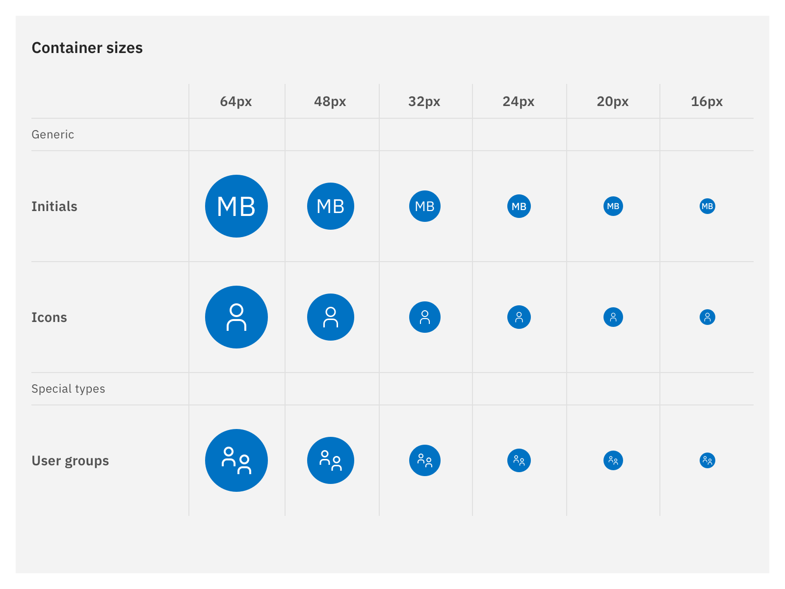

<PageDescription>

The User profile images is part of the Carbon UI shell. It provides a common set of interaction patterns that persist between and across products.

</PageDescription>

<AnchorLinks>
<AnchorLink>Overview</AnchorLink>
<AnchorLink>When to use</AnchorLink>
<AnchorLink>Accessibility</AnchorLink>
<AnchorLink>Contact</AnchorLink>
<AnchorLink>Feedback</AnchorLink>
</AnchorLinks>

## Overview

Our products need user profiles that display an image of the user. This can either be:
- A profile picture for a single user
- User initials for as single user (if no image is uploaded or supported) or
- An icon for a group of users

Those images are used within list views or account settings to identify a user and indicate collaborators. 

## When to use

Use this pattern in the following context:
- User management
- List/Table view displaying collaborators/users
- Account settings
- Assign user roles or user groups to collaborators
- Comment threads

### When to use profile images 

If users are able to upload profile pictures their images are displayed within the UI. 

### When to use user initials

Often the majority of our users probably won’t upload a profile image at all. Initials are a good way to provide identifying information when no profile image is present. Also here – pairing initials with a color can help visually organize comment threads or lists at a glance and provide extra context as to who is commenting or who is listed.

For the user’s initials for the avatar, we use both first and last name of the user. This provides a recognisable avatar in isolation, as well as in context. 

This solution may present problems in non-English countries where people don’t always have exactly 2 initials. In this case we stick to the rule to go also with just 2 letters – even if there are multiple last names we use only the first last name’s letter.

#### For example

✅ Do: Eva Cochet Weinandt => EC

❌ Don’t: Eva Cochet Weinandt => ECW

#### Color system
Users with no uploaded photo will be represented across the platform as initials with a color from the IBM color palette to create unique identifiers for users. We are not using any danger colors. 

Users with no uploaded photo or user groups will be represented across the products with a color from the IBM color palette to create unique identifiers for users. We don’t want to pick any random colour, so we just pick a few that fit the design. Each users avatar has a specific color applied by the system and we have a certain order the selected colors are applied:

1. Colors 60 (with light text / elements)
2. Colors 80 (with light text / elements)
3. olors 40 (with dark text / elements)

When the last color 40 (Teal 40 / #08bdba) is applied we start again with colors 60 (Blue 60 / #0f62fe).

#### Sizes and type specification
We use 5 different sizes for user profile images:
16 px / 20 px / 24 px / 32 px / 64 px

Text is always centred to the circle and uses the following sizes: 
- 64 px: font 28 px regular [$productive-heading-04]
- 32 px: font 14 px regular [$body-short-01]
- 24 px: font 12 px semibold
- 20 px: font 10 px semibold
- 16 px: font 8 px semibold

### When to use icon for single user
Ideally we would use user avatars if users don’t upload a profile image. For products that have technical contraints in displaying avatars, the user profile icon for single users can be used. Also here we are pairing the icon with a color that visually organize comment threads or lists better.

**Color scheme**

We follow the same color system and order of colors as for user initials: [Icon — user](https://github.com/carbon-design-system/carbon/blob/25f35677b90e5b469044520130025a28cf3d3bf2/packages/icons/svg/32/user.svg)

### When to use icon for user groups
Some products don’t list only individual collaborators but also support user groups. Those groups can be also displayed in tables or lists and need some indication.

We follow the same color system and order of colors as for user initials: [Icon — user](https://github.com/carbon-design-system/carbon/blob/25f35677b90e5b469044520130025a28cf3d3bf2/packages/icons/svg/32/user.svg)

## Accessibility

Make sure to follow the color system to have enough contrast for low-vision people. 

**Background 60** — use light text / icons #FFFFFF

**Background 80** — use light text / icons #FFFFFF

**Background** — use dark text / icons #161616

## Contact

- Mitchell Bernstein
- Marion Brülls

## Feedback
Help us improve this pattern by providing feedback, asking questions, and leaving any other comments on [GitHub](https://github.ibm.com/CDAI-design/pal)