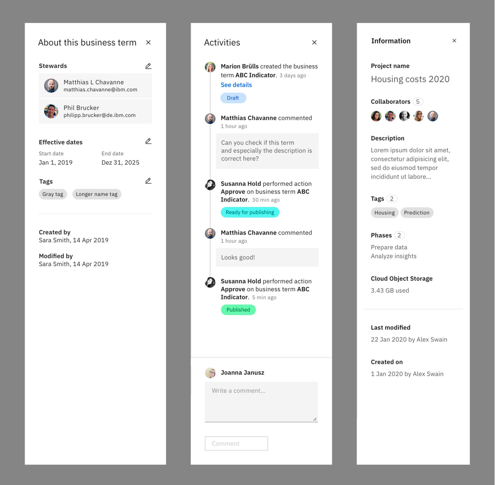

<PageDescription>

The User profile images is part of the Carbon UI shell. It provides a common set of interaction patterns that persist between and across products.

</PageDescription>

<AnchorLinks>
<AnchorLink>Overview</AnchorLink>
<AnchorLink>When to use</AnchorLink>
<AnchorLink>Style system</AnchorLink>
<AnchorLink>Accessibility</AnchorLink>
<AnchorLink>Contacts</AnchorLink>
<AnchorLink>Feedback</AnchorLink>
</AnchorLinks>

## Overview

Our products need user profiles that display a representaiton of users. This can be in the form of:
- A profile picture for a single user.
- User initials for single users (if no image is uploaded or supported).
- An icon for a group of users.

Those profile images are used within list views or account settings to identify a user and indicate collaborators. 

<Row>
<Column colMd={8} colLg={8}>

</Column>
</Row>

## When to use

Use this pattern in the following context:
- User management
- List/Table view displaying collaborators/users
- Account settings
- Assign user roles or user groups to collaborators
- Comment threads

### Images

If users are able to upload profile pictures their images are displayed within the UI. 

<Row>
<Column colMd={8} colLg={8}>

</Column>
</Row>

### Initials

Often the majority of our users probably won’t upload a profile image at all. Initials are a good way to provide identifying information when no profile image is present. Also here – pairing initials with a color can help visually organize comment threads or lists at a glance and provide extra context as to who is commenting or who is listed.

For the user’s initials for the avatar, we use both first and last name of the user. This provides a recognisable avatar in isolation, as well as in context. 

<Row>
<Column colMd={8} colLg={8}>

</Column>
</Row>

This solution may present problems in non-English countries where people don’t always have exactly 2 initials. In this case we stick to the rule to go also with just 2 letters – even if there are multiple last names we use only the first last name’s letter.

<Row>
<Column colMd={8} colLg={8}>

#### ✅ Do: Eva Cochet Weinandt => EC

#### ❌ Don’t: Eva Cochet Weinandt => ECW

</Column>
</Row>

### Icons

Use icons when the profile cannot be represented by an image.

<Row>
<Column colMd={8} colLg={8}>

#### Single user

Ideally we would use user avatars if users don’t upload a profile image. For products that have technical contraints in displaying avatars or initials, the user profile icon for single users can be used. We are also pairing the icon with a color that visually organize comment threads or lists better.

 

#### User groups

Some products also support user groups. Those groups can be also displayed in tables or lists and need some indication.

</Column>
</Row>

## Style system

There is an order to colors on both light and dark modes and sometimes specific icons to use with certain types of profiles.

### Colors

Users with no uploaded photo will be represented across the platform as initials (or an icon if initials are not supported) on top of a color from the IBM color palette to create unique identifiers for users. We are avoiding the use of any danger colors. We use color to be the first differenciation signifier and text (or an icon) to be the second. There are far more combinations of initials that can be made while color serves as a quick identifier of who is who.

<Row>
<Column colMd={8} colLg={8}>

 

The order of these colors should be picked by the system, not by users. The order they are assigned colors includes as follows:

| Order | Light mode color token | Dark mode color token |
| :--   | :--      | :--         |
| 1 | `$cyan-60` | `$cyan-50` |
| 2 | `$gray-60` | `$gray-50` |
| 3 | `$green-60` | `$green-50` |
| 4 | `$magenta-60` | `$magenta-50` |
| 5 | `$purple-60` | `$purple-50` |
| 6 | `$teal-60` | `$teal-50` |
| 7 | `$cyan-80` | `$cyan-30` |
| 8 | `$gray-80` | `$gray-30` |
| 9 | `$green-80` | `$green-30` |
| 10 | `$magenta-80` | `$magenta-30` |
| 11 | `$purple-80` | `$purple-30` |
| 12 | `$teal-80` | `$teal-30` |

</Column>
</Row>

 

### Scales

We use 6 different sizes for user profile images. 64px, 48px, 32px, 24px, 20px, and 16px. Text and icons are always centred to the circle and uses the following sizes: 

<Row>
<Column colMd={8} colLg={8}>

 

The type and icons at some scales are not represented by tokens within Carbon.

| Profile scale | Type scale | Icon scale |
| :--           | :--        | :--        |
| `64px`        | `28pt`     | `32px`     |
| `48px`        | `20pt`     | `24px`     |
| `32px`        | `14pt`     | `16px`     |
| `24px`        | `10.5pt`   | `12px`     |
| `20px`        | `8.75pt`   | `10px`     |
| `16px`        | `8pt`      | `10px`     |

</Column>
</Row>

## Accessibility

Make sure to follow the color system to have enough contrast for low-vision people. 

<Row>
<Column colMd={8} colLg={8}>

| Sequence | Text / icon color |
| :--      | :--               |
| 60       | `#FFFFFF`         | 
| 80       | `#FFFFFF`         | 
| 50       | `#000000`         | 
| 30       | `#000000`         | 

</Column>
</Row>

## Contacts

- Marion Brülls
- Mitchell Bernstein

## Feedback

Help us improve this pattern by providing feedback, asking questions, and leaving any other comments on [GitHub](https://github.ibm.com/CDAI-design/pal)