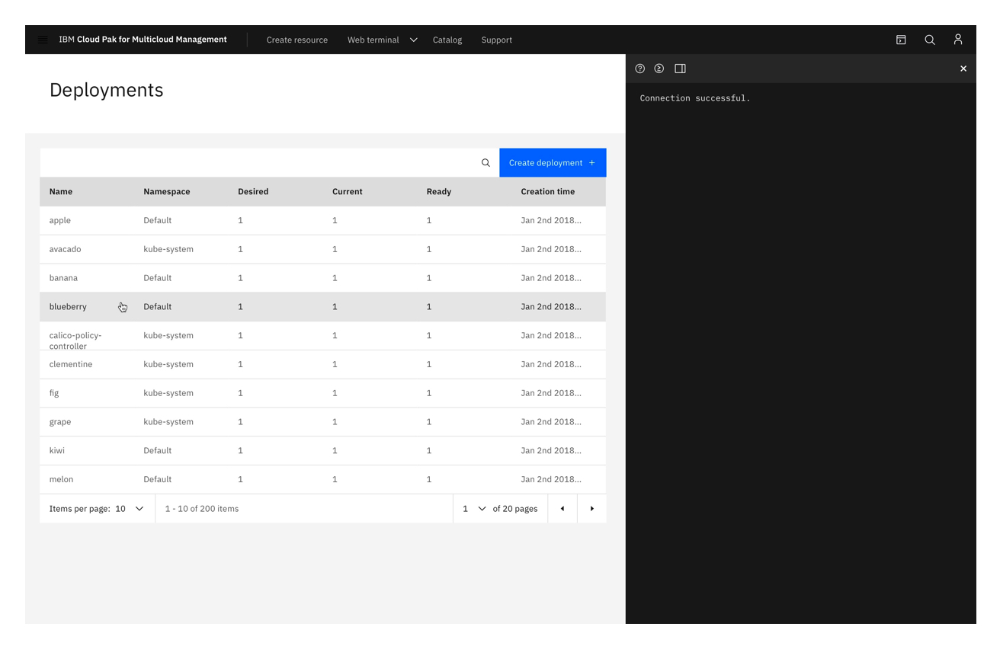
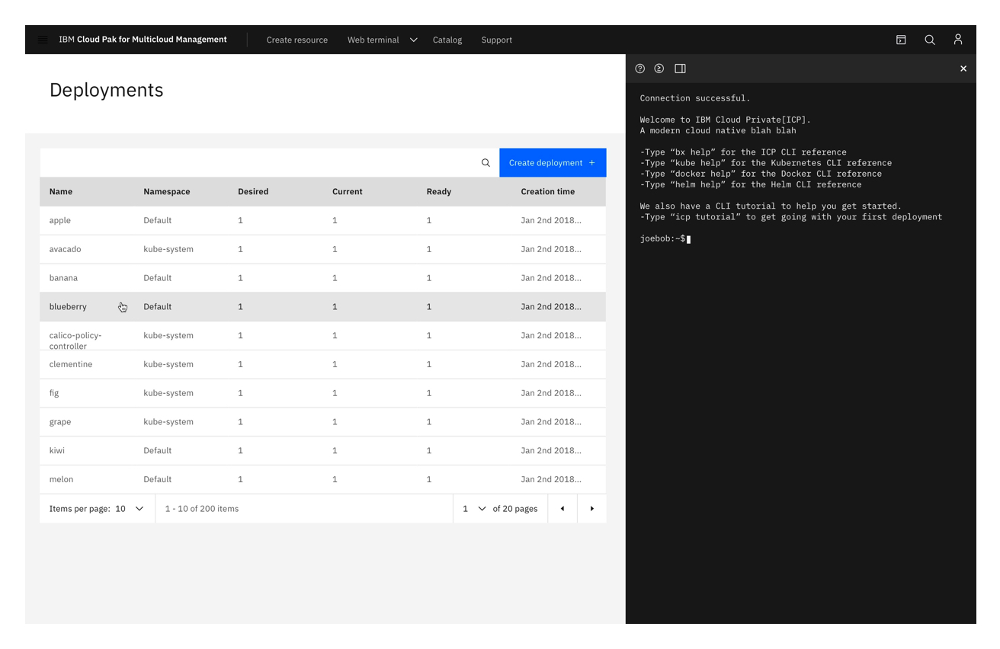

<PageDescription>

A _Web terminal_ provides users with the ability to type commands instead of using the GUI.

</PageDescription>

<AnchorLinks>
  <AnchorLink>Overview</AnchorLink>
  <AnchorLink>Behavior guidance</AnchorLink>
  <AnchorLink>Accessibility</AnchorLink>
  <AnchorLink>Related</AnchorLink>
  <AnchorLink>Feedback</AnchorLink>
</AnchorLinks>

## Overview

The Web terminal is prompted by the user and is persistent until dismissed. The purpose of a web terminal is to provide users with the ability to type commands manually instead of using the GUI.

## Behavior guidance

Often times users are those who work with code. These users may prefer to operate the product with code rather than by the UI. The Web Terminal component gives these users the option to use a web terminal and code instead of the UI of the page.

### Structure and functionality 

- Users have the option to view and use a web terminal
- On the right side of the header is a terminal icon
- If you hover on the icon it turns blue
- Clicking on the icon opens the web terminal as a panel on the right side of the page
- The content on the page condenses to the left to make room for the terminal. The terminal is not covering up page content.
- At the top of the terminal panel, there is a header
- On the right side of the terminal header is an “x" to close the terminal
- On the left side of the terminal header is where other tool icons can be included
- Included in the mockup is a “help”, “create a new deployment”, and “layout” icon button
- The layout button allows the user to dock the web terminal on a different part of the screen
- If you hover over the icon it turns blue and a dropdown menu appears upon click
- In the dropdown, you have the option of docking the terminal to the left, right, or bottom of the screen, as well as separate it into it’s own window.

### Best practices

Do consider the user and if this is a feature they would appreciate
Do consider if the page would lend to the feature
Do not use this component on every page without consideration

## Accessibility

This component uses existing Carbon 10 color combinations and font sizes so the accessibility is unchanged.

## Related

- Web terminal panel
- Gray 100 theme
- Top tool bar is Gray 90 theme
- All components in the panel adhere to carbon guidelines, including the icons and the dropdown menu
- Width: Users can adjust the width of the panel. If you hover over the edge of the panel until a double sided arrow appears, you can click and drag the edge of the panel to the desired width.
- Height: panel is the full height of the page from the bottom of the page header to the bottom of the page

Help us improve this pattern by providing feedback, asking questions, and leaving any other comments on GitHub.
