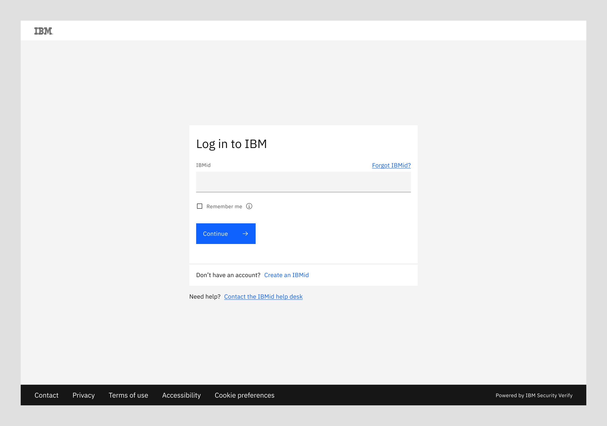
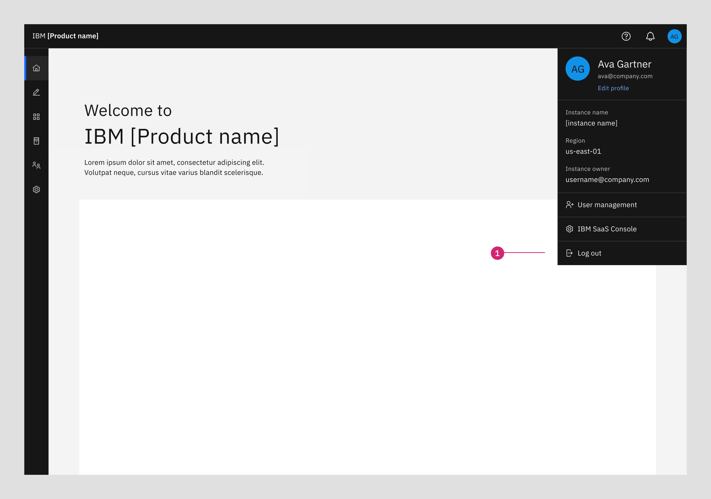
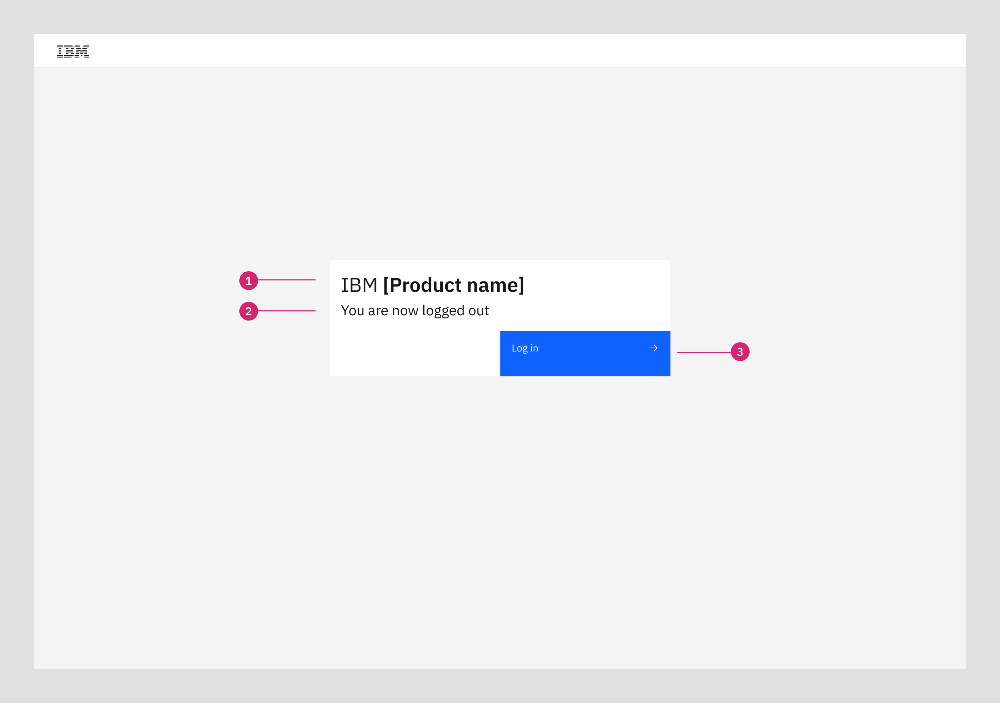

import { Breadcrumb, BreadcrumbItem } from "carbon-components-react";
import { Link } from "gatsby";

<Breadcrumb>
  <BreadcrumbItem href="https://pages.github.ibm.com/cdai-design/pal/">
    Home
  </BreadcrumbItem>
  <BreadcrumbItem href="https://pages.github.ibm.com/cdai-design/pal/saas-for-hyperscalers/overview">
    PLG and MultiCloud SaaS
  </BreadcrumbItem>
  <BreadcrumbItem href="https://pages.github.ibm.com/cdai-design/pal/saas-for-hyperscalers/use">
    Use
  </BreadcrumbItem>
  <BreadcrumbItem
    isCurrentPage
    href="https://pages.github.ibm.com/cdai-design/pal/saas-for-hyperscalers/use-patterns/login-logout"
  >
    Login and Logout
  </BreadcrumbItem>
</Breadcrumb>

<PageDescription>

Products can provide users with a consistent log out experience by adopting these two patterns.

 
1. Enabling the log out menu action in the profile menu provided by MCSP.  
2. Customizing the reusable log out dialog provided by MCSP.

The resources in this section provide both the design and reusable code components for these patterns.

</PageDescription>

## Login

The login page allows a user to gain access to their applications. The standard IBM login dialog should be used here for SaaS products access. There is no need for SaaS products to provide a customized or product specific login dialog.

#### SaaS products login screen

## Logout

User can log out from the profile menu dropdown

#### SaaS products logout screen

1. **Page title:** Only the page title is configurable on this screen - indicating which product the user is logging out of.
2. **Subtext:** Message provided by MCSP team (not configurable). "You are being logged out. It's recommended to close all browsers."
3. **Log in button:** This will take the user back to the login screen.

 
<CardGroup>
  <MiniCard
    title="Figma file"
    href="https://www.figma.com/file/SlZ7TK2mTzNLIHZB2dGXRF/MCSP-Onboarding-Design-Guide?node-id=2123%3A400806&t=HLaG62yqbYuR0XKo-1"
    actionIcon="launch"
  ></MiniCard>
  <MiniCard
    title="Storybook"
    href="https://pages.github.ibm.com/automation-saas/automation-common-header/?path=/story/logout--tile"
    actionIcon="launch"
  ></MiniCard>
</CardGroup>{" "}
