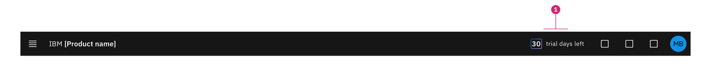
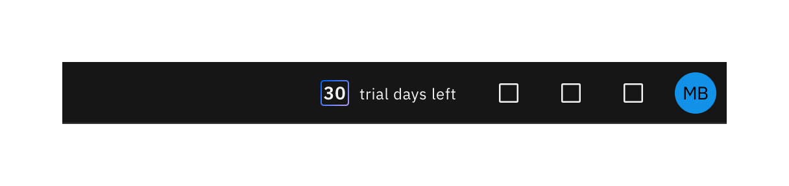
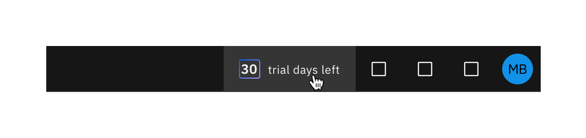
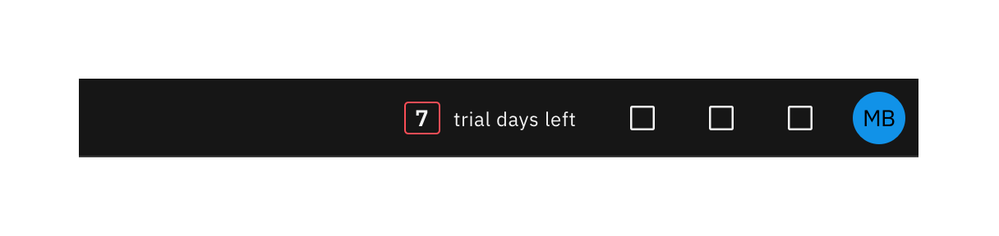
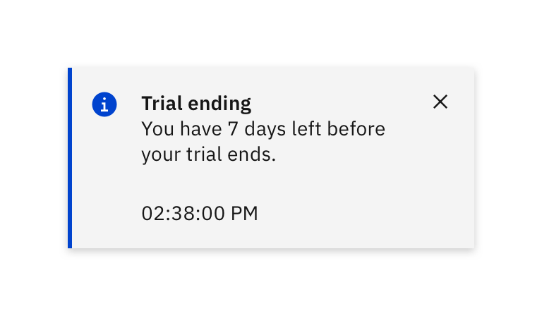
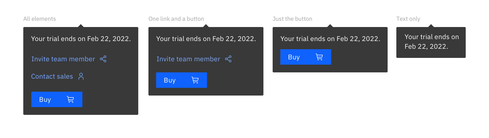
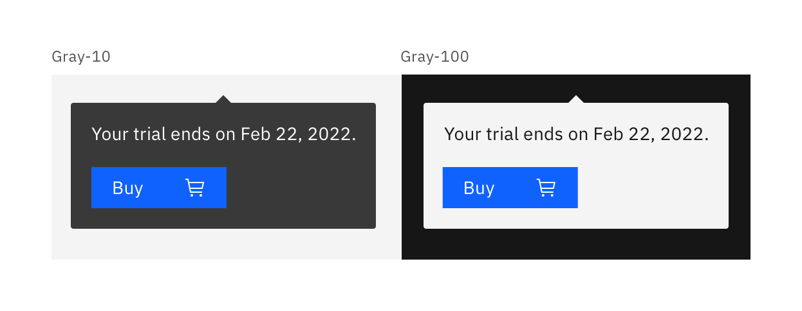

import { Breadcrumb, BreadcrumbItem } from "carbon-components-react";
import { Link } from "gatsby";

<Breadcrumb>
    <BreadcrumbItem href="https://pages.github.ibm.com/cdai-design/pal/">
    Home
  </BreadcrumbItem>

{" "}
<BreadcrumbItem href="https://pages.github.ibm.com/cdai-design/pal/cloud-paks/home-page/usage">
  Foundational experiences
</BreadcrumbItem>
<BreadcrumbItem href="https://pages.github.ibm.com/cdai-design/pal/plg-and-multicloud-saas/use">
  Use
</BreadcrumbItem>

  <BreadcrumbItem isCurrentPage href="https://pages.github.ibm.com/cdai-design/pal/plg-and-multicloud-saas/use-patterns/trial-countdown">
    Trial countdown
  </BreadcrumbItem>
</Breadcrumb>

<PageDescription>

The trial countdown helps users track how many days they have left on their Cloud Pak trial experience.

</PageDescription>

<AnchorLinks>
  <AnchorLink>Overview</AnchorLink>
  <AnchorLink>States</AnchorLink>
  <AnchorLink>Toggletip</AnchorLink>
  <AnchorLink>Resources</AnchorLink>

  </AnchorLinks>

## Overview

The trial countdown is necessary when the user is on the trial phase of the product. It displays how many days they have left to explore the product features before they are prompted to buy or upgrade.

1. **Trial countdown:** Located at the furthest left of the section utilities.

## States

### Enabled

<Row>
  <Column colMd={8} colLg={8}>

  </Column>
</Row>

This is the original state the user will see when they land on the homepage during their trial period. The number of days left is surrounded by a [gradient](https://www.ibm.com/design/language/color#gradients) border `(Blue 50 and Purple 40)`. The trial countdown is explicitly for trials and nothing else.

### Hover

<Row>
  <Column colMd={8} colLg={8}>

  </Column>
</Row>

Hover state is used when the cursor is on top of the trial countdown without clicking on it and an overlay will highlight the area.

### Active

<Row>
  <Column colMd={8} colLg={8}>

  </Column>
</Row>

Active state is when the user clicks on the trial countdown and the `Hover ui state` appears along with the toggletip.

<Row>
  <Column colMd={8} colLg={8}>

  </Column>
</Row>

<Caption>Trial ending state</Caption>

<Row>
  <Column colMd={4} colLg={4}>

  </Column>
</Row>

<Caption>Toast notification</Caption>

### Trial ending

A week before the trial ends, the border around the number of days left will change from a gradient to a `Red 50` stroke. An email will be sent to the user 7 days before their trial ends and when they log in, they will also get a toast notification reminding them about the trial ending.

## Toggletip

- The [toggletip](https://www.carbondesignsystem.com/components/toggletip/usage/) appears only when the user clicks on the trial countdown button to show the exact date of when the trial ends.
- The toggletip disappears when the user clicks away from it.
- The toggletip content is configurable based on product needs.
- On the 7th day, we suggest editing the text encouraging the user to upgrade or buy.

#### Toogletip anatomy

<Row>
<Column colMd={8} colLg={8}>

  </Column>
</Row>

<Caption fullWidth>
  In this example all elements that can be added to the toggletip are being
  used.
</Caption>

1. **Body copy _(required)_**
   1. This caption is the only required element in the toggletip.
   2. The caption inside the toggletip should be limited to 2 lines.
   3. The [date format](https://pages.github.ibm.com/cdai-design/pal/content/numbers/#dates) will be localized based on user's region.
   4. We suggest using the short format Month Day, Year. _(See images below)_
2. **Secondary link _(optional)_**
   1. All links will be accompanied with an icon on the right side.
   2. It is recommended to keep the number of actions under 2.
   3. Example of action items are: _Invite team member and Contact sales_
3. **Primary button _(optional_**)
   1. The primary action is a button.
   2. This button can also be reserved for _"Buy"_ if it is available for the product.
   3. An alternative action to this is _"Contact sales"_ if _"Buy"_ is not available.

<Caption>
  These are the different variations of the toggletip that can be used.
</Caption>

### Theme switch

The toggleltip will switch to dark/light depending on what theme the product is using.

<Row>
  <Column colMd={8} colLg={8}>

  </Column>
</Row>
