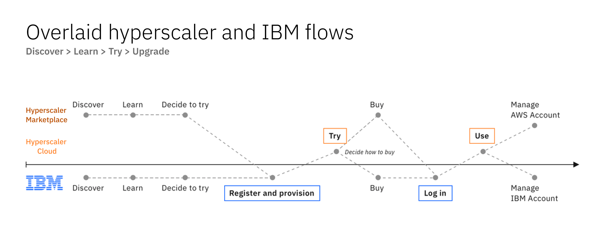

import { Breadcrumb, BreadcrumbItem } from "carbon-components-react";
import { Link } from "gatsby";

<PageDescription>

With deployment on the hyperscaler cloud platforms, the users now have more ways to access our SaaS products. The following diagram illustrate the high level touchpoints for the E2E SaaS cloud native journey with respect to the systems they will typically interact with.

</PageDescription>

<Row>
  <Column colMd={8} colLg={10}>

  </Column>
</Row>

## E2E user journeys

There are different paths a user may take depends on how and where they want to try and buy IBM SaaS products that runs on a hyperscaler cloud. The followings are the typical scenarios when transacting through the different cloud providers.

<CardGroup>
  <MiniCard
    title="Try and buy through IBM"
    href="https://pages.github.ibm.com/cdai-design/pal/plg-and-multicloud-saas/user-scenarios/transact-upgrade-ibm"
    actionIcon="arrowRight"
  ></MiniCard>
  <MiniCard
    title="Try and buy through AWS Marketplace"
    href="https://pages.github.ibm.com/cdai-design/pal/plg-and-multicloud-saas/user-scenarios/transact-upgrade-aws"
    actionIcon="arrowRight"
  ></MiniCard>
  <MiniCard
    title="Try and buy through Azure Marketplace"
    href="https://pages.github.ibm.com/cdai-design/pal/plg-and-multicloud-saas/user-scenarios/transact-upgrade-azure"
    actionIcon="arrowRight"
  ></MiniCard>
  <MiniCard
    title="Custom offers via IBM sales"
    href="https://pages.github.ibm.com/cdai-design/pal/plg-and-multicloud-saas/user-scenarios/private-offer"
    actionIcon="arrowRight"
  ></MiniCard>
</CardGroup>
