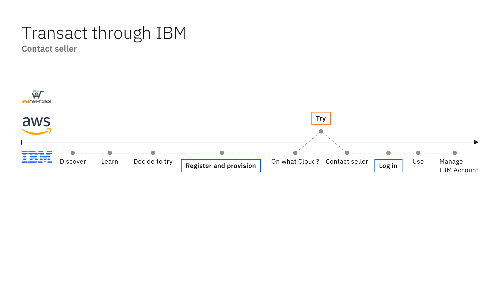

import { Breadcrumb, BreadcrumbItem } from "carbon-components-react";
import { Link } from "gatsby";

<Breadcrumb>
  <BreadcrumbItem href="https://pages.github.ibm.com/cdai-design/pal/">
    Home
  </BreadcrumbItem>
  <BreadcrumbItem href="https://pages.github.ibm.com/cdai-design/pal/plg-and-multicloud-saas/overview">
    PLG and MultiCloud SaaS
  </BreadcrumbItem>
  <BreadcrumbItem href="https://pages.github.ibm.com/cdai-design/pal/plg-and-multicloud-saas/user-scenarios">
    User scenarios
  </BreadcrumbItem>
  <BreadcrumbItem
    isCurrentPage
    href="https://pages.github.ibm.com/cdai-design/pal/plg-and-multicloud-saas/user-scenarios/contact-seller-ibm"
  >
    IBM scenarios
  </BreadcrumbItem>
</Breadcrumb>

<PageDescription>

This scenario starts from the AWS marketplace, where a user will learn about IBM’s software product and decides to try.

</PageDescription>

The user registers for the IBM product and it is then provisioned on AWS. **When they’re ready to buy, they can connect an IBM seller to get a private offer they accept on AWS.** When they now log into their IBM account, they can continue to use the software. They will manage their money in the AWS portal and theproduct use in the IBM Management environment.

 

<Row>
  <Column colMd={8} colLg={10}>

<Caption>

Flow depicts the seller contact flow through IBM services.

  </Caption>

  </Column>
</Row>
