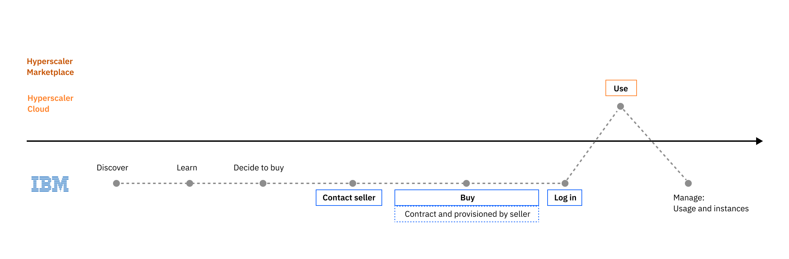
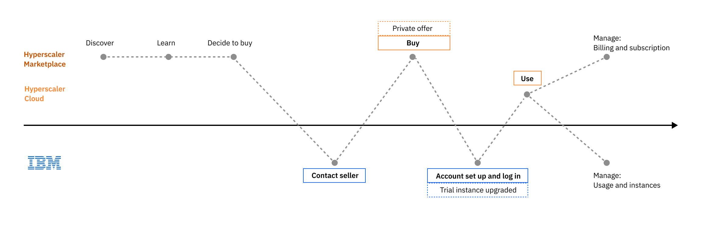

import { Breadcrumb, BreadcrumbItem } from "carbon-components-react";
import { Link } from "gatsby";

<Breadcrumb>
  <BreadcrumbItem href="https://pages.github.ibm.com/cdai-design/pal/">
    Home
  </BreadcrumbItem>
  <BreadcrumbItem href="https://pages.github.ibm.com/cdai-design/pal/saas-for-hyperscalers/overview">
    PLG and MultiCloud SaaS
  </BreadcrumbItem>
  <BreadcrumbItem href="https://pages.github.ibm.com/cdai-design/pal/saas-for-hyperscalers/user-scenarios">
    User scenarios
  </BreadcrumbItem>
  <BreadcrumbItem
    isCurrentPage
    href="https://pages.github.ibm.com/cdai-design/pal/saas-for-hyperscalers/user-scenarios/contact-seller-aws"
  >
    Custom offers via IBM sales
  </BreadcrumbItem>
</Breadcrumb>

<PageDescription>

When the user has gain enough understanding of the product and is ready to buy, they can ** work with an IBM seller to get a custom offer ** that better meets their needs.

</PageDescription>

When the user is ready to buy, instead of subscribing to the public plans offered on the marketplace, they can initiate a direct sales conversation with the IBM seller using the "Contact sales" link provided on the product listing page or under the trial countdown menu in the product. The user fills out a form. They will then be contacted by our seller to discuss their needs and negotiate the custom plan that works best for them.

## Direct sales from IBM

After the seller creates the contract and completed the needed registration/subscription steps for the user directly in SSM, the user will receive an email with the link and instruction to access the product or to create their instance. Note: users either already have a sales representative working with them or should be able to find a link on the product page to contact a sales representative.

<Row>
  <Column colMd={8} colLg={10}>

  </Column>
</Row>

## Private offer from a hyperscaler marketplace

Alternatively, the seller can create a private offer in AWS or Azure marketplace and make it visible to the user's account. The user will received an email with link to access the private offer on the specific marketplace where they can review and accept the offer.

Once they have completed the subscription transaction, the user will be directed to the IBM landing page where they are asked to create or sign in with an IBMid. The user will be asked to enter the private offer code, which they have received from the seller in an email. When the account setup process is complete, a new instance of the product will be provisioned and the user can start using the product.

<Row>
  <Column colMd={8} colLg={10}>

  </Column>
</Row>

## Related

- [Contact sales form example](https://www.ibm.com/account/reg/us-en/signup?formid=MAIL-cloud&source=ace-aws)
