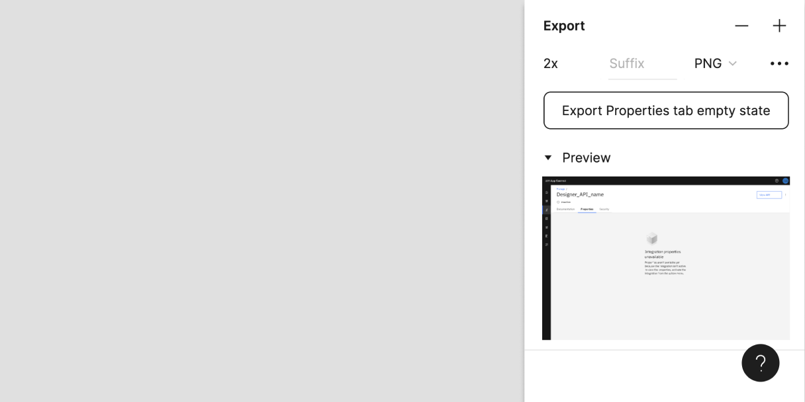

<PageDescription>

Submissions can include all levels of fidelity and stages of completeness. We believe the more we share, the more we can learn and grow our practice together.

</PageDescription>

#### Your screen(s):
- Must be using the Carbon Design System (v10 or above)
- Should be up-to-date (Less than a year old)
- Recommended screen size: 1312px
- Resolution: 2x and above. _See below for export instructions._

<Accordion>
  <AccordionItem title="How to export screens in Figma">

Select the frame(s) you wish to export. Navigate to the export section within the right hand panel of the UI.
Click the + if it's not open. 

  

Using the preview section, you can check your screens will export as expected.

  

  

By default the screen is exported to 1x resolution. Using the dropdown, select 2x or above for a higher resolution.

  

Click export to save your screen. The filename will be visibile within the Gallery, so choose something sensible that describes the screen(s) you are exporting.

  </AccordionItem>

</Accordion>

<iframe class="airtable-embed" src="https://airtable.com/embed/appYaUbXAtoRYLR1L/shruXNhVsp9YTCNkx?backgroundColor=yellowDusty" frameborder="0" onmousewheel="" width="100%" height="750" style="background: transparent; border: 1px solid #ccc;"></iframe>