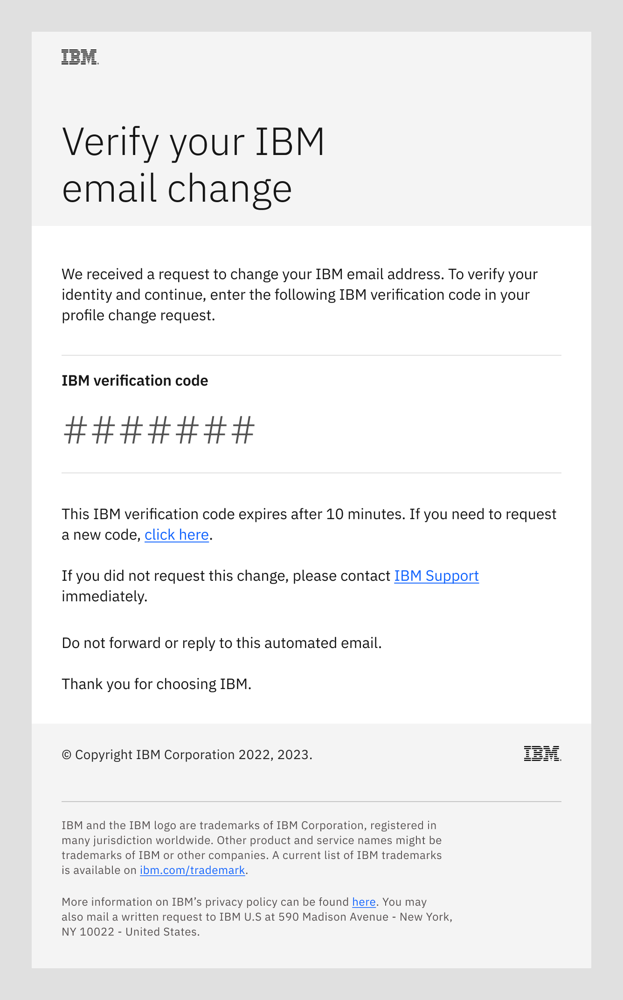
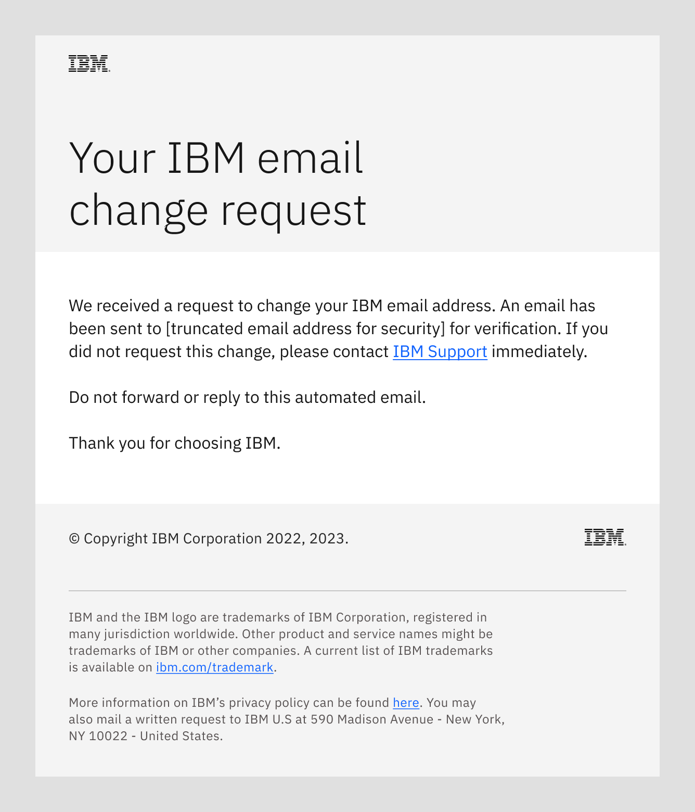

import { Breadcrumb, BreadcrumbItem } from "carbon-components-react";
import { Link } from "gatsby";

<Breadcrumb>
  <BreadcrumbItem href="https://pages.github.ibm.com/cdai-design/pal/">
   Home
  </BreadcrumbItem>
  <BreadcrumbItem href="https://pages.github.ibm.com/cdai-design/pal/saas-for-hyperscalers/overview">
   PLG and MultiCloud SaaS
  </BreadcrumbItem>
  <BreadcrumbItem href="https://pages.github.ibm.com/cdai-design/pal/saas-for-hyperscalers/common-patterns-components">
   SaaS patterns and components
  </BreadcrumbItem>
  <BreadcrumbItem isCurrentPage href="https://pages.github.ibm.com/cdai-design/pal/saas-for-hyperscalers/common-patterns/change-email">
   Change IBM email address
  </BreadcrumbItem>
</Breadcrumb>

<PageDescription>

Using this automated email flow enables your users to change their IBM email address (IBMid or contact) through a consistent
and vetted user experience.

</PageDescription>

<AnchorLinks>
  <AnchorLink>IBM user profile</AnchorLink>
  <AnchorLink>Change verification email</AnchorLink>
  <AnchorLink>Change notice email</AnchorLink>
  <AnchorLink>Profile updated email</AnchorLink>
  <AnchorLink>Related</AnchorLink>
</AnchorLinks>

## IBM user profile
This email flow enables a user who is logged in to their ibm.com profile to securely change their IBM email address. The emails
are sent to the user’s contact email address.

<Row>
<Column colMd={8} colLg={8}>

</Column>
</Row>

When the user submits an email address change request, the flow sends two automated emails to verify the identity of
the requester.

### Change verification email
One email, with a verification code, is sent to the new IBM email address. This email directs the recipient to
enter the verification code into their IBM profile change request at ibm.com. Their email address (IBMid or
contact) is not changed until the verification code is entered correctly.

<Row>
<Column colMd={8} colLg={10}>

Subject: Your IBM email change request

</Column>
</Row>

### Change notice email
A second email is sent to the user’s existing IBM email address to notify them of the profile change request. This
email directs the user to contact IBM immediately if they did not request a change to their IBM email address.

<Row>
<Column colMd={8} colLg={8}>

Subject: Your IBM email change request

</Column>
</Row>

### Profile updated email
When triggered by a completed update to their IBM user profile, this email is sent to the user's IBM contact email address. The email
alerts them to their updated profile.

<Row>
<Column colMd={8} colLg={10}>

Subject: Your updated IBM profile

</Column>
</Row>

## Related
- [Email templates](https://pages.github.ibm.com/cdai-design/pal/saas-for-hyperscalers/email-templates)
