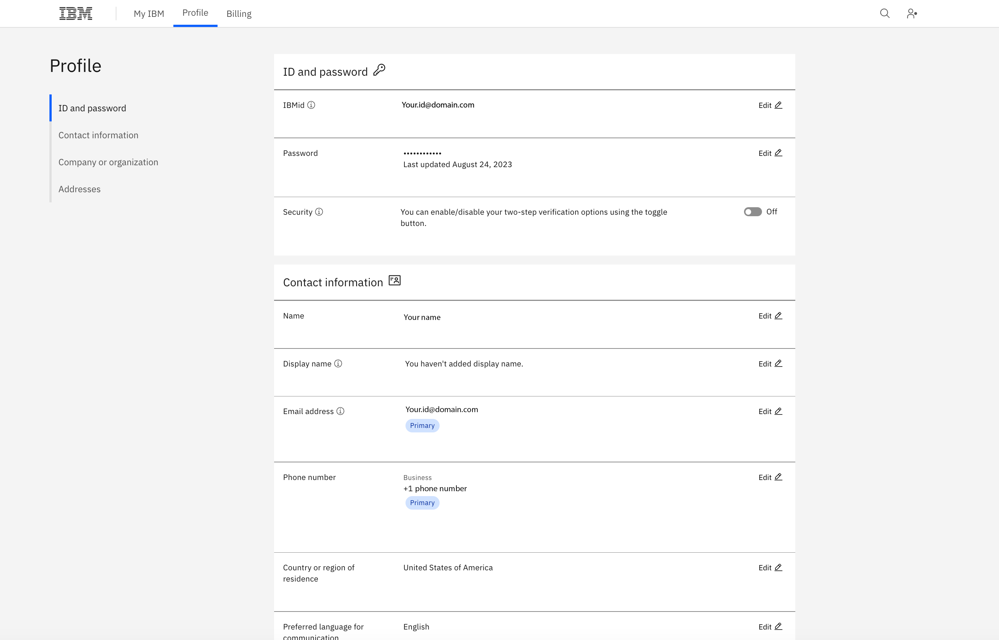
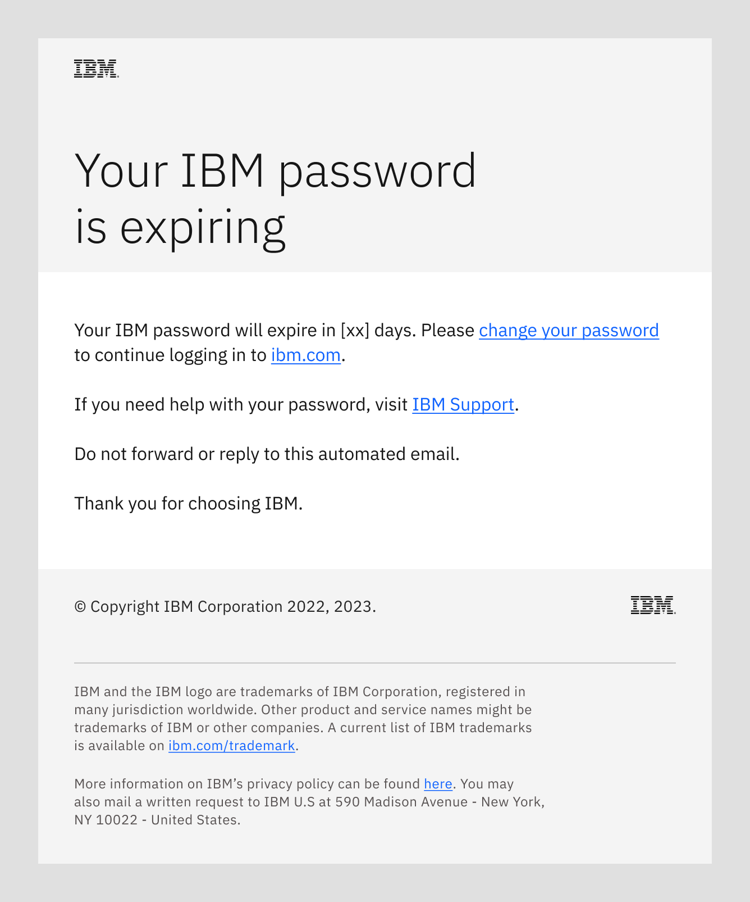
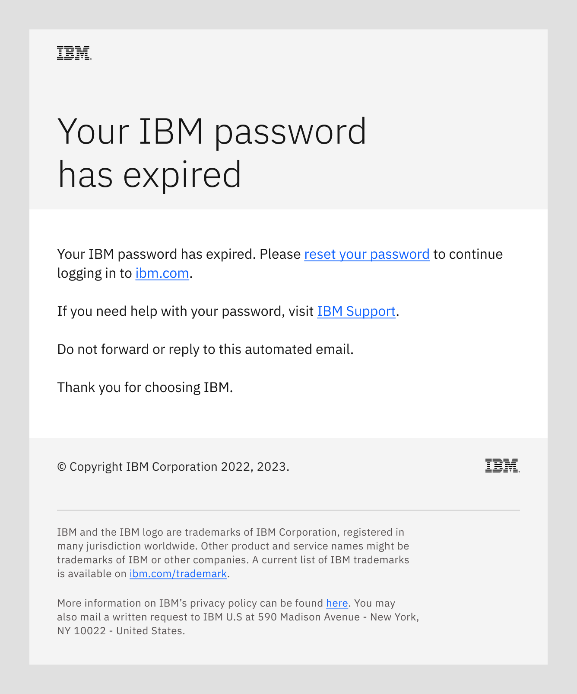
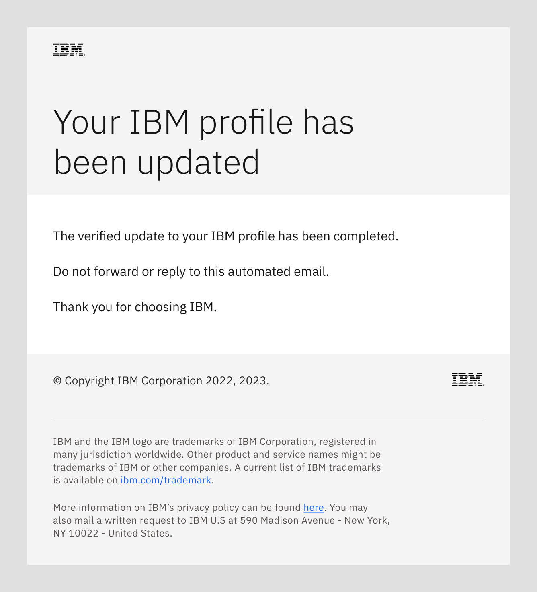

import { Breadcrumb, BreadcrumbItem } from "carbon-components-react";
import { Link } from "gatsby";

<Breadcrumb>
  <BreadcrumbItem href="https://pages.github.ibm.com/cdai-design/pal/">
   Home
  </BreadcrumbItem>
  <BreadcrumbItem href="https://pages.github.ibm.com/cdai-design/pal/saas-for-hyperscalers/overview">
   PLG and MultiCloud SaaS
  </BreadcrumbItem>
  <BreadcrumbItem href="https://pages.github.ibm.com/cdai-design/pal/saas-for-hyperscalers/common-patterns-components">
   SaaS patterns and components
  </BreadcrumbItem>
  <BreadcrumbItem isCurrentPage href="https://pages.github.ibm.com/cdai-design/pal/saas-for-hyperscalers/common-patterns/change-password">
   Change IBM password
  </BreadcrumbItem>
</Breadcrumb>

<PageDescription>

Using this automated email flow enables your users to change their IBM password through a consistent and vetted user experience.

</PageDescription>

<AnchorLinks>
  <AnchorLink>IBM user profile</AnchorLink>
  <AnchorLink>Password expiring email</AnchorLink>
  <AnchorLink>Password expired email</AnchorLink>
  <AnchorLink>Profile updated email</AnchorLink>
  <AnchorLink>Related</AnchorLink>
</AnchorLinks>

## IBM user profile
This email flow enables a user whose IBM password has expired, or is expiring soon, to securely change or reset their password.
The emails included in this flow are sent to the user’s contact email address.

<Row>
<Column colMd={8} colLg={8}>

</Column>
</Row>

When activated by a password expiration event, the flow sends the applicable email to prompt the user to either change or reset their
IBM password.

### Password expiring email
When triggered by an expiration notice event, this email is sent to the user's IBM contact email address. The email
alerts them to their approaching password expiration and prompts them to change their password before it expires.

<Row>
<Column colMd={8} colLg={10}>

</Column>
</Row>

### Password expired email
When triggered by an expired password event, this email is sent to the user's IBM contact email address. The email
alerts them to their expired password and prompts them to reset their password.

<Row>
<Column colMd={8} colLg={10}>

</Column>
</Row>

### Profile updated email
When triggered by a completed update to their IBM user profile, this email is sent to the user's IBM contact email address. The email
alerts them to their updated profile.

<Row>
<Column colMd={8} colLg={10}>

</Column>
</Row>

## Related
- [Email templates](https://pages.github.ibm.com/cdai-design/pal/saas-for-hyperscalers/email-templates)
