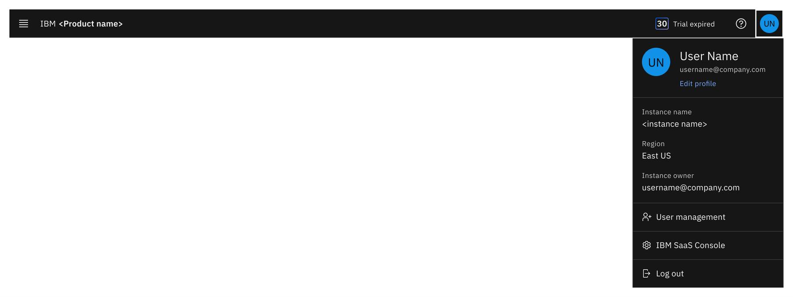

import { Breadcrumb, BreadcrumbItem } from "carbon-components-react";
import { Link } from "gatsby";

<Breadcrumb>
  <BreadcrumbItem href="https://pages.github.ibm.com/CDAI-design/cpp-foundation-microsite/">
   Home
  </BreadcrumbItem>
  <BreadcrumbItem href="https://pages.github.ibm.com/CDAI-design/cpp-foundation-microsite/saas-for-hyperscalers/overview">
   SaaS for hyperscalers
  </BreadcrumbItem>
  <BreadcrumbItem href="https://pages.github.ibm.com/CDAI-design/cpp-foundation-microsite/saas-for-hyperscalers/common-patterns-components">
   SaaS patterns and components
  </BreadcrumbItem>
  <BreadcrumbItem isCurrentPage href="https://pages.github.ibm.com/CDAI-design/cpp-foundation-microsite/saas-for-hyperscalers/common-patterns/profile">
   Expired trial
  </BreadcrumbItem>
</Breadcrumb>

<PageDescription>

The profile menu is a consistently available user interface element that contains an essential account, product and active session information. It is only available in the logged in state.
</PageDescription>

## User profile menu contents
User profile provide information about the current instance, as well as navigation to the IBM SaaS Console. If the product is leveraging the User management feature provided by MCSP, the user may also access the User management via the user profile menu.

<Row>
<Column colMd={8} colLg={12}>

</Column>
</Row>

<CardGroup>
  <MiniCard 
    title="Figma template" 
    href="https://www.figma.com/file/SlZ7TK2mTzNLIHZB2dGXRF/MCSP-Onboarding-Design-Guide?node-id=2184%3A401494&t=pavrP2xC3KdDhtvz-1"
    actionIcon="launch">
  </MiniCard>
  <MiniCard 
    title="Storybook" 
    href="https://pages.github.ibm.com/automation-saas/automation-common-header/?path=/story/user-profile--menu"
    actionIcon="launch">
  </MiniCard>
</CardGroup>

## Related
- [Login/logout](https://pages.github.ibm.com/CDAI-design/cpp-foundation-microsite/saas-for-hyperscalers/common-patterns/trial-end/login)

## References
- [User profile menu - Carbon for IBM Products](https://pages.github.ibm.com/cdai-design/pal/patterns/profile-header-menu/usage/)

