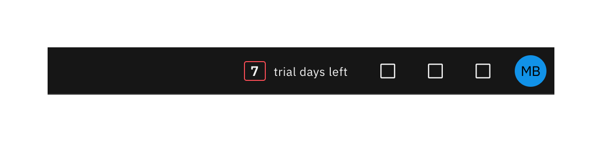
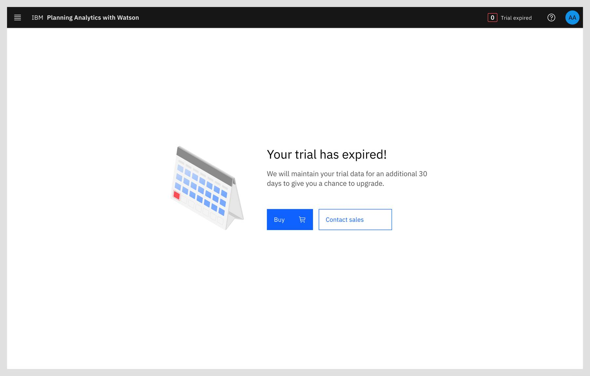
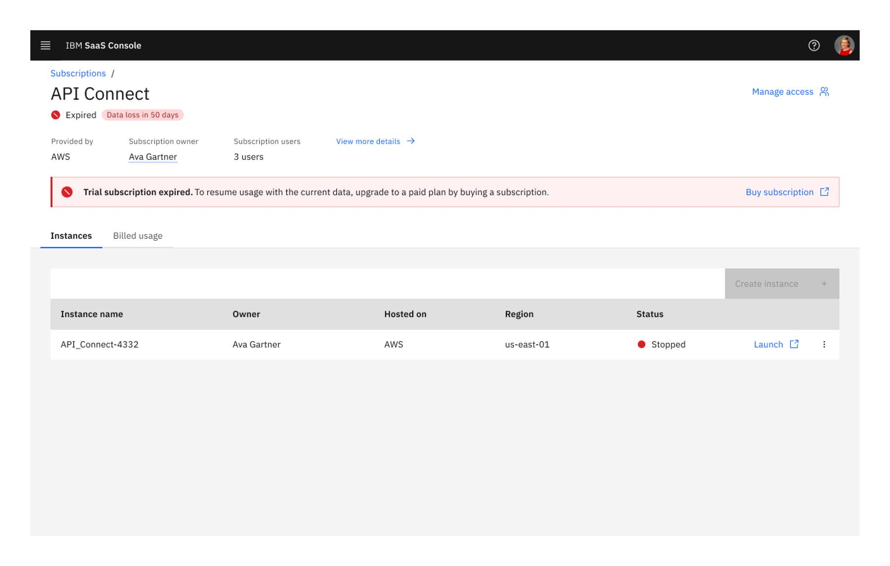
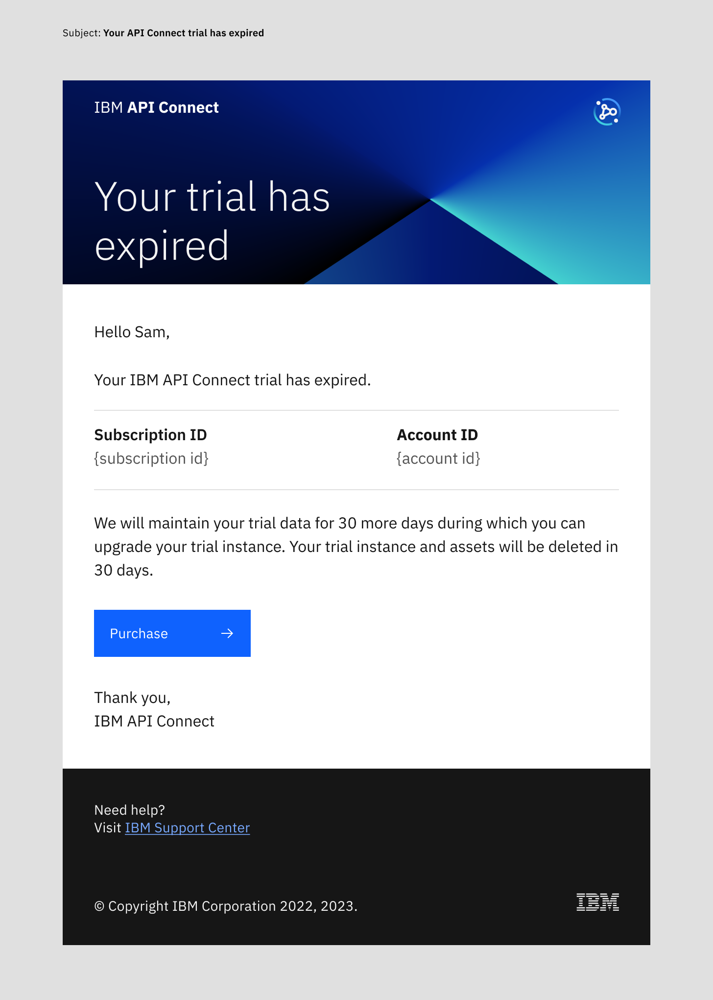

import { Breadcrumb, BreadcrumbItem } from "carbon-components-react";
import { Link } from "gatsby";

<Breadcrumb>
  <BreadcrumbItem href="https://pages.github.ibm.com/cdai-design/pal/">
   Home
  </BreadcrumbItem>
  <BreadcrumbItem href="https://pages.github.ibm.com/cdai-design/pal/saas-for-hyperscalers/overview">
   PLG and MultiCloud SaaS
  </BreadcrumbItem>
  <BreadcrumbItem href="https://pages.github.ibm.com/cdai-design/pal/saas-for-hyperscalers/common-patterns-components">
   SaaS patterns and components
  </BreadcrumbItem>
  <BreadcrumbItem isCurrentPage href="https://pages.github.ibm.com/cdai-design/pal/saas-for-hyperscalers/common-patterns/trial-end">
   Expired trial
  </BreadcrumbItem>
</Breadcrumb>

<PageDescription>

A well-designed end-of-trial experience helps keeping the user engaged and making the transition from trial to purchase smooth.
</PageDescription>

## Days before expiration
The SaaS end-of-trial experience starts a few days prior to the trial expiry. The trial countdown widget is highlighted in red when the user logs in.
<Row>
<Column colMd={8} colLg={8}>

</Column>
</Row>

## After trial is expired
At the end of the trial period, when the user tries to access the product, a message is displayed with call to action buttons directing users to the right place for the purchase.

#### Message in product
<Row>
<Column colMd={8} colLg={10}>

</Column>
</Row>

#### Manage trial instance
When the user access the **IBM SaaS Console** , there is a clear indicator showing the status and link that guides the user to where they can purchase a subscription.

When the user access the **IBM SaaS Console**, there is a clear indicator showing the status and link that guides the user to where they can purchase a subscription.

<Row>
<Column colMd={8} colLg={10}>

</Column>
</Row>

#### Message in email
In addition to the in product experience, emails can also be sent directly to the user both prior to the expiry and when the trial has expired. 

<Row>
<Column colMd={8} colLg={8}>

</Column>
</Row>

## Email communication
In addition to the in product experience, emails can also be sent directly to the user both prior to the expiry and when the trial has expired. See [email templates](https://pages.github.ibm.com/cdai-design/pal/saas-for-hyperscalers/email-templates/) for details.

 
<CardGroup>
  <MiniCard 
    title="Figma template" 
    href="https://www.figma.com/file/AdslrSd7PwrntFZehRcTjb/SaaS-for-Hyperscalers-Design-Templates?node-id=1020%3A588549"
    actionIcon="launch">
  </MiniCard>
</CardGroup> 

## Related
- [Trial countdown](https://pages.github.ibm.com/cdai-design/pal/cloud-paks/trial-countdown/usage/)
- [Email template](https://pages.github.ibm.com/cdai-design/pal/saas-for-hyperscalers/email-templates)